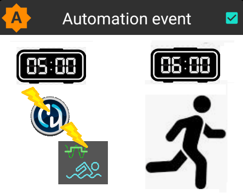
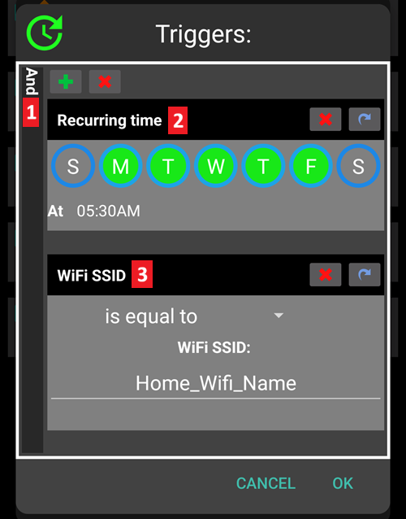
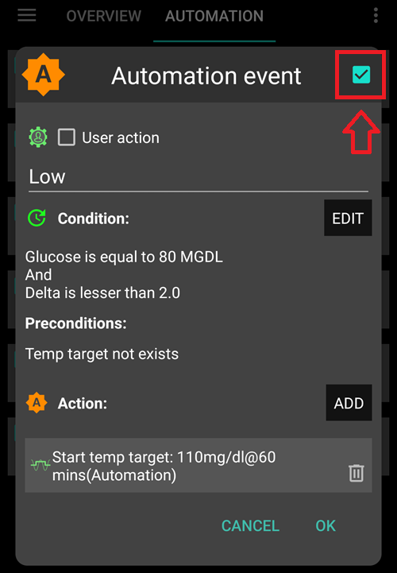

# Automatisierung

## Was ist eine Automatisierung?

"**Automation**" is a feature within **AAPS** which can simplify a user’s diabetes management by making automatic changes to insulin delivery in order to fit within the individual's lifestyle needs.

An **Automation** instructs **AAPS** to carry out a specific action 'automatically' as a result of one or more conditions or triggers. This can be for irregular episodic events, like low or high **BG**, a set amount of negative **IOB**. It can also be for reoccurring events, for example a meal or exercise at a certain time of day, or when the user is located within a certain distance of GPS location or WIFI SSID area.

There are a wide range of **Automation** options, and users are encouraged to study these within the **AAPS** app, in the **Automation** section. You can also search the **AAPS** user groups on **Facebook** and **Discord** for **Automation** examples from other users.

## Wie Automatisierung helfen kann

1. **Decreasing decision fatigue:** The primary benefit of **Automations** is to relieve the user from the burden of having to make manual interventions in **AAPS**. Die [Forschung](https://www.ncbi.nlm.nih.gov/pmc/articles/PMC6286423/#ref4) schätzt, dass Menschen mit Diabetes Typ 1 täglich durchschnittlich 180 zusätzliche Entscheidungen treffen müssen. **Automatisierungen** können diese mentale Belastung verringern und so Freiräume für andere Dinge des Lebens schaffen können.

1. **Potentially improving glycemic control:** for example, **Automations** can help ensure **Temp Targets** are always set when needed, even during busy schedules or periods of forgetfulness. For example, if a child with diabetes has sports scheduled at school on Tuesdays at 10am and Thursdays at 2pm and requires a high Temp Target ('TT') actioned 30 minutes before the sports activity, the **Temp Target** can be enabled by way of an **Automation**.

1. **Enabling AAPS to be highly customised** to be more or less aggressive in specific situations, according to a user's preference. For example, triggering a temporary reduced **Profile** % for a set period of time if negative **IOB** develops in the middle of the night, indicating that the existing **Profile** may be too strong.

Im Beispiel unten wird gezeigt, wie mit einer **Automatisierung** einzelne manuelle Schritte überflüssig gemacht werden. The user has set an **Automation** to trigger a 5am ‘Temp Target Exercise’ to ensure their **BG** and **IOB** are optimal, in preparation for their 6 am exercise:



## Wichtige Vorüberlegungen, bevor mit Automatisierung gestartet wird

1. Before setting up an **Automation**, you should have reasonable **BG** control with **AAPS**. **Automations** should not be used to compensate for sub-optimal basal, **ISF** or **CR** settings (discussed further below). Avoid setting an automated **Profile switch** to compensate for **BG** rises due to _e.g._ food, these are better dealt with via other strategies (SMBs etc).

1. As with any technology, **CGMs**, **Pumps** and phones can malfunction: Technical issues or sensor errors can disrupt the **Automation** actions, and manual intervention may be needed.

1. **Requirements for **Automations** are likely to change as routines change**. When changing between work/school/holiday periods, set a reminder in your calendar to review which **Automations** are currently active (they are easy to activate and de-activate). For example, if you go on holiday, and no longer need a Automation set up for school sports or daily exercise, or need to adjust the timings.

1. **Automations** may conflict with each other, and it is good to review any new **Automation(s)** setting carefully in a safe environment, and understand why an **Automation** may or may not have triggered in the way you expect.

1. If using Autosens, try to use **Temp Targets** instead of **Profile Switches**. **Temporäre Ziele** setzen Autosens nicht auf 0 zurück. **Profilwechsel** setzen Autosens zurück (reset).

1. Most **Automations** should only be set for a **limited time duration**, after which **AAPS** can re-evaluate and repeat the **Automation**, if necessary, and if the condition is still met. For example, "start temp target of 7.0 mmol/l for 30 min" or "start **Profile** 110% for 10 min" _and_ "start temp target of 5.0 mmol/l for 10 min". Using **Automations** to create permanent changes (e.g. to stronger %profile) risks hypoglycemia.

## Wann kann ich mit Automatisierungen beginnen?

**Automations** can be started in **objective 10**.

## Wo finden sich die Automatisierungen in AAPS?

Depending on your [config builder](../SettingUpAaps/ConfigBuilder.md) settings, **Automation** is located either in the ‘hamburger’ menu or as a tab with **AAPS**.

## Wie kann ich eine Automatisierung einrichten?

Um eine **Automatisierung** einzurichten, erstelle in **AAPS** eine 'Regel/Aufgabe'. Das kann so aussehen:


* give your ‘rule’ a title;
* select at least one ‘Condition’;


* select one ‘Action’;


* check the right box to the **Automation** event is ‘ticked’ to activate the **Automation**:


Um eine **Automatisierungsregel** zu deaktivieren, deaktiviere das Kästchen links neben dem Namen der **Automatisierung**. The example below shows an **Automation** entitled ‘Low Glucose TT’ as either activated (‘ticked') or deactivated (‘unticked’).


When setting up an **Automation**, you can first test it by activating the ‘notification’ option under "Actions". **AAPS** löst damit zunächst nur eine Benachrichtigung aus und nicht eine tatsächliche automatisierte Aktion. Wenn Du dann sicher bist, dass die Benachrichtigung zur richtigen Zeit bzw. Bedingung ausgelöst worden ist, kannst Du die **Automatisierungsregel** anpassen und die 'Benachrichtigung' durch die tatsächlich gewünschte 'Aktion' ersetzen.


```{admonition} Important note
:class: note

**Automations** are still active when the Loop is disabled!
```


## Sicherheitsbeschränkungen

Es gibt Sicherheitsbeschränkungen für **Automatisierungen**:

* Der **Glukosewert** muss zwischen 72 und 270 mg/dl (bzw. zwischen 4 und 15 mmol/l) liegen.
* The **Profile Percentage** has to be between 70% and 130%.
* Es müssen 5 Minuten zwischen der Ausführung der einzelnen **Automatisierungen** (und der erstmaligen Ausführung) liegen.

## Negative Werte richtig nutzen

```{admonition} Warning
:class: warning

Please be careful when selecting a negative value in **Automation**
```

Besonderer Vorsicht bedarf es, wenn in einer **Automatisierung** ein 'negativer Wert' innerhalb einer "kleiner als"-Bedingung genutzt werden soll. Zum Beispiel:


**Example 1:** Creating a Condition **"is lesser than"** "-0.1mmol/l" (or "-2mg/dl") will:

Trigger an **Automation** for any number which is **strictly less than** -0.1 (-2). This includes numbers like -0.2, -0.3, -0.4 (-4, -6, -8) and so on. Remember that -0.1 (-2) itself **is not** included in this condition. (The condition "is equal or lesser than -0.1mmol/l (-2 mg/dl)" _would_ include -0.1 mmol/l or -2 mg/dl).

**Example 2:** Creating a Condition "is greater than" -0.1mmol/l (-2mg/dl) will:

Trigger an **Automation** for any number which is **greater than** -0.1mmol/l (-2mg/dl). This includes numbers like 0, 0.2, 0.4mmol/l, (0, 4, 8mg/dl) and any other positive number.

Bei der Auswahl Deiner **Automatisierung** und der Wahl der Bedingungen und Werte, ist es wichtig genau zu wissen, welches Ziel damit erreicht werden soll.

## Bedingungen in einer Automatisierung

Es gibt eine Reihe von „Bedingungen“, die ausgewählt werden können. Die folgende Liste ist nicht vollständig:

**Bedingung:** verknüpfe Bedingungen

**Optionen:**

Mit den folgenden Auslösern können mehrer Bedinungen miteinander verknüpft werden
* “Und”
* “Oder”
* "Entweder oder" (d.h. eine (und nur eine) der Bedingungen muss zutreffen, damit die Aktion ausgeführt wird)

**Bedingung:** Zeit vs. Wiederholungszeit

**Optionen:**

* Zeit = einmaliges Ereignis
* Wiederkehrende Zeit = etwas, das regelmäßig passiert (z.B.  einmal pro Woche, jeden Werktag etc.)

**Bedingung:** Standort

**Optionen:**

* In den **Einstellungen** der Automatisierungen, kann der gewünschte Standortdienst ausgewählt werden.

**Bedingung:** Standortdienste

**Optionen:**

* Passiven Standort verwenden: **AAPS** nutzt nur die Standorte, wenn sie von anderen Apps angefordert werden.
* Use network location: Location of your Wi-Fi.
* GPS-Standort (Achtung! Kann zu übermäßigem Akkuverbrauch führen!)

## Aktion

**Aktion:** **Temporäres Ziel** (TT) starten

**Optionen:**

* **Glukosewert** muss zwischen 72 mg/dl und 270 mg/dl (bzw. zwischen 4 mmol/l und 15 mmol/l) liegen
* **TT**> funktioniert nur, wenn aktuell kein temporäres Ziel eingestellt ist

**Aktion:** **Temporäres Ziel** (TT) stoppen

**Optionen:**

kein(e)

**Actions:** **Profile Percentage**

**Optionen:**

* **Prozentsatz** muss zwischen 70% und 130% liegen
* works only if the previous Percentage is 100%

Sobald die Aktion hinzugefügt wurde, müssen die voreingestellten Werte durch Klicken auf Deine Wünsche angepasst werden.


(Automations-the-order-of-the-automations-in-the-list-matters)=
## The order of the **Automations** in the list matters
 **AAPS** ordnet die Regeln in der Reihenfolge, wie sie erstellt wurden und beginnt bei der oberen Automatisierung mit dem Abarbeiten der **Automatisierungsliste**. Wenn beispielsweise ‘Hypobehandlung’ unter allen Automatisierungsregeln die wichtigste **Automatisierung** ist, sollte diese ganz oben auf der Liste Deiner **Automatisierungen** erscheinen:


To reprioritize the **Automation** rules, click and hold the four-lines-button on the right side of the screen. Sortiere die  **Automatisierungen** neu, indem Du die entsprechende Regel nach oben oder unten verschiebst.


## Löschen von Automatisierungsregeln

Klicke auf das Papierkorbsymbol, um eine **Automatisierungsregel** zu löschen.


## Beispiele für Automatisierungen

Es folgen nun einige Beispiele für **Automatisierungen**. Weiterführende und tiefere Diskussionen über **Automatisierungen** im allgemeinen und einige Praxisbeispiele findest Du entweder in den Facebook-Gruppen oder auf Discord. Die folgenden Beispiele sollten nicht blind übernommenen werden. Wichtig ist, die genaue Funktionsweise der jeweiligen </strong>Automatisierung** zu verstehen, bevor sie genutzt wird.</p>

### Temporäres Ziel bei niedrigem Blutzucker

Diese **Automatisierung** setzt beim Erreichen eines bestimmten **Glukosewerts** ein niedriges temporäres Ziel.


### Temporäres Ziel zur Mittagszeit (abhängig vom 'Standort')


Diese **Automatisierung** wurde für eine Person erstellt, die das Mittagessen an Werktagen (Mo - Fr) ungefähr zur gleichen Zeit auf der Arbeit isst, und nur ausgeführt wird, wenn die Person an einem bestimmten 'Standort' ist.  So if the user is not at work one day, this **Automation** will be activated.

This **Automation** will set a low **Temp Target** (Eating Soon) at 13:00 to drive ‘BG, to 90mg (or 5 mmol/l) in preparation for lunch.

Der Standort wird als 'Auslöser' eingestellt, indem die Koordinaten für Breitengrad und Längengrad wie unten angegeben werden:


Aufgrund der ‘Und’-Verknüpfung wird die **Automatisierung** nur dann ausgeführt, wenn die Person sich zum gewählten Zeitpunkt am hinterlegten Standort aufhält.

Diese **Automatisierung** wird zu keiner anderen Zeit an diesem Standort ausgeführt und auch nicht, wenn man sich zum gewählten Zeitpunkt weiter als 100 Meter von der hinterlegten GPS-Position aufhält.

### WLAN SSID und Standort-Automatisierungen

Wenn eine **Automatisierung** nur dann ausgelöst werden soll, wenn man sich in einem bestimmten WLAN-Bereich befindet, ist 'WLAN SSID' ist ein guter Weg das umzusetzen. Die WLAN SSID ist im Vergleich zur GPS Position recht genau, nutzt dabei weniger Akkuleistung und funktioniert auch in geschlossenen Räumen an denen GPS oder andere Standortdienste eventuell nicht verfügbar sind.

Hier nun ein weiteres Beispiel für das frühzeitige Setzen eines **temporären Ziels** an Werktagen für das Frühstück (1).


Die **Automatisierung** wird montags - freitags (2), wenn man sich im heimischen WLAN (3) befindet, ausgelöst.


It will then set a **Temp Target**  of 75mg/dl for 30 minutes (4). Den Standort zu berücksichtigen hat den Vorteil, dass die Automatisierung (zum Beispiel auf Reisen) nicht gestartet wird.


Here is the screenshot detailing the **Automation** triggers:

1) Under the main “AND” (both conditions need to be met to trigger) 1) Recurring time = M,T,W,T,F At 5:30am  
1) WIFI SSID = My_Home_WiFi_Name



## Automatisierungsprotokolle (Logs)

Es gibt unten am Rand des Reiters eine **AAPS**Protokollierung der zuletzt ausgelösten **Automatisierung**.

Im Beispiel unten wird das Protokoll angezeigt:

(1) um 01:58 Uhr wird „Low BG Trigger temp hypo profil“ ausgelöst
* der Glukosewert ist kleiner als 75mg/dl;
* das Delta ist negativ (d.h. der Glukosewert sinkt);
* die aktuelle Zeit liegt zwischen 01:00h und 06:00h.

Die **Automatisierung** wird:
* ein **temporäres Ziel** auf 110mg/dl für 40 Minuten setzen;
* eine **Profilanpassung** auf 50% für 40 Minuten vornehmen.

(2) um 03:38 Uhr wird „High carb after low at night“ ausgelöst
* die aktuelle Zeit liegt zwischen 01:05h und 06:00h;
* der Glukosewert ist größer (höher) als 110mg/dl.

Die **Automatisierung** wird:
* einen **Profilwechsel** zum LocalProfile1 ausführen (d.h. das temporäre Profil wird beendet, sofern es aktiv ist)
* ein **temporäres Ziel** beenden (sofern eines aktiv ist)


## Troubleshooting

* Problem: __Meine Automatisierungen werden durch AAPS nicht gestartet__

Check the box to the right of **Automation** event is ‘ticked’ to ensure the rule is activated.

## Troubleshooting



* Problem: __Meine Automatisierungen werden in der falschen Reihenfolge gestartet.__

Überprüfe die Reihenfolge der Regeln in Deiner Liste, so es oben beschrieben wurde.

## Alternatives to Automations

Für fortgeschrittene Benutzer gibt es andere Möglichkeiten, Aufgaben mit IFTTT oder einer Drittanbieter-Android-App namens Automate zu automatisieren. 
