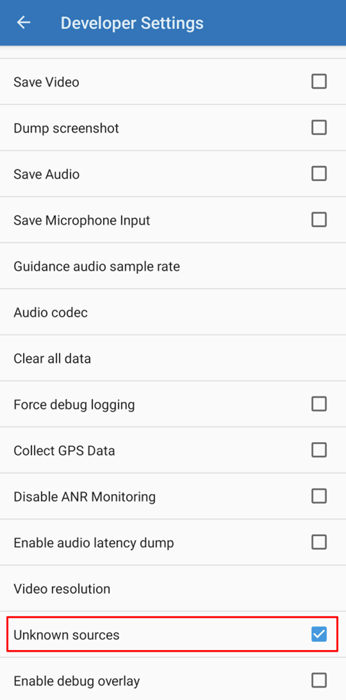

# Android Auto

**AAPS** kann aktuelle Statusinformationen als Benachrichtigung direkt an Android Auto im Auto senden.

```{admonition} version and last change information :class: dropdown date of last edit: 07/05/2023

Für die Dokumentation verwendete Versionen:

* AAPS 3.2.0-dev-i
* Android Auto: 9.3.631434-release ```

## Voraussetzungen

**AAPS** verwendet eine Android Auto-Funktion, mit der Nachrichten von Smartphone-Apps an den Bildschirm im Auto geschickt werden können.

Das bedeutet:

* **AAPS** muss so konfiguriert werden, dass Systembenachrichtigungen verwendet werden können und
* Dass "unbekannte Quellen" mit Android Auto verwendet werden dürfen, da **AAPS** eine inoffizielle AAPS ist.


## Verwenden der Benachrichtigungen für Alarme und Meldungen

Rufe das 3-Punkte Menü auf dem **AAPS**-Übersicht-Reiter oben rechts auf und wähle **Einstellungen** aus.


Aktiviere unter **Lokale Warnungen** die Option **Benutze Systemmeldungen für Alarme und Meldungen**


Bevor Du nun zu Deinem Auto gehst, überprüfe, ob Du **AAPS**-Meldungen auf Deinem Smartphone erhältst.


## Zulassen von "unbekannten Quellen" in Android Auto

Da **AAPS** keine offizielle Android Auto App ist, müssen die Benachrichtigungen einmalig manuell aktiviert werden. Die Aktivierung erfolgt über den Entwicklermodus auf Deinem Smartphone. Was dazuzutun ist, wird nun erklärt.

Als Erstes verbinde Dein Smartphone mit dem Infotainment-System Deines Autos.

Der Bildschirm sollte nun ungefähr so aussehen:


Um mit der Konfiguration zu starten, wähle das Zahnradsymbol für die **Einstellungen** aus.

Scrolle bis ans Seitenende und wähle **Mehr auf dem Smartphone anzeigen**.


Jetzt wird der Entwicklermodus auf Deinem Smartphone aktiviert.

Der erste Bildschirm sieht wie folgt aus. Scrolle bis zum Ende der Seite.


Unten findest Du die verwendete Android Auto-Version. Tippe zehn Mal (10) hintereinander auf die Versionsangabe. Damit hast Du nun den Entwicklermodus aktiviert.


Durch Deine Bestätigung (z. B. Entsperrmuster) wird der Entwicklermodus dann freigegeben.


Aktiviere in den **Entwickler-Einstellungen** die "Unbekannte Quellen".



Jetzt kannst Du den Entwicklermodus wieder verlassen. Rufe dazu über die drei Punkte oben rechts das Menü auf.

## Benachrichtigung im Auto anzeigen

Tippe auf das **Nummernsymbol** unten rechts in Android Auto in deinem Auto.


Die CGM-Werte werden wie folgt angezeigt:


## Problembehandlung:

* Falls keine Benachrichtigungen angezeigt werden: prüfe, ob Du in den Android-Einstellungen die [Benachrichtigungsanzeige für AAPS aktiviert](#use-system-notifications-in-aaps-for-alerts-and-notifications) hast und ob [Android Auto Zugriffsrechte für die Benachrichtigungen hat](#allow-the-use-of-unknown-sources-with-android-auto).