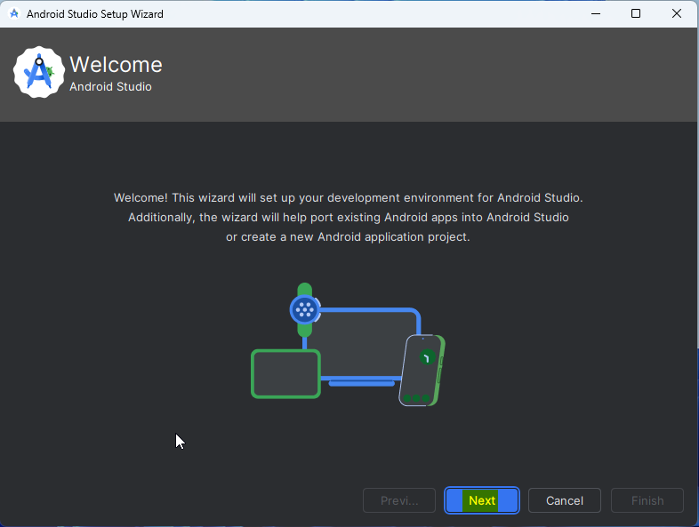
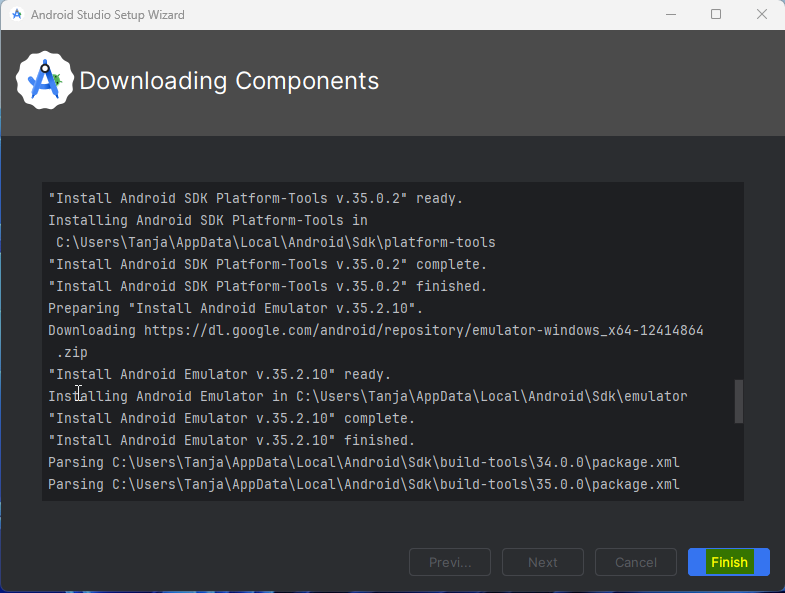
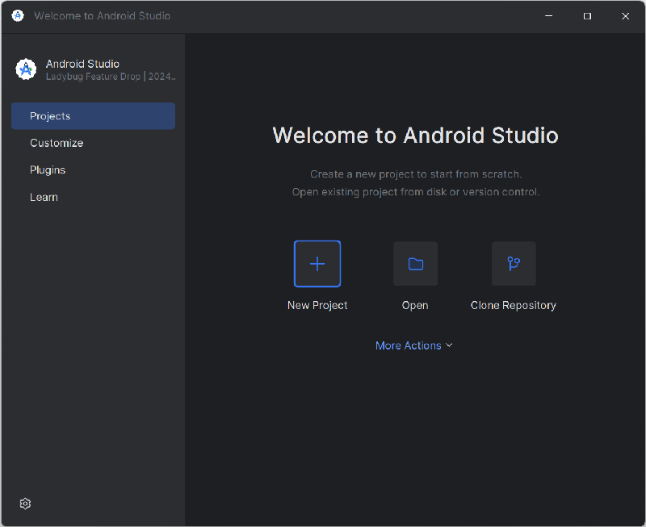
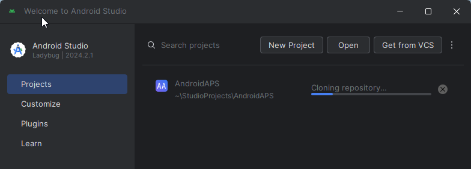

# AAPS erstellen

## Kein Download möglich - APK muss selbst erstellt werden

**The AAPS app (an apk file) is not available for download, due to regulations around medical devices. Es ist zulässig, die App für den eigenen Gebrauch zu erstellen, aber du darfst keine Kopie an andere weitergeben!**

See [FAQ page](../UsefulLinks/FAQ.md) for details.


(Building-APK-recommended-specification-of-computer-for-building-apk-file)=
## Computer- und Software-Spezifikationen für das "Bauen" von AAPS

* Please use the **[Android Studio version called at least Hedgehog (2023.1.1) or one more recent like Iguana, Jellyfish, Koala or Ladybug](https://developer.android.com/studio/)** to build the apk. Ältere Versionen des Android Studios müssen zuerst aktualisiert werden!
* [Windows 32-bit systems](#troubleshooting_androidstudio-unable-to-start-daemon-process) are not supported by Android Studio. Please keep in mind that both **64 bit CPU and 64 bit OS are mandatory condition.** If your system DOES NOT meet this condition, you have to change affected hardware or software or the whole system.

<table class="tg">
<tbody>
  <tr>
    <th class="tg-baqh">Betriebssystem (nur 64 Bit)</th>
    <td class="tg-baqh">Windows 8 oder höher</td>
    <td class="tg-baqh">Mac OS 10.14 oder höher</td>
    <td class="tg-baqh">Jedes Linux unterstützt Gnome, KDE oder Unity DE;&nbsp;&nbsp;GNU C Library 2.31 oder höher</td>
  </tr>
  <tr>
    <th class="tg-baqh"><p align="center">CPU (nur 64 Bit)</th>
    <td class="tg-baqh">x86_64-CPU-Architektur Intel Core der 2. Generation oder neuer oder AMD-CPU mit Unterstützung für <br><a href="https://developer.android.com/studio/run/emulator-acceleration#vm-windows" target="_blank" rel="noopener noreferrer"><span style="text-decoration:var(--devsite-link-text-decoration,none)">Windows Hypervisor-Framework</span></a></td>
    <td class="tg-baqh">ARM-basierte Chips oder Intel Core der 2. Generation oder neuer mit Unterstützung für <br><a href="https://developer.android.com/studio/run/emulator-acceleration#vm-mac" target="_blank" rel="noopener noreferrer"><span style="text-decoration:var(--devsite-link-text-decoration,none)">Hypervisor-Framework</span></a></td>
    <td class="tg-baqh">x86_64 CPU Architektur; Intel Core der zweiten Generation oder neuer, alternativ AMD Prozessor mit Unterstützung für AMD Virtualization (AMD-V) und SSSE3</td>
  </tr>
  <tr>
    <th class="tg-baqh"><p align="center">RAM</th>
    <td class="tg-baqh" colspan="3"><p align="center">8GB oder mehr</td>
  </tr>
  <tr>
    <th class="tg-baqh"><p align="center">Festplatte</th>
    <td class="tg-baqh" colspan="3"><p align="center">Mind. 30 GB freier Speicherplatz. SSD wird empfohlen.</td>
  </tr>
  <tr>
    <th class="tg-baqh"><p align="center">Bildschirmauflösung</th>
    <td class="tg-baqh" colspan="3"><p align="center">1280 x 800 Minimum <br></td>
  </tr>
  <tr>
    <th class="tg-baqh"><p align="center">Internet</th>
    <td class="tg-baqh" colspan="3"><p align="center">Breitband</td>
  </tr>
</tbody>
</table>

**It is strongly recommended (not mandatory) to use SSD (Solid State Disk) instead of HDD (Hard Disk Drive) because it will take less time when you are building the AAPS apk file.**  You can still use a HDD when you are building the **AAPS** apk file. Wenn du dies tust, kann es lange dauern, bis der Bau der App abgeschlossen ist, aber sobald er begonnen hat, kann man ihn unbeaufsichtigt lassen.

## Hilfe und Unterstützung während des Erstellungsprozesses

If you run into difficulties in the process of building the **AAPS** app, there is a dedicated [**troubleshooting Android Studio**](../GettingHelp/TroubleshootingAndroidStudio) section, please consult that first.


If you think something in the building instructions is wrong, missing or confusing, or you are still struggling, please reach out to other **AAPS** users group on [Facebook](https://www.facebook.com/groups/AndroidAPSUsers) or [Discord](https://discord.gg/4fQUWHZ4Mw). If you want to change something yourself (updating screenshots _etc_), please submit a [pull request (PR)](../SupportingAaps/HowToEditTheDocs.md).

## Schritt-für-Schritt Anleitung zum Erstellen der AndroidAPS.wear apk

```{admonition} WARNING
:class: warning
If you have built AAPS before, you don't need to take all the following steps again.
Please jump directly to the [update guide](../Maintenance/UpdateToNewVersion.md)!
```

The overall steps for building the **AAPS** apk file are as follows:

4.1 [Install Git](#install-git-if-you-dont-have-it)

4.2 [Install Android Studio](#install-android-studio)

4.3 [Download AAPS code](#download-the-aaps-code)

4.4 [Set Git path in Android Studio preferences](#set-git-path-in-android-studio-preferences)

4.5 [Build AAPS "signed" apk](#build-the-aaps-signed-apk)


In this guide you will find _example_ screenshots of building of **AAPS** apk file. Because  **Android Studio** - the software which we use to build the **AAPS** apk - is regularly updated, these screenshots may not be identical to your installation, but they should still be possible to follow.

Since **Android Studio** runs on Windows, Mac OS X and Linux platforms, there might be also be minor differences in the steps for the different  platforms.

(Git installieren)=
### Git installieren (wenn Du es nicht hast)

```{admonition} Why Git? 
:class: dropdown

Git is known as a “_Versioning Control System_” (VCS).\
Git is a program that allows you to track changes in code and to collaborate with others. You will use Git to make a copy of the **AAPS** source code from the GitHub website to your local computer. Then, you will use Git on your computer to build the **AAPS** application (apk). 
```

(BuildingAaps-steps-for-installing-git)=
#### Schritte zur Installation von Git

1.  Check that you don’t already have **Git** installed. You can do this by typing “git” in the Windows search bar – if you see **“Git bash”** or some other form of Git, it is already installed and you can go straight to [installing Android Studio](#install-android-studio):


2. If you don’t have Git installed, download and install the latest version for your system from the "Download" section on [**here**](https://git-scm.com/downloads). Jede aktuelle Git-Version sollte funktionieren, wähle die richtige Version nach deinem System, entweder Mac, Windows oder Linux.

**Note for Mac users:** the Git webpage will also guide you to install an additional program called "homebrew" to aid the installation. Wenn Du git über homebrew installierst, musst Du keine Einstellungen ändern.

(Make_a_note_of_Git_path)=

* During the installation, when you are asked to "select destination location" make a note of _where_ Git is being installed (the "**installation path**") you will need to check it in the next step. Der Installationspfad wird in in etwa so aussehen: "C:\Program Files\Git\cmd\git.exe"

*  Akzeptptiere in den verschiedenen Schritten der Git-Installation die voreingestellten Optionen.

*  Falls Du nach der Installtion vergessen hast (oder Du Dir keinen Notiz gemacht hast), in welchem Verzeichnis Git installiert wurde, kannst Du es auch auf folgendem Weg herausfinden: Gib in der Windows-Suchleiste unten "git"ein, klicke mit der rechten Maustaste auf "Git Bash", "Dateispeicherort öffnen". Damit öffnet sich der Installationspfad.

* Starte vor dem nächsten Schritt Deinen Computer bitte neu.

(Building-APK-install-android-studio)=
### Android Studio installieren

- **You have to be online all of the time during the following steps, as Android Studio downloads several updates**

```{admonition} What is Android Studio?
:class: dropdown
Android Studio is a program which runs on your computer. It allows you to download source code from the internet (using Git) and build smartphone (and smartwatch) apps. You cannot "break" a current, looping version of **AAPS** which you might have running on a smartphone by building a new or updated app on your PC with Android Studio, these are totally separate processes. 
```

One of the most important things when installing Android Studio is **be patient!** During installation and setup, Android Studio is downloading a lot of stuff which will take time.

Jede Version des Android Studios wie z.B. die Version Hedgehog (oder neuer) ist geeignet. Mit der Version Ladybug musst Du eventuell einen weiteren Schritt machen, aber der ist gut zu schaffen!

```{admonition} Different UI
:class: warning
Import note: Android Studio changed its UI during the last releases. This guide will show you the steps with the *new UI* in "Ladybug". If you still use the older UI, you might want to change Android Studio to the new UI first following [these instructions](NewUI).
```

Download the [current version of Android Studio](https://developer.android.com/studio) or an older version from the [**Archives**](https://developer.android.com/studio/archive) and accept the download agreements.


Sobald der Download abgeschlossen ist, starte die heruntergeladene Anwendung, um sie auf Deinem Computer zu installieren. Eventuell musst Du einige Windows-Warnungen zu heruntergeladenen Apps akzeptieren/bestätigen!

Installiere Android Studio, indem Du, wie in den folgenden Screenshots gezeigt, auf "Weiter" (Next) klickst. You do **not** need to change any settings!


Klicke nun auf "Install":


Sobald die Installation abgeschlossen ist, klicke auf "Next"


Im letzten Schritt klicke auf "Finished" (dt. Fertig), um Android Studio erstmalig zu starten.


Du wirst danach gefragt, ob Du bei der Verbesserung des Android Studios helfen möchtest. Wähle die Option, die Dir am meisten zusagt. Das hat keinen Einfluss auf die Folgeschritte.


Der Willkommensbildschirm begrüßt Dich zur Installation des Android Studios. Klicke "Next" (dt. Weiter).



Wähle "Standard" als Installationstyp aus.


Überprüfe die Einstellungen, indem Du erneut auf "Next" (dt. Weiter) klickst.


Jetzt musst Du die Lizenzvereinbarungen akzeptieren. Du hast auf der linken Seite zwei Abschnitte (1 + 3) die Du einen nach dem anderen auswählst und mit "Accept" (2 + 4) auf der rechten Seite bestätigst.

Danach kannst Du auf "Finish" (5) klicken.


Einige der Android-Pakete werden nun heruntergeladen und installiert. Habe Geduld und warte ab.

Nach dem Abschluss siehst Du den folgenden Bildschirm, auf dem Du erneut "Finish" klickst.



Du wirst jetzt Android Studios Willkommens-Bildschirm sehen.




(Building-APK-download-AAPS-code)=
### AAPS-Code herunterladen

```{admonition} Why can it take a long time to download the AAPS code?
:class: dropdown

The first time **AAPS** is downloaded, Android Studio will connect over the internet to the Github website to download the source code for **AAPS**. This should take about 1 minute. 

Android Studio will then use **Gradle** (a development tool for Android apps) to identify other components needed to build these items on your computer. 
```

On the Android Studio Welcome screen, check that "**Projects**" (1) is highlighted on the left.

Then click "**Get from VCS**" (2) on the right:


Wir werden Android Studio nun sagen, wo es den Code herunterladen soll:


* "Repository-URL" (voreingestellt) sollte auf der linken Seite ausgewählt werden (1).
* "Git" (standardmäßig) sollte als Version Control ausgewählt werden (2).
* Kopiere nun diese URL:
    ```
    https://github.com/nightscout/AndroidAPS.git
    ```
    und füge sie in das URL-Textfeld (3) ein.

* Überprüfe ob das (Standard)-Verzeichnis zum Speichern des geklonten Codes auf Deinem Computer nicht bereits existiert (4). You can change it to some directory, but please remember where you stored it!
* Klicke nun auf "Clone" (5).

```{admonition} INFORMATION
:class: information
Make a note of the directory. It is where your sourcecode is stored!
```

Du wirst jetzt einen Screen sehen, der Dir sagt, dass das Repository geklont wurde:



Irgendwann wird sich Android Studio schließen und neu starten. Du wirst gefragt, ob Du dem Projekt vertrauen willst. Klicke auf "Trust project":

  


Nur für Windows-Benutzer: Wenn Deine Firewall um Erlaubnis bittet, lasse den Zugriff zu:

 

Nachdem das Projektarchiv erfolgreich geklont wurde, wird Android Studio das geklonte Projekt öffnen.

(NewUI)=
```{admonition} New UI
:class: information
Android Studio changed its UI recently. New installations of Android Studio use the new UI by default!

Only if your Android Studio looks different, you might need to switch to the new UI:
Click on the hamburger menu on the top left, then select **Settings** (or **Preferences** on Apple computers).
In **Appearance & Behaviour**, go to **New UI** and tick **Enable new UI**. Then restart Android Studio to start using it.

If you don't find the option **New UI** don't worry: you are already using it!
```


When Android Studio opened, wait patiently (this may take a few minutes), and particularly, **do not** update the project as suggested in the pop-up.

Android Studio startet automatisch einen "Gradle project sync", der einige Minuten dauert. Du siehst, dass es (noch) läuft:


```{admonition} NEVER UPDATE GRADLE!
:class: warning

Android Studio might recommend updating the gradle system. **Never update gradle!** This will lead to difficulties.
```

Only on windows computers: You might get a notification about windows defender running: Click on **Automatically** and confirm, it will make the build run faster!


Du kannst den Gradle Sync laufen lassen während Du Dich schon um die folgenden Schritte kümmerst.

(Building-APK-set-git-path-in-preferences)=
### Pfad zu Git in den Einstellungen von Android Studio festlegen

Now we will tell Android studio where to find Git, which you installed [earlier](#install-git-if-you-dont-have-it).

* Windows users only: Make sure you have restarted your computer after [installing Git](#install-git-if-you-dont-have-it). Falls nicht, starte jetzt neu und öffne Android Studio dann erneut

In the top left corner of **Android Studio**, open the hamburger menu and navigate to **File** > **Settings** (on Windows) or **Android Studio** > **Preferences** (on Mac). This opens the following window, click to expand the dropdown called **Version Control** (1) and select **Git**


Check if **Android Studio** can automatically locate the correct **Path to Git executable** automatically by clicking the button "Test" (1):


If the automatic setting is successful, your current version of **Git** will be displayed next to the path.

   


If you find that **git.exe** is not found automatically, or that clicking "Test" results in an error (1), you can either
* manually enter the path which you saved [earlier](#BuildingAaps-steps-for-installing-git), or
* click on the folder icon (1) and manually navigating to the directory where **git.exe** was installed [earlier](#BuildingAaps-steps-for-installing-git)
* Verify your settings with the **Test** button!

  

(Building-APK-generate-signed-apk)=
### Signierte AAPS APK erstellen

```{admonition} Why does the AAPS app need to be "signed"?
:class: dropdown

Android requires each app to be _signed_, to ensure that it can only be updated later from the same trusted source that released the original app. For more information on this topic, follow [this link](https://developer.android.com/studio/publish/app-signing.html#generate-key). 

For our purposes, this just means that we generate a signing or "keystore" file and use it when we build the **AAPS** app.
```


**Important: Make sure the gradle sync is finished successfully before proceeding!**


Klicke oben links auf das Hamburger-Menü, um die Menüleiste zu öffnen. Select **Build** (1), then select **Generate Signed App Bundle / APK** (2)


Wähle "APK" anstelle von "Android App Bundle" aus und klicke auf "Next":


In der nächsten Ansicht muss "Modul" auf "AAPS.app" (1) eingestellt sein/werden.

(Building-APK-wearapk)=
```{admonition} INFORMATION!
:class: information
Wenn Du die APK für Deine Smartwatch erstellen möchtest, musst Du jetzt AAPS.wear auswählen!
```


Klicke auf "Create new..." (2), um mit der Erzeugung Deines Keystore zu beginnen.

```{admonition} INFORMATION!
:class: information
You will only need to create the keystore once.
If you have build AAPS before, do NOT create a new keystore but select your existing one and enter its passwords!
```

**_Note:_** The key store is a file in which the information for signing the app is stored. Die Datei ist verschlüsselt und passwortgeschützt.


* Klicke auf das Ordner-Symbol, um den Pfad Deines Keystore auf Deinem Computer auszuwählen.

  Do **not** use the directory where you stored your sourcecode but some directory that you would also transfer to a new computer.

```{admonition} WARNING!
:class: warning
Make sure to note down for yourself where your keystore is stored. You will need it when you build the next AndroidAPS update!
```

* Wähle jetzt ein einfaches Passwort (und notiere es Dir), gib es in das Passwortfeld (2) ein und bestätige es (2).

  Die Passwörter für Keystore und Key müssen nicht sehr anspruchsvoll sein. If you lose your password in the future, see [troubleshooting for lost key store](#troubleshooting_androidstudio-lost-keystore).

* Der Standard-Alias (3) für den Key lautet "key0". Lass ihn unverändert.

* Jetzt brauchst Du ein Passwort für Deinen Key. Wenn Du es einfach halten willst, nimmst Du das selbe Passwort, das Du auch für Deinen Keystore oben verwendet hast. Gib ein Passwort (4) ein und bestätige es.

```{admonition} WARNING!
:class: warning
Note down these passwords! You will need them when you build the next AAPS update!
```

* Standardmäßig sind sie 25 Jahre gültig. Lass es unverändert.

* Gib Deinen Vor- und Nachnamen ein (5). Es müssen keine weiteren Informationen hinzugefügt werden, aber Du kannst es dennoch tun, wenn Du möchtest (6-7).

* Drücke auf "OK" (8) um fortzufahren:


On the **Generate signed App Bundle or APK** page, the path to your keystore will now be displayed. Gib jetzt erneut das Keystore-Password (1) und das Key-Password (2) ein, und hake die Box "remember password" an (3), sodass Du es beim nächsten Erstellen der APK (z.B. bei der nächsten AAPS-Aktualisierung) nicht noch einmal eingeben brauchst. Klicke auf "Next" (4):


Auf der nächsten Seite wähle die Build-Variante "fullRelease" (2) aus und klicke auf "Create" (3). Merke Dir das Verzeichnis, das in (1) angezeigt wird, da dort später die Build-APK-Datei zu finden sein wird!

   

Android Studio will now build the **AAPS** apk. Es wird unten rechts "Gradle Build running" (2) angezeigt. The process takes some time, depending on your computer and internet connection, so **be patient!** If you want to watch the progress of the build, click on the small hammer "build" (1) at the bottom of Android Studio:


Jetzt kannst Du den Build-Fortschritt verfolgen:


Sobald der Build abgeschlossen ist, wird Android Studio "BUILD SUCCESSFUL" anzeigen. Möglicherweise erscheint eine Popup-Benachrichtigung auf der Du "locate" anklicken kannst. If you miss this, click on the notification icon (1) and then on **locate** (2) at the very bottom of the screen to bring up the Notifications:


_If the build was not successful, refer to the [Android Studio Troubleshooting section](../GettingHelp/TroubleshootingAndroidStudio)._

Klicke im Benachrichtigungsfeld auf den blauen Link "locate":

 Your file manager will open and show you the build apk file that you have just built.

   

Glückwunsch! Now you have built the **AAPS** apk file, you will be transferring this file to your smartphone in the next section of the docs.

```{tip}
If you think you might want to use an Android Wear smartwatch in the future, this is the best time to build the AAPS Wear apk to be sure it will be synchronized with your AAPS apk.
```

Move to the next stage of [Transferring and Installing **AAPS**](../SettingUpAaps/TransferringAndInstallingAaps.md).


