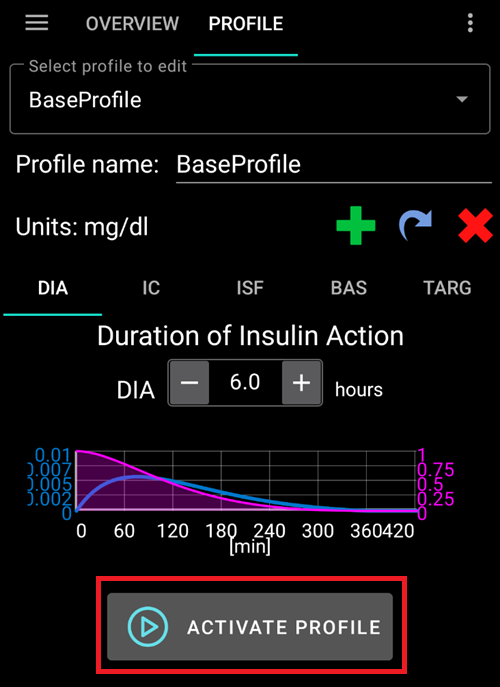
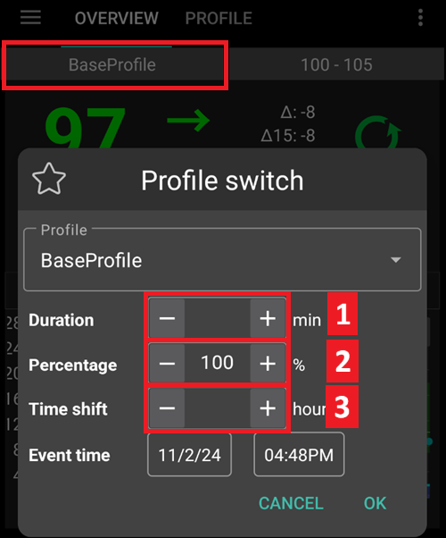

# Profile switch & Profile Percentage

This section will explain what is a **Profile Switch** and **Profile Percentage**. You can learn about how to create a **Profile** at [Config Builder - profile](#setup-wizard-profile).

When first embarking on your **AAPS** journey, you will need to create a **Profile**, understand how to action a **Profile Switch** and learn the impact of a **Profile Percentage** within **AAPS**. The features of a **Profile Switch** or **Profile Percentage** can offer be particularly beneficial for:

- the Menstrual Cycle - a percentage adjustment within a **Profile** can be set up in **Automations** in order to allow **AAPS** to accommodate for different stages of the hormone cycle and with predicted insulin resistance.

- Exercise - a percentage adjustment within a **Profile** can be set up in **Automations** for exercise in order to reduce basal intake.

- Night or pattern shift workers - a time shift in **Profile** can be set up for pattern shift workers by altering the number of hours in the **Profile** to how much later/earlier the user will go to bed or wake up.

Why use a **Profile Percentage** rather than a temporary basal adjustment? To be more effective in its application a **Profile Percentage** applies a proportionate reduction or increase across: basal, ISF and I:C. This ensures a balanced approach is calculated by **AAPS** when administering the user’s insulin intake. Little benefit can be gained in a user’s **Profile** in **AAPS** by a basal reduction if the algorithm continues to deliver the same ratios for ISF and I:C.

## How to activate a Profile Switch?

Each **Profile** once selected by the user will require a “Profile Switch”. To do this, the user should edit their **Profile** or set up a new **Profile** within the “Local Profile” tab. Once the desired settings have been applied, the user should save their changes and activate the **Profile** by selecting ‘Activate Profile’ as shown below:

Once a new **Profile** has been created and saved, **AAPS** will maintain a library of the user’s **Profiles** as generated by the user.

## How to activate a Profile Switch?

A. In order use this feature the user must have more than one **Profile** saved within **AAPS**. To activate a **Profile Switch**:

- **long-press** on the name of the **Profile** (the example below adopts a ‘Profile’ saved as: “(Lyum) low” on **AAPS’** homescreen and selects the desired **Profile** form the drop down tab:

1. Long press **Profile**;
2. Select desired **Profile**; and
3. then press ‘ok’.

## To activate a Profile Percentage within Profile Switch:

B. To activate a **Profile Percentage**:

- Follow the steps at A above.
- Adjust the fields for ‘Duration’ and ‘Percentage’ as required but noting the following. If the ‘Duration’ field (in as shown in icon 2 below) is: 
    - left ‘zero’, this will remain active in the **Profile** for an infinite amount of time. The **Profile** will remain active until the new “Profile switch” is selected and switched by the user.
    - entered with the number of [x] minutes this will be the desired time period for the **Profile**. Upon expiry of the selected time frame, the standard **Profile** will revert into **AAPS**.

How to action a **Profile** ‘Percentage’:

2. Enter ‘Duration’ field.

3. Enter ‘Percentage’ field.

4. Enter ‘Time Shift’.

## To activate a Profile Percentage within Profile Switch:

It is important that a user understands the essential features of a **Profile Percentage**. By applying a percentage increase or decrease to a **Profile Switch** this will apply in the same percentage to either raise or lower the user’s settings parameters as set within the **Profile**.

For example: a **Profile Switch** to 130% (means the user is 30% more insulin resistant) will instruct **AAPS** to

- **increase** the basal rate by 30%; 
- **lower** the **ISF**: by dividing by 1.3;
- **lower** the **I:C** by dividing by 1.3.

Remember lowering the **ISF** or **I:C** means a stronger ratio and more insulin being administered. This fact can be easily overlooked by new users to **AAPS**.

Once selected, **AAPS** readjusts the default basal rate, and **AAPS** (open or closed) will continue to work on top of the selected percentage **Profile**.

The effect of a **Profile** Percentage is summarized in the table below:

| Profile Switch  
Percentage |    Effect    |    I:C  
g/UI     | example  
15g |         ISF  
mmol/l/UI  
mg/dl/UI         | UI to lower  
2mmol/l  
40mg/dl |
|:---------------------------:|:------------:|:-----------------:|:-------------:|:------------------------------------------:|:-------------------------------:|
|             90%             |    Weaker    | 5/0.9  
=**5.55** |    2.7 UI     | 2.2/0.9  
=**2.4**  
  
40/0.9  
=**44.4** |             0.8 UI              |
|          **100%**           | **Standard** |       **5**       |   **3 UI**    |                **2.2  
40**                |           **0.9** UI            |
|            130%             |   Stronger   | 5/1.3  
=**3.85** |    3.9 UI     | 2.2/1.3  
=**1.7**  
  
40/1.3  
=**30.8** |             1.2 UI              |

(ProfileSwitch-ProfilePercentage-time-shift-of-the-circadian-percentage-profile)=

## Time shift of the Circadian Percentage Profile

A ‘time shift’ within a user’s **Profile** feature will move the user’s **Profile’s** settings around the day-to-day clock (‘circadian’) to the desired number of hours entered. This can be helpful for:

- **night shift or pattern workers**: work night shifts by altering the number of hours to how much later/earlier in the **Profile** the user will go to bed or wake up; 
- **users changing time zones during travelling**; or
- **users who are type 1 children**: and have a set bedtime routine and insulin resistance catered for within their **Profile**. If for whatever reason, there is a predicted later bedtime for the child, the caregiver can apply a ‘time shift’ to the child’s **Profile** to allow **AAPS** to react to insulin resistance at a desired time period as set by the user.

It is always a question of which hour’s **Profile’s** settings should replace the settings of the current time. Cette heure doit être décalée de x heures. So please be mindful of the directions as described in the following example:

- Heure actuelle : 12:00
- **Positif** décalage horaire +10h 
    - 2:00 **+10 h** -> 12:00
    - Les paramètres à partir de 2:00 seront utilisés à la place des paramètres normalement utilisés à 12:00 en raison du décalage horaire positif.
- **Négatif** décalage horaire +10h 
    - 22:00 **-10 h** -> 12:00
    - Les paramètres à partir de 22:00 seront utilisés à la place des paramètres normalement utilisés à 12:00 en raison du décalage horaire négatif.

This mechanism of taking snapshots of the **Profile** allows a much more precise calculation of the past and the possibility to track **Profile** changes.