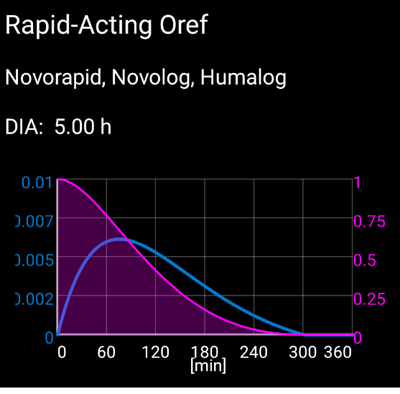
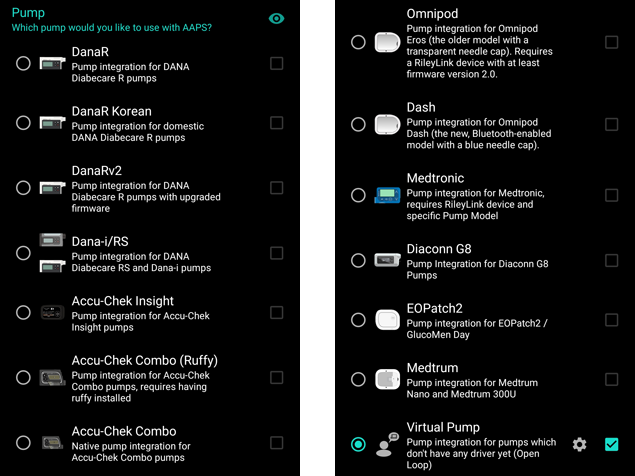

# Configuration

Depending on your settings you can open Config Builder through a tab at the top of **AAPS**' screen or through the hamburger menu.


The **Config Builder** is the tab where you turn the modular features on and off. In the picture below, the boxes on the left-hand side (A) allow you to select which modules you want activated, the boxes on the right-hand side (C) allow you to view these as a tab (E) in **AAPS**. In case the right box is not activated, you can reach the function by using the hamburger menu (D) on the top left of the screen. See [Tab or hamburger menu](#tab-or-hamburger-menu) below.

When there are additional settings available within the module, you can click on the cog wheel (B) which will take you to the specific settings within preferences.


(Config-Builder-tab-or-hamburger-menu)=

## Onglet ou menu hamburger

Avec la case à cocher sous le symbole de l'oeil, vous pouvez décider comment ouvrir la section correspondante du programme.


```{contents}
:backlinks: entry
:depth: 2
```

## Profil

This module can not be disabled as it is a core part of **AAPS**.

* See [Your AAPS Profile](../SettingUpAaps/YourAapsProfile.md) for a basic understanding of what goes inside your **Profile**.
* See [AAPS Screens > Profile](#aaps-screens-profile) for more information about managing your **Profiles**.

(Config-Builder-insulin)=

## Insuline


Select the type of insulin you are using.

More information to understand the Insulin Profile as shown in **AAPS** [here](#AapsScreens-insulin-profile).

### Différences entre les types d'insuline

* Les options 'Insuline à Action rapide Oref', 'Insuline à action Ultra Rapide Oref', 'Lyumjev' et 'Profil d'insuline ajustable Oref' ont toutes une forme exponentielle.
* Pour l'insuline à "Action Rapide", "Ultra-Rapide" et "Lyumjev", la DAI est la seule variable que vous pouvez ajuster vous-même, le temps du pic est fixé. 
* Le Profil d'insuline ajustable vous permet d'ajuster à la fois la DAI et le temps du pic, et ne doit être utilisé que par les utilisateurs confirmés qui connaissent les effets de ces paramètres. 
* The [insulin curve graph](#AapsScreens-insulin-profile) helps you to understand the different curves.

#### Insuline à Action Rapide Oref 



* recommandé pour Humalog, Novolog et Novorapid
* DAI = au moins 5.0h
* Pic maxi = 75 minutes après l'injection (fixe, non réglable)

#### Insuline Ultra Rapide Oref


* recommendé pour FIASP
* DAI = au moins 5.0h
* Pic maxi = 55 minutes après l'injection (fixe, non réglable)

(Config-Builder-lyumjev)=

#### Lyumjev


* profil d'insuline spécifique pour Lyumjev
* DAI = au moins 5.0h
* Pic maxi = 45 minutes après l'injection (fixe, non réglable)

#### Profil d'insuline ajustable Oref


* Avec le "Profil d'insuline ajustable 0ref" vous pouvez entrer individuellement l'heure du pic. Pour cela, cliquez sur la roue crantée pour entrer dans les paramètres avancés.
* La DAI est automatiquement définie à 5 heures s'il n'est pas spécifié plus haut dans le profil.
* Ce profil est recommandé si une insuline non soutenue ou un mélange d'insulines différentes est utilisé.

(Config-Builder-bg-source)=

## Source GLY

Select the blood glucose source you are using. See [BG Source](../Getting-Started/CompatiblesCgms.md) page for more setup information.


* [xDrip+](../CompatibleCgms/xDrip.md)
* [NSClient BG](../CompatibleCgms/CgmNightscoutUpload.md) - only if you know what you are doing, see [BG Source](../Getting-Started/CompatiblesCgms.md).
* [Medtronic 640g](../CompatibleCgms/MM640g.md)
* [Glimp](#libre1-using-glimp) - only version 4.15.57 and newer are supported
* [Build Your Own Dexcom App (BYODA)](#DexcomG6-if-using-g6-with-build-your-own-dexcom-app).
* [Poctech](../CompatibleCgms/PocTech.md)
* [Tomato App](#libre1-using-tomato) for MiaoMiao device
* [Application Glunovo](https://infinovo.com/) pour le système MGC Glunovo
* Gly Aléatoire : Génère des données de glycémie aléatoires (mode Démo uniquement)

## Smoothing


See [Smoothing blood glucose data](../CompatibleCgms/SmoothingBloodGlucoseData.md).

(Config-Builder-pump)=

## Pump

Sélectionner la pompe que vous utilisez. See [Compatible pumps](../Getting-Started/CompatiblePumps.md) page for more setup information.



* [DanaR](../CompatiblePumps/DanaR-Insulin-Pump.md)
* DanaR coréenne (pour la pompe DanaR domestique)
* DanaRv2 (pompe DanaR avec mise à niveau du firmware non officiel)
* [Dana-i/RS](../CompatiblePumps/DanaRS-Insulin-Pump.md)
* [Accu Chek Insight](../CompatiblePumps/Accu-Chek-Insight-Pump.md)
* Accu Chek Combo 
  * [Driver using Ruffy](../CompatiblePumps/Accu-Chek-Combo-Pump.md) (requires ruffy installation)
  * [Driver with no additional requirement](../CompatiblePumps/Accu-Chek-Combo-Pump-v2.md), added in [AAPS v.3.2](#version3200)
* Omnipod for [Omnipod Eros](../CompatiblePumps/OmnipodEros.md)
* Dash for [Omnipod DASH](../CompatiblePumps/OmnipodDASH.md)
* [Medtronic](../CompatiblePumps/MedtronicPump.md)
* [Diaconn G8](../CompatiblePumps/DiaconnG8.md)
* [EOPatch2](../CompatiblePumps/EOPatch2.md)
* [Medtrum](../CompatiblePumps/MedtrumNano.md)
* Virtual pump: open loop - **AAPS** suggestions only 
  * as you make you first steps with **AAPS**, during the first [objectives](../SettingUpAaps/CompletingTheObjectives.md)
  * for pump which doesn't have any driver yet

## Estimation de Sensibilité

Sélectionnez le type de calcul pour la sensibilité. For more details of different designs please [read on here](../DailyLifeWithAaps/SensitivityDetectionAndCob.md). Cela analysera les données historiques au fur et à mesure et fera des ajustements si elle détecte que vous réagissez de façon plus sensible (ou plus résistante) à l'insuline que d'habitude. Plus de détails sur l'algorithme de la Sensitibilité peuvent être lus dans la [documentation OpenAPS](https://openaps.readthedocs.io/en/latest/docs/Customize-Iterate/autosens.html).

You can view your sensitivity on the homescreen in an [additional graph](#AapsScreens-section-g-additional-graphs). Vous pouvez voir votre sensibilité sur l'écran d'accueil en sélectionnant Sensibilité dans les paramètres du graphique et en observant la ligne blanche. Note, you need to be in [Objective 8](#objectives-objective8) in order to let Sensitivity Detection/[Autosens](#Open-APS-features-autosens) automatically adjust the amount of insulin delivered. Avant d'atteindre cet objectif, le poucentage Autosens ainsi que la ligne dans votre graphique ne sont affichés que pour information.

### Paramètres d’absorption

If you use Oref1 with **SMB** you must change **min_5m_carbimpact** to 8. The value is only used during gaps in **CGM** readings or when physical activity "uses up" all the blood glucose rise that would otherwise cause **AAPS** to decay COB. At times when [carb absorption](../DailyLifeWithAaps/CobCalculation.md) can't be dynamically worked out based on your blood's reactions it inserts a default decay to your carbs. De base, c'est une sécurité intégrée.

(Config-Builder-aps)=

## APS

Sélectionnez l'algorithme APS souhaité pour les ajustements de thérapie. Vous pouvez afficher le détail actif de l'algorithme choisi dans l'onglet OpenAPS (OAPS).

* OpenAPS AMA 
  * Advanced Meal Assist: older algorithm not recommended anymore.
  * In simple terms, the benefits are after you give yourself a meal bolus, the system can high-temp more quickly IF you enter carbs reliably.
* [OpenAPS SMB](#Open-APS-features-super-micro-bolus-smb) 
  * Super Micro Bolus: most recent algorithm recommended for all users.
  * In contrast to AMA, SMB does not use temporary basal rates to control glucose levels, but mainly small **Super Micro Boluses**.
  * Note : It is recommended to use this algorithm from the beginning, even though you will not actually get SMBs delivered until [Objective 9](#objectives-objective9).

If switching from AMA to SMB algorithm, *min_5m_carbimpact* must be changed manually to **8** (default value for SMB) in [Preferences > Sensitivity detection > Sensitivity Oref1 settings](../SettingUpAaps/Preferences.md).

## Boucle

This module should not be disabled as it is a core part of **AAPS**.

## Constraints

### Objectives

**AAPS** has a learning program (a series of objectives) that you have to fulfill step by step. Cela devrait vous guider en toute sécurité à travers la mise en place d'un système de boucle fermée. Ce programme d'apprentissage garantit que vous avez tout mis en place correctement et que vous comprenez ce que le système fait exactement. C'est la seule façon pour vous de faire confiance au système.

See [Objectives](../SettingUpAaps/CompletingTheObjectives.md) page for more information.

## Synchronization

In this section, you can choose if/where you want **AAPS** to send your data to.

### NSClient or NSClientV3

Can be used as a [reporting server](../SettingUpAaps/SettingUpTheReportingServer.md) and/or for [remote monitoring](../RemoteFeatures/RemoteMonitoring.md), [remote control](../RemoteFeatures/RemoteControl.md).

See [Synchronization with the reporting server](#SetupWizard-synchronization-with-the-reporting-server-and-more) to help you choose between NSClient (v1) and NSClientV3.

### Tidepool

Can be used as a [reporting server](../SettingUpAaps/SettingUpTheReportingServer.md).

See [Tidepool](../SettingUpAaps/Tidepool.md).

### xDrip

Used to **send** data such as treatments to xDrip+.

### Open Humans

See [Open Humans](../SupportingAaps/OpenHumans.md).

### Wear

Monitor and control **AAPS** using your Android WearOS watch (see [page Watchfaces](../UsefulLinks/WearOsSmartwatch.md)).

### Samsung Tizen

Broadcast data to Samsung's G-Watch Wear App (Tizen OS).

### Garmin

Connection to Garmin device (Fenix, Edge...)

## Traitements

Si vous affichez les traitements, vous pouvez voir ceux qui ont été téléchargés dans Nightscout. Should you wish to edit or delete an entry (e.g. you ate less carbs than you expected) then select 'Remove' and enter the new value (change the time if necessary) through the [carbs button on the home screen](#screens-bolus-carbs).

## General

### Aperçu

This is the [main screen](#AapsScreens-the-homescreen) of **AAPS** and can not be disabled.

#### Affiche les notes dans les dialogues

Choisissez si vous voulez avoir un champ Notes lors de la saisie des traitements ou non.

#### Voyants d'état

Choose if you want to have [status lights](#Preferences-status-lights) on overview for cannula age, insulin age, sensor age, battery age, reservoir level or battery level. Lorsque le seuil d'avertissement est atteint, la couleur du voyant d'état passe à jaune. Le seuil critique s'affichera en rouge.

#### Paramètres Avancés

**Injecter cette partie de Bolus calculée par l’assistant** : Avec l'utilisation des SMB, beaucoup de personnes ne font pas de bolus repas avec 100% de l'insuline nécessaire, mais seulement une partie de celle-ci (par ex. 75 %) et laissent les SMB avec les RNS (repas non signalés) faire le reste. In this setting, you can choose a default value for the percentage the bolus wizard should calculate with. Si ce paramètre est de 75 % et que vous avez besoin d'un de bolus 10U, l'assistant de bolus proposera un bolus repas de seulement 7,5 unités.

**Activer la fonction super bolus dans l'Assistant** (c'est différent des *super micro bolus* !) : à utiliser avec prudence et ne l'activez pas tans que vous n'avez pas appris ce qu'il fait vraiment. En gros, l'insuline correspondant au débit de basal des deux heures suivantes est ajoutée au bolus et deux heures de zéro-temp sont activées. **Les fonctions de boucle AAPS seront désactivées - c'est donc à utiliser avec prudence ! If you use SMB AAPS looping functions will be disabled according to your settings in ["Max minutes of basal to limit SMB to"](#Open-APS-features-max-minutes-of-basal-to-limit-smb-to), if you do not use SMB looping functions will be disabled for two hours.** Details on super bolus can be found [here](https://www.diabetesnet.com/diabetes-technology/blue-skying/super-bolus).

(Config-Builder-actions)=

### Actions

A tab offering multiple buttons to take [actions](#screens-action-tab) in **AAPS**.

### Automatisation

A tab for managing your [Automations](../DailyLifeWithAaps/Automations.md), starting at [Objective 10](#objectives-objective10).

(Config-Builder-sms-communicator)=

### Communicateur SMS

Allows remote caregivers to control some **AAPS** features via SMS, see [SMS Commands](../RemoteFeatures/SMSCommands.md) for more setup information.

### Aliments

Affiche les préréglages alimentaires définis dans la base de données Nightscout, voir [Nightscout Lisez-moi](https://github.com/nightscout/cgm-remote-monitor#food-custom-foods) pour plus d'informations sur la configuration.

Note: Entries cannot be used in the **AAPS** calculator. (Affichage uniquement)

(Config-Builder-wear)=

### Wear

Monitor and control AAPS using your Android Wear watch (see [page Watchfaces](../UsefulLinks/WearOsSmartwatch.md)). Utilisez les paramètres (roue crantée) pour définir quelles variables doivent être prises en compte lors du calcul du bolus donné par votre montre (par ex. tendance de 15min, GA...).

Si vous voulez commander AAPS depuis la montre (bolus etc) alors dans les "Paramètres Wear" vous devez activer "Commandes depuis la montre".


Via l'onglet Wear ou le menu hamburger (en haut à gauche de l'écran, si l'onglet n'est pas affiché), vous pouvez

* Renvoyer toutes les données. Cela peut être utile si la montre n'est pas connectée pendant un certain temps et que vous voulez envoyer toutes les informations à la montre.
* Ouvrez le menu Paramètres de votre montre directement depuis votre téléphone.

### Maintenance

Access this tab to export / import settings.

### Configuration

This current tab.