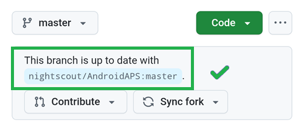
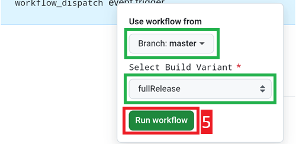

# Update with a browser

## Build yourself instead of download

**AAPS** is not available to download, due to regulations concerning medical devices. It is legal to build the app for your own use, but you must not give a copy to others! See [FAQ page](../UsefulLinks/FAQ.md) for details.

```{note}
In case you want to upgrade **AAPS** with a browser for the first time : copy your back-up keystore file to your Google Drive. Then follow the [Browser Build **AAPS** procedure](../SettingUpAaps/BrowserBuild.md) instead of this guide. Instead of creating a new keystore, you must select the one you have copied from your computer.
This operation will be mandatory only the first time, then for successive upgrades you will be able to follow this guide.
```

## Overview for updating to a new version of AAPS with a browser

```{contents} Steps for updating to a new version of AAPS
:depth: 1
:local: true
```

In case you experience problems, see separate page for [troubleshooting Android Studio](../GettingHelp/TroubleshootingAndroidStudio).

### Export your settings

Export your settings from the existing **AAPS** version on your phone. You might not need it, but better be safe than sorry.

See the [Export & import settings](ExportImportSettings.md) page if you don't remember how to do this.

(Update-to-new-version-update-your-repo)=
### Update your GitHub repository

```{admonition} WARNING
:class: warning
Browser Build is available from AAPS version 3.3.2.1.
```

[Log into GitHub](https://github.com/login).

1. Select Repositories.
2. Scroll down and select your own AndroidAPS repository.


3. Verify you are using your own copy of AndroidAPS (Forked from nightscout/AndroidAPS)
4. Tap Sync Fork to update it (the number of commits behind might differ from the picture)


5. Tap Update Branch


Note: if you have modified your copy of AndroidAPS by mistake, you will see this screen. Discard all changes (commits) to return to the released version.


You have now synchronized (updated) your own copy with the latest release of Android APS. Good job.



### Run the Workflow to Build the Signed APK

1. In your GitHub copy of AndroidAPS, select Actions.
2. Expand All Workflows.
3. Select AAPS-CI


4. Scroll down and tap Run Workflow.


5. Select the branch you want to deploy (master), the [variant](variant) (fullRelease) and tap Run Workflow.




6. You will see the message Workflow run was successfully requested. Refresh your browser page and you will be able to monitor the build progress. When the action completes, the AAPS CI action will show a green tick mark. You have successfully built the updated version of Android APS.


### Install the AAPS APK

1. Open your Google Drive
2. Browse into AAPS, select the new version folder and you will find both the phone and Android Wear versions.


Continue [here](#Update-to-new-version-check-aaps-version-on-phone)

## Troubleshooting

If anything goes wrong, don't panic.

Take a breath!

Then see the [troubleshooting tips](#aaps-ci-preparation) if your problem is already documented!

If you need further help, please reach out to other **AAPS** users on [Facebook](https://www.facebook.com/groups/AndroidAPSUsers) or [Discord](https://discord.gg/4fQUWHZ4Mw).