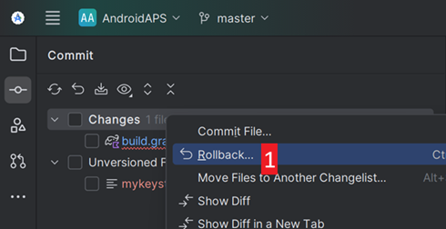
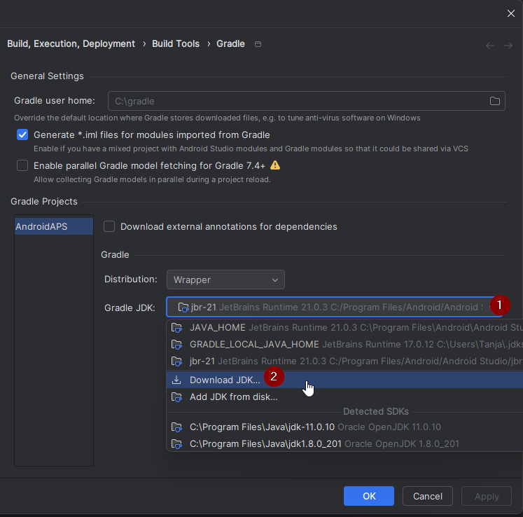

(troubleshooting_androidstudio-troubleshooting-android-studio)=

# Устранение неполадок Android Studio

(troubleshooting_androidstudio-lost-keystore)=
## Потеряно хранилище ключей
If you use the same keystore when updating **AAPS** you do not have to uninstall the previous version on your smartphone. That's why it is recommended to store the keystore in a safe place.

If you try to install the apk, signed with a different keystore than before, you will get an error message explaining that the installation failed!

In the event that you cannot trace your old keystore or password, proceed as follows:

1. [Export settings](../Maintenance/ExportImportSettings.md) on your phone.
2. Скопируйте или загрузите файл настроек из телефона во внешнее местоположение (напр. компьютер, облачный сервис хранения данных...).
4. Generate a new version of the signed apk as described on the [Update guide](../Maintenance/UpdateToNewVersion) and transfer it to your phone.
5. Uninstall previous **AAPS** version on your phone.
6. Install new **AAPS** version on your phone.
7. [Import settings](#ExportImportSettings-restoring-from-your-backups-on-a-new-phone-or-fresh-installation-of-aaps) to restore your objectives and configuration.

   If you can't find these on your phone, copy them from the external storage to your phone.

8. Проверьте параметры оптимизации батареи и отключите их снова.
9. Продолжайте пользоваться системой AAPS.

## Ошибка синхронизации Gradle
Gradle Sync can fail for various reasons. When you receive a message saying that 'gradle sync failed', open the "Build" tab (1) at the bottom of Android Studio and check what error message (2) is displayed.


Likely reasons for gradle sync failures are:
* [Непринятые изменения](#uncommitted-changes)
* [Нет кэшированной версии...](#could-not-resolveno-cached-version)
* [Incompatible Gradle JVM](#incompatible-gradle-jvm)
* [Incompatible version of the Android Gradle plugin](#incompatible-version-of-android-gradle-plugin)

*Important*: After you have followed the instructions for your specific problem, you need to trigger the [gradle sync](#gradle-resync) again.


### Непринятые изменения

If you receive a failure message like this one:


```
Build file 'C:\Data\50-Android\AndroidAPS\app\build.gradle.kts' line: 243

There are uncommitted changes.
Clone sources again as described in wiki and do not allow gradle update
```

#### Шаг 1 - Проверьте установку git
  * Откройте вкладку терминала (1) в нижней части Android Studio и скопируйте следующий текст и вставьте или введите в терминал.
    ```
    версия git
    ```

    

    Note: There is a space and two hyphens between Git and version!

  * You must receive a message saying what Git version is installed, as you can see in the screenshot above. In this case, go to [Step 2](#troubleshooting-android-studio-check-for-uncommitted-changes).

  * Если вы получите сообщение
    ```
    Git: команда не найдена
    ```
    то Git установлен неправильно.

  * [Проверьте установку git](#BuildingAaps-steps-for-installing-git)

  * if on Windows and the Git was just installed, you should restart your computer to make Git globally available after the installation

  * If Git is installed, you have restarted (if on windows), and Git still couldn't found:

  * Выполните поиск в компьютере файла "git.exe".

    Note for yourself, which directory it is saved in.

  * Перейдите к переменным окружения в окнах, выберите переменную «PATH» и нажмите «Редактировать». Add the directory where you have found your Git installation.

  * Сохраните и закройте.

  * Перезапустите Android Studio.


#### Шаг 2: Проверьте незафиксированные изменения.

  * In Android Studio, open the 'Commit' tab (1) on the left-hand side. 
  * Вы увидите либо "Изменения по умолчанию" (2) или "Неверсионные файлы" (3):

    * For "Default changeset", you probably updated 'Gradle' or changed some of the file contents by mistake.

    * Щелкните правой кнопкой мыши на "Изменения по умолчанию" и выберите "Отмена"

      

    * Файлы снова загрузятся с Git сервера. If there are no other changes in the commit tab, go to [Step 3](#gradle-resync).

  * If you can see "Unversioned Files", you might have stored files in your source code directory by mistake. Maybe they are important files: like your keystore file, that should be moved elsewhere. If you don't know what those files are and you have not created them yourself, you can delete them.

    * Use your regular file explorer on your computer to move or cut and paste that file to a safe place.

    * Go back to Android Studio and click the Refresh button (4) within the Commit tab to make sure the file is not stored in the **AAPS** directory anymore.

      If there are no other changes in the Commit tab, go to [Step 3](#gradle-resync).


#### Шаг 3: Пересинхронизация Gradle (повторно)

Follow the instructions at [Gradle Resync](#gradle-resync).

### Git Pull Failed - Please tell me who you are

If you see this message, Git needs you to identify yourself.


Open the terminal and type the following two commands, one after the other.

```
git config --global user.name "Your name here"
git config --global user.email your.email@here.com
```

Your name needs to be written between quotation marks.


(troubleshooting_androidstudio-android-gradle-plugin-requires-java-11-to-run)=

(incompatible-gradle-jvm)=
### Incompatible Gradle JVM


```
Your build is currently configured to use incompatible Java 21.0.3 and Gradle 8.2.
Cannot sync the project.

We recommend upgrading to Gradle version 8.9.

The minimum compatible Gradle version is 8.5.

The maximum compatible Gradle JVM version is 19.
```

Or:

```
Cause: error: invalid source release: 21
```

If you experience the above error message, you need to download a correct JVM version before you can try rebuild again:

1.  Check in the [requirement table](#Building-APK-recommended-specification-of-computer-for-building-apk-file) which JVM version you need for the **AAPS** version you are building, and make a note of it.

2. Open the Gradle view by clicking on the elephant (1) on the right side of Android Studio and open the settings (2) and select **Gradle Settings** (3):


3.  In **Gradle JDK** field, check if the appropriate version is selected (1) If not, click on the field, and see if it is already available in the list. The example below shows JVM 21 is labeled as “jbr-21”. If you find it, just select it, and you are done. If not available, then select 'Download JDK'.




4. In Version (1), select the JDK required for your **AAPS** version (the one you made a note of when you checked the requirement table). In Vendor (2) select 'JetBrains Runtime'. Location (3): do not change.


5.  Close the **Settings** dialog with **OK**.
6. You now need to restart the Gradle Sync. Follow the instructions at [Gradle Resync](#gradle-resync).

(incompatible-version-of-android-gradle-plugin)=
### Incompatible version of Android Gradle plugin

  Если вы сталкиваетесь со следующими ошибками

  

  Вы используете устаревшую версию Android Studio. В меню перейдите в "Справка > Проверить наличие обновлений и установить любые обновления и расширения Android Studio.

(troubleshooting_androidstudio-could-not-resolve-no-cached-version)=
### Не удалось разрешить/Нет кэшированной версии

  Вы можете столкнуться с этой ошибкой:


  * С правой стороны откройте вкладку Gradle (1).

    Убедитесь, что кнопка, показанная на (2), *НЕ* выбрана.

    

  * Now you need to trigger a [Gradle Resync](#gradle-resync)

(troubleshooting_androidstudio-unable-to-start-daemon-process)=
### Не удается запустить демон процесс

  Если вы видите подобное сообщение об ошибке, вы, вероятно, используете ОС Windows 10, 32-bit. This is not supported by Android Studio 3.5.1 and above and unfortunately there is nothing that the **AAPS** developers can do about this!

  There is information on the internet about how to determine wether you have a 32-bit or 64-bit OS - i.e. [this one](https://support.microsoft.com/en-us/windows/32-bit-and-64-bit-windows-frequently-asked-questions-c6ca9541-8dce-4d48-0415-94a3faa2e13d).

  

(gradle-resync)=
### Повторная синхронизация Gradle

  Если вы все еще видите сообщение о том, что синхронизация gradle не удалась, выберите "Повторить попытку". 


  If you don't see the message anymore, you can still trigger this manually:

  * Откройте вкладку Gradle (1) на правой границе Android Studio.

    

  * Щелкните правой кнопкой мыши по AAPS (2)

  * Нажмите на "Перезагрузить Gradle Project" (3)

## Generate Signed APK успешно сгенерировано с 0 вариантами сборки

When you generate the signed apk, you might get the notification that generation was successfully but are told that this is with '0 build variants' were generated:


Это неверное предупреждение. Check the directory for your selected "Destination folder" for generation (step [Generate Signed APK](#Building-APK-generate-signed-apk)) and you will find the generated apk there!


## Приложение было создано с предупреждениями компилятора/kotlin

Если ваша сборка успешно завершена, но получено предупреждения компилятора или kotlin (обозначенные желтым или синим восклицательным знаком), то эти предупреждения можно просто проигнорировать.

 

Your apk was built successfully and can be transferred to your phone!


## AAPS не получает данные мониторинга CGM

* If you are using patched Dexcom G6 app: this app is outdated. Use the [BYODA](#DexcomG6-if-using-g6-with-build-your-own-dexcom-app) app instead.

* If you are using xDrip+: identify receiver as described on [xDrip+ settings page](#xdrip-identify-receiver).


## Apk not installed


* Убедитесь, что вы передали файл «full-release.apk» на телефон.
* Если на телефоне появилось сообщение "приложение не установлено", то выполните следующее:

1. [Export settings](../Maintenance/ExportImportSettings.md) (in AAPS version already installed on your phone)
2. Uninstall **AAPS** on your phone.
3. Включите режим самолета & выключите bluetooth.
4. Установите новую версию («app-full-release.apk»)
5. [Выполните импорт настроек](../Maintenance/ExportImportSettings.md)
6. Снова включите Bluetooth и отключите режим самолета

## Apk installed but old version

If you built the app successfully, transferred it to your phone and installed it successfully but the version number stays the same then you might have missed to [update your local copy](#Update-to-new-version-update-your-local-copy)

## Ничего из вышеперечисленного не сработало

If none of the above tips helped you might consider building the apk from scratch:

1. [Export settings](../Maintenance/ExportImportSettings.md) (in AAPS version already installed on your phone)

2. Подготовьте пароль ключа и пароль хранилища. В случае, если вы забыли пароли, вы можете попытаться найти их в файлах проекта, как описано [здесь](https://youtu.be/nS3wxnLgZOo).

    Или просто создайте новый файл хранения ключей.

3. Build the apk from scratch as described [here](#Building-APK-download-AAPS-code).

4. When you have built the apk successfully delete the existing apk on your phone, transfer the new apk to your phone and install.
5. [Import settings](../Maintenance/ExportImportSettings.md) again to restore your objectives and settings.
6. Проверьте параметры оптимизации батареи и отключите их снова.

## Сценарий худшего варианта

If the above does not solve your build issue you may wish to try to uninstall Android Studio completely and rebuild from scratch.  Some users find that this can resolve their build problem.  When deleting Android Studio, do not delete Android user settings and **Make sure to uninstall all files associated with Android Studio.** If you do not completely remove Android Studio with all hidden files, uninstalling may cause new problems instead of solving your existing one(s). Руководства по полной деинсталляции можно найти в Интернете, напр.

[https://stackoverflow.com/questions/39953495/how-to-completely-uninstall-android-studio-from-windowsv10](https://stackoverflow.com/questions/39953495/how-to-completely-uninstall-android-studio-from-windowsv10).

Install Android Studio from scratch as described [here](#Building-APK-install-android-studio).
