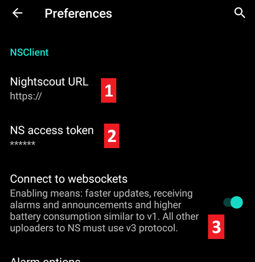
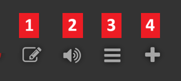
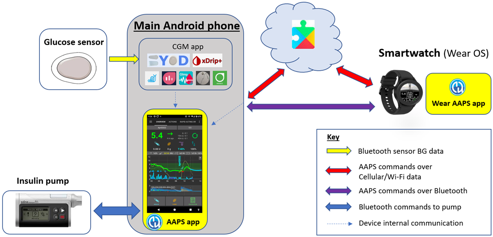

# Дистанционное управление AAPS
Существует 4 наиболее эффективных инструмента для удаленного управления **AAPS**:

1) [SMS commands](RemoteControl_SMS-Commands) (follower phone can be either Android or iOS), 2) [AAPSClient](RemoteControl_aapsclient) (follower phone is Android) 3) [Nightscout](RemoteControl_nightscout) (Android, iOS or other computer/device).  
4) [Smartwatches](RemoteControl_smartwatches) (Android)

The first three are mostly appropriate for caregivers/parents, but smartwatches are very useful for caregivers/parents **and** for adults with diabetes themselves.

(RemoteControl_SMS-Commands)=

## 1) SMS Commands

See the dedicated [SMS Commands](../RemoteFeatures/SMSCommands.md) page.

(RemoteControl_aapsclient)=
## 2) AAPSClient

**AAPSClient** похож внешне на сам **AAPS**, но позволяет опекунам отправлять команды в **AAPS** дистанционно:

### Download and installation

**AAPSClient** can be installed on a single phone or multiple follower phones (i.e. parent 1’s follower phone and parent 2’s follower phone) in order for both caregivers to be granted access and remote control a patient's **AAPS** phone.

There are 2 versions of the apk that can be [downloaded from the GitHUb repository](https://github.com/nightscout/AndroidAPS/releases/),  **AAPSClient** & **AAPSClient2** which have a subtle but important difference as explained below.

Should a caregiver require a second copy of **AAPSClient** to remote control an additional patient with a Nightscout account, they should install **AAPSClient2** in addition to **AAPSClient**. **AAPSClient 2** позволяет одному опекуну установить apk **AAPSClient** два раза на одном и том же телефоне, чтобы получить одновременный доступ и дистанционное управление для двух различных пациентов.

To download **AAPSClient**, navigate to the [GitHUb repository](https://github.com/nightscout/AndroidAPS/releases/) and click on the asset **“app-AAPSClient-release_x.x.x.x”** (it may be a newer version to that shown in the screenshot below):

Затем перейдите в _загрузки_ на своем компьютере. В Windows, -downloads_ покажется лента справа:

После загрузки нажмите _показать в папке_ для поиска файла.

The **AAPSClient** apk can now be either:

Перенесено при помощи кабеля USB на телефон опекуна; или перетащено в папку Google диска, а затем добавлено на телефон опекуна после нажатия на app-AAPSClient-release-3. apk.

Should you be needing **AAPS** for yourself, and **AAPSClient** for monitoring someone else, you will need to build **AAPSClient** yourself instead of downloading it from the Github repository as described above. The reason is that you can't install both **AAPS** and **AAPSClient** on the same phone, signed by a different key.   To build **AAPSClient** yourself, follow the same process as [regular AAPS build](../SettingUpAaps/BuildingAaps.md). On the **Generate signed App Bundle or APK** page, select **aapsclientRelease** instead of **fullRelease**.

### Synchronization- AAPSClient and AAPS set up (for Version 3.2.0.0 above)

Once __AAPSClient__ apk is installed on the follower phone, the user must ensure their ‘Preferences’ in Config Builder are correctly set up and aligned with __AAPS__ for Nightscout 15 (see Release Notes [here](../Maintenance/UpdateToNewVersion)). The example below provides Synchronization guidance for NSClient and NSClientV3 using Nightscout15 but there are other options available with __AAPS__ (e.g xDrip+).

Within the ‘Synchronization’ located under ‘Config Builder’, the user can opt for either Synchronization options for both __AAPS__ and follower phone being:

- Option 1: NSClient (also known as ‘v1’) - which synchronizes the user’s data with Nightscout; or

- Option 2: NSClientV3 (also referred to as ‘v3’).- which synchronizes the user’s data with Nightscout using v3 API.

The user must ensure that __both__ the AAPS and AAPS Client phones are synched together by actioning either option for v1 or v3 being:

Option 1: v1 for both phones:

- Enter your Nightscout URL

- Enter your API secret

Option 2: v3 for both phones:

- Enter your Nightscout URL under NSClientV3 tab

- Enter your NS access token under ‘Config Build’ tab. Please follow the notes [here](https://nightscout.github.io/nightscout/security/#create-a-token)

If selecting Websockets (which is optional) ensure this is activated or deactivated for both __AAPS’__ and __AAPSClient’s__ phone. Activating Websockets in __AAPS__ and not within __AAPSClient__ (and vice versa) will only cause __AAPS__ to malfunction. By enabling websockets will allow for faster synchronization with Nightscout but may lead to more phone battery consumption.

Users should ensure that both __AAPSClient__ and __AAPS__ are showing  ‘connected’ under the ‘NSClient' tab for each phone, and that ‘Profile Switches’ or ‘Temp Target' can be correctly activated in __AAPS__ once selected in __AAPSClient__.

Users should also ensure that carbs are logged in both ‘Treatments’ within both __AAPSClient__ and __AAPS__ otherwise this could indicate a malfunction within the user’s set up.

### Troubleshooting 'NS access token' configuration issues

The precise 'NS access token' configuration may differ depending upon whether your Nightscout provider is a paid for hosted site or not.

If you are struggling with **AAPS** v3 to accept the 'NS access token' and using a paid for hosted Nightscout site, you may wish to first liaise with your Nightscout provider on how to resolve the 'NS access token' difficulties. Otherwise, please reach out to the **AAPS** group but please double check that you have correctly followed the notes before doing so [here](https://nightscout.github.io/nightscout/security/#create-a-token).

### Возможности AAPSClient включают:

| Tab / Hamburger     | Features                                                                                                                                                                                              |
| ------------------- | ----------------------------------------------------------------------------------------------------------------------------------------------------------------------------------------------------- |
| **Action** Tab      | - Profile Switch  - Temp Target - BG Check - CGM Sensor Insert - Note - Exercise - Announcement - Question? - History Browser |
| **Food** Tab        |                                                                                                                                                                                                       |
| **Treatments** Tab  | - Check Treatments delivered including bolus and carbs entered                                                                                                                                        |
| **Maintenance** Tab | - Export and Import Settings                                                                                                                                                                          |
| **Profile** Tab     | - Creating new profile - Profile switch                                                                                                                                                      |

**AAPSClient** позволяет родителю/опекуну выполнять действия, которые выполняются непосредственно в приложении **AAPS** (за исключением болюсов) дистанционно по мобильной или интернет-сети. Основными преимуществами **AAPSClient** являются скорость и легкость, с которой опекуны/родители могут использовать его для дистанционного управления **APPS**. __AAPSClient__ _can_ be much faster than entering SMS Commands, if delivering a command which would require authentication. Команды, введенные в **AAPSClient** загружаются в Nightscout.

Remote control through **AAPSClient** is only recommended if your synchronization is working well (_i.e._ you don’t see unwanted data changes like self-modification of TT, TBR etc) see [release notes for Version 2.8.1.1](#important-hints-2-8-1-1) for further details.

### AAPSClient with smartwatch options

Смарт-часы - полезный инструмент в управлении **AAPS** у детей. Возможны несколько различных конфигураций. Если AAPSClient установлен на родительский телефон,, приложение [AAPSClient WearOS](https://github.com/nightscout/AndroidAPS/releases/) может быть установлено на смарт-часах, сопряженных с родительским телефоном. На них будет отображаться текущая ГК, статус замкнутого цикла, возможность вписать углеводы, временные цели и изменения профиля. Возможности ввести болюс с приложения на WearOS не будет. You can read more about Smartwatches [here](#4-smartwatches).

(RemoteControl_nightscout)=
## 3) Nightscout

Кроме того, что Nightscout является сервером в «Облаке», также есть специальное приложение **Nightscout**, которое можно загрузить непосредственно из App Store на iPhone. If you have an Android follower phone, there is not a dedicated Nightscout app and it is better to use [**AAPSClient**](#2-aapsclient), or, if you only want to follow, and not send treatments you can download and install the [Nightwatch](https://play.google.com/store/apps/details?id=se.cornixit.nightwatch) app from the Playstore.

После установки приложения **Nightscout** на iPhone, откройте приложение и следуйте инструкциям настройки, введя адрес Nightscout (см. ниже, слева). Форма может быть разной, в зависимости от провайдера хостинга. (_например_ http://адресвашегосайта.herokuapp.com). Затем введите Nightscout API secret (см. ниже, справа). Если API-пароль не запрошен, то нужно ввести его, нажав на замок в верхней части приложения:

Дополнительная информация об установке доступна непосредственно на ресурсе [Nightscout](https://nightscout.github.io/nightscout/discover/)

When you first log in, you will have a very simple display. Customize the display options, by selecting the “hamburger” in the top right and scrolling down:

Прокрутите вниз до «Настройки». "Масштаб" можно заменить на "линейный" т. к. по умолчанию он логарифмический, и в строке «отображать базал» выберите «по умолчанию», чтобы появился график базала.

Select your desired options. Uncheck alarms if you use an alternative app for alarms.

Продолжайте прокручивать вниз до «показать расширения (плагины)».

Убедитесь, что «портал терапии» отмечен галочкой, а также можете выбрать другие показатели (наиболее полезные: активный инсулин IOB, помпа, катетер, отсчет возраста инсулина, базальный профиль и OpenAPS).

Не забудьте, это важно, чтобы эти изменения вступили в силу, нажать кнопку «сохранить» в нижней части.

После нажатия «сохранить» приложение вернется на главный экран Nightscout и будет выглядеть примерно так:

1. Current glucose value
2. Information on AAPS system status - touch the individual tabs on the screen to display more detail. Add or remove these display options using hamburger menu.
3. Recent glucose trace with treatments (carbs, boluses) displayed
4. Longer-term glucose trace
5. "Hamburger" menu for setting display options, generating reports, editing profiles and Nightscout admin tools
6. "**+**" menu for entering treatments to send to AAPS.
7. Select different time period to display
8. Basal insulin profile
9. Green line = historical glucose Blue lines = predicted glucose

В верхнем левом меню приложения Nightscout вы найдете дополнительную информацию:

1. Careportal retrospective edit
2. Turn on/off alarms
3. Hamburger - for setting preferences
4. Careportal - Log treatment - to send changes to AAPS

На серых вкладках огромное количество информации о состоянии системы **AAPS** (и еще больше информации если щелкуть по вкладкам):

1. 5min glucose trend
2. Bolus wizard preview
3. Press on Basal to see your current profile and basal information
4. Time since latest CGM reading in AAPS
5. **Pump**: insulin, battery % and when AAPS last connected to it
6. Last time AAPS refreshed - if this is longer than 5 mins it can indicate a connection issue between AAPS phone and pump/CGM
7. Press on IOB to see split of basal and bolus insulin
8. Insulin age in reservoir
9. сколько времени прошло с момента установки канюли
10. Battery status of AAPS phone
11. Size of your database. If it gets too full (DIY Nightscout only - hosted services just ignore) you may start having connectivity issues. You can delete data to reduce the size of the number in the Admin tools menu (via hamburger).

Press "refresh" at the bottom of the page to close the popup.

### Отправка событий терапии через приложение Nightscout в AAPS

Чтобы настроить отправку событий терапии с приложения **Nightscout** на главный телефон **AAPS**, перейдите на вкладку **AAPSClient** в приложении **AAPS**. Откройте меню с правой стороны, найдите настройки синхронизации AAPSClient – и выберите соответствующие параметры. Настройте его на получение различных команд (временных целей и т. д.) а также на синхронизацию профилей. Если ничего не синхронизируется, вернитесь на вкладку AAPSClient, выберите «полная синхронизация» и подождите несколько минут.

Nightscout на iPhone имеет те же функции, что и Nightscout на ПК. Он позволяет отправлять множество команд **AAPS**, за исключением болюсов.

### Отмена отрицательного инсулина во избежание повторных гипо

Хотя у нас нет возможности вводить болюсы, мы можем "внести" инсулин через Nightscout как "болюс на коррекцию", который реально не вводится. В этом случае AAPS будет учитывать этот инсулин,, заставляя алгоритм AAPS действовать _менее агрессивно_, что полезно при отмене отрицательного активного инсулина. Это также предотвратит гипогликемию при агрессивно настроенном профиле. Вы можете проверить это самостоятельно в присутствии телефона **AAPS** если настройки **Nightscout** отличаются.

Некоторые полезные команды **Nightscout** приведены в таблице ниже.

#### Таблица команд Nightscout

| Most commonly used treatments                             | Function, example of when command is useful                                                                                                                                                                                                               |
| --------------------------------------------------------- | --------------------------------------------------------------------------------------------------------------------------------------------------------------------------------------------------------------------------------------------------------- |
| **Correction bolus**                                      | Allows you to announce **but <u>not</u> bolus** insulin. Very useful for cancelling negative insulin to prevent a hypo, for example in the middle of the night, if the profile has been too strong.                                     |
| **Carb correction**                                       | Announce carbs now                                                                                                                                                                                                                                        |
| **Temporary Target** **Temporary Target cancel** | Allows temp targets to be set and cancelled. Note that cancelling does not always work, in this instance you can set a new target for a short time period (2 min) which will then revert back to the normal target afterwards. |
| **Переключение профиля**                                  | Allows you to check the current profile which is running, and switch to another profile, either permanently, or for a defined length of time (mins).                                                                                    |

| Less widely used commands                                                                                                           | Function, example of when command is useful                                                                                                                              |
| ----------------------------------------------------------------------------------------------------------------------------------- | ------------------------------------------------------------------------------------------------------------------------------------------------------------------------ |
| **BG check**                                                                                                                        | Send a BG check to AAPS.                                                                                                                                                 |
| **Snack bolus** **Meal bolus** **Combo bolus**                                                                    | Can announce carbs (plus proteins and fat)  from 60 min in the past to 60 min in the future. Combo bolus allows insulin announcement at the same time. |
| **Announcement** **Note** **Question** **Exercise** **Open APS offline** **DAD alert** | Add these info notes (DAD = diabetic dog alert).                                                                                                                         |
| **Pump site change** **Battery change** **Insulin cartridge change**                                              | Announces these pump changes.                                                                                                                                            |
| **CGM sensor start** **CGM sensor insert** **CGM sensor stop**                                                    | Announces these CGM changes.                                                                                                                                             |
| **Temp basal start** **Temp basal end**                                                                                    | Most useful in open looping.                                                                                                                                             |

Подробнее возможностях **Nightscout** [здесь](https://nightscout.github.io/)

### Как извлечь максимум пользы из приложения Nightscout

1). Если вы «застряли» на странице и хотите видеть главное окно снова, просто нажмите «обновить» (внизу по центру) и вернетесь на домашнюю страницу **Nightscout** с графиком ГК.

Чтобы увидеть параметры текущего профиля на телефоне, нажмите на различные иконки на экране над графиком. Больше информации (текущий углеводный коэффициент, чувствительность, часовой пояс и т. д.) можно увидеть нажав «basal»; а нажав на «OpenAPS» получим данные о профиле, текущей цели и т. д. Можно также отслеживать % батареи телефона и % батареи помпы. Калькулятор болюса дает информацию о прогнозе алгоритма с учетом активного инсулина IOB и активных углеводов COB.

#### Другие иконки в меню: что означает карандаш (редактирование)?

Карандаш редактирования поможет (технически) переместить или удалить болюс или коррекцию с графика за последние 48 часов.

Подробнее [здесь](https://nightscout.github.io/nightscout/discover/#edit-mode-edit)

Хотя это может пригодиться для удаления внесенных (но не получивших болюса) углеводов, на практике эта функция плохо работает с **AAPS** и мы рекомендуем вносить такие изменения непосредственно через приложение **AAPS**.

(RemoteControl_smartwatches)=
## Смарт-часы

### Option 1) Controlling AAPS from a Wear OS Watch

Once you have [setup **AAPS** on your watch](../WearOS/BuildingAapsWearOS.md), extensive details about the smartwatch faces and their functions can be found in [Operation of Wear AAPS on a Smartwatch](../WearOS/WearOsSmartwatch.md).

As a brief overview, the following functions can be triggered from the smartwatch:

* set a temporary target

* use the bolus calculator (calculation variables can be defined in settings on the phone)

* administer eCarbs

* administer a bolus (insulin + carbs)

* watch settings

* status

* check pump status

* check loop status

* check and change profile, CPP (Circadian Percentage Profile = time shift + percentage)

* show TDD (Total daily dose = bolus + basal per day)

* Remote bolus where the caregiver and T1D child are in different locations (this is possible for the **AAPS** watch and **AAPS** phone providing both devices are connected to the network)

#### Communication from caregivers to the watch using other apps (like WhatsApp)

It is possible to add additional apps to the watch, like WhatsApp, for messaging (for example) between caregivers and kids. It is important only to have ONE Google account associated with the phone, or the watch will not bring this data across. You need to be 13 or older to have a Samsung account, and this needs to be set up in the same email address which is used on the Android phone.

A video explaining getting WhatsApp setup for messaging on the Galaxy 4 watch (you can’t get full functionality of WhatsApp) is shown [here](https://gorilla-fitnesswatches.com/how-to-get-whatsapp-on-galaxy-watch-4/)

Making adjustments in both the **Galaxy wearable** app on the **AAPS** phone and the watch makes it possible for WhatsApp messages to announce with a slight vibration, and also for the WhatsApp message to display over the existing watchface.

### Вариант 2) **AAPS** на смарт-часах, для дистанционного управления **AAPS** на телефоне

Аналогично использованию телефона фоллоуэра либо с AAPSClient, Nightscout или SMS (ссылка на разделы) смарт-часы можно использовать для удаленного управления **AAPS** и предоставления полных данных профиля. Ключевое различие с телефоном фоллоуэра заключается в том, что смарт-часы связываются с **AAPS** через Bluetooth и не требуют кода аутентификатора. As a side-note, if both smartwatch and **AAPS** phone linked by bluetooth are also on a Wi-Fi/Cellular data network, the watch will also interact with the **AAPS** phone, giving a longer range of communication. This includes remote delivery of a bolus where the caregiver with the **AAPS** watch and T1D child (with **AAPS** phone) are in different locations and which can useful in circumstances where the T1D child is in school.

Таким образом, смарт-часы дистанционного управления полезны когда:

a)  команды **AAPSClient**/Nightscout/**SMS** не работают; или

b)  The user wishes to avoid the need for authenticator code (as required for the follower phone with inputting data, selecting TT or entering carbs).

На смарт-часах требуется программное обеспечение **Android wear** (идеально версии 10 или выше), чтобы управлять **AAPS**. Please check the technical specifications of the watch, and check the [Phones page](../Getting-Started/Phones.md). Воспользуйтесь поиском или задайте вопрос в группе **AAPS** на Facebook или в Discord если есть сомнения.

Specific How-to guides for setting up **AAPS** on the popular [Samsung Galaxy Watch 4 (40mm) is given below. Часы [Garmin](https://apps.garmin.com/en-US/apps/a2eebcac-d18a-4227-a143-cd333cf89b55?fbclid=IwAR0k3w3oes-OHgFdPO-cGCuTSIpqFJejHG-klBTm_rmyEJo6gdArw8Nl4Zc#0) также популярны. If you have experience of setting up a different smartwatch which you think would be useful to others, please add it into these pages [edit the documentation](../SupportingAaps/HowToEditTheDocs.md) to share your findings with the wider **AAPS** community.

### Вариант 3) AAPS на смарт-часах, для дистанционного управления **AAPS** на телефоне

Программное обеспечение для часов, **AAPSClient** Wear apk, можно загрузить непосредственно с [Github](https://github.com/nightscout/AndroidAPS/releases/).

Чтобы скачать приложение, нажмите на требуемое приложение (на этом снимке экрана, либо **wear-aapsclient-release_3.2.0.** либо **wear-aapsclient2-release_3.2.0.** будут работать, есть две версии (копия для второго опекуна):

Затем «сохранить как» и сохранить файл в удобном месте на компьютере:

The **AAPSClient** wear apk can be transferred to your phone and side-loaded onto the watch in the same way as the **AAPS** Wear app, as detailed in [Transferring the Wear app onto your AAPS phone](#remote-control-transferring-the-aaps-wear-app-onto-your-aaps-phone)  

