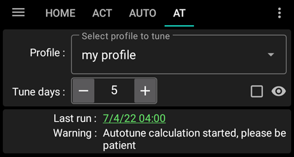
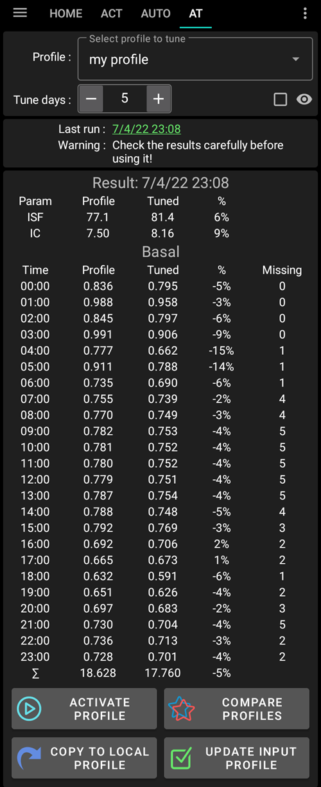
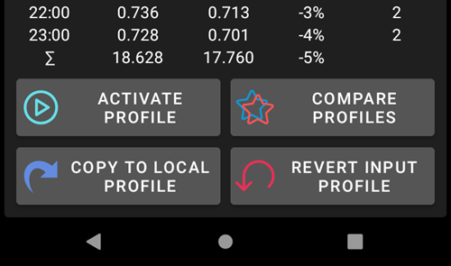
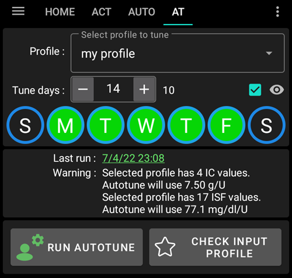

# Otoayar eklentisi nasıl kullanılır? (sadece geliştirici sürümünde)

Otoayar algoritması hakkında daha fazla ayrıntıyı [OpenAPS dokümantasyonu](https://openaps.readthedocs.io/en/latest/docs/Customize-Iterate/autotune.html)nda bulabilirsiniz.

Otoayar eklentisi, AAPS içindeki OpenAPS otoayar algoritmasının uygulanmasıdır.

**Currently Autotune Plugin is only available in [dev branch](../AdvancedOptions/DevBranch.md) and with Engineering mode.**

## Otoayar kullanıcı arabirimi

- Ayarlamak istediğiniz giriş profilini Profil açılır menüsünden seçebilirsiniz (varsayılan olarak mevcut etkin profiliniz seçilidir)
  - Not: Her yeni profil seçiminde, önceki sonuçlar kaldırılacak ve Gün Ayar parametreleri varsayılan değere ayarlanacaktır.
- Ayar günleri, profilinizi ayarlamak için hesaplamada kullanılan gün sayısını içermektedir. Minimum değer 1 gün ve maksimum değer 30 gündür. Doğru yinelemeli ve sorunsuz sonuçlar elde etmek için bu sayı çok küçük olmamalıdır (her hesaplama için 7 günden fazla)
  - Not: Ayar günleri parametresini her değiştirdiğinizde, önceki sonuçlar kaldırılacaktır
- Son Çalıştırma, en son geçerli hesaplamanızı kurtaran bir bağlantıdır. If you didn't launch Autotune on current day, or if previous results was removed with a modification of calculation parameter above, then you can recover parameters and results of the latest successful run.
- Uyarı size örneğin seçilen profil hakkında bazı bilgiler gösterir (birkaç Kİ değeriniz veya birkaç İDF değeriniz varsa)
  - Not: Otomatik ayar hesaplaması yalnızca tek bir Kİ ve tek bir İDF değeriyle çalışır. Şu anda bir sirkadiyen Kİ veya sirkadiyen İDF'yi ayarlamak için mevcut bir OtoAyar algoritması yoktur. Giriş profilinizin birkaç değeri varsa, profilinizi ayarlamak için dikkate alınan ortalama değeri uyarı bölümünde görebilirsiniz.
- Giriş Profilini Kontrol Et düğmesi, profilinizi (Ünite, İES, Kİ, İDF, bazal ve hedef) hızlı bir şekilde doğrulamanıza izin vermek için Profil Görüntüleyiciyi açar.
  - Not: OtoAyar, yalnızca Kİ (tek değer), İDF (tek değer) ve bazal (sirkadiyen varyasyonlu) ayarlarınızı yapacaktır. Üniteler, İES ve hedef, çıktı profilinde değişmeden kalacaktır.

- "OtoAyarı Çalıştır", seçili profil ve ayarlama gün sayısı ile OtoAyar hesaplamasını başlatır
  - Not: Otomatik ayar hesaplaması uzun sürebilir. Başlatıldıktan sonra, başka bir görünüme (ev, ...) geçebilir ve sonuçları görmek için daha sonra otoayar eklentisinde geri dönebilirsiniz

- Ardından çalıştırma sırasında aşağıda ara sonuçları göreceksiniz

  - Not: Çalıştırma sırasında ayarlar kilitlenir, bu nedenle artık seçilen giriş profilini veya gün sayısını değiştiremezsiniz. Diğer parametrelerle başka bir çalıştırma başlatmak istiyorsanız mevcut hesaplamanın bitmesini beklemeniz gerekecektir.

  

- OtoAyar hesaplaması bittiğinde, sonucu (Ayarlanmış profil) ve aşağıda dört buton göreceksiniz.

- Girdi profilini ("Profil" sütunu), çıktı profilini ("Ayar" sütunu) ve her değer için varyasyon yüzdesini ("%" Sütunu) her zaman karşılaştırmak önemlidir.

- Bazal oranlar için "kayıp gün" sayısına da sahipsiniz. Otoayarın bu dönemde bazal oranı ayarlamak için "Bazal" olarak kategorize edilmiş yeterli veriye sahip olmadığı durumlarda (örneğin, her yemekten sonra karbonhidrat emilimi durumunda) eksik günleriniz olacaktır. Bu sayı, özellikle bazal önemli olduğunda (örneğin gece veya öğleden sonra) mümkün olduğunca düşük olmalıdır.

- "Profilleri karşılaştır" butonu, profil karşılaştırıcı görünümünü açar. Giriş profili mavi ve çıkış profili ("Ayarlanmış" olarak adlandırılır) kırmızıdır.

  - Not: Aşağıdaki örnekte, giriş profilinin Kİ ve İDF için sirkadiyen değişimi vardır, ancak hesaplanan çıktı profilinin tek bir değeri vardır. If it's important for you to get a circadian output profile see [Circadian IC or ISF profile](#circadian-ic-or-isf-profile) below.

  

- Sonuçlara güveniyorsanız, (giriş profili ile çıktı profili arasında düşük yüzdeli farklılık) "Profili etkinleştir" düğmesine tıklayabilir ve ardından doğrulamak için Tamam'a tıklayabilirsiniz.

  - Ayarlanmış profili etkinleştirin, Yerel profil eklentinizde otomatik olarak yeni bir "Ayarlanmış" profil oluşturacaktır.
  - Yerel profil eklentinizde zaten "Ayarlanmış" (Tuned) adlı bir profiliniz varsa, bu profil aktivasyondan önce hesaplanan Otoayar profiliyle güncellenecektir.

  

- Ayarlanmış profilin gerektiğini düşünüyorsanız (örneğin, bazı varyasyonların çok önemli olduğunu düşünüyorsanız), "Yerel profile kopyala" düğmesine tıklayabilirsiniz.

  - Yerel profil eklentisinde "Ayarlanmış" ön ekine ve çalıştırmanın tarih ve saatine sahip yeni bir profil oluşturulacak

- Ardından, Ayarlanmış profilini düzenlemek için yerel profili seçebilirsiniz (Yerel profil eklentisini açtığınızda varsayılan olarak seçilecektir)

  - yerel profildeki değerler ancak kullanıcı arabiriminde pompa kapasitenize yuvarlanır

  

- Giriş profilinizi Otoayar sonuçlarıyla değiştirmek isterseniz, "Giriş profilini güncelle" düğmesine tıklayın ve açılan pencereyi Tamam ile onaylayın

  - Not: "Giriş profilini güncelle"den sonra "Profili etkinleştir"e tıklarsanız, varsayılan "Ayarlanmış" profili değil, güncellenmiş profilinizi etkinleştirirsiniz.

  

- Giriş profilinizi güncellediyseniz, "Giriş profilini güncelle" butonunun yerini "Giriş profilini geri al" butonu alır (aşağıdaki ekran görüntüsüne bakın). You can that way immediately see if your current input profile in Local profile plugin already include the result of last run or not. Ayrıca, bu buton ile otoayar sonucu olmadan giriş profilinizi kurtarma olanağına da sahipsiniz.

  

## OtoAyar ayarları

(autotune-plugin-settings)=

### Otoayar eklenti ayarları

- Automation Switch Profile (default Off): see [Run Autotune with an automation rule](#run-autotune-with-an-automation-rule) below. Bu ayarı Açık olarak değiştirirseniz, giriş profili Ayarlanmış profil tarafından otomatik olarak güncellenecek ve etkinleştirilecektir.
  - **Be Careful, you must trust and verify during several following days, that after an update and activation of Tuned profile without modification, it improves your loop**

- UAM'ı bazal olarak kategorize et (varsayılan Açık): Bu ayar, herhangi bir karbonhidrat girmeden AndroidAPS kullanan kullanıcılar içindir (Tam UAM). (Kapalı olduğunda) UAM'ın bazal olarak kategorize edilmesini önleyecektir.
  - Not: Bir gün boyunca tespit edilen en az bir saatlik karbonhidrat emiliminiz varsa, bu ayar ne olursa olsun (Açık veya Kapalı) "UAM" olarak sınıflandırılan tüm veriler bazal olarak kategorize edilir.
- Veri gün sayısı (varsayılan 5): Bu ayar ile varsayılan değer tanımlayabilirsiniz. Otoayar eklentisinde her yeni profil seçtiğinizde, Ayar günleri parametresi bu varsayılan değerle değiştirilecektir.
- Apply average result in circadian IC/ISF (default Off): see [Circadian IC or ISF profile](#circadian-ic-or-isf-profile) below.

### Other settings

- Autotune also uses Max autosens ratio and Min autosens ratio to limit variation. Bu değerleri; Konfigürasyon ayarları > Hassasiyet algılama eklentisi > Ayarlar > Gelişmiş Ayarlarda görebilir ve ayarlayabilirsiniz.

  

## Gelişmiş özellik

(autotune-circadian-ic-or-isf-profile)=

### Sirkadiyen Kİ veya İDF profili

- If you have important variation of IC and/or you ISF in your profile, and you fully trust in your circadian time and variation, then you can set "Apply average result in circadian IC/ISF"

  - Otoayar hesaplamasının her zaman tek bir değerle yapılacağını ve sirkadiyen varyasyonun Otoayar tarafından ayarlanmayacağına dikkat edin. Bu ayar yalnızca sirkadiyen değerlerinizde Kİ ve/veya İDF için hesaplanan ortalama değişimi uygular.

- Ortalama varyasyonu uygula Kapalı (solda) ve Açık (sağda) ile Ayarlanmış profilin altındaki ekran görüntüsüne bakın

  

### Tune specific days of the week

- If you click on the checkbox with the eye on the right of "Rune days" parameter, you will see the day selection. You can specify which day of the week should be included in Autotune calculation (in screenshot below you can see an example for "working days" with Saturday and Sunday removed from autotune calculation)
  - If the number of day included in Autotune calculation is lower than the number of Tune days, then you will see how many days will be included on the right of Tune days selector (10 days in the example below)
  - This setting gives good results only if the number of remaining days is not to small (for example if you Tune a specific profile for week end days with only Sunday and Saturday selected, you should select a minimum of 21 or 28 Tune days to have 6 or 8 days included in Autotune calculation)

- During Autotune calculation, you can see the progress of the calculations ("Partial result day 3 / 10 tuned" on example below)

  

(autotune-run-autotune-with-an-automation-rule)=

## Otomasyon kuralı ile Otoayar çalıştırma

İlk adım, otomasyon kuralı için doğru tetikleyiciyi Otoayar tanımlamaktır:

Note: for more information on how to set an automation rule, see [here](../DailyLifeWithAaps/Automations.md).

- You should select Recurring time trigger: only run Autotune once per day, and autotune is designed to be run daily (each new run you shift one day later and quickly profile modification should be tiny)

  

- Sonuçları kontrol edebilmek için Otoayarı gün boyunca çalıştırmak daha iyidir. Gece boyunca Otoayarı çalıştırmak istiyorsanız, bir sonraki Otoayar hesaplamasına şu anki gün de dahil tetikleme için saat 4 veya daha sonrasını seçmeniz gerekir.

  

- Ardından listede "Otoayarı Çalıştır" eylemini seçebilirsiniz

  

- Ardından, çalıştırmanız için gerekli parametreleri ayarlamak için Otoayar eylemini seçebilirsiniz. Varsayılan parametreler "Aktif Profil", Otoayar eklentisi tercihlerinde tanımlanan varsayılan ayar günleri değeridir ve tüm günler seçilir.

  

- After a few days, if you fully trust Autotune results and percentage of modification is low, you can modify [Autotune settings](#autotune-plugin-settings) "Automation Switch Profile" to enabled to automatically update and activate profile tuned after calculation.

Note: if you want to automatically tune profiles for specific days of the week (for example a profile for "Weekend days" and another one for "Working days"), then create one rule for each profile, select the same days in Trigger and in Autotune Action, Tune days must be high enough to be sure tuning will be done with at least 6 or 8 days, and don't forget to select time after 4AM in trigger...

- See below an example of rule to tune "my profile" on all "Working days" with 14 Tune days selected (so only 10 days included in autotune calculation).

## Ipuçları ve Püf noktaları

Otoayar, veritabanınızda bulunan bilgilerle çalışır, bu nedenle AAPS yeni bir telefona henüz yüklendiyse, ilgili sonuçları almak için yeterli günle Otoayarı başlatmadan önce birkaç gün beklemeniz gerekecektir.

Otoayar sadece bir yardımdır, hesaplanan profille hemfikir olup olmadığınızı düzenli olarak kontrol etmek önemlidir. Herhangi bir şüpheniz varsa, Otoayar (örneğin gün sayısını) ayarlarını değiştirin veya yerel profildeki sonuçları kopyalayın ve kullanmadan önce profili ayarlayın.

Always use Autotune several days manually to check results before applying them. Ve yalnızca, Otoayar sonuçlarına tam olarak güvendiğinizde ve önceki profil ile hesaplanan profil arasında değerler, otomasyonu kullanmaya başladığınızdan bu yana küçükse kullanın. (Daha önce değil)

- Otoayar, bazı kullanıcılar için çok iyi çalışabilir ve bazıları için çalışmaz, bu nedenle ** Otoayara güvenmiyorsanız, kullanmayın **

Otoayarın neden bu değişiklikleri önerdiğini anlamak (veya anlamaya çalışmak) için otoayar sonuçlarını analiz etmek de önemlidir.

- Profil direncinizin bir artışı veya azalması olabilir (örneğin, İDF ve Kİ değerlerinin azalmasıyla ilişkili toplam bazal artışı). Otoduyarlılık % 100'ün üzerinde (daha fazla agresif) veya% 100'ün altında (daha hassassınız) sonraki birkaç gün ile ilişkilendirilebilir.
- Bazen Otoayar, bazal oranlar ve Kİ/İDF arasında farklı bir denge önerir (önceki düşük bazal ve daha agresif Kİ/İDF için)

Aşağıdaki durumlarda Otoayar kullanmayı tavsiye etmiyoruz:

- Tüm karbonhidratları girmiyorsanız
  - Bir hipoglisemideki karbonhidrat düzeltmesini girmezseniz, Otoayar, KŞ değerinizde anlaşılmaz bir artış görecek ve 4 saat önceden bazal oranlarınızı arttıracaktır. Özellikle de gece yarısı hipodan kaçınmanız gerekirken tam tersi olabilir. Bu yüzden tüm karbonhidraları, özellikle hipo için yapılan düzeltmeleri girmek önemlidir.
- Gün boyunca UAM tespit edilen çok fazla periyot varsa.
  - Tüm karbonhidratlarınızı girdiniz ve karbonhidratlarınızı doğru tahmin ettiniz mi?
  - Tüm UAM dönemleri (bir gün boyunca karbonhidrat girmezseniz ve bazal devre dışı bırakıldığı için UAM kategorize edilmezse) bazal olarak kategorize edilir ve bu bazalınızı çok artırabilir (gerekenden çok daha fazla)

- Karbonhidrat emiliminiz çok yavaş: Karbonhidrat emiliminizin çoğu min_5m_carbimpact parametresi ile hesaplanıyorsa (bu periyotları AKRB eğrisinin üst kısmında küçük bir turuncu nokta ile görebilirsiniz), AKRB hesaplaması yanlış olabilir ve yanlış sonuçlara yol açabilir.
  - When you practice sport, you are generally more sensitive and your BG doesn't rise a lot, so during or after an exercise, it's usual to see some periods with slow carbs. Ancak çok sık beklenmedik yavaş karbonhidrat emiliminiz varsa, o zaman bir profil ayarlamasına (daha yüksek Kİ değeri) veya biraz yüksek bir min_5m_carbimpact'e ihtiyacınız olabilir.
- "Çok kötü günler" geçiriyorsunuz, örneğin, aralığın içine inebilmek için yüksek miktarda insülinle birkaç saat hiperglisemide kalmışsınız veya bir sensör değişikliğinden sonra uzun süre yanlış kan şekeri değerleriniz olmuş. If during the pas weeks you only have one or 2 "bad days", you can disable manually these days in autotune calculation to exclude them from calculation, and again **check carefully if you can trust the results**
- Değişiklik yüzdesi çok önemliyse
  - Daha sorunsuz sonuçlar almak için gün sayısını artırmayı deneyebilirsiniz.