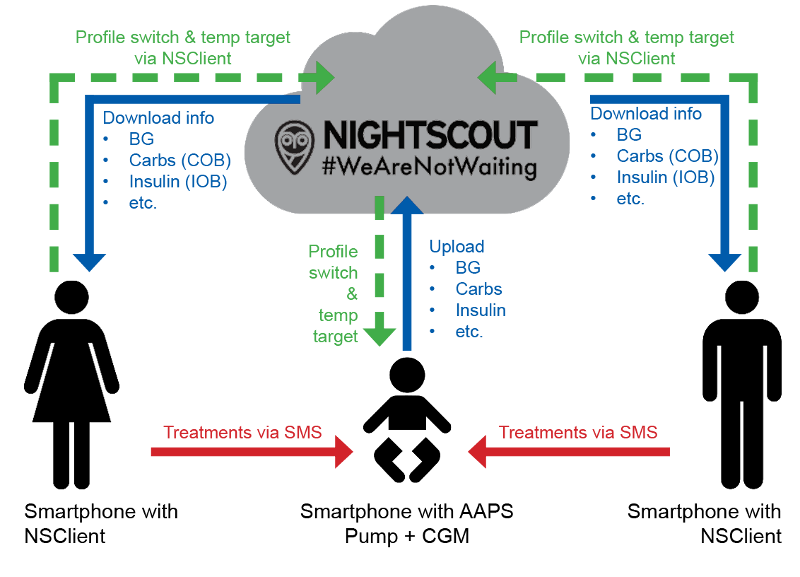

# 遠端監控

AAPS 提供多種遠端監控兒童的選項，並允許傳送遠端指令。 當然，您也可以使用遠端監控來追蹤您的伴侶或朋友。 Of course you can also use remote monitoring to follow your partner or friend.

## 功能

- 孩子的幫浦是由孩子的手機使用 AAPS 控制的。
- 父母可以透過他們的手機使用 **AAPSClient 應用程式** 遠端查看所有相關資料，如血糖值、活性碳水化合物、活性胰島素等。 AAPS 和 AAPSClient 應用程式中的設定必須相同。 AAPS 和 AAPSClient 應用程式中的設定必須相同。
- 父母可以使用手機上的 **xDrip+ 應用程式** 在追蹤者模式中接收警報。
- 透過雙因素身份驗證的 [SMS 指令](../Children/SMS-Commands.md) 遠端控制 AAPS。
- 僅在同步運作正常時（例如您沒有看到不需要的資料更改如 TT、TBR 自動修改等情況）建議使用 AAPSClient 應用程式進行遠端控制，有關詳情請參閱 [2.8.1.1 版的發行說明](Releasenotes-important-hints-2-8-1-1)。

## 遠端監控的工具和應用程式

- 網頁瀏覽器中的 [Nightscout](https://nightscout.github.io/)（主要用於資料顯示）
- AAPSClient app is a stripped down version of AAPS capable of following somebody, making profile switches, setting TTs and entering carbs. AAPSClient 應用程式是 AAPS 的精簡版本，能夠追蹤某人、更換設定檔、設定臨時目標並輸入碳水化合物。 您可以下載兩個應用程式：[AAPSClient 及 AAPSClient2](https://github.com/nightscout/AndroidAPS/releases/)。 這兩個應用程式唯一的區別是應用程式名稱。 這樣，您可以在同一部手機上安裝兩個應用程式，從而能夠追蹤兩個不同人的nightscouts。 The only difference is the app name. This way you can install the app twice on the same phone, to be able to follow 2 different persons/nightscouts with it.
- Dexcom follow if you are using original Dexcom app (BG values only)
- [xDrip+](../Configuration/xdrip.md) 在追蹤者模式中（主要顯示血糖值和 **警報**）。
- 在 iOS 上使用 [Sugarmate](https://sugarmate.io/) 或 [Spike](https://spike-app.com/)（主要顯示血糖值和 **警報**）。
- 一些使用者發現 [TeamViewer](https://www.teamviewer.com/) 這樣的全遠端存取工具對於進行高階遠端故障排除非常有幫助。

## 智慧型手錶選項

智慧型手錶在幫助管理 AAPS 和孩子的情況下可能是非常有用的工具。 可以進行幾種不同的配置： A couple of different configurations are possible:

- 如果父母的手機上安裝了 AAPSClient，則可以在與父母手機相連的相容智慧型手錶上安裝 [AAPSClient WearOS 應用程式](https://github.com/nightscout/AndroidAPS/releases/)。 這將顯示當前的血糖值、循環狀態，並允許輸入碳水化合物、設定臨時目標和更換設定檔。 無法從 WearOS 應用程式進行注射。 This will show current BG, loop status and allow carb entry, temp targets and profile changes. It will NOT allow bolusing from the WearOS app.
- 或者，可以自行建立並安裝在與孩子手機相連的相容智慧型手錶上，但由父母配戴的 [AAPS WearOS 應用程式](https://androidaps.readthedocs.io/en/latest/Configuration/Watchfaces.html)。 這包括上述所有功能，並具有注射胰島素的能力。 這允許父母在不需要取出孩子手機的情況下管理胰島素注射。 This includes all the functions listed above as well as the ability to bolus insulin. This allows the parent to adminster insulin without needing to remove the kid's phone from however it is kept on them.

## 需考慮的事項

- Setting the correct [treatment factors](FAQ-how-to-begin) (basal rate, DIA, ISF...) is difficult for kids, especially when growth hormones are involved.
- 遠端監控和治療在幼兒園和小學中非常有幫助。 但請確保老師和教育工作者了解您孩子的治療計劃。 可以在 Facebook 上的 [AAPS 使用者群組檔案區](https://www.facebook.com/groups/AndroidAPSUsers/files/) 中找到此類照護計劃的範例。
- 考慮主裝置和追蹤者之間的時間差，因為上傳和下載需要時間，並且 AAPS 主手機只會在循環運作後上傳資料。
- 因此，請花時間正確設定這些參數，並在現實生活中與您的孩子一起測試，然後再開始遠端監控和遠端治療。 學校假期可能是進行此操作的好時機。 School holidays might be a good time for that.
- 當遠端控制無法運作時（例如，網路問題），您的應變計劃是什麼？
- Remote monitoring and treatment can be really helpful in kinder garden and elementary school. But make sure the teachers and educators are aware of your kid's treatment plan. Examples for such care plans can be found in the [files section of AAPS users](https://www.facebook.com/groups/AndroidAPSUsers/files/) on Facebook.
- It is important to keep the kid's phone in range of their pump and CGM at all times. This can be challenging especially with very small children. Many solutions exist, a popular option is an [SPI Belt](https://spibelt.com/collections/kids-belts)
