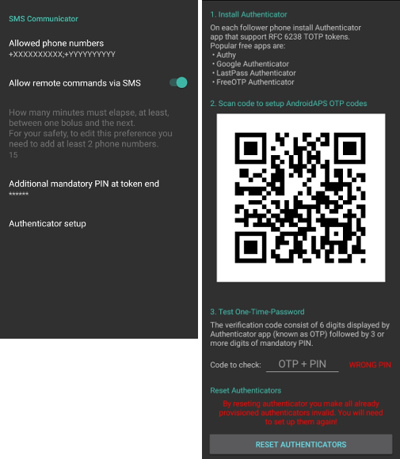
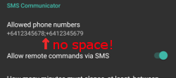

# SMS(簡訊) 指令

## 安全第一

- AAPS 允許您透過簡訊遠端控制孩子的手機。 如果您啟用此 SMS 通訊功能，請務必記住，設置為傳送遠端指令的手機可能會被盜。 因此，務必至少使用 PIN 碼來保護手機。 建議使用強度較高的密碼或生物識別技術。 If you enable this SMS Communicator, always remember that the phone set up to give remote commands could be stolen. So always protect it at least by a PIN code. A strong password or biometrics are recommended.
- 透過發送並確認一條 SMS 指令使該號碼運作。 此外，建議允許 [第二個手機號碼](SMS-Commands-authorized-phone-numbers) 來發送 SMS 指令。 這樣，當您的主遠端手機丟失或被盜時，可以使用第二個號碼 [臨時停用](SMS-Commands-other) SMS 通訊功能。
- AAPS will also inform you by text message if your remote commands, such as a bolus or a profile change, have been carried out. It is advisable to set this up so that confirmation texts are sent to at least two different phone numbers in case one of the receiving phones is stolen.
- **如果您透過 SMS 指令進行注射，則必須透過 Nightscout（AAPSClient、網站等）輸入碳水化合物！** 如果您未這樣做，活性胰島素（IOB）數值會正確，但活性碳水化合物化合物（COB）可能過低，導致 **AAPS** 假設您有過多的活性胰島素，從而未執行糾正注射。
- 從 AAPS 2.7 版本起，當使用 SMS 指令時，必須使用帶有時間一次性密碼的身份驗證器應用程式來提高安全性。

## 設定 SMS 指令

- 大多數臨時目標的調整、追蹤 AAPS 等操作可以在連線網路的 Android 手機上的 [AAPSClient 應用程式](../Children/Children.md) 中完成。
- 無法透過 Nightscout 進行注射，但可以使用 SMS 指令。
- 如果您使用 iPhone 作為追蹤者，無法使用 AAPSClient 應用程式，則有其他 SMS 指令可用。
- 在 Android 手機設定中，前往應用程式 > AndroidAPS > 權限並啟用 SMS。

(SMS-Commands-authorized-phone-numbers)=

### 授權手機號碼

- 在 AAPS 中，前往 **偏好設定 > SMS 通訊功能** 並輸入允許發送 SMS 指令的手機號碼（使用分號分隔 - 例如 +6412345678;+6412345679）。

- Note that the "+" in front of the number may or may not be required based on your location. To determine this send a sample text which will show the received format in the SMS Communicator tab.

- 啟用「允許透過 SMS 傳送遠端指令」。

- 如果您想使用多個號碼：

  - Enter just one number.

  - Make that single number work by sending and confirming a SMS command.

  - 輸入其他號碼，使用分號分隔，無需空格。

    

### Minutes between bolus commands

- 您可以定義透過 SMS 發送的兩次注射之間的最小間隔時間。
- 出於安全考慮，您必須添加至少兩個授權手機號碼來編輯此數值。

### 另外，必須在訊息末端添加 PIN 碼。

- 為了安全起見，回覆碼後面必須加上 PIN 碼。

- PIN 碼規則：

  - 3到6位數字
  - 不允許相同數字（例如 1111）
  - not in a row (i.e. 1234)

### Authenticator setup

- 使用雙因素身份驗證來提高安全性。

- 您可以使用任何支援 RFC 6238 TOTP 令牌的身份驗證應用程式。 常見的免費應用程式有： Popular free apps are:

  - [Authy](https://authy.com/download/)
  - Google 身份驗證器 - [Android](https://play.google.com/store/apps/details?id=com.google.android.apps.authenticator2) / [iOS](https://apps.apple.com/de/app/google-authenticator/id388497605)
  - [LastPass 身份驗證器](https://lastpass.com/auth/)
  - [FreeOTP 身份驗證器](https://freeotp.github.io/)

- 在追蹤者的手機上安裝您選擇的身份驗證應用程式，並掃描 AAPS 中顯示的 QR Code。

- 透過輸入您身份驗證應用程式中顯示的令牌和您剛剛在 AAPS 中設置的 PIN 來測試一次性密碼。 範例： Example:

  - 您的強制 PIN 碼是 2020
  - TOTP 令牌來自身份驗證應用程式是 457051
  - Enter 4570512020

- 如果輸入正確，紅色文字「PIN 錯誤」將**自動**變為綠色的「OK」。 **這裡沒有按鈕可以按！** **There is no button you can press!**

- The time on both phones must be synchronized. Best practice is set automatically from network. Time differences might lead to authentication problems.

- Use button "RESET AUTHENTICATORS" if you want to remove provisioned authenticators.  (By resetting authenticator you make ALL already provisioned authenticators invalid. You will need to set them up again)

## 使用 SMS 指令

- 從您的授權手機號碼向運作 AAPS 的手機發送 SMS，使用以下任何[指令](SMS-Commands-commands)。

- AAPS 手機將回覆以確認指令是否成功執行或請求的狀態。

- 如果需要，請透過發送代碼確認指令。 範例： Example:

  - 您的強制 PIN 碼是 2020
  - TOTP 令牌來自身份驗證應用程式是 457051
  - Enter 4570512020

**提示**：如果您將發送大量 SMS，則建議您手機方案中具有無限簡訊功能（對於每個使用的手機）。

(SMS-Commands-commands)=

## 指令

指令必須以英文發送，回覆將使用您當地的語言，如果該回覆字符串已經[翻譯](translations-translate-strings-for-AAPS-app)。

### 循環

- LOOP STOP/DISABLE (循環停止/停用) \* 回覆：循環已停用

- LOOP START/ENABLE (循環啟動/啟用) \* 回覆：循環已啟用

- LOOP STATUS (循環狀態)

  - Response depends on actual status

    - Loop is disabled \* 回覆：循環已停用
    - Loop is enabled \*回覆：循環已啟用
    - Suspended (10 min)

- LOOP SUSPEND 20 (循環暫停 20) \* 回覆：循環已暫停 20 分鐘

- LOOP RESUME (循環恢復) \* 回覆：循環已恢復

- LOOP CLOSED (循環關閉) \* 回覆：當前循環模式：循環關閉

- LOOP LGS (循環低血糖暫停) \* 回覆：當前循環模式：低血糖暫停

### CGM 資料

- BG
  \* Response: Last BG: 5.6 4min ago, Delta: -0,2 mmol, IOB: 0.20U (Bolus: 0.10U Basal: 0.10U)
- CAL 5.6 (校正 5.6) \* 回覆：要發送校正 5.6，請回覆來自身份驗證器應用程式的代碼和 PIN \* 正確代碼收到後的回覆：校正已發送（**如果安裝了 xDrip。 啟用 xDrip+ 的校正接受功能**） Accepting calibrations must be enabled in xDrip+\*\*)

### Basal

- BASAL STOP/CANCEL (基礎停止/取消) \* 回覆：要停止臨時基礎率，請回覆來自身份驗證器應用程式的代碼和 PIN
- BASAL 0.3 (基礎 0.3) \* 回覆：要開始 0.3U/h 的基礎率持續 30 分鐘，請回覆來自身份驗證器應用程式的代碼和 PIN
- BASAL 0.3 20 (基礎 0.3 20) \* 回覆：要開始 0.3U/h 的基礎率持續 20 分鐘，請回覆來自身份驗證器應用程式的代碼和 PIN
- BASAL 30% (基礎30%) \* 回覆：要開始 30% 的基礎率持續 30 分鐘，請回覆來自身份驗證器應用程式的代碼和 PIN
- BASAL 30% 50 (基礎30% 50 \* 回覆：要開始 30% 的基礎率持續 50 分鐘，請回覆來自身份驗證器應用程式的代碼和 PIN

### Bolus

Remote bolus is not allowed within 15 min (this value is editable only if 2 phone numbers added) after last bolus command or remote commands! Therefore the response depends on the time that the last bolus was given.

- BOLUS 1.2
  \* Response A: To deliver bolus 1.2U reply with code from Authenticator app for User followed by PIN
  \* Response B: Remote bolus not available. Try again later.
- BOLUS 0.60 MEAL
  \* If you specify the optional parameter MEAL, this sets the Temp Target MEAL (default values are: 90 mg/dL, 5.0 mmol/l for 45 mins).
  \* Response A: To deliver meal bolus 0.60U reply with code from Authenticator app for User followed by PIN
  \* Response B: Remote bolus not available.
- CARBS 5
  \* Response: To enter 5g at 12:45 reply with code from Authenticator app for User followed by PIN
- CARBS 5 17:35/5:35PM
  \* Response: To enter 5g at 17:35 reply with code from Authenticator app for User followed by PIN
- EXTENDED STOP/CANCEL (擴展停止/取消) \* 回覆：要停止擴展注射，請回覆來自身份驗證器應用程式的代碼和 PIN
- EXTENDED 2 120
  \* Response: To start extended bolus 2U for 120 min reply with code from Authenticator app for User followed by PIN

### Profile

- PROFILE STATUS (設定檔狀態) \* 回覆：設定檔 1
- PROFILE LIST (設定檔清單) \* 回覆：1.\`設定檔 1\` 2.\`設定檔 2\`
- PROFILE 1 (設定檔 1) \* 回覆：要切換至設定檔 1 100%，請回覆來自身份驗證器應用程式的代碼和 PIN
- PROFILE 2 30 (設定檔 2 30) \* 回覆：要切換至設定檔 2 30%，請回覆來自身份驗證器應用程式的代碼和 PIN

(SMS-Commands-other)=

### 其他

- TREATMENTS REFRESH (治療重新整理) \* 回覆：從 NS 重新整理治療
- NSClient RESTART (NSClient 重新啟動) \* 回覆：NSCLIENT 重新啟動已發送
- PUMP
  \* Response: Last conn: 1 min ago Temp: 0.00U/h @11:38 5/30min IOB: 0.5U Reserv: 34U Batt: 100
- PUMP CONNECT (幫浦連線) \* 回覆：幫浦已重新連線
- PUMP DISCONNECT _30_ (幫浦斷線 _30_) \* 回覆：要中斷幫浦 <0>30</0> 分鐘，請回覆來自身份驗證器應用程式的代碼和 PIN
- SMS DISABLE/STOP
  \* Response: To disable the SMS Remote Service reply with code Any. Keep in mind that you'll able to reactivate it directly from the AAPS master smartphone only.
- TARGET MEAL/ACTIVITY/HYPO
  \* Response: To set the Temp Target MEAL/ACTIVITY/HYPO reply with code from Authenticator app for User followed by PIN
- TARGET STOP/CANCEL (目標停止/取消) \* 回覆：要取消臨時目標，請回覆來自身份驗證器應用程式的代碼和 PIN
- HELP (幫助) \* 回覆：BG, LOOP, TREATMENTS，......
- HELP BOLUS (幫助 注射) \* 回覆：BOLUS 1.2 BOLUS 1.2 餐前

(SMS-Commands-troubleshooting)=

## Troubleshooting

### 多條簡訊

If you receive the same message over and over again (i.e. profile switch) you will probably have set up a circle with other apps. This could be xDrip+, for example. If so, please make sure that xDrip+ (or any other app) does not upload treatments to NS.

如果其他應用程式安裝在多部手機上，請確保在所有手機上停用上傳功能。

### SMS 指令在三星手機上無法正常運作

有報告指出，Galaxy S10 手機更新後，SMS 指令停止運作。 透過停用「以聊天訊息發送」可以解決此問題。 Could be solved by disabling 'send as chat message'.

### Android Messages 應用程式

如果您在使用 Android Messages 應用程式發送或接收 SMS 指令時遇到問題，請在照護者和孩子的手機上停用端到端加密。

- 打開 Messages 中的特定 SMS 對話
- Select the options ellipisis in the top right corner
- 選擇「詳細訊息」
- 啟用「僅發送 SMS 和 MMS 訊息」
