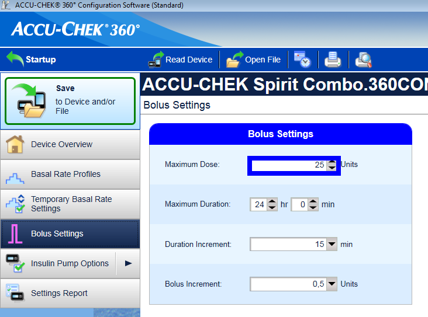
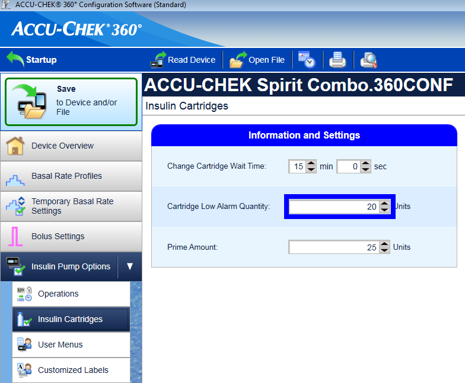
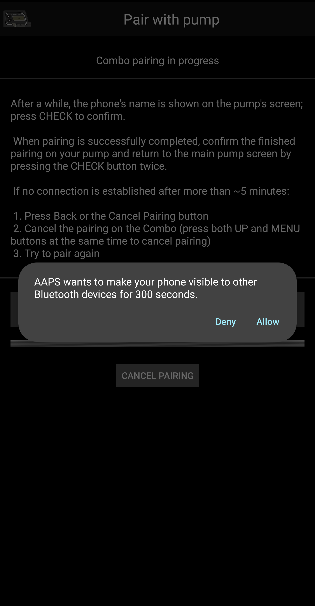
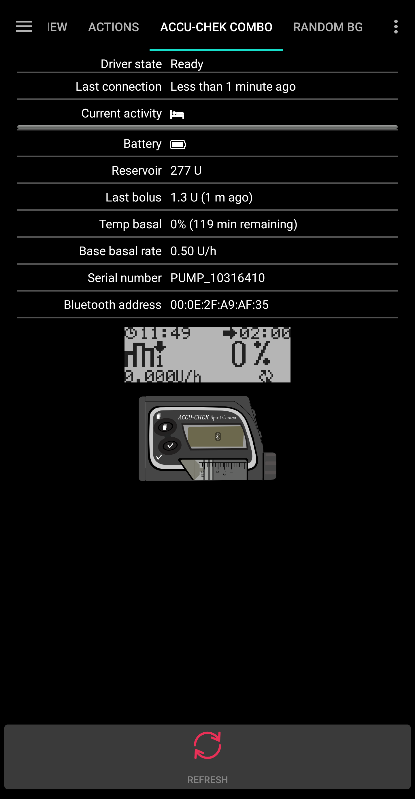

# Accu Chek Combo 幫浦

這些說明是關於使用 AndroidAPS 3.2 版本中新增的 combov2 驅動程式設置 Accu-Chek Combo 幫浦。 該驅動程式與舊版完全分開。 This driver is entirely separate from the old one.

**This software is part of a DIY solution and is not a product, but requires YOU to read, learn and understand the system including how to use it. It is not something that does all your diabetes management for you, but allows you to improve your diabetes and your quality of life if you're willing to put in the time required. Don't rush into it, but allow yourself time to learn. You alone are responsible for what you do with it.**

## 硬體和軟體需求

- 一台 Roche Accu-Chek Combo 幫浦（任何韌體版本均可使用）。
- A Smartpix or Realtyme device together with the 360 Configuration Software to configure the pump. (Roche sends out Smartpix devices and the configuration software free of charge to their customers upon request.)
- A compatible phone. Android 9 (Pie) or newer is a must. If using LineageOS, the minimum supported version is 16.1. See [release notes](https://androidaps.readthedocs.io/en/latest/Installing-AndroidAPS/Releasenotes.html#android-version-and-aaps-version) for details.
- 手機上安裝了 AndroidAPS 應用程式。

根據手機的藍牙支援質量及其是否具備額外的省電邏輯，有些手機可能比其他手機運作得更好。 可以在[AAPS 手機列表](https://docs.google.com/spreadsheets/d/1gZAsN6f0gv6tkgy9EBsYl0BQNhna0RDqA9QGycAqCQc/edit)文件中找到相容手機。 請注意，這不是完整的列表，只反應個人使用經驗。 我們鼓勵你也分享你的經驗，這樣可以幫助其他人（這些專案是關於傳遞經驗）。 A list of phones can be found in the [AAPS Phones](https://docs.google.com/spreadsheets/d/1gZAsN6f0gv6tkgy9EBsYl0BQNhna0RDqA9QGycAqCQc/edit) document. Please be aware that this is not complete list and reflects personal user experience. You are encouraged to also enter your experience and thereby help others (these projects are all about paying it forward).

(combov2-before-you-begin)=

## 開始之前

**SAFETY FIRST** - do not attempt this process in an environment where you cannot recover from an error. Keep your Smartpix / Realtyme device handy, along with the 360 Configuration Software. Plan on spending about an hour for setting everything up and checking that everything is working properly.

請注意以下限制：

- 目前不支援延長注射和多波注射（您可以使用[延長碳水化合物](../Usage/Extended-Carbs.rst)來代替）。
- Only one basal profile (the first one) is supported.
- The loop is disabled if the currently active profile on the pump isn't profile no. 1. This continues until profile no. 1 is made the active one; when that is done, the next time AAPS connects (either on its own after a while or because the user presses the Refresh button in the combov2 user interface), it will notice that profile no. 1 is the current one, and enable the loop again.
- If the loop requests a running TBR to be cancelled, the Combo will set a TBR of 90% or 110% for 15 minutes instead. This is because actually cancelling a TBR causes an alert on the pump which causes a lot of vibrations, and these vibrations cannot be disabled.
- Bluetooth connection stability varies with different phones, causing "pump unreachable" alerts, where no connection to the pump is established anymore. If that error occurs, make sure Bluetooth is enabled, press the Refresh button in the Combo tab to see if this was caused by an intermitted issue and if still no connection is established, reboot the phone which should usually fix this.
- There is another issue were a restart doesn't help but a button on the pump must be pressed (which resets the pump's Bluetooth stack), before the pump accepts connections from the phone again.
- Setting a TBR on the pump is to be avoided since the loop assumes control of TBRs. 避免在幫浦上設定 TBR，因為循環控制 TBR。 在幫浦上偵測到新的 TBR 可能需要長達 20 分鐘，並且 TBR 的效果僅從偵測時開始計算，因此最壞情況下可能有 20 分鐘的 TBR 沒有反映在 IOB 中。

If you have been using the old Combo driver that depends on the separate Ruffy app, and want to move to this new one, note that the pairing has to be done again - Ruffy and the new Combo driver are not able to share pairing information. Also, make sure that Ruffy is _not_ running. If in doubt, long-press the Ruffy app icon to bring up a context menu. In that menu, press on "App Info". In the UI that just opened up, press "Force stop". That way, it is ensured that an active Ruffy instance cannot interfere with the new driver.

Also, if you are migrating from the old driver, be aware that the new driver communicates a bolus command in an entirely different way to the Combo that is much faster, so don't be surprised when a bolus starts immediately regardless of the dosage. Furthermore, the general suggestions, tips and tricks etc. about dealing with Ruffy pairing and connection problems do not apply here, since this is an entirely new driver that shares no code with the old one.

This new driver is currently written to support the following languages on the Combo.
該新驅動程式當前支援 Combo 上以下語言。 （這與 AAPS 的語言無關——是顯示在 Combo LCD 上的語言。）

- 英語
- 西班牙語
- 法語
- 義大利語
- 俄語
- 土耳其語
- 波蘭語
- 捷克語
- 匈牙利語
- 斯洛伐克語
- 羅馬尼亞語
- 克羅地亞語
- 荷蘭語
- 希臘語
- 芬蘭語
- 挪威語
- 葡萄牙語
- 瑞典語
- 丹麥語
- 德語
- 斯洛文尼亞語
- 立陶宛語

**Important**: If your pump is set to a language that is not part of this list, please contact the developers, and set the pump's language to one in this list. Otherwise, the driver won't work properly.

## 手機設置

It is very important to make sure that battery optimizations are turned off. AAPS already auto-detects when it is subject to these optimizations, and requests in its UI that these be turned off. But, on modern Android phones, Bluetooth _itself_ is an app (a system app). And, usually, that "Bluetooth app" is run _with battery optimizations on by default_. As a result, Bluetooth can refuse to respond when the phone aims to save power because it kills off the Bluetooth app. This means that in that Bluetooth system app's settings, battery optimizations must be turned off as well. Unfortunately, how one can find that Bluetooth system app differs between phones. In stock Android, go to Settings -> Apps -> See all N apps (N = the number of apps on your phone). Then, open the menu to the top right corner, tap on "Show system" or "Show system apps" or "All apps". Now, in the newly expanded list of apps, look for a "Bluetooth" app. Select it, and on its "App info" UI, tap on "Battery". There, disable battery optimizations (sometimes called "battery usage").

## Combo 設置

- Configure the pump using the Accu-Chek 360 Configuration Software. If you do not have the software, please contact your Accu-Chek hotline. They usually send registered users a CD with the "360° Pump Configuration Software" and a SmartPix USB-infrared connection device (the Realtyme device also works if you have that).

  - **必要設定**（在螢幕截圖中以綠色標記）：

    - Set/leave the menu configuration as "Standard", this will show only the supported menus/actions on the pump and hide those which are unsupported (extended/multiwave bolus, multiple basal rates), which cause the loop functionality to be restricted when used because it's not possible to run the loop in a safe manner when used.
    - Verify the _Quick Info Text_ is set to "QUICK INFO" (without the quotes, found under _Insulin Pump Options_).
    - 將 TBR _最大調整_ 設定為 500%
    - Disable _Signal End of Temporary Basal Rate_
    - 將 TBR _持續時間增量_ 設定為 15 分鐘
    - 啟用藍牙

  - **推薦設定**（在螢幕截圖中以藍色標記）

    - 根據你的需求設置低匣警報
    - 配置一個適合你治療的最大注射量，以防軟體中的錯誤
    - Similarly, configure maximum TBR duration as a safeguard. Allow at least 3 hours, since the option to disconnect the pump for 3 hours sets a 0% for 3 hours.
    - Enable key lock on the pump to prevent bolusing from the pump, esp. when the pump was used before and quick bolusing was a habit.
    - Set display timeout and menu timeout to the minimum of 5.5 and 5 respectively. This allows the AAPS to recover more quickly from error situations and reduces the amount of vibrations that can occur during such errors

  

  

  

  

## 註冊驅動並將其與 Combo 配對

- 在 [組態建置工具](../Configuration/Config-Builder) 中選擇 "Accu-Chek Combo" 驅動程式。 **重要提示**：名單中也有舊驅動，稱為 "Accu-Chek Combo (Ruffy)"。 請 _不要_ 選擇那個。 **Important**: There is the old driver, called "Accu-Chek Combo (Ruffy)", in that list as well. Do _not_ select that one.

  

- Tap the cog-wheel to open the driver settings.

- In the settings user interface, tap on the button 'Pair with pump' at the top of the screen. This opens the Combo pairing user interface. Follow the instructions shown on screen to start pairing. When Android asks for permission to make the phone visible to other Bluetooth devices, press "allow". Eventually, the Combo will show a custom 10-digit pairing PIN on its screen, and the driver will request it. Enter that PIN in the corresponding field.

  

  

  

  

  

- 當驅動請求 Combo 上顯示的 10 位 PIN，並且代碼輸入錯誤時，會顯示如下： 

- Once pairing is done, the pairing user interface is closed by pressing the OK button in the screen that states that pairing succeeded. After it is closed, you return to the driver settings user interface. The 'Pair with pump' button should now be greyed out and disabled.

  成功配對後，Accu-Chek Combo 標籤看起來如下：

  

  但如果沒有與 Combo 配對，則標籤看起來如下：

  

- To verify your setup (with the pump **disconnected** from any cannula to be safe!) use AAPS to set a TBR of 500% for 15 min and issue a bolus. The pump should now have a TBR running and the bolus in the history. AAPS should also show the active TBR and delivered bolus.

- On the Combo, it is recommended to enable the key lock to prevent bolusing from the pump, esp. when the pump was used before and using the "quick bolus" feature was a habit.

## 關於配對的注意事項

Accu-Chek Combo 是在藍牙 4.0 發佈之前開發的，僅在第一款 Android 版本發佈一年後。 這就是為什麼它與其他設備配對的方式，與當今 Android 中的方式不100％ 相容。 要完全克服這一點，AAPS 需要系統級別的權限，這僅適用於系統應用程式。 這些應用程式由手機製造商安裝在手機中 - 用戶無法安裝系統應用程式。 This is why its way of pairing with other devices is not 100% compatible with how it is done in Android today. To fully overcome this, AAPS would need system level permissions, which are only available for system apps. These are installed by the phone makers into the phone - users cannot install system apps.

The consequence of this is that pairing will never be 100% without problems, though it is greatly improved in this new driver. In particular, during pairing, Android's Bluetooth PIN dialog can briefly show up and automatically go away. But sometimes, it stays on screen, and asks for a 4-digit PIN. (This is not to be confused with the 10-digit Combo pairing PIN.) Do not enter anything, just press cancel. If pairing does not continue, follow the instructions on screen to retry the pairing attempt.

(combov2-tab-contents)=

## Accu-Chek Combo 標籤內容

The tab shows the following information when a pump was paired (items are listed from top to bottom):

1. _驅動狀態_：驅動可以處於以下狀態之一：
   - 「中斷連線」：沒有藍牙連線；驅動大多數時間處於此狀態，僅在需要時連線至幫浦 - 這樣可以節省電力
   - 「連線中」
   - 「檢查幫浦」：幫浦已連線，但驅動目前正在執行安全檢查，以確保一切正常並且是最新的
   - 「準備就緒」：驅動準備接受來自 AAPS 的指令
   - 「暫停」：幫浦暫停（在 Combo 中顯示為「停止」）
   - 「執行指令」：正在執行 AAPS 指令
   - 「錯誤」：發生錯誤；連線已終止，任何正在進行的指令都被中止
2. _最後連線_：驅動上次成功連線至 Combo 是多少分鐘前；如果此時間超過 30 分鐘，此項目會顯示為紅色
3. _Current activity_: Additional detail about what the pump is currently doing; this is also where a thin progress bar can show a command's execution progress, like setting a basal profile
4. _電池_：電池電量；Combo 只顯示「滿」、「低」、「空」電池，並且沒有提供更準確的數字（如百分比），因此這裡僅顯示這三個級別
5. _Reservoir_: How many IU are currently in the Combo's reservoir
6. _Last bolus_: How many minutes ago the last bolus was delivered; if none was delivered yet after AAPS was started, this is empty
7. _Temp basal_: Details about the currently active temporary basal; if none is currently active, this is empty
8. _基本基礎率_：當前活動的基礎基礎率（「基礎」意味著不受任何活動 TBR 影響的基礎率因子）
9. _Serial number_: Combo serial number as indicated by the pump (this corresponds to the serial number shown on the back of the Combo)
10. _藍牙地址_：Combo 的 6 位元組藍牙地址，以 `XX:XX:XX:XX:XX:XX` 格式顯示

The Combo can be operated through Bluetooth in the _remote-terminal_ mode or in the _command_ mode. The remote-terminal mode corresponds to the "remote control mode" on the Combo's meter, which mimics the pump's LCD and four buttons. Some commands have to be performed in this mode by the driver, since they have no counterpart in the command mode. That latter mode is much faster, but, as said, limited in scope. When the remote-terminal mode is active, the current remote-terminal screen is shown in the field that is located just above the Combo drawing at the bottom. When the driver switches to the command mode however, that field is left blank.

(The user does not influence this; the driver fully decides on its own what mode to use. This is merely a note for users to know why sometimes they can see Combo frames in that field.)

At the very bottom, there is the "Refresh" button. This triggers an immediate pump status update. 這會觸發幫浦狀態的即時更新。 它也用於告訴 AAPS 之前發現的錯誤現在已修復，可以讓 AAPS 再次檢查一切是否正常（更多相關訊息請參閱 [警報部分](combov2-alerts)）。 它還用於讓AAPS知道之前發現的錯誤已修復，並且AAPS可以再次檢查一切是否正常（更多內容請參閱[關於警報的部分](combov2-alerts)）。

## 偏好設定

這些偏好設定適用於 combo 驅動（項目按從上到下的順序列出）：

1. _與幫浦配對_：這是一個可以按下的按鈕，用於與 Combo 配對。 如果已經配對了幫浦，它將無法使用。 It is disabled if a pump is already paired.
2. _Unpair pump_: Unpairs a paired Combo; the polar opposite of item no. 1. It is disabled if no pump is paired.
3. _Discovery duration (in seconds)_: When pairing, the drivers makes the phone discoverable by the pump. This controls how long that discoverability lasts. By default, the maximum (300 seconds = 5 minutes) is selected. Android does not allow for discoverability to last indefinitely, so a duration has to be chosen.
4. _Autodetect and automatically enter insulin reservoir change_: If enabled, the "reservoir change" action that is normally done by the user through the "prime/fill" button in the Action tab. This is explained [in further detail below](combov2-autodetections).
5. _Autodetect and automatically enter battery change_: If enabled, the "battery change" action that is normally done by the user through the "pump battery change" button in the Action tab. This is explained [in further detail below](combov2-autodetections).
6. _Enable verbose Combo logging_: This greatly expands the amount of logging done by the driver. **CAUTION**: Do not enable this unless asked to by a developer. Otherwise, this can add a lot of noise to AndroidAPS logs and lessen their usefulness.

Most users only ever use the top two items, the _Pair with pump_ and _Unpair pump_ buttons.

(combov2-autodetections)=

## 自動檢測並自動輸入電池和儲存庫變更

The driver is capable of detecting battery and reservoir changes by keeping track of the battery and reservoir levels. If the battery level was reported by the Combo as low the last time the pump status was updated, and now, during the new pump status update, the battery level shows up as normal, then the driver concludes that the user must have replaced the battery. The same logic is used for the reservoir level: If it now is higher than before, this is interpreted as a reservoir change.

This only works if the battery and reservoir are replaced when these levels are reported as low _and_ the battery and reservoir are sufficiently filled.

可以在偏好設定用戶界面中關閉這些自動檢測。

(combov2-alerts)=

## 警報（警告和錯誤）以及如何處理它們

The Combo shows alerts as remote-terminal screens. Warnings are shown with a "Wx" code (x is a digit), along with by a short description. One example is "W7", "TBR OVER". Errors are similar, but show up with an "Ex" code instead.

某些警告會被驅動程式自動消除。 這些包括： These are:

- W1 “儲液槽低”：驅動程式會將其轉為顯示於 AAPS 主標籤上的“儲液槽低”警告
- W2 “電池低”：驅動程式會將其轉為顯示於 AAPS 主標籤上的“電池低”警告
- W3、W6、W7、W8：這些僅供用戶參考資訊，驅動程式會自動消除它們，因此是安全的

Other warnings are _not_ automatically dismissed. Also, errors are _never_ automatically dismissed. Both of these are handled the same way: They cause the driver to produce an alert dialog on top of the AAPS UI, and also cause it to abort any ongoing command execution. The driver then switches to the "error" state (see [the Accu-Chek Combo tab contents description above](combov2-tab-contents)). This state does not allow for any command execution. The user has to handle the error on the pump; for example, an occlusion error may require replacing the cannula. Once the user took care of the error, normal operation can be resumed by pressing the "Refresh" button on the Accu-Chek Combo tab. The driver then connects to the Combo and updates its status, checking for whether an error is still shown on screen etc. Also, the driver auto-refreshes the pump status after a while, so manually pressing that button is not mandatory.

Bolusing is a special case. It is done in the Combo's command mode, which does not report mid-bolus that an alert appeared. As a consequence, the driver cannot automatically dismiss warnings _during_ a bolus. This means that unfortunately, the pump will be beeping until the bolus is finished. The most common mid-bolus alert typically is W1 "reservoir low". **Don't** dismiss Comnbo warnings on the pump itself manually during a bolus. You risk interrupting the bolus. The driver will take care of the warning once the bolus is over.

Alerts that happen while the driver is not connected to the Combo will not be noticed by the driver. The Combo has no way of automatically pushing that alert to the phone; it is always the phone that has to initiate the connection. As a consequence, the alert will persist until the driver connects to the pump. Users can press the "Refresh" button to trigger a connection and let the driver handle the alert right then and there (instead of waiting until AAPS itself decides to initiate a connection).

**IMPORTANT**: If an error occurs, or a warning shows up that isn't one of those that are automatically dismissed, the driver enters the error state. In that state, the loop **WILL BE BLOCKED** until the pump status is refreshed! It is unblocked after the pump status is updated (either by manual "Refresh" button press or by the driver's eventual auto-update) and no error is shown anymore.

## 使用 Combo 時需注意的事項

- 請記住這不是一個產品，特別是在初期，使用者需要監控並理解系統、其限制以及可能出現的故障方式。 強烈建議不要在不充分瞭解系統的人使用該系統時使用它。 It is strongly advised NOT to use this system when the person using it is not able to fully understand the system.
- Due to the way the Combo's remote control functionality works, several operations (especially setting a basal profile) are slow compared to other pumps. This is an unfortunate limitation of the Combo that cannot be overcome.
- Don't set or cancel a TBR on the pump. The loop assumes control of TBRs and cannot work reliably otherwise, since it's not possible to determine the start time of a TBR that was set by the user on the pump.
- Don't press any buttons on the pump while AAPS communicates with the pump (the Bluetooth logo is shown on the pump while it is connected to AAPS). Doing that will interrupt the Bluetooth connection. Only do that if there are problems with establishing a connection (see [the "Before you begin" section above](combov2-before-you-begin)).
- Don't press any buttons while the pump is bolusing. In particular, don't try to dismiss alerts by pressing buttons. See [the section about alerts](combov2-alerts) for a more detailed explanation why.

## Checklist for when no connection can be established with the Combo

The driver does its best to connect to the Combo, and uses a couple of tricks to maximize reliability. Still, sometimes, connections aren't established. Here are some steps to take for trying to remedy this situation.

1. Press a button on the Combo. 按一下 Combo 的按鈕。 有時，Combo 的藍牙堆疊變得無反應，不再接受連線。 按一下 Combo 的按鈕並顯示 LCD 螢幕內容，藍牙堆疊會重置。 大部分情況下，這是解決連線問題所需的唯一步驟。 By pressing a button on the Combo and making the LCD show something, the Bluetooth stack is reset. Most of the time, this is the only step that's needed to fix the connection issues.
2. Restart the phone. This may be needed if there is an issue with the phone's Bluetooth stack itself.
3. 如果 Combo 的電池蓋已經老化，考慮更換它。 老舊的電池蓋可能會導致 Combo 的電源供應問題，從而影響藍牙。 Old battery caps can cause issues with the Combo's power supply, which affect Bluetooth.
4. If connection attempts still keep failing, consider unpairing and then re-pairing the pump.
