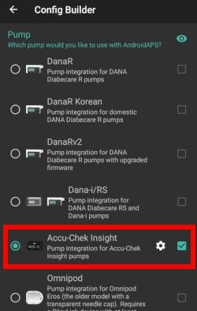
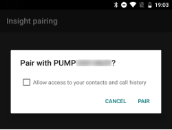
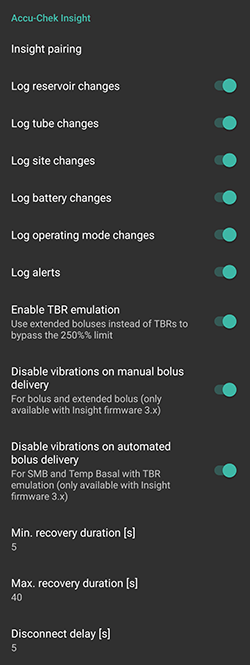

# Accu-Chek Insight 幫浦

**This software is part of a DIY artificial pancreas solution and is not a product, but
requires YOU to read, learn and understand the system including how to use it.
It is not something that does all your diabetes management for you but
allows you to improve your diabetes and your quality of life,
if you're willing to put in the time required. Don't rush into it,
but allow yourself time to learn. You alone are responsible for what
you do with it.**

---

## _**警告：** 如果您曾經使用過 Insight 與 **SightRemote**，請**更新至最新 AAPS 版本**並**卸載 SightRemote**。_

## 硬體和軟體需求

- 一台 Roche Accu-Chek Insight 幫浦（任何韌體都適用）

Note: AAPS will write data always in **first basal rate profile in the pump**.

- 一台 Android 手機（基本上每個 Android 版本都適用於 Insight，但請檢查[模組](module-phone)頁面了解運作 AAPS 所需的 Android 版本）。
- 您的手機上安裝了 AAPS 應用程式

## 設定

- The Insight pump should only be connected to one device at a time. If you have previously used the Insight remote control (meter), you must remove the meter from the paired devices list of your pump: Menu > Settings > Communication > Remove device

  

- 在 AAPS 應用程式的[組態建置工具](../Configuration/Config-Builder)中，選擇幫浦區域的 Accu-Chek Insight。

  

- Tap the cog-wheel to open Insight settings.

- In settings, tap on the button 'Insight pairing' at the top of the screen. You should see a list of all nearby bluetooth devices (below left).

- On the Insight pump, go to Menu > Settings > Communication > Add Device. The pump will display the following screen (below right) showing the serial number of the pump.

  

- Going back to your phone, tap on the pump serial number in the list of bluetooth devices. Then tap on Pair to confirm.

  

- Both the pump and phone will then display a code. Check that the codes are the same on both devices and confirm on both the pump and the phone.

  

- Success! Pat yourself on the back for successfully pairing your pump with AAPS.

  

- 要檢查是否一切正常，返回 AAPS 中的組態建置工具並點擊 Insight 幫浦旁的齒輪圖示進入 Insight 設定，然後點擊 Insight 配對，您將看到一些關於幫浦的資訊：

  

Note: There will be no permanent connection between pump and phone. A connection will only be established if necessary (i.e. setting temporary basal rate, giving bolus, reading pump history...). Otherwise battery of phone and pump would drain way too fast.

(Accu-Chek-Insight-Pump-settings-in-aaps)=

## AAPS 設定

**注意：現在可以（僅適用於 AAPS v2.7.0 及以上版本）使用‘永遠使用基礎絕對值’來與 Insight 幫浦配合使用自動調整，即使已啟用與 Nightscout 的同步功能。**（在 AAPS 中，前往[偏好設定 > NSClient > 進階設定](Preferences-advanced-settings-nsclient)）。

在 AAPS 的 Insight 設定中，您可以啟用以下選項：

- "Log reservoir changes": This will automatically record an insulin cartridge change when you run the "fill cannula" program on the pump.

- "Log tube changes": This adds a note to the AAPS database when you run the "tube filling" program on the pump.

- "Log site change": This adds a note to the AAPS database when you run the "cannula filling" program on the pump. **Note: A site change also resets Autosens.**

- "Log battery changes": This records a battery change when you put a new battery in the pump.

- "Log operating mode changes": This inserts a note in the AAPS database whenever you start, stop or pause the pump.

- "Log alerts": This records a note in the AAPS database whenever the pump issues an alert (except reminders, bolus and TBR cancellation - those are not recorded).

- "Enable TBR emulation": The Insight pump can only issue temporary basal rates (TBRs) up to 250%. To get round this restriction, TBR emulation will instruct the pump to deliver an extended bolus for the extra insulin if you request a TBR of more than 250%.

  **Note: Just use one extended bolus at a time as multiple extended boluses at the same time might cause errors.**

- "Disable vibrations on manual bolus delivery": This disables the Insight pump's vibrations when delivering a manual bolus (or extended bolus). This setting is available only with the latest version of Insight firmware (3.x).

- "Disable vibrations on automated bolus delivery": This disables the Insight pump's vibrations when delivering an automatic bolus (SMB or Temp basal with TBR emulation). This setting is available only with the latest version of Insight firmware (3.x).

- "恢復時間"：這定義了在連線失敗後，AAPS 將等待多長時間後再嘗試連線。 您可以選擇0到20秒。 如果您遇到連線問題，請選擇較長的等待時間。 You can choose from 0 to 20 seconds. If you experience connection problems, choose a longer wait time.
  恢復時間範例：最小 恢復時間=5，最大 恢復時間=20 無連線 -> 等待**5**秒。\
  再試 -> 無連線 -> 等待**6**秒。\
  再試 -> 無連線 -> 等待**7**秒。\
  再試 -> 無連線 -> 等待**8**秒。\
  ...
  再試 -> 無連線 -> 等待**20**秒。\
  再試 -> 無連線 -> 等待**20**秒。\
  ...

- "Disconnect delay": This defines how long (in seconds) AAPS will wait to disconnect from the pump after an operation is finished. Default value is 5 seconds.

For periods when pump was stopped AAPS will log a temp. basal rate with 0%.

在 AAPS 中，Accu-Chek Insight 標籤顯示幫浦的當前狀態，並有兩個按鈕：

- "Refresh": Refreshes pump status
- "Enable/Disable TBR over notification": A standard Insight pump emits an alarm when a TBR is finished. This button lets you enable or disable this alarm without the need for configuration software.

  

## Settings in the pump

配置幫浦中的警報如下：

- 選單 > 設定 > 裝置設定 > 模式設定 > 靜音 > 信號 > 聲音
- 選單 > 設定 > 裝置設定 > 模式設定 > 靜音 > 音量 > 0（移除所有條）
- 選單 > 模式 > 信號模式 > 靜音

這將使幫浦靜音，允許 AAPS 決定警報是否與您相關。 如果 AAPS 未確認警報，其音量將增加（先是嗶聲，然後是震動）。 If AAPS does not acknowledge an alarm, its volume will increase (first beep, then vibration).

(Accu-Chek-Insight-Pump-vibration)=

### 震動

Depending on the firmware version of your pump, the Insight will vibrate briefly every time a bolus is delivered (for example, when AAPS issues an SMB or TBR emulation delivers an extended bolus).

- 韌體 1.x：設計上沒有震動。
- 韌體 2.x：無法停用震動。
- 韌體 3.x：AAPS 安靜地發送注射。 (最低[版本 2.6.1.4](Releasenotes-version-2-6-1-4)) (minimum [version 2.6.1.4](Releasenotes-version-2-6-1-4))

Firmware version can be found in the menu.

## 電池更換

Insight 在循環使用期間的電池壽命範圍為 10 到 14 天，最大 20 天。 報告此電池壽命的用戶使用的是 Energizer 鋰電池。 The user reporting this is using Energizer lithium batteries.

The Insight pump has a small internal battery to keep essential functions like the clock running while you are changing the removable battery. If changing the battery takes too long, this internal battery may run out of power, the clock will reset, and you will be asked to enter a new time and date after inserting a new battery. If this happens, all entries in AAPS prior to the battery change will no longer be included in calculations as the correct time cannot be identified properly.

(Accu-Chek-Insight-Pump-insight-specific-errors)=

## Insight 特定錯誤

### Extended bolus

Just use one extended bolus at a time as multiple extended boluses at the same time might cause errors.

### 逾時

Sometimes it might happen that the Insight pump does not answer during connection setup. In this case AAPS will display the following message: "Timeout during handshake - reset bluetooth".

In this case turn off bluetooth on pump AND smartphone for about 10 seconds and then turn it back on.

## Crossing time zones with Insight pump

For information on traveling across time zones see section [Timezone traveling with pumps](Timezone-traveling-insight).
