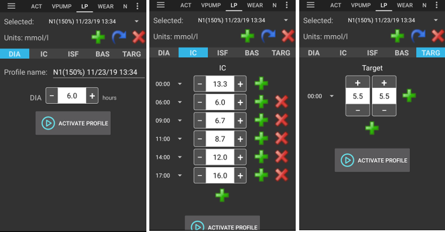
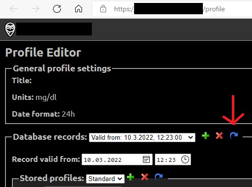
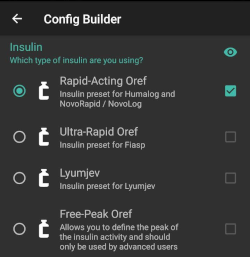
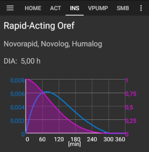
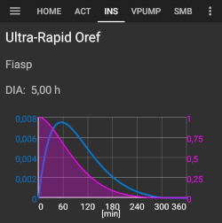
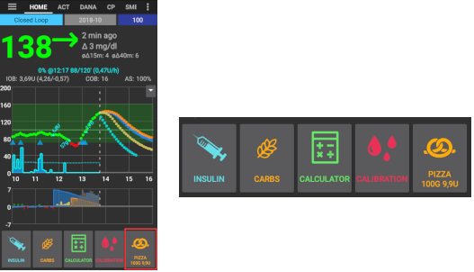

# 組態建置工具

Depending on your settings you can open Config Builder through a tab at the top of the screen or through hamburger menu.

Config Builder (Conf) is the tab where you turn the modular features on and off.  The boxes on the left-hand side (A) allow you to select which one to use, the boxes on the right-hand side (C) allow you to view these as a tab (E) in AAPS.  In case the right box is not activated you can reach the function by using the hamburger menu (D) on the top left of the screen.

Where there are additional settings available within the module, you can click on the cog wheel (B) which will take you to the specific settings within preferences.

\*\*首次配置：\*\*從 AAPS 2.0 開始，設定嚮導會引導你完成 AAPS 的配置過程。 按下螢幕右上角的三點選單（F），並選擇「設定嚮導」來使用它。 Push 3-dots-menu on the upper right-hand side of the screen (F) and select 'Setup Wizard' to use it.

(Config-Builder-tab-or-hamburger-menu)=

## Tab or hamburger menu

With the checkbox under the eye symbol you can decide how to open the corresponding program section.

(Config-Builder-profile)=

## Profile

- Select the basal profile you wish to use. See [Profiles](../Usage/Profiles.md) page for more setup information.
- 從 AAPS 3.0 開始，僅提供本地設定檔。

However, it is possible to synchronise a Nightscout profile into a local profile. To do this, however, it is important to clone the whole database record consisting of several profiles in the Nightscout editor. Please see the instructions below. This can be helpful if major changes to a more extensive profile can be entered more easily via the web interface, e.g. to manually copy data from a spreadsheet.

(Config-Builder-local-profile)=

### 本地設定檔(Local profile)

Local profile uses the basal profile manually entered in phone. As soon as it is selected, a new tab appears in AAPS, where you can change the profile data read out from the pump if necessary. With the next profile switch they are then written to the pump in profile 1. This profile is recommended as it does not rely on internet connectivity.

你的本地設定檔是[匯出設定](../Usage/ExportImportSettings.md)的一部分。 因此，確保有一個安全的備份。 So make sure to have a backup in a safe place.

按鈕：

- 綠色加號：新增
- 紅色 X：刪除
- 藍色箭頭：複製

If you make any changes to your profile, make sure, you are editing the correct profile. In profile tab there is not always shown the actual profile being used - e.g. if you made a profile switch by using the profile tab on homescreen it may differ from the profile actually shown in profile tab as there is no connection between these.

#### Clone profile switch

You can easily create a new local profile from a profile switch. In this case timeshift and percentage will be applied to the new local profile.

1. Click 3-dots-menu in upper right corner.
2. Select 'Treatments'.
3. Press star symbol to access profile switch page.
4. Select the desired profile switch and press "Clone".
5. You can edit the new local profile in Local Profile (LP) tab or via the hamburger menu.

(Config-Builder-upload-local-profiles-to-nightscout)=

#### 上傳本地設定檔到 Nightscout

Local profiles can also be uploaded to Nightscout. The settings can be found in [NSClient preferences](Preferences-nsclient).

#### Change profile in Nighscout profile editor

You can synchronize changes to the profile in the Nighscout profile editor to local profiles. The settings can be found in [NSClient preferences](Preferences-nsclient).

It is necessary to clone the actual active entire Nightscout database records for the profiles and not just a profile with the blue arrow! The new database records then carries the current date and can be activated via the tab "local profile".

### Profile helper

設定檔助手提供兩個功能：

1. Find a profile for kids
2. 比較兩個設定檔或設定檔切換，以便複製新的設定檔

詳細說明請參閱[設定檔助手頁面](../Configuration/profilehelper.md)。

(Config-Builder-insulin)=

## 胰島素

- 選擇你正在使用的胰島素曲線類型。
- The options 'Rapid-Acting Oref', Ultra-Rapid Oref', 'Lyumjev' and 'Free-Peak Oref' all have an exponential shape. 選項 'Rapid-Acting Oref'、'Ultra-Rapid Oref'、'Lyumjev' 和 'Free-Peak Oref' 都具有指數形狀。 更多資訊請參閱[OpenAPS 文件](https://openaps.readthedocs.io/en/latest/docs/While%20You%20Wait%20For%20Gear/understanding-insulin-on-board-calculations.html#understanding-the-new-iob-curves-based-on-exponential-activity-curves)。
- 曲線將根據 DIA 和峰值時間而有所不同。

  - PURPLE line shows how much **insulin remains** after it has been injected as it decays with time.
  - 藍色線顯示**胰島素的活性**。

### DIA

- DIA 對每個人來說並不相同。 這就是為什麼你需要自行測試。 That's why you have to test it for yourself.
- 但它必須至少是 5 小時。
- For a lot of people using ultra-rapid insulins like Fiasp there is practically no noticeable effect after 3-4 hours any more, even if 0.0xx units are available as a rule then. This residual amount can still be noticeable during sports, for example. Therefore, AAPS uses minimum 5h as DIA.
- 你可以在[此頁面](Screenshots-insulin-profile)的胰島素設定檔部分中閱讀更多相關資訊。

### 胰島素類型差異

- 對於 'Rapid-Acting'、'Ultra-Rapid' 和 'Lyumjev'，DIA 是唯一可以自行調整的變數，峰值時間是固定的。
- Free-Peak 允許你同時調整 DIA 和峰值時間，這僅應由了解這些設置效果的高級使用者使用。
- [胰島素曲線圖](Screenshots-insulin-profile)幫助你了解不同的曲線。
- You can view it by enabling the tickbox to show it as a tab, otherwise it will be in the hamburger menu.

#### Rapid-Acting Oref

- 推薦用於 Humalog、Novolog 和 Novorapid
- DIA = 至少 5.0 小時
- Max. 峰值 峰值 = 注射後 75 分鐘（固定，不可調整）

#### Ultra-Rapid Oref

- 推薦用於 FIASP
- DIA = 至少 5.0 小時
- Max. 峰值 峰值 = 注射後 55 分鐘（固定，不可調整）

(Config-Builder-lyumjev)=

#### Lyumjev

- Lyumjev 的特殊胰島素設定檔
- DIA = 至少 5.0 小時
- Max. 峰值 峰值 = 注射後 45 分鐘（固定，不可調整）

#### Free Peak Oref

- With the "Free Peak 0ref" profile you can individually enter the peak time. To do so click to cogwheel to enter advanced settings.
- 如果設定檔中未指定更高值，則 DIA 自動設置為 5 小時。
- This effect profile is recommended if an unbacked insulin or a mixture of different insulins is used.

(Config-Builder-bg-source)=

## BG Source

選擇你正在使用的血糖來源——詳情請參閱[血糖來源](BG-Source.md)頁面。

- [構建你自己的 Dexcom 應用程式（BYODA）](https://docs.google.com/forms/d/e/1FAIpQLScD76G0Y-BlL4tZljaFkjlwuqhT83QlFM5v6ZEfO7gCU98iJQ/viewform?fbzx=2196386787609383750\&fbclid=IwAR2aL8Cps1s6W8apUVK-gOqgGpA-McMPJj9Y8emf_P0-_gAsmJs6QwAY-o0)。
- [xDrip+](https://xdrip-plus-updates.appspot.com/stable/xdrip-plus-latest.apk)
- [MM640g](https://github.com/pazaan/600SeriesAndroidUploader/releases)
- [Glimp](https://play.google.com/store/apps/details?id=it.ct.glicemia\&hl=de) - 只支援版本 4.15.57 及更新的版本
- [Poctech](https://www.poctechcorp.com/en/contents/268/5682.html)
- [MiaoMiao 裝置的 Tomato 應用程式](http://tomato.cool/)
- [Glunovo 應用程式](https://infinovo.com/) 用於 Glunovo CGM 系統
- NSClient BG - not recommended as closed loop relies on mobile data / wifi coverage in this case. CGM data will only be received if there is an online connection to your NS site. Better use local broadcast from one of the other CGM data sources.
- Random BG: Generates random BG data (Demo mode only)

(Config-Builder-pump)=

## Pump

Select the pump you are using.

- [Dana R](DanaR-Insulin-Pump.md)

- Dana R Korean（適用於國內 DanaR 幫浦）

- Dana Rv2（升級了非官方韌體的 DanaR 幫浦）

- [Dana-i/RS](DanaRS-Insulin-Pump.md)

  - For dana pumps, use <b>Advanced settings</b> to activate BT watchdog if necessary. It switches off bluetooth for one second if no connection to the pump is possible. This may help on some phones where the bluetooth stack freezes.
  - 必須正確輸入 [Dana RS 幫浦的密碼](../Configuration/DanaRS-Insulin-Pump.md)。 在之前的版本中未檢查密碼。 Password was not checked in previous versions.

- [Accu Chek Insight](Accu-Chek-Insight-Pump.md)

- [Accu Chek Combo](Accu-Chek-Combo-Pump.md)（需要安裝 ruffy）

- [Omnipod Eros](OmnipodEros.md)

- [Omnipod DASH](OmnipodDASH.md)

- [Medtronic](MedtronicPump.md)

- [Diaconn G8](DiaconnG8.md)

* MDI（接收 AAPS 對你多次每日注射治療的建議）
* Virtual pump (open loop for pump which don't have any driver yet - AAPS suggestions only)

## 敏感性檢測

Select the type of sensitivity detection. For more details of different designs please [read on here](../Configuration/Sensitivity-detection-and-COB.md). This will analyze historical data on the go and make adjustments if it recognizes that you are reacting more sensitively (or conversely, more resistant) to insulin than usual.  More details about the Sensitivity algorithm can be read in the [OpenAPS docs](https://openaps.readthedocs.io/en/latest/docs/Customize-Iterate/autosens.html).

You can view your sensitivity on the homescreen by selecting SEN and watching the white line.  Note, you need to be in [Objective 8](Objectives-objective-8-adjust-basals-and-ratios-if-needed-and-then-enable-autosens) in order to let Sensitivity Detection/[Autosens](Open-APS-features-autosens) automatically adjust the amount of insulin delivered. Before reaching that objective, the Autosens percentage / the line in your graph is displayed for information only.

(Config-Builder-absorption-settings)=

### 吸收設定

If you use Oref1 with SMB you must change <b>min_5m_carbimpact</b> to 8. The value is only used during gaps in CGM readings or when physical activity "uses up" all the blood glucose rise that would otherwise cause AAPS to decay COB. At times when [carb absorption](../Usage/COB-calculation.md) can't be dynamically worked out based on your bloods reactions it inserts a default decay to your carbs. Basically, it is a failsafe.

(Config-Builder-aps)=

## APS

AAPS 會持續評估所有可用資料（IOB、COB、血糖等），並在必要時提供治療建議來調整你的治療。 選擇用於治療調整的 APS 演算法。 你可以在 OpenAPS (OAPS) 標籤中查看選定演算法的活動詳情。

- OpenAPS AMA（進階餐前輔助，2017 年的演算法狀態）簡單來說，它的好處是在你自己進行餐前注射後，如果你可靠地輸入碳水化合物，系統可以更快地提高臨時基礎率。
- [OpenAPS SMB](../Usage/Open-APS-features.md)（超微量注射，針對進階使用者的最新演算法） 注意：你需要在[目標 9](Objectives-objective-9-enabling-additional-oref1-features-for-daytime-use-such-as-super-micro-bolus-smb)，才能使用 OpenAPS SMB，並且必須在組態建置工具 > 敏感性檢測 > 敏感性 Oref1 設定中將 min_5m_carbimpact 設置為 8。

## 循環

- 在開放循環、閉合循環和低血糖暫停 (LGS) 之間切換。

(Config-Builder-open-loop)=

### 開放循環

- AAPS continuously evaluates all available data (IOB, COB, BG...) and makes treatment suggestions on how to adjust your therapy if necessary.
- The suggestions will not be executed automatically (as in closed loop) have to be entered manually into the pump or by using a button in case you are using a compatible pump (Dana R/RS or Accu Chek Combo).
- 這個選項是給那些想了解 AAPS 運作方式或正在使用不支援的幫浦的人。

(Config-Builder-closed-loop)=

### 閉合循環

- AAPS continuously evaluates all available data (IOB, COB, BG...) and automatically adjusts the treatment if necessary (i.e. without further intervention by you) to reach the set target range or value (bolus delivery, temporary basal rate, insulin switch-off to avoid hypo etc.).
- 閉合循環在多個安全限制範圍內工作，你可以個別設定這些限制。
- 閉合循環僅在你達到[目標 6](Objectives-objective-6-starting-to-close-the-loop-with-low-glucose-suspend)或更高目標且使用支援的幫浦時才可能。
- 請注意：在閉合循環模式下，建議使用單一目標而非目標範圍（即 5.5 mmol 或 100 mg/dl，而非 5.0 - 7.0 mmol 或 90 - 125 mg/dl）。

### 低血糖暫停 (LGS)

- maxIOB 設為 0
- 這意味著如果血糖下降，它可以為你減少基礎率。
- 但如果血糖上升，則不會自動進行修正。 你的基礎率將保持與所選設定檔相同。 Your basal rates will remain the same as your selected profile.
- 只有當來自先前的低血糖暫停的基礎 IOB 為負時，才會額外注射胰島素來降低血糖。

### Minimal request change

- 使用開放循環時，當 AAPS 建議調整基礎率時，你會收到通知。
- To reduce number of notifications you can either use a wider bg target range or increase percentage of the minimal request rate.
- This defines the relative change required to trigger a notification.

## 目標（學習計畫）

AAPS has a leraning program (objectives) that you have to fulfill step by step. This should guide you safely through setting up a closed loop system. It guarantees that you have set everything up correctly and understand what the system does exactly. This is the only way you can trust the system.

You should [export your settings](../Usage/ExportImportSettings.md) (including progress of the objectives) on a regularly basis. In case you have to replace your smartphone later (new purchase, display damage etc.) you can simply import those settings.

更多資訊請參閱[目標](../Usage/Objectives.md)頁面。

## 治療

If you view the Treatments (Treat) tab, you can see the treatments that have been uploaded to nightscout.  Should you wish to edit or delete an entry (e.g. you ate less carbs than you expected) then select 'Remove' and enter the new value (change the time if necessary) through the [carbs button on the home screen](Screenshots-carb-correction).

## General

### Overview

Displays the current state of your loop and buttons for most common actions (see [section The Homescreen](../Getting-Started/Screenshots.md) for details).  Settings can be accessed by clicking the cog wheel.

#### 保持螢幕常亮

Option 'Keep screen on' will force Android to keep the screen on at all times. This is useful for presentations etc. But it consumes a lot of battery power. Therefore, it is recommended to connect the smartphone to a charger cable.

#### 按鈕

定義顯示在主畫面上的按鈕。

- 治療
- 計算機
- 血糖來源
- 碳水化合物
- CGM（打開 xDrip+）
- 校正

此外，你可以為胰島素和碳水化合物增量設置快捷方式，並決定是否應在治療對話框中顯示備註欄位。

#### 快速嚮導設定(QuickWizard settings)

Create a button for a certain standard meal (carbs and calculation method for the bolus) which will be displayed on the home screen. Use for standard meals frequently eaten. If different times are specified for the different meals you will always have the appropriate standard meal button on the home screen, depending on the time of day.

注意：如果在指定的時間範圍外，或者如果你已經有足夠的 IOB 來覆蓋 QuickWizard 按鈕中定義的碳水化合物，按鈕將不可見。

#### Default Temp-Targets

Choose default temp-targets (duration and target). Preset values are:

- 即將用餐：目標 72 mg/dl / 4.0 mmol/l，持續 45 分鐘
- 運動：目標 140 mg/dl / 7.8 mmol/l，持續 90 分鐘
- 低血糖：目標 125 mg/dl / 6.9 mmol/l，持續 45 分鐘

#### 填充/啟動標準胰島素量

Choose the default amounts of the three buttons in fill/prime dialogue, depending on the length of your catheter.

#### 視覺化範圍

Choose the high and low marks for the BG-graph on AAPS overview and smart watch. It is only the visualization, not the target range for your BG. Example: 70 - 180 mg/dl or 3.9 - 10 mmol/l

#### Shorten tab titles

選擇 AAPS 中的標籤標題是長的（例如：操作、本地設定檔、自動化）還是短的（例如：操作、本地設定、自動）

#### 在治療對話框中顯示備註欄位

Choose if you want to have a notes field when entering treatments or not.

#### 狀態燈

Choose if you want to have [status lights](Preferences-status-lights) on overview for cannula age, insulin age, sensor age, battery age, reservoir level or battery level. When warning level is reached, the color of the status light will switch to yellow. Critical age will show up in red.

#### 進階設定

**Deliver this part of bolus wizard result**: When using SMB, many people do not meal-bolus 100% of needed insulin, but only a part of it (e.g. 75 %) and let the SMB with UAM (unattended meal detection) do the rest. In this setting, you can choose a default value for the percenteage the bolus wizard should calculate with. If this setting is 75 % and you had to bolus 10u, the bolus wizard will propose a meal bolus of only 7.5 units.

**Enable super bolus functionality in wizard** (It is different from _super micro bolus_!): Use with caution and do not enable until you learn what it really does. Basically, the basal for the next two hours is added to the bolus and a two hour zero-temp activated. **AAPS looping functions will be disabled - so use with care! If you use SMB AAPS looping functions will be disabled according to your settings in ["Max minutes of basal to limit SMB to"](Open-APS-features-max-minutes-of-basal-to-limit-smb-to), if you do not use SMB looping functions will be disabled for two hours.** Details on super bolus can be found [here](https://www.diabetesnet.com/diabetes-technology/blue-skying/super-bolus).

(Config-Builder-actions)=

### 操作

- 一些按鈕可快速查看常見功能。
- 詳情請參閱[AAPS 截圖](Screenshots-action-tab)。

### 自動化

用戶自定義自動化任務（「如果-那麼-否則」）。 請[點此閱讀更多](../Usage/Automation.md)。 Please [read on here](../Usage/Automation.md).

(Config-Builder-sms-communicator)=

### SMS(簡訊) 通訊器

允許遠端照護者透過 SMS 控制一些 AAPS 功能，更多設定資訊請參閱[SMS 指令](../Children/SMS-Commands.md)。

### 食物

顯示 Nightscout 食物資料庫中定義的食物預設值，更多設定資訊請參閱[Nightscout 讀我](https://github.com/nightscout/cgm-remote-monitor#food-custom-foods)。

注意：條目無法在 AAPS 計算機中使用。 （僅供檢視） (View only)

(Config-Builder-wear)=

### Wear

使用 Android Wear 手錶監控和控制 AAPS（請參閱[Watchfaces 頁面](../Configuration/Watchfaces.md)）。 使用設置（齒輪圖示）來定義在透過手錶進行注射時應考慮哪些變數（例如 15 分鐘趨勢，COB...）。 Use settings (cog wheel) to define which variables should be considered when calculating bolus given though your watch (i.e. 15min trend, COB...).

If you want to bolus etc. from the watch then within "Wear settings" you need to enable "Controls from Watch".

Through Wear tab or hamburger menu (top left of screen, if tab is not displayed) you can

- Resend all data.
  Might be helpful if watch was not connected for some time and you want to push the information to the watch.
- Open settings on your watch directly from your phone.

### xDrip Statusline (watch)

在你的 xDrip+ 手錶外觀上顯示循環資訊（如果你未使用 AAPS/[AAPSv2 手錶外觀](../Configuration/Watchfaces.md)）。

### NSClient

- 設定 AAPS 資料與 Nightscout 的同步。
- Settings in [preferences](Preferences-nsclient) can be opened by clicking the cog wheel.

### Maintenance

Email and number of logs to be send. Normally no change necessary.

### 組態建置工具

Use tab for config builder instead of hamburger menu.
