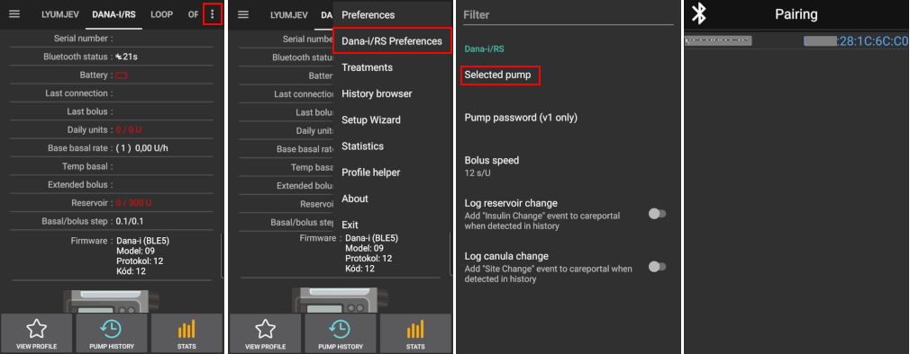
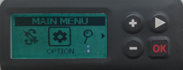

# DanaRS 和 Dana-i 幫浦

_These instructions are for configuring the app and your pump if you have a DanaRS from 2017 onwards or the newer Dana-i. _這些說明適用於配置 2017 年之後的 DanaRS 或更新的 Dana-i 幫浦。 如果你擁有原始的 DanaR，請查看[DanaR 胰島素幫浦](./DanaR-Insulin-Pump)。_

**Dana RS v3 韌體從 AAPS 版本 2.7 開始支援使用。**

**Dana-i 從 AAPS 版本 3.0 開始支援使用。**

- In DanaRS/i pump "BASAL A" is used by the app. Existing data gets overwritten.

(DanaRS-Insulin-Pump-pairing-pump)=

## Pairing pump

- 在 AAPS 主畫面上點擊左上角的選單，進入組態建置工具。

- 在幫浦部分選擇「Dana-i/RS」。

- Click on gear wheel to get directly to the pump settings or return to homescreen.

  

- 進入「DANA-i/RS」標籤。

- Select preferences menu by tapping the 3 dots in the top right.

- 選擇「Dana-i/RS 偏好設定」。

- Click on "Selected pump".

- In the pairing window click on the entry for your pump.

  

- **你必須在幫浦上確認配對！** 這跟其他藍牙配對的方式一樣（例如手機與汽車音響）。

  

- Follow the pairing process based on the type and firmware of your pump:

  - For DanaRS v1 select pump password in preferences and set your password.
  - DanaRS v3 中，你需要在 AAPS 配對對話框中輸入幫浦上顯示的兩段數字和字母序列。
  - Dana-i 中，會出現標準的 Android 配對對話框，你需要輸入幫浦上顯示的 6 位數字。

- Select Bolus Speed to change the default bolus speed used (12sec per 1u, 30sec per 1u or 60sec per 1u).

- Set basal step on pump to 0.01 U/h using Doctors menu (see pump user guide).

- Set bolus step on pump to 0.05 U/h using Doctors menu (see pump user guide).

- Enable extended boluses on pump

(DanaRS-Insulin-Pump-default-password)=

### 預設密碼

- 對於韌體版本 v1 和 v2 的 DanaRS，預設密碼為 1234。
- 對於韌體版本 v3 或 Dana-i，預設密碼來自製造日期，計算方式為 MMDD，其中 MM 是月份，DD 是製造日期（例如「0124」代表 1 月 24 日）。

  - From MAIN MENU select REVIEW then open SHIPPING INFORMATION from the sub menu
  - 第三個項目是製造日期。
  - For v3/i this password is used only for locking menu on pump. It's not used for communication and it's not necessary to enter it in AAPS.

(DanaRS-Insulin-Pump-change-password-on-pump)=

## Change password on pump

- 按下幫浦上的「OK」按鈕

- 在主選單中選擇「選項」（按下箭頭按鈕多次向右移動）

  

- 在選項選單中選擇「用戶選項」

  

- 使用箭頭按鈕向下捲動至「11. 密碼」 密碼

  

- 按下「OK」進入舊密碼。

- 輸入**舊密碼**（預設密碼請參閱[上方](DanaRS-Insulin-Pump-default-password)），然後按下「OK」。

  

- 如果此處輸入了錯誤的密碼，將不會顯示失敗訊息！

- 設置**新密碼**（使用 + 和 - 按鈕更改數字 / 使用箭頭按鈕向右移動）。

  

- 按下「OK」按鈕確認。

- 按下 OK 以儲存設定。

  

- 向下移動至「14. 退出」，然後按下 OK 以退出。

  

(DanaRS-Insulin-Pump-dana-rs-specific-errors)=

## Dana RS 特定錯誤

### 胰島素注射過程中的錯誤

如果在注射胰島素過程中 AAPS 與 Dana RS 之間的連線中斷（例如，你在 Dana RS 幫浦注射胰島素時走開手機），你將看到以下訊息並聽到警報聲。

- In most cases this is just a communication issue and the correct amount of insulin is delivered.
- Check in pump history (either on the pump or through Dana tab > pump history > boluses) if correct bolus is given.
- 如有需要，你可以刪除[治療標籤](Screenshots-carb-correction)中的錯誤條目。
- Real amount is read and recorded on next connect. To force this press BT icon on dana tab or just wait for next connect.

## 更換手機時的特別注意事項

更換新手機時，需要進行以下步驟：

- 在舊手機上[匯出設定](ExportImportSettings-export-settings)
- 將設定從舊手機傳輸至新手機

### DanaRS v1

- **手動配對** Dana RS 與新手機
- As pump connection settings are also imported AAPS on your new phone will already "know" the pump and therefore not start a bluetooth scan. Therefore new phone and pump must be paired manually.
- 在新手機上安裝 AAPS。
- 在新手機上[匯入設定](ExportImportSettings-import-settings)

### DanaRS v3, Dana-i

- 按照[上述說明](DanaRS-Insulin-Pump-pairing-pump)開始配對過程。
- Sometimes it may be necessary to clear pairing information in AAPS by long-click BT icon on Dana-i/RS tab.

## Timezone traveling with Dana RS pump

For information on traveling across time zones see section [Timezone traveling with pumps](Timezone-traveling-danarv2-danars).
