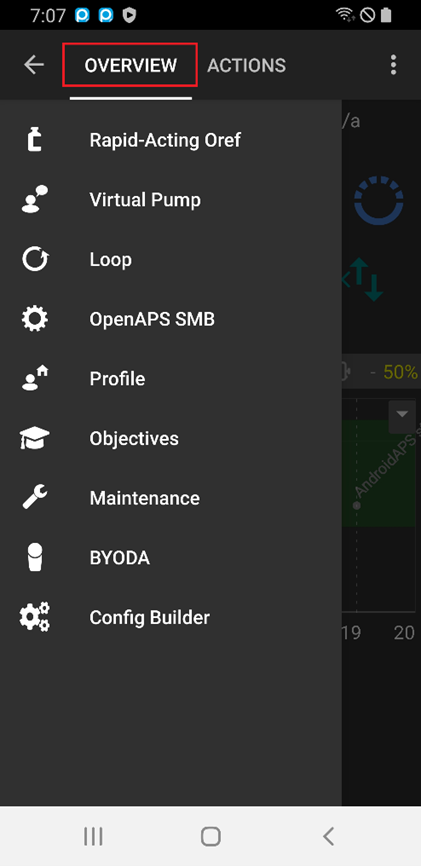
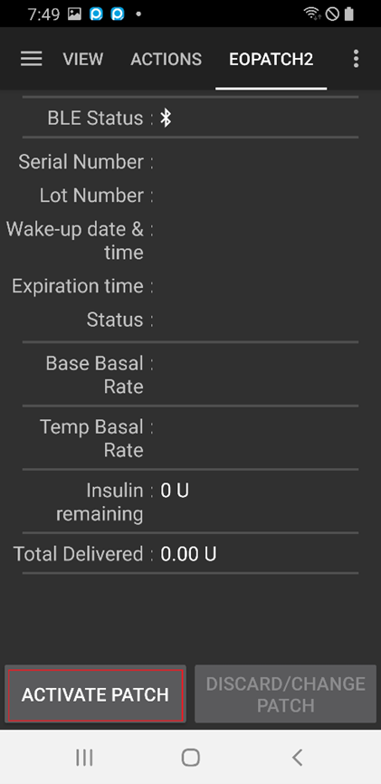
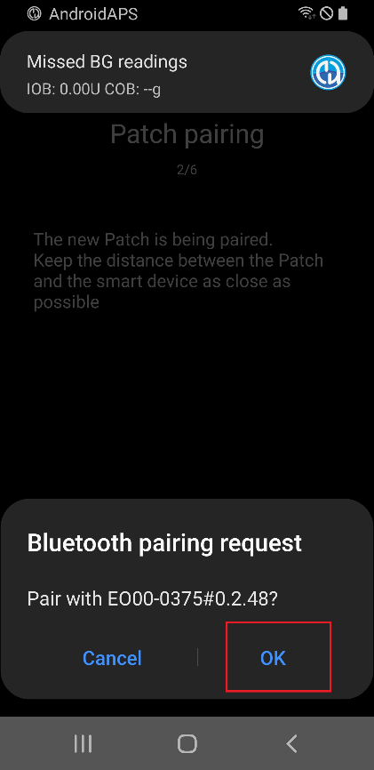
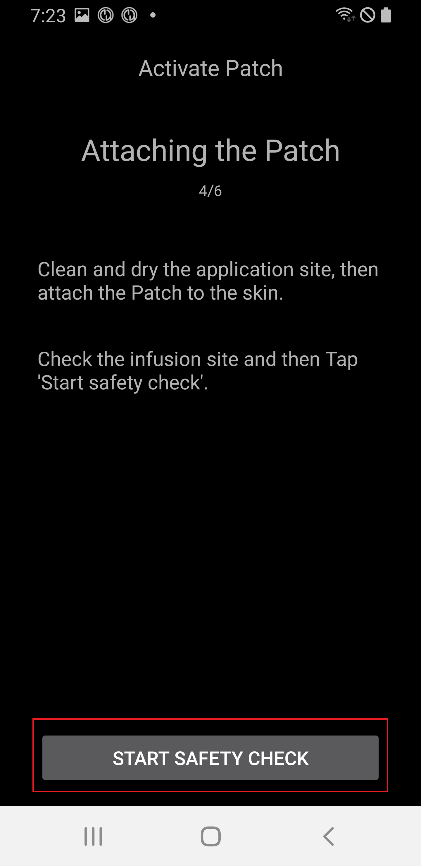
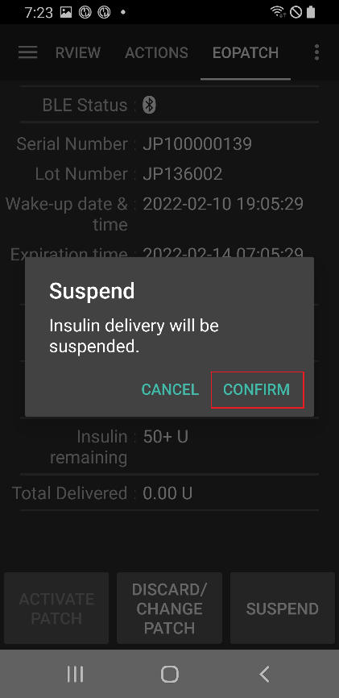
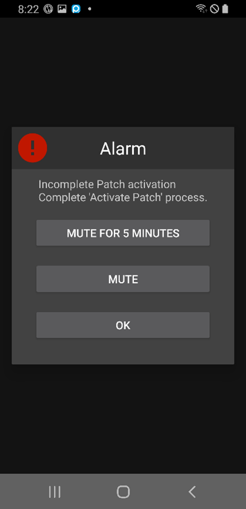
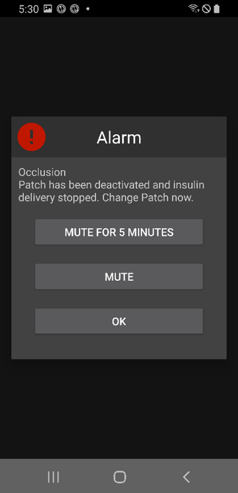

# EOPatch2 使用手冊

The patch requires the use of rapid-acting U-100 type insulin, such as NovoRapid or Humalog. Use a rapid-acting insulin that is suitable for you according to your doctor’s prescription and inject the prescribed dosage.

使用此貼片時，最小可注射劑量為 0.05 U。因此，基礎速率（Profile BAS）應設置為至少 0.05 U/hr 或更多，並以 0.05 U/hr 的間隔調整，否則基礎速率與實際輸注量之間可能會出現誤差。 同樣地，注射劑量也必須設定並以最小輸注量 0.05 U 輸注。 Likewise, the bolus must also be set and infused with a minimum infusion volume of 0.05 U.

## Pump Setup

1. 在 AAPS 主畫面上，點擊左上角的漢堡選單，進入組態建置工具。
2. 在幫浦部分選擇「EOPatch2」。
3. 按返回鍵回到主畫面。

 

## 設定

在主畫面頂部選擇「EOPATCH2」，以進入「EOPATCH2」頁籤。

Select the EOPatch2 Preferences menu by clicking the three dots in the upper right corner.

「EOPatch2 偏好設定」選單提供三種通知的設定選項。

### 低儲存量警報

A warning appears when the amount of insulin remaining in the reservoir reaches the set value or less while using the patch. It can be set from 10 to 50U in 5U increments.

### 貼片到期提醒

This is a reminder to notify you of the time remaining before the current patch expires. It can be set from 1 to 24 hours in 1 hour increments. The initial setting value is 4 hours.

### Patch buzzer Reminder

This is a reminder function for injections other than basal injection. If you are using an (extended) bolus injection or a temporary basal injection, the patch will make a buzzer sound when the injection starts and when the injection is complete. The initial setting value is Off.

## Connecting the Patch

### Move to patch connection screen

Select EOPATCH2 at the top of the home screen and click the ACTIVATE PATCH button at the bottom left.

### Connecting the patch

Insert the syringe needle into the insulin inlet on the patch and then slowly push the piston to inject the insulin. When insulin is filled with more than 80U, the patch makes a booting sound (1 buzzer) and boots.
After confirming the buzzer sound, click the START PAIRING button on the screen.

[警告]

- Do not turn the needle action lever until instructed. It can cause serious problems during injection or safety checks otherwise.
- The amount of insulin that can be injected into the patch is 80~200U. If you inject less than 80U into the patch initially, the patch will not work.
- Take the insulin to be put into the patch from the refrigerator and leave it at room temperature for 15 to 30 minutes beforehand. The temperature of the insulin to be injected must be at least 10°C.

### 貼片配對

The Patch pairing screen will be displayed, and pairing will be attempted automatically. If communication is successful, the Bluetooth pairing request notification appears. Click OK and when the Bluetooth pairing request notification appears a second time with the authentication code, select OK again.

[警告]

- 為了進行配對，貼片和智慧型手機之間必須保持在 30 公分內。
- After the patch booting is completed, the patch will beep every 3 minutes until the pairing is complete.
- After booting the patch, the patch application must be completed via the app within 60 minutes. If the application cannot be completed within 60 minutes, the patch should be discarded.

  

### 貼片準備

移除貼片的膠帶後，檢查針頭是否突出。 如果貼片無問題，點擊「下一步」。 If there are no problems with the patch, click NEXT.

### 貼片貼附

Insulin should be injected in a spot with subcutaneous fat but few nerves or blood vessels, so it is recommended to use the abdomen, arm, or thigh for the patch attachment site. Choose a patch attachment site and apply the patch after disinfecting the location.

[警告]

- Make sure to straighten the side of the patch tape attached to the body evenly, so that the patch adheres completely to the skin.
- 如果貼片沒有完全貼合，貼片和皮膚之間可能會進入空氣，這可能會削弱貼片的黏合強度和防水效果。

### 安全檢查

When patching is complete, touch Start Safety Check. When the safety check is completed, the patch will beep once.

[警告]

- 為了安全使用，在安全檢查完成之前，請勿轉動針頭操作桿。

 

### 插入針頭

The needle is inserted by holding around the patch and turning the needle action lever more than 100° in the upward direction of the lever. There is a buzzer sound when the needle is inserted correctly. Turn the needle action lever further clockwise to release the lever. Click NEXT.

[注意]

- 如果在沒有嗶聲聲的情況下進入下一步，將會出現針頭插入錯誤警告。

## Discarding the patch

Patches must be replaced in the case of low insulin levels, usage expiration, and defects. The recommended usage period for each patch is 84 hours after booting the patch.

### Discarding the patch

Select EOPATCH2 at the top of the home screen and click the DISCARD/CHANGE PATCH button at the bottom. On the next screen, click the DISCARD PATCH button. A dialog box appears to confirm once more and if you select the DISCARD PATCH button, the disposal is completed.

   

## Suspending and Resuming Insulin Delivery

Suspending insulin delivery also cancels both extended bolus and temporary basal. When resuming insulin delivery, the canceled extended bolus and temporary basal will not be resumed. And when insulin delivery is suspended, the patch will give a sound every 15 minutes.

### Suspending insulin delivery

Select EOPATCH2 at the top of the home screen and click the SUSPEND button at the bottom right. When you select CONFIRM in the confirmation box, a time selection box appears. If you select the CONFIRM button after selecting the time, the insulin delivery will be suspended for the set amount of time.

  

### Resuming insulin delivery

Select EOPATCH2 at the top of the home screen and click the RESUME button at the bottom right. Insulin delivery will resume by selecting CONFIRM in the confirmation dialog box.

 

## 警報/警告

### 警報

Alarms are issued for emergency situations of the highest priority and require immediate action. The alarm signal does not disappear or time out until it is acknowledged. An alarm occurs when there is a problem with the patch being used, so there may be cases where the patch in use needs to be discarded and replaced with a new patch. The warning is displayed as a dialog box and switching to another screen is not possible until processing is completed.

 

以下說明不同類型的警報。

| 警報                         | 說明                                                                                                                                                                                                                                                                                     |
| -------------------------- | -------------------------------------------------------------------------------------------------------------------------------------------------------------------------------------------------------------------------------------------------------------------------------------- |
| 儲存量已空                      | Occurs when the patch’s reservoir runs out of insulin.                                                                                                                                                                                                                 |
| Patch expired              | Occurs when the patch usage time has expired, and no further insulin injections are possible.                                                                                                                                                                          |
| 堵塞                         | Occurs when it appears that the patch's insulin inlet is clogged.                                                                                                                                                                                                      |
| Power on self-test failure | Occurs when the patch finds an unexpected error during the post-boot self-test process.                                                                                                                                                                                |
| 不適當的溫度                     | Occurs when the patch is outside the normal operating temperature range during patch application and use. To deal with this alarm, move the patch to an  appropriate operating temperature (4.4 to 37°C) condition. |
| 針頭插入錯誤                     | Occurs when needle insertion is not normal during the patch application process. Check that the needle insertion edge of the patch and the needle activation button are in a straight line.                                                            |
| 貼片電池錯誤                     | Occurs just before the patch’s internal battery runs out and powers off.                                                                                                                                                                                               |
| Patch activation Error     | Occurs when the app fails to complete the patching process within 60 minutes after the patch is booted.                                                                                                                                                                |
| 貼片錯誤                       | Occurs when the patch encounters an unexpected error while applying and using the patch.                                                                                                                                                                               |

### 警告

A warning occurs in a medium or low-priority situation. When a warning occurs, it is displayed as a notification in the Overview screen.

以下說明不同類型的警告。

| 警告                           | 說明                                                                                                                                                    |
| ---------------------------- | ----------------------------------------------------------------------------------------------------------------------------------------------------- |
| End of insulin suspend       | Occurs when the time set by the user has elapsed after the insulin infusion suspension has been completed.                            |
| 儲存量過低                        | Occurs when the remaining amount of insulin in the patch is below the set amount.                                                     |
| Patch operating life expired | Occurs when the patch usage period is over.                                                                                           |
| Patch will expire soon       | Occurs 1 hour before the patch must be discarded.                                                                                     |
| Incomplete Patch activation  | Occurs when more than 3 minutes have elapsed due to an interruption during patch application in the stage after pairing is completed. |
| 貼片電池電量低                      | Occurs when the patch's battery is low.                                                                                               |
