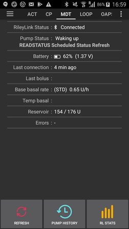

# Medtronic Pumps

此驅動程式不適用於任何新型號，包括所有以 G 結尾的型號（530G、600 系列 [630G、640G、670G]、700 系列 [770G、780G] 等）。

以下型號和韌體組合是相容的：

```
554/754 加拿大版本（韌體 2.7A 或更低版本）
```

您可以查看如何在[OpenAPS 文件](https://openaps.readthedocs.io/en/latest/docs/Gear%20Up/pump.html#how-to-check-pump-firmware-check-for-absence-of-pc-connect)或[LoopDocs](https://loopkit.github.io/loopdocs/build/step3/#medtronic-pump-firmware)中檢查幫浦韌體。

## 硬體和軟體需求

- **Phone:** The Medtronic driver should work with any android phone that supports Bluetooth connections. **IMPORTANT: Phone manufacturers Bluetooth implementations can vary so how each phone model behaves can vary.  For example, some phones will handle enabling/disabling Bluetooth differently.  This can impact the user experience when AAPS needs to reconnect to your Rileylink type device.**
- **RileyLink Compatible Device:** Android phones cannot communicate to Medtronic pumps without a seperate device to handle communications. This device will link with your phone via Bluetooth and with your pump via a compatible radio connection.  The first such device was called a Rileylink but a number of other options are now available which can offer additional functionality.

  - RileyLink 可於[getrileylink.org](https://getrileylink.org/product/rileylink916)購買
  - Orangelink 可於[getrileylink.org](https://getrileylink.org/product/orangelink)購買
  - Emalink（多種型號可選）可於[github.com](https://github.com/sks01/EmaLink)購買
  - Gnarl（需要一些額外 DIY）詳情可見[github.com](https://github.com/ecc1/gnarl)

各種 Rileylink 相容裝置的比較圖表可見[getrileylink.org](https://getrileylink.org/rileylink-compatible-hardware-comparison-chart)

(MedtronicPump-configuration-of-the-pump)=

## Configuration of the pump

The following settings should be configured on the pump in order for AAPS to remotely send commands.  The steps necessary to make each change on a Medtronic 715 are shown in brackets for each setting.  The exact steps may vary based on pump type and/or firmware version.

- **Enable remote mode on Pump** (On the pump press Act and go to Utilities -> Remote Options, Select On, and on next screen do Add ID and add any random id such as  111111). At least one ID must be on the Remote ID list in order for the pump to expect remote communication.
- **Set Max Basal** (On the pump press Act and got to Basal and then select Max Basal Rate) As an example setting this value to four times your maximum standard basal rate would allow a 400% Temporary Basal Rate. The maximum value permitted by the pump is 34.9 units per hour.
- **Set Max Bolus** (On the pump press Act and to to Bolus and then select Max Bolus) This is the largest bolus that the pump will accept.  The maximum value permitted by the pump is 25.
- **Set profile to Standard**. (On the pump press Act and go to Basal and then Select Patterns) The pump will only need one profile as AAPS will manage different profiles on your phone.  No other patterns are required.
- **Set Temporary Basal Rate type** (On the pump press Act and go to Basal and then Temp Basal Type).  Select Absolute (not Percent).

## Medtronic Configuration of Phone/AAPS

- \*\*不要在手機的藍牙選單中配對 RileyLink 相容裝置。\*\*透過手機的藍牙選單配對將會阻止 AAPS 在您按照以下指示操作時看到您的 Rileylink 相容裝置。
- Disable automatic screen rotation on your phone.  On certain devices automatic screen rotation causes Bluetooth sessions to restart which would cause issues for your Medtronic pump.
- 有兩種方式可在 AAPS 中配置您的美敦力幫浦：

1. 使用全新安裝時的設置嚮導
2. By selecting the cog icon beside the Medtronic selection in the pump selection option in Config Builder

When configuring your Medtronic pump with the setup wizard it is possible that you will be prevented from completing setup because of Bluetooth issues (e.g. you cannot succesfully connect to the pump).  Should this happen you should select the virtual pump option in order to complete the configuration and allow for further troubleshooting by using option 2.


在設置 AAPS 與您的美敦力幫浦協作時，您需要設置以下項目：（請參閱上方圖片）

- **Pump Serial Number**: Displayed on the back of your pump and starts with SN. You should only enter the 6 numbers shown without any alpabetic characters (e.g. 123456).

- **Pump Type**: The model pump you are using (e.g. 522).

- **Pump Frequency**: There are two options based on where your pump was originally distributed.  Please check the [FAQ](MedtronicPump-faq) if you are unsure which option to select):
  - 美國和加拿大使用的頻率為 916 Mhz
  - 全球其他地區使用的頻率為 868 Mhz

- **Max Basal on Pump (U/h)**: This needs to match the setting set on your pump (see Configuration of the pump above).  Again this setting must be carefully selected as it will determine how much AAPS can deliver via your basal rate.  This will effectively set the maximum temporary basal rate.  As an example, setting this value to four times your maximum standard basal rate would allow a 400% Temporary Basal Rate. The maximum value permitted by the pump is 34.9 units per hour.

- **Max Bolus on Pump (U)** (in an hour): This needs to match the setting set on your pump (see Configuration of the pump above).  This setting should be carefully considered as it determines how large a bolus AAPS can ever set.

- **Delay before Bolus is started (s)**: The number of seconds after a bolus is issued before the command is actually sent to the pump.  This period of time allows the user to cancel the bolus in the event a bolus command is sent in error.  It is not possible to cancel a bolus that has started via AAPS.  The only way to cancel a bolus that has already started is to suspend the pump manually followed by resuming it.

- **Medtronic Encoding**: Determines if the medtronic encoding is carried out.  Selecting Hardware encoding (i.e. carried out by the Rileylink compatible device) is preferred as this results in less data being sent.  Selecting Software encoding (i.e. carried out by AAPS) can help in the event frequent disconnects are seen. This setting will be ignored if you have firmware version 0.x on Rileylink devices.

- **電池類型（電力檢視）**：為了正確判斷剩餘的電池電量，您應選擇正在使用的 AAA 電池類型。 當選擇了非簡單檢視的值時，AAPS 將顯示剩餘的計算電池百分比和電壓。 以下選項可用： When a value other than simple view is selected AAPS will display the remaining calculated battery percentage level and volts. The following options are available:

  - 未選擇（簡單檢視）
  - Alkaline (Extended view)
  - Lithium (Extended view)
  - NiZn (Extended view)
  - NiMH (Extended view)

- **Bolus/Treatments Debugging**:  Select On or Off depending on requirements.

- **RileyLink 配置**：此選項允許您找到並配對您的 Rileylink 相容裝置。 選擇此選項將顯示附近的所有 Rileylink 相容裝置及其訊號強度。  Selecting this will show any nearby Rileylink compatible devices and the signal strength.

- **使用掃描**：在連線 Rileylink 相容裝置之前啟用藍牙掃描。 這應能提高與裝置連線的可靠性。  This should improve the reliability of your connection to the device.

- **顯示 OrangeLink/EmaLink/DiaLink 回報的電池電量**：此功能僅支援較新型的連線裝置，如 EmaLink 或 OrangeLink。 數值將顯示在 AnroidAPS 的美敦力標籤頁中。 Values will be shown in the Medtronic tab in AnroidAPS.

- **Set neutral temp basals** By default Medtronic pumps beep on the hour when a temporary basal rate is active.  Enabling this option can help reduce the number of beeps heard by interupting a temporary basal at the hour change in order to supress the beep.

## MEDTRONIC (MDT) Tab


When AAPS is configured to use a Medtronic pump a MDT tab will be shown in the list of tabs at the top of the screen.  This tab displays the current pump status information along with some Medtronic specific actions.

- **RileyLink 狀態**：手機與 Rileylink 相容裝置之間連線的當前狀態。 此狀態應始終顯示為已連線。 任何其他狀態可能需要使用者介入。  This should show as Connected at all times. Any other status may require user intervention.
- **RileyLink 電池**：顯示 EmaLink 或 OrangeLink 裝置的當前電池電量。 取決於是否在美敦力幫浦配置選單中選擇了“顯示 OrangeLink/EmaLink/DiaLink 裝置回報的電池電量”。  Dependent on selecting "Show battery level reported by OrangeLink/EmaLink/DiaLink device" in the Medtronic Pump Configuration menu.
- **Pump Status**: The current status of the pump connection.  As the pump will not be constantly connected this will primarily show the sleep icon.  There are a number of possible other status including "Waking Up" when AAPS is trying to issue a command or other possible pump commands such as "Get Time", "Set TBR", etc.
- **Battery**: Shows battery status based on the value chosen for Battery Type (Power View) in the Medtronic Pump Configuration menu.
- **Last connection**: How long ago the last succesful pump connection happened.
- **Last Bolus**: How long ago the last succesful bolus was delivered.
- **基礎基礎率**：這是當前小時內幫浦運作的基礎基礎率，根據您的活動設定檔設定。
- **Temp basal**: Temp basal currently being delivered which can be 0 units per hour.
- **Reservoir**: How much insulin is in reservoir (updated at least every hour).
- **錯誤**：如果有問題，則顯示錯誤字串（主要顯示配置中的錯誤）。

螢幕底部有三個按鈕：

- **Refresh** is for refreshing the current status of the pump. This should only be used if the connection was lost for a sustained period as this will require a full data refresh (retrieve history, get/set time, get profile, get battery status, etc).
- **幫浦歷史記錄**：顯示幫浦歷史記錄（請參閱[下方](MedtronicPump-pump-history)）。
- **RL 狀態**：顯示 RL 狀態（請參閱[下方](MedtronicPump-rl-status-rileylink-status)）。

(MedtronicPump-pump-history)=

## Pump History


Pump history is retrieved every 5 minutes and stored locally. Only the previous 24 hours worth of history is stored.  The allows for a convinient way to see pump behaviour should that be required.  The only items stored are those relevenant to AAPS and will not inlcude a configuration function that has no relevance.

(MedtronicPump-rl-status-rileylink-status)=

## RL 狀態（RileyLink 狀態）

 

RL 狀態對話框有兩個標籤：

- **設定**：顯示有關 Rileylink 相容裝置的設定：已配置的地址、連線裝置、連線狀態、連線錯誤和 Rileylink 韌體版本。 裝置類型始終為美敦力幫浦，型號為您的型號，序列號為已配置的序列號，幫浦頻率顯示您使用的頻率，最後使用的頻率為上次使用的頻率。 Device Type is always Medtronic Pump, Model would be your model, Serial number is configured serial number, Pump Frequency shows which frequency you use, Last Frequency is last frequency used.
- **歷史**：顯示通訊歷史，RileyLink 的項目顯示狀態變更，美敦力顯示發送給幫浦的指令。

## 操作

當使用美敦力驅動程式時，操作標籤中會添加兩個額外操作：

- **Wake and Tune Up** - In the event that AAPS hasn't connected to your pump for a sustained period (it should connect every 5 minutes), you can force a Tune Up. This will try to contact your pump, by searching all of the possible radio frequencies used by your pump. In the event a succesful connection is made the succesful frequency will be set as the default.
- **重置 RileyLink 配置**：如果您重置了 Rileylink 相容裝置，則可能需要使用此操作，以便可以重新配置裝置（設置頻率、設置頻率類型、配置編碼）。

## 重要提示

### 在 NS 配置中需要特別注意

AAPS is using serial number for synchronization and serial number is exposed to NS. Because knowledge of serial number of old Medtronic pump can be used to control the pump remotely take special care to hardening NS site preventing leakage of SN of your pump. See https://nightscout.github.io/nightscout/security/

### OpenAPS 用戶

OpenAPS users should note that AAPS with Medtronic uses a completely different approach than OpenAPS.  Using AAPS the primary method of interacting with th pump is via your phone.  In normal use cases it is likely that the only time it is required to use the pump menu is when changing resevoirs.  This is very different when using OpenAPS where at least some of a bolus is usually delivered via the quick bolus buttons.  In the event the pump is used to manually deliver a bolus there can be issues if AAPS attempts to deliver one at the same time.  There are checks to try and prevent issues in such cases but this should still be avoided where possible.

### Logging

In the event you need to troubleshoot your Medtronic pump function select the menu icon in the upper left corner of the screen, select Maintainance and Log Settings. For troubleshooting any Medtronic issues Pump, PumpComm, PumpBTComm should be checked.

### 美敦力 CGM

目前不支援美敦力 CGM。

### Manual use of pump

You should avoid manually bolusing or setting TBRs on your pump. All such commands should be sent via AAPS.  In the event manual commands are used there must be a delay of at least 3 minutes between them in order to reduce the risk of any issues.

### 時區變更與夏令時間（DST）或攜帶美敦力幫浦和 AAPS 旅行

當您的手機切換到新時間時，AAPS 將自動檢測時區變更並更新幫浦的時間。

向東旅行意味著您將增加當前時間的小時數（例如從 GMT+0 到 GMT+2），不會出現問題，因為不會重疊（例如，不可能出現相同的小時兩次）。 然而，向西旅行會導致問題，因為您實際上是在倒退時間，這可能會導致錯誤的 IOB 資料。 開發人員已知向西旅行時出現的問題，正在努力尋找解決方案。  Travelling west however can result in issues  as you are effectively going back in time which can result in incorrect IOB data.

The issues seen when travelling west are known to the developers and work on a possible solution is ongoing.  See https://github.com/andyrozman/RileyLinkAAPS/issues/145 for more detail.  For now, please be aware that this issue may occur and carefully monitor when changing time zones.

### GNARL 是完全相容的 Rileylink 裝置嗎？

GNARL 代碼完全支援 AAPS 美敦力驅動程式使用的所有功能，這意味著它是完全相容的。 需要注意的是，這將需要額外的工作，因為您將需要採購相容的硬體，然後將 GNARL 代碼載入裝置。  It is important to note that this will require addtional work as you will have to source compatible hardware and then load the GNARL code on to the device.

\*\*作者提醒：\*\*請注意，GNARL 軟體仍處於實驗階段，測試較少，不應被視為與 RileyLink 一樣安全。

(MedtronicPump-faq)=

## FAQ

(MedtronicPump-what-to-do-if-i-loose-connection-to-rileylink-and-or-pump)=

### 如果我失去與 RileyLink 和/或幫浦的連線該怎麼辦？

There are a number of options to try and resolve connectivity issues.

- Use the "Wake Up and Tune" button in the ACT tab as detailed above.
- Disable Bluetooth on your phone, wait 10 seconds and then enable it again. This will force the Rileylink device to reconnect to the phone.
- 停用手機上的藍牙，等待 10 秒鐘，然後重新啟用。 這將強制 Rileylink 裝置重新連線到手機。  重置 Rileylink 裝置。 然後必須在 ACT 標籤中使用“重置 Rileylink 配置”按鈕。
- 其他使用者發現，當其他方法無效時，以下步驟能有效恢復連線：
  1. 重新啟動手機
  2. _同時_ 重新啟動 Rileylink 裝置
  3. 打開 AAPS 並允許恢復連線

### How to determine what Frequency my pump uses


On the back of the pump you will find a line detailing your model number along with a special 3 letter code. The first two letters determine the frequency type and the last one determines color. Here are possible values for Frequency:

- NA - 北美（在頻率選擇中需要選擇“美國和加拿大（916 MHz）”）
- CA - 加拿大（在頻率選擇中需要選擇“美國和加拿大（916 MHz）”）
- WW - 全球（在頻率選擇中需要選擇“全球（868 MHz）”）
