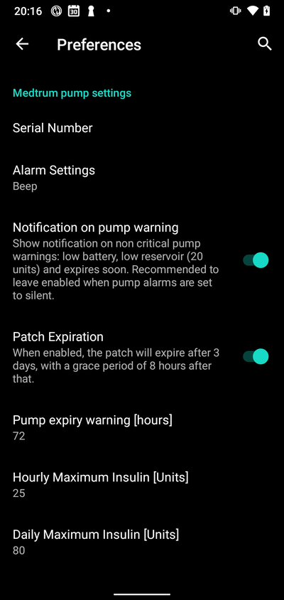
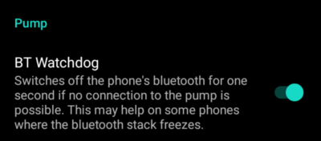
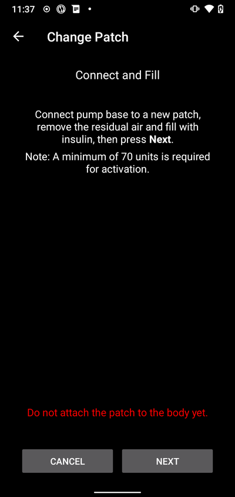
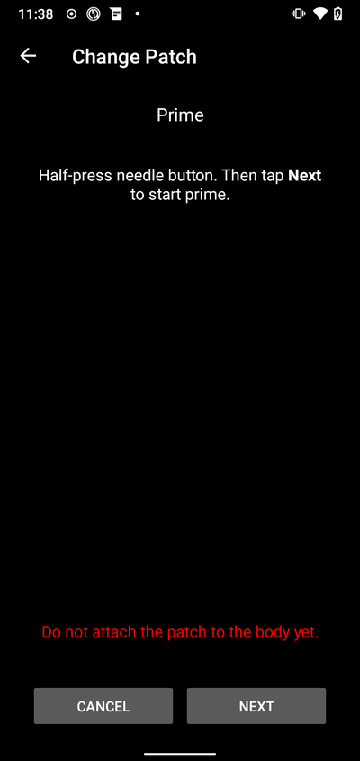
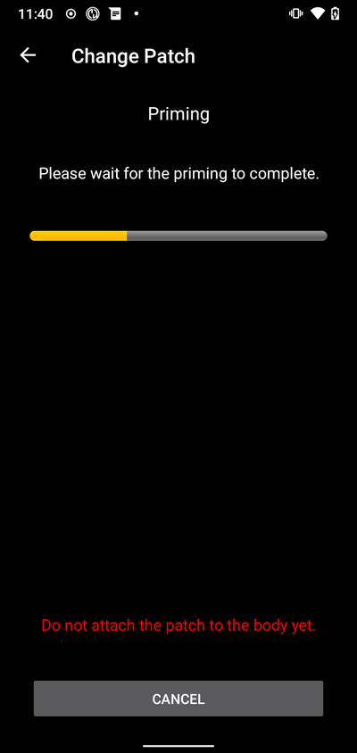
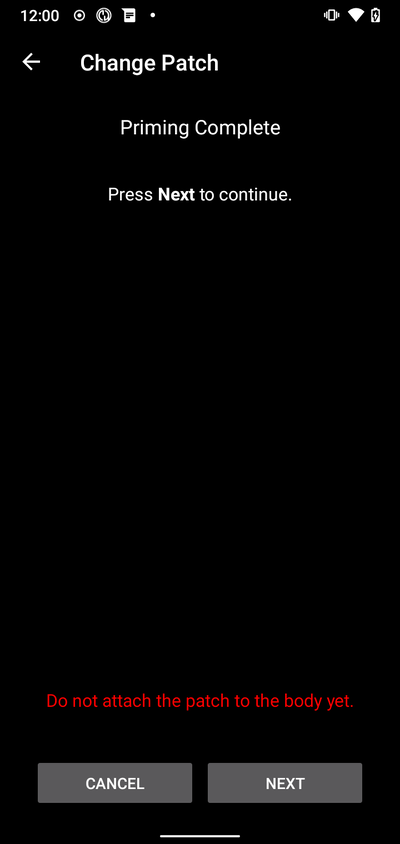
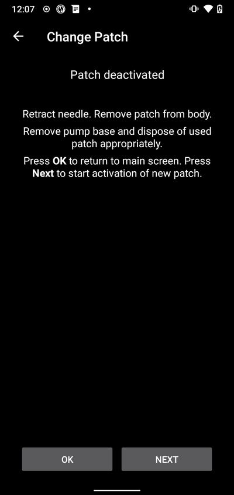
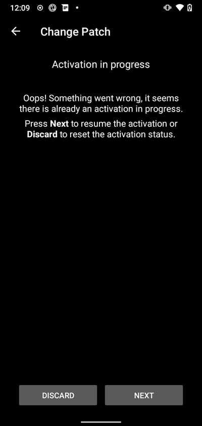
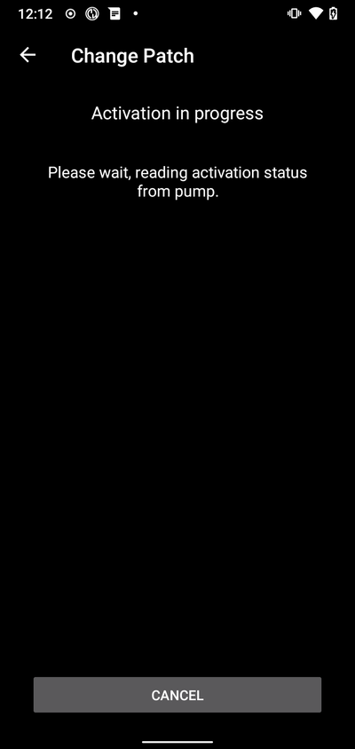
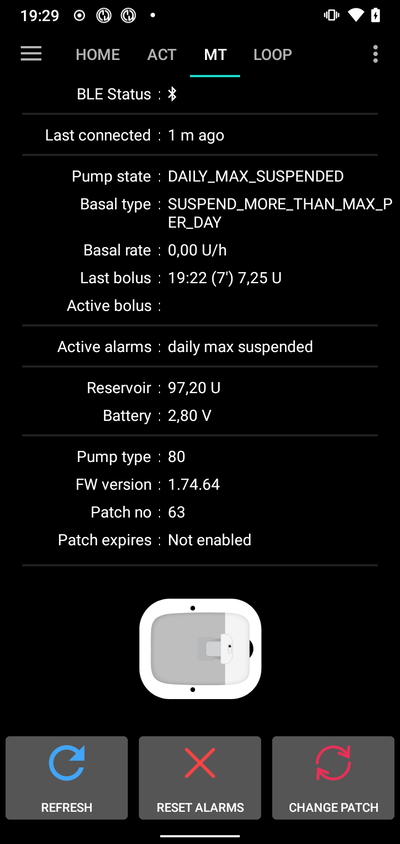

# Medtrum Nano / 300U

These instructions are for configuring the Medtrum insulin pump.

此軟體是 DIY 人工胰臟解決方案的一部分，並非產品，您需要閱讀、學習並了解系統，包括如何使用它。 你需要對自己使用的結果負完全責任。 You alone are responsible for what you do with it.

## Pump capabilities with AAPS

- 支援所有循環功能（SMB、TBR等）
- 自動夏令時間（DST）與時區處理
- AAPS驅動不支援延長注射

## 硬體和軟體需求

- **與Medtrum幫浦基座及儲液瓶相容的修補版**
  - 目前支援：
    - Medtrum TouchCare Nano與幫浦基座參考：**MD0201**和**MD8201**。
    - Medtrum TouchCare 300U與幫浦基座參考：**MD8301**。
    - 如果您擁有不支援的型號，並願意捐贈硬體或協助測試，請透過discord與我們聯繫[這裡](https://discordapp.com/channels/629952586895851530/1076120802476441641)。
- **版本3.2.0.0或更新的AAPS，依照[APK建置指南](../Installing-AndroidAPS/Building-APK.md)建立並安裝。**
- **相容的 Android 手機** 需具備 BLE 藍牙連線
  - 請參閱AAPS的[版本說明](../Installing-AndroidAPS/Releasenotes.md)
- [**連續血糖監測儀（CGM）**](BG-Source.md)

## 開始之前

**SAFETY FIRST** Do not attempt this process in an environment where you cannot recover from an error (extra patches, insulin, and pump control devices are must-haves).

**PDM與Medtrum App將無法與AAPS啟動的修補版一起運作。** 之前您可能使用PDM或Medtrum App向您的幫浦發送指令。 基於安全考量，您只能使用與啟動該修補版的裝置或App。 For security reasons you can only use the activated patch with the device or app that was used to activate it.

_這並不意味著您應該丟棄PDM。 建議將它放在安全的地方作為備用，以防緊急情況發生，例如手機遺失或AAPS無法正常運作。_ It is recommended to keep it somewhere safe as a backup in case of emergencies, for instance if your phone gets lost or AAPS is not working correctly.\*

**Your pump will not stop delivering insulin when it is not connected to AAPS**
Default basal rates are programmed on the pump as defined in the current active profile.
As long as AAPS is operational, it will send temporary basal rate commands that run for a maximum of 120 minutes. If for some reason the pump does not receive any new commands (for instance because communication was lost due to pump - phone distance) the pump will fall back to the default basal rate programmed on the pump once the Temporary Basal Rate ends.

**AAPS 不支援 30 分鐘基礎率設定檔。** **AAPS 設定檔不支援 30 分鐘的基礎率時間框架** 如果您是 AAPS 新手並首次設置基礎率設定檔，請注意，基礎率從半小時開始的設定不被支援，您需要調整您的基礎率設定檔以從整點開始。 例如，如果您的基礎率為 1.1 單位，並於 09:30 開始，持續時間為 2 小時，於 11:30 結束，這將無法正常工作。 您需要將此 1.1 單位的基礎率更改為 9:00-11:00 或 10:00-12:00 的時間範圍。 儘管Medtrum幫浦硬體本身支援30分鐘基礎率增量，但AAPS目前無法在其算法中考慮這些增量。 For example, if you have a basal rate of 1.1 units which starts at 09:30 and has a duration of 2 hours ending at 11:30, this will not work. You will need to change this 1.1 unit basal rate to a time range of either 9:00-11:00 or 10:00-12:00. Even though the Medtrum pump hardware itself supports the 30 min basal rate profile increments, AAPS is not able to take them into account with its algorithms currently.

**AAPS不支援0U/h的設定檔基礎率** 儘管Medtrum幫浦支援零基礎率，但AAPS使用設定檔基礎率的倍數來確定自動治療，因此無法使用零基礎率。 可以透過“中斷幫浦”功能或停用循環/臨時基礎率或暫停循環/臨時基礎率的組合來實現臨時的 0 單位基礎率。 A temporary zero basal rate can be achieved through the "Disconnect pump" function or through a combination of Disable Loop/Temp Basal Rate or Suspend Loop/Temp Basal Rate.

## 設定

CAUTION: When activating a patch with AAPS you **MUST** disable all other devices that can talk to the Medtrum pumpbase. e.g. active PDM and Medtrum app. Make sure you have your pumpbase and pumpbase SN ready for activation of a new patch.

### 步驟1：選擇Medtrum幫浦

#### 選項 1：新安裝

If you are installing AAPS for the first time, the **Setup Wizard** will guide you through installing AAPS. Select “Medtrum” when you reach Pump selection.

If in doubt you can also select “Virtual Pump” and select “Medtrum” later, after setting up AAPS (see option 2).

#### 選項 2：組態建置工具

在現有安裝中，您可以從[組態建置工具](Config-Builder.md#config-builder-profile)中選擇**Medtrum**幫浦：

在左上角的**漢堡選單**中選擇**組態建置工具**\ ➜\ **幫浦**\ ➜\ **Medtrum**，選擇**啟用按鈕**標題為**Medtrum**。

勾選**齒輪圖示**旁的**複選框**，將允許Medtrum總覽顯示在AAPS介面中的標籤中，標題為**Medtrum**。 勾選此框將便於您在使用AAPS時存取Medtrum指令，非常建議如此設置。 Checking this box will facilitate your access to the Medtrum commands when using AAPS and is highly recommended.

### 步驟2：變更Medtrum設置

Enter the Medtrum settings by tapping the **Settings Gear** of the Medtrum module in the Config Builder .

#### 序號：

Enter the serial number of your pumpbase here as noted on the pumpbase. Make sure the serial number is correct and there are no spaces added (You can either use capital or lowercase).

注意：此設置只能在無活動修補版時更改。

#### 警報設置

_**Default: Beep.**_

This setting changes the way that the pump will alert you when there is a warning or error.

- 嗶聲 > 當出現警報或警告時，修補版會發出嗶聲聲
- 靜音 > 當出現警報或警告時，修補版將不發出任何聲音

注意：在靜音模式下，AAPS仍會根據手機音量設置發出警報。 如果您未回應警報，修補版最終會開始嗶聲。 If you do not respond to the alarm, the patch will eventually beep.

#### Notification on pump warning

_**預設：已啟用。**_

This settings changes the way AAPS will show notification on non ciritical pump warnings.
When enabled a Notification will be shown on the phone when a pump warning occurs, including:
\- Low battery
\- Low reservoir (20 Units)
\- Patch expiration warning

無論如何，這些警告也會顯示在Medtrum總覽畫面中的[活動警報](#active-alarms)下。

#### 修補版過期

_**預設：已啟用。**_

This setting changes the behavior of the patch. When enabled the patch will expire after 3 days and give an audible warning if you have sound enabled. After 3 days and 8 hours the patch will stop working.

If this setting is disabled, the patch will not warn you and will continue running until the patch battery or reservoir runs out.

#### Pump expiry warning

_**預設：72小時。**_

此設置更改過期警告的時間，當[修補版過期](#patch-expiration)啟用時，AAPS將在啟動後的設定小時內發送通知。

#### Hourly Maximum Insulin

_**預設：25U。**_

This setting changes the maximum amount of insulin that can be delivered in one hour. If this limit is exceeded the patch will suspend and give an alarm. The alarm can be reset by pressing the reset button on in the overview menu see [Reset alarms](#reset-alarms).

Set this to a sensible value for your insulin requirements.

#### 每日最大胰島素輸送量

_**預設：80U。**_

This setting changes the maximum amount of insulin that can be delivered in one day. If this limit is exceeded the patch will suspend and give an alarm. The alarm can be reset by pressing the reset button on in the overview menu see [Reset alarms](#reset-alarms).

Set this to a sensible value for your insulin requirements.

### 步驟2b：AAPS警報設置

進入偏好設定

#### Pump:

##### BT Watchdog

進入偏好設定並選擇**幫浦**：

##### BT Watchdog

This setting will try to work around any BLE issues. It will try to reconnect to the pump when the connection is lost. It will also try to reconnect to the pump when the pump is unreachable for a certain amount of time.

Enable this setting if you experience frequent connection issues with your pump.

#### 本地警報：

進入偏好設定並選擇**本地警報**：

##### Alert if pump is unreachable

_**預設：已啟用。**_

This setting is forced to enabled when the Medtrum driver is enabled. It will alert you when the pump is unreachable. This can happen when the pump is out of range or when the pump is not responding due to a defective patch or pumpbase, for example when water leaks between the pumpbase and the patch.

For safety reasons this setting cannot be disabled.

##### Pump unreachable threshold [min]

_**預設：30分鐘。**_

This setting changes the time after which AAPS will alert you when the pump is unreachable. This can happen when the pump is out of range or when the pump is not responding due to a defective patch or pumpbase, for example when water leaks between the pumpbase and the patch.

此設定可在使用Medtrum幫浦時更改，但建議出於安全理由設為30分鐘。

### Step 3: Activate patch

**在繼續之前：**

- 準備好您的Medtrum Nano幫浦基座與儲液瓶修補版。
- 請確保AAPS已正確設置，並已[註冊設定檔](../Usage/Profiles.md)。
- 停用其他可與Medtrum幫浦連線的裝置（PDM與Medtrum App）

#### Activate patch from the Medtrum overview Tab

在AAPS介面中導航至[Medtrum標籤](#overview)，然後按下右下角的**更換修補版**按鈕。

If a patch is already active, you will be prompted to deactivate this patch first. 如果修補版已啟動，系統將提示您先停用該修補版。 請參閱[停用修補版](#deactivate-patch)。

Follow the prompts to fill and activate a new patch. Please note - it is important to only connect the pumpbase to the reservoir patch at the step when you are prompted to do so. **You must only put the pump on your body and insert the cannula when prompted to during the activation process (after priming is complete).**

##### 開始啟動

At this step, double check your serial number and make sure the pumpbase is not connected to the patch yet.

按**下一步**繼續。

##### 填充修補版

Once the patch is detected and filled with a minimum of 70Units of insulin, press **Next** will appear.

##### Prime the patch

不要移除安全鎖，並按下修補版上的針頭按鈕。

按**下一步**開始填充

填充完成後，按**下一步**繼續。

##### 填充修補版

Clean the skin, remove stickers and attach the patch to your body.
Remove safety lock and press the needle button on the patch to insert the cannula.

Press **Next** to activate the patch.

##### 啟動修補版

啟動完成後，將顯示以下畫面

按**確定**返回主畫面。

### 停用修補版

要停用當前啟動的修補版，請前往AAPS介面中的[Medtrum標籤](#overview)，然後按下**更換修補版**按鈕。

You will be asked to confirm that you wish to deactivate the current patch. **Please note that this action is not reversable.** When deactivation is completed, you can press **Next** to continue the process to activate a new patch. If you are not ready to activate a new patch, press **Cancel** to return to the main screen.

如果Android APS無法停用修補版（例如因為幫浦基座已從儲液瓶修補版中移除），您可以按下**丟棄**以忘記當前修補版會話，並啟動新修補版。

停用完成後，按**確定**返回主畫面，或按**下一步**繼續啟動新修補版的過程。

### Resume interrupted activation

如果修補版啟動過程被中斷，例如由於手機電量耗盡，您可以前往AAPS介面中的Medtrum標籤，並按下**更換修補版**按鈕來恢復啟動過程。

按**下一步**啟動修補版。 Press **Discard** to discard the current patch session and make it possible to activate a new patch.

The driver will try to determine the current status of the patch activation. If this was successful it will go into the activation progress at the current step.

## Overview

The overview contains the current status of the Medtrum patch. It also contains buttons to change the patch, reset alarms and refresh the status.

##### BLE Status:

This shows the current status of the Bluetooth connection to the pumpbase.

##### 上次連線：

This shows the last time the pump was connected to AAPS.

##### Pump state:

This shows the current state of the pump. For example:
\- ACTIVE : The pump is activated and running normally
\- STOPPED: The patch is not activated

##### 基礎率類型：

This shows the current basal type.

##### 基礎率：

這顯示了當前的基礎率。

##### Last bolus:

This shows the last bolus that was delivered.

##### Active bolus:

This shows the active bolus that is currently being delivered.

##### 當前警報：

這顯示了當前活動中的警報。

##### Reservoir:

This shows the current reservoir level.

##### 電池：

This shows the current battery voltage of the patch.

##### Pump type:

This shows the current pump type number.

##### 韌體版本：

This shows the current firmware version of the patch.

##### Patch no:

This shows the sequence number of the activated patch. This number is incremented every time a new patch is activated.

##### 修補版過期：

This shows the date and time when the patch will expire.

##### 重新整理：

This button will refresh the status of the patch.

##### 更換修補版：

This button will start the process to change the patch. 此按鈕將啟動更換修補版的過程。 請參閱[啟動修補版](#activate-patch)以獲取更多資訊。

### 重置警報

The alarm button will appear on the overview screen when there is an active alarm that can be reset. Pressing this button will reset the alarms and resume insulin delivery if the patch has been suspended due to the alarm. E.g. when suspended due to a maximum daily insulin delivery alarm.

按下**重置警報**按鈕以重置警報並恢復正常運作。

## Troubleshooting

### 連線問題

如果您遇到連線逾時或其他連線問題：

- 在AAPS的Android應用程式設置中：將定位權限設置為「始終允許」。

### Activation interrupted

If the activation process is interrupted for example by and empty phone battery or phone crash. The activation process can be resumed by going to the change patch screen and follow the steps to resume the activation as outlined here: [Resume interrupted activation](#resume-interrupted-activation)

### 防止修補版故障

The patch can give a variety of errors. To prevent frequent errors:

- Make sure the pumpbase is properly seated in the patch and no gaps are visible.
- When filling the patch do not apply excessive force to the plunger. Do not try to fill the patch beyond the maximum that applies to your model.

## 如何尋求協助

所有Medtrum驅動的開發工作均由社群**志願者**完成；請記住這一點，並在請求協助之前，遵循以下指導原則：

- **等級 0：** 閱讀此文件的相關部分，以確保您了解遇到困難的功能應如何工作。
- **第一層：**如果您仍遇到無法透過此文件解決的問題，請前往**Discord**上的\*#Medtrum\*頻道，使用[此邀請連結](https://discord.gg/4fQUWHZ4Mw)。
- 如果您是首次安裝AAPS，**安裝嚮導**將引導您完成AAPS的安裝過程。 當您到達幫浦選擇時，請選擇「Medtrum」。
  \*\*第二層：\*\*搜尋現有問題，看看您的問題是否已在[問題頁面](https://github.com/nightscout/AAPS/issues)中報告 如果存在，請確認/評論/添加您的問題資訊。 如果沒有，請建立[新問題](https://github.com/nightscout/AndroidAPS/issues)並附上您的[日誌檔案](../Usage/Accessing-logfiles.md)。
- **保持耐心——我們社群中的大多數成員都是善良的志願者，解決問題通常需要使用者和開發者雙方的時間和耐心。**
