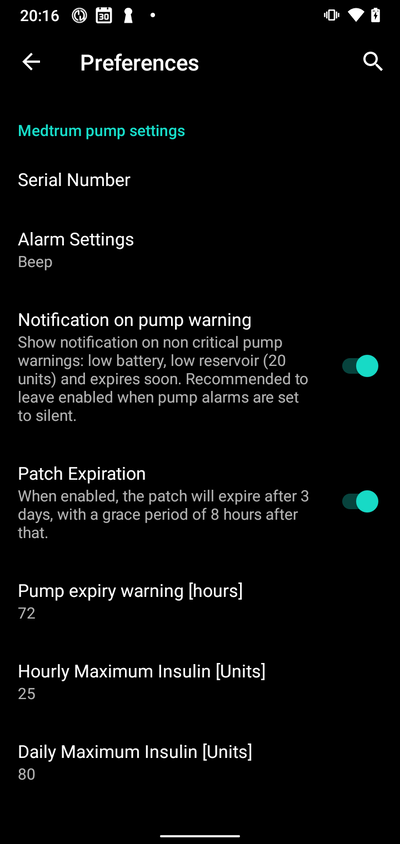
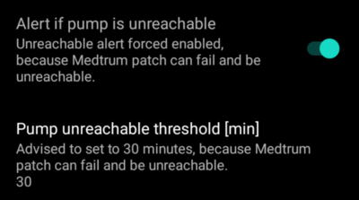
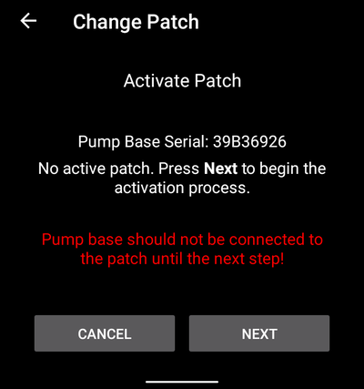
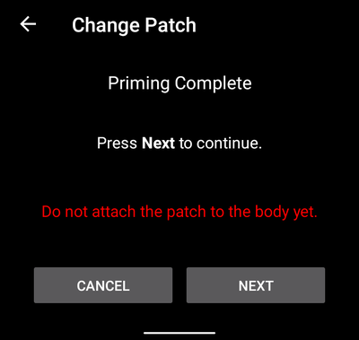

- - -
orphan: true
- - -

# 移宇（Medtrum）Nano/300U胰岛素泵

本说明用于配置移宇（Medtrum）胰岛素泵。

This software is part of a DIY artificial pancreas solution and is not a product but requires YOU to read, learn, and understand the system, including how to use it. 使用后果由您自行承担。

```{contents} Table of contents
:depth: 1
:local: true
```

## AAPS支持的胰岛素泵功能
* 支持所有闭环功能（包括SMB、TBR等）
* 自动处理夏令时（DST）及时区
* AAPS驱动程序不支持扩展大剂量功能

## Hardware and Software Requirements
* **兼容的移宇(Medtrum)泵底板与储药器贴片**
    - 当前支持：
        - 移宇TouchCare Nano胰岛素泵（配套泵基座型号：**MD0201**及**MD8201**）
        - 移宇TouchCare 300U胰岛素泵（配套泵基座型号：**MD8301**）
        - 若您持有不受支持的型号，并愿意捐赠硬件或协助测试，请通过Discord[此处](https://discordapp.com/channels/629952586895851530/1076120802476441641)联系我们。
* **已构建并安装AAPS 3.2.0.0或更高版本**，请参照[构建APK](../SettingUpAaps/BuildingAaps.md)说明进行操作。
* **兼容的Android手机**（需具备BLE蓝牙连接功能）
    - 请参阅AAPS[版本说明](../Maintenance/ReleaseNotes.md)
* [**持续血糖监测仪（CGM）**](../Getting-Started/CompatiblesCgms.md)

## 在您开始前

**安全第一** 请勿在无法从错误中恢复的环境中进行此操作（必须备有额外的贴片、胰岛素及泵控制设备）。

**经AAPS激活的贴片将无法与PDM及移宇应用程序兼容。** 此前您可能使用过PDM或移宇应用程序向胰岛素泵发送指令。 出于安全考虑，已激活的贴片仅限用于激活时使用的设备或应用程序。

*这并不意味着您应当丢弃您的PDM设备。 建议将其妥善保管作为应急备用，例如当手机遗失或AAPS运行异常时。*

**当未连接AAPS时，您的胰岛素泵不会停止输注胰岛素** 胰岛素泵将按照当前使用方案中设定的基础率持续输注。 只要AAPS处于运行状态，就会发送最长持续120分钟的临时基础率指令。 若因某些原因（如因胰岛素泵与手机距离过远导致通信中断）泵体未能接收到新指令，临时基础率结束后将自动恢复为泵体预设的基础率。

**AAPS不支持30分钟基础率方案。****AAPS配置方案不支持30分钟基础率时间间隔。**若您初次使用AAPS并首次设置基础率方案，请注意系统不支持半点起始的基础率设置，您需要将基础率方案调整为整点起始。 例如，若您设置了09:30开始、持续2小时至11:30结束的1.1单位基础率，该设置将无法生效。 您需要将这个1.1单位的基础率时间段调整为9:00-11:00或10:00-12:00。 尽管移宇胰岛素泵硬件本身支持30分钟基础率间隔设置，但AAPS当前算法尚无法兼容此类设置。

**AAPS不支持0U/h基础率方案设置**。虽然移宇胰岛素泵确实支持零基础率，但AAPS需基于基础率倍数进行自动化治疗计算，因此无法兼容零基础率设置。 可通过"断开泵连接"功能，或结合停用循环/临时基础率与暂停循环/临时基础率功能，实现临时零基础率设置。

## 设置

警告：使用AAPS激活贴片时，您**必须**禁用所有其他可与移宇泵基座通信的设备。 例如：正在使用的PDM及移宇应用程序。 请确保准备好您的泵基座及泵基座序列号，以便激活新贴片。

### 步骤1：选择移宇胰岛素泵

#### 方式一：全新安装

若您首次安装AAPS，**设置向导**将引导您完成安装流程。 当进入泵体选择界面时，请选择"移宇"。

如有疑问，您也可先选择"虚拟泵"，待完成AAPS设置后再选择"移宇"（参见选项2）。


#### 选项2：配置构建器

在现有安装中，您可通过[配置生成器 > 泵](#Config-Builder-pump)选择**移宇**胰岛素泵：

在左上角**汉堡菜单**中选择**配置生成器** ➜ **泵** ➜ **移宇**，然后点击标有**移宇**的**启用按钮**。

勾选**设置齿轮**旁的**复选框**，即可在AAPS界面中显示名为**移宇**的标签页概览。 勾选此选项将便于您在使用AAPS时访问移宇相关指令，强烈建议启用。


### 步骤2：调整移宇设置

点击配置生成器中移宇模块的**设置齿轮**即可进入移宇设置界面。



#### 序列号:

请在此处输入您泵基座上标注的泵基座序列号。 请确保序列号准确无误且未添加空格（字母大小写均可）。

注意：此设置仅在无激活贴片时方可修改。

#### 警报设置

***默认设置：蜂鸣提示。***

此设置将改变胰岛素泵在出现警告或错误时的警报方式。

- 蜂鸣 > 贴片将通过蜂鸣声提示警报和警告
- 静音 > 贴片将不会通过警报声或警告声提醒您

注意：在静音模式下，AAPS仍会根据您手机的音量设置发出警报声。 若您未响应警报，贴片最终仍会发出蜂鸣声。

#### 胰岛素泵警告通知

***默认状态：启用。***

此设置将改变AAPS对非关键性泵警报的提示方式。 当启用时，手机将在出现胰岛素泵警告时显示通知，包括：
    - 电量不足
    - 储药量不足（20单位）
    - 贴片有效期警告

无论何种情况，这些警告信息都将在移宇概览屏幕的[活动警报](#medtrum-active-alarms)项下显示。

(medtrum-patch-expiration)=
#### 贴片到期警告

***默认状态：启用。***

此设置将改变贴片的工作模式。 当启用此设置时，贴片将在3天后到期，并在开启声音提示的情况下发出声音警告。 3天8小时后，贴片将停止工作。

若禁用此设置，贴片将不会发出警告，并持续运行直至贴片电池耗尽或储药槽用尽。

#### 胰岛素泵到期警告

***默认值：72小时。***

此设置将修改到期警告的时间：当启用[贴片到期](#medtrum-patch-expiration)功能时，AAPS会在激活后的设定小时数发出通知。

#### 每小时最大胰岛素剂量

***默认值：25单位。***

此设置将修改每小时的最大胰岛素输注量。 若超过此限制，贴片将暂停输注并发出警报。 可通过概览菜单中的[重置警报](#reset-alarms)按钮来解除警报。

请根据您的胰岛素需求设置合理数值。

#### 每日最大胰岛素剂量

***默认值：80单位。***

此设置将修改每日最大胰岛素输注量。 若超过此限制，贴片将暂停输注并发出警报。 可通过概览菜单中的[重置警报](#reset-alarms)按钮来解除警报。

请根据您的胰岛素需求设置合理数值。

#### 连接错误时扫描

***默认状态：关闭。***

位于**高级设置**项下。

仅在出现连接问题时启用。 若启用此功能，驱动程序将在尝试重新连接胰岛素泵前再次进行扫描。 请确保将位置权限设置为"始终允许"。

### 步骤2b：AAPS警报设置

前往偏好设置

#### 胰岛素泵:

##### 蓝牙看门狗

前往偏好设置并选择**胰岛素泵**：


##### 蓝牙看门狗

此设置将尝试解决所有蓝牙低功耗(BLE)连接问题。 当连接中断时，系统将尝试重新连接胰岛素泵。 当胰岛素泵在一定时间内无法连接时，系统也将尝试重新建立连接。

若您的胰岛素泵频繁出现连接问题，请启用此设置。

#### 本地警报：

前往偏好设置并选择**本地警报**：



##### 若胰岛素泵无法连接则发出警报

***默认状态：启用。***

当移宇驱动程序启用时，此设置将强制启用。 当泵无法连接时，系统将发出警报。 当泵超出连接范围，或因贴片或泵座故障导致泵无响应时（例如泵座与贴片之间发生渗漏），系统将触发此警报。

出于安全考虑，此设置不可禁用。

##### 泵失联阈值[分钟]

***默认值：30分钟。***

此设置用于调整移宇胰岛素泵失联后，AAPS系统触发警报的延迟时间。 当泵超出连接范围，或因贴片或泵座故障导致泵无响应时（例如泵座与贴片之间发生渗漏），系统将触发此警报。

使用移宇胰岛素泵时可调整此设置，但出于安全考虑建议保持30分钟默认值。

### 步骤3：激活贴片

**操作前须知：**
- 请准备好您的移宇Nano泵座和储药贴片。
- 请确保AAPS已正确设置并激活了[配置文件](../DailyLifeWithAaps/ProfileSwitch-ProfilePercentage.md)。
- 其他可与移宇泵通信的设备（PDM和移宇应用）已被禁用

#### 从移宇概览标签页激活贴片

在AAPS界面中导航至[移宇标签页](#overview)，并点击右下角的**更换贴片**按钮。

如果已有贴片处于激活状态，系统将提示您先停用当前贴片。 请参阅[停用贴片](#deactivate-patch)。

请按照提示操作，完成新贴片的填充和激活。 请注意 - 必须严格按提示步骤操作，仅在系统提示时才能将泵底座与储药贴片连接。 **必须严格遵照激活流程提示操作，仅当完成预充程序后系统提示时，方可将泵体佩戴至身上并插入导管。**

##### 开始激活



在此步骤中，请再次核对序列号，并确保泵底座尚未与贴片连接。

点击**下一步**继续。

##### 填充贴片


当检测到贴片并填充至少70单位胰岛素后，将出现**下一步**按钮。

##### 预充贴片


请勿移除安全锁，并按下贴片上的针头按钮。

点击**下一步**开始预充




预充完成后，点击**下一步**继续。

##### 安装贴片


清洁皮肤，移除贴纸，将贴片安装到身体上。 移除安全锁并按下贴片上的针头按钮以插入导管。

点击**下一步**激活贴片。

(medtrum-activate-patch)=
##### 激活贴片


当激活完成后，将出现以下界面


点击**确定**返回主界面。

### 停用贴片

要停用当前激活的贴片，请进入AAPS界面中的[移宇标签页](#overview)，然后点击**更换贴片**按钮。


系统将要求您确认是否要停用当前贴片。 **请注意此操作不可逆。** 停用完成后，可点击**下一步**继续新贴片激活流程。 若尚未准备好激活新贴片，请点击**取消**返回主界面。


若Android APS无法停用贴片（例如因泵底座已从储药贴片移除），可点击**丢弃**以终止当前贴片会话，从而激活新贴片。


停用完成后，点击**确定**返回主界面，或点击**下一步**继续新贴片激活流程。

### 继续中断的激活

若贴片激活流程被中断（例如因手机电量耗尽），可通过进入AAPS界面中的[移宇标签页](#overview)并点击**更换贴片**按钮来恢复激活流程。


点击**下一步**继续激活流程。 点击**丢弃**以终止当前贴片会话，从而激活新贴片。


驱动程序将尝试检测当前贴片激活状态。 若检测成功，系统将从当前步骤继续激活流程。

## 概览

该概览显示移宇贴片的当前状态。 同时包含更换贴片、重置警报和刷新状态的按钮。


### 蓝牙状态：

此处显示与泵底座的蓝牙连接当前状态。

### 上次连接:

此处显示泵上次连接AAPS的时间。

### 泵状态：

此处显示泵的当前状态。 例如：
    - 激活：泵已激活并正常运行
    - 停止：贴片未激活

### 基础率类型:

此处显示当前基础率类型。

### 基础率：

此处显示当前基础率。

### 最近一次大剂量：

此处显示最近一次输注的大剂量。

### 当前大剂量：

此处显示正在输注的当前大剂量。

(medtrum-active-alarms)=
### 当前警报：

此处显示当前所有激活中的警报状态。

### 储药器:

此处显示当前储药器剩余药量。

### 电池:

此处显示贴片当前电池电压。

### 泵类型：

此处显示当前泵类型编号。

### 固件版本：

此处显示贴片当前固件版本。

### 贴片编号：

此处显示已激活贴片的序列号。 该编号在每次激活新贴片时递增。

### 贴片有效期：

此处显示贴片到期日期和时间。

### 刷新:

此按钮将刷新贴片状态。

### 更换贴片：

此按钮将启动更换贴片流程。 详见[激活贴片](#medtrum-activate-patch)获取更多信息。

### 重置警报

当存在可重置的激活警报时，警报按钮将显示在概览屏幕上。 按下此按钮将重置警报，若贴片因警报暂停，将恢复胰岛素输注。 例如 当日胰岛素最大输注量警报触发暂停时。


请按**重置警报**按钮以清除警报并恢复正常运行。

## 切换手机，导出/导入设置

When switching to a new phone the following steps are necessary:
* [Export settings](../Maintenance/ExportImportSettings.md) on your old phone
* 将设置从旧手机传输至新手机，并导入至AAPS

导入的设置文件必须与当前使用的贴片会话相同，否则贴片将无法连接。

导入设置后，驱动程序将与泵同步历史记录，根据设置文件的生成时间，此过程可能需要一定时间。

自AAPS 3.3.0.0版本起，主屏幕将显示同步进度：

## 故障排除

### 连接问题

若出现连接超时或其他连接问题：
- 在AAPS的安卓应用设置中：将位置权限设为"始终允许"。

### 激活中断

若激活流程因手机电量耗尽或系统崩溃等原因中断。 可通过进入更换贴片界面，按此处所述步骤继续激活流程：[恢复中断的激活](#resume-interrupted-activation)

### 预防贴片故障

贴片可能出现多种故障。 为避免频繁出现故障：
- 请确保泵基座正确嵌入贴片且无可见缝隙。
- 填充贴片时请勿对推杆施加过大压力。 请勿超过您所用型号的最大填充量进行填充。

## 获取帮助途径

移宇驱动器的所有开发工作均由社区**志愿者**完成；请您在寻求帮助前谨记这一事实并遵循以下准则：

-  **Level 0:** Read the relevant section of this documentation to ensure you understand how the functionality with which you are experiencing difficulty is supposed to work.
-  **第一级：**若您遇到的问题无法通过本文档解决，请通过[此邀请链接](https://discord.gg/4fQUWHZ4Mw)加入**Discord**平台的*#Medtrum*频道寻求帮助。
-  **第二级：**请在[问题追踪](https://github.com/nightscout/AAPS/issues)中搜索现有问题，查看您的问题是否已被上报。若存在相关记录，请确认/评论/补充您的问题信息。 如果没有，请创建一个[新问题](https://github.com/nightscout/AndroidAPS/issues)并附上[您的日志文件](../GettingHelp/AccessingLogFiles.md)。
-  **Be patient - most of the members of our community consist of good-natured volunteers, and solving issues often requires time and patience from both users and developers.**