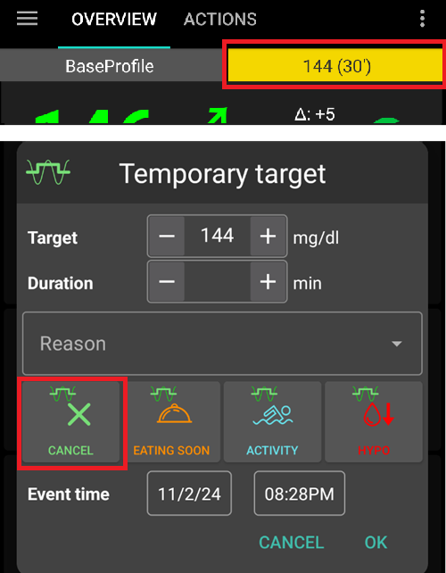

# 临时目标

## 什么是临时目标，以及在哪里设置和配置它们？

**临时目标**（或简称**TT**）是**AAPS**的一个功能，允许用户为计划中的活动更改其[**BG**（血糖）目标范围](#profile-glucose-targets)。 这是通过**AAPS**调整用户的胰岛素使用量来实现的。

一个血糖目标，特别是如果它是短期的（持续时间少于4小时），并不需要是您期望或希望达到的实际血糖水平值，而是一个告诉**AAPS**在保持血糖水平在范围内的同时，更加或更少地积极调节的好方法。

临时目标可以在以下范围内定义：

|     | 临时目标                  |
| --- | --------------------- |
| 最小值 | 4 mmol/l 或 72 mg/dL   |
| 最大值 | 15 mmol/l 或 225 mg/dL |

**AAPS**提供了三种适合不同情境的**临时目标**选项：运动（**临时目标-运动**）、用餐（**临时目标-即将用餐**）和预测低血糖（**临时目标-低血糖**）。 这些**临时目标**位于**“操作”选项卡**下。

用户应对在**AAPS**中选择**临时目标**时能取得的结果有合理的期望。 达到期望的**BG**目标的成功程度取决于多种因素，包括：用户**AAPS**设置的可靠性、整体**BG**控制、**IOB**、胰岛素敏感性、胰岛素抵抗、运动期间的体力消耗程度等。

**临时目标**大约需要30分钟或更长时间才能达到期望的**BG**目标。 **AAPS**无法实现立即达到**BG**目标的效果，用户在选择**临时目标**时应考虑到这一点。

下表总结了**临时目标-运动**、**临时目标-即将用餐**和**临时目标-低血糖**的功能特点。

### TT - 活动

**BG目标（根据用户设置）**

AAPS将努力在40分钟内达到8mmol/l或144mg/dl。

**用户在选择时可能需要考虑的其他因素**：

根据**BG**水平，**AAPS**将“减少”胰岛素使用量以达到**BG**目标。 如果**BG**目标不在范围内（即高于用户**配置文件**中选择的**BG**目标），则**AAPS**可能会保持基础率不变。

在闭环模式下，**SMB**：

- *可能*会被停用（下文进一步讨论）；和/或
- 基础率可能被停用，如果**AAPS**处于负**IOB**或 <0.

用户可能还希望考虑：

- 在计划运动前*选择*此**TT** 1-2小时，以确保减少IOB（此TT的正确时机因人而异）；
- 在计划活动的持续时间内*选择*一个临时配置文件（降低）以确保减少**IOB**；
- *确保***TT**在运动前*被停用*，因为减少**IOB**后，一些用户可能在运动后会出现**BG**快速上升的情况。

### TT - 即将进食

**BG目标（根据用户设置）**

AAPS将努力在30分钟内达到5mmol/l或90mg/dl。

**用户在选择时可能需要考虑的其他因素**：

在闭环模式下，**SMB**：

- 将保持激活状态；和/或
- 根据用户的**配置文件**设置，基础率也可能被激活。

根据**BG**水平，**AAPS**将在用户**AAPS**设置参数的范围内“增加”胰岛素使用量以达到期望的**BG**目标。

### TT - 低血糖

**BG目标（根据用户设置）**

AAPS将努力在30分钟内达到7mmol/l或126mg/dl。

**用户在选择时可能需要考虑的其他因素**：

在闭环模式下，**SMB**：

- *可能*会被停用（下文进一步讨论）；和/或
- 基础率可能被停用，如果**AAPS**处于负**IOB**或 <0.

(TempTargets-where-can-i-select-a-temp-target)=

## 我可以在哪里选择临时目标？

在**AAPS**的**操作**标签下。

1. 选择**临时目标**按钮；然后
2. 选择所需的**临时目标**

或者点击位于**AAPS**右上角**BG目标**。

- 长按主页右上角的目标或使用底部橙色“碳水化合物”按钮中的快捷方式。

## 我如何更改默认的临时目标并用自己的偏好覆盖它？

要重新配置分配给用户的默认**临时目标**设置的“BG目标范围”和“持续时间”，请转到**AAPS**菜单的右上角，并

1. 选择**首选项**； 
2. 向下滚动到“概览”； 
3. 选择“默认临时目标”；
4. 步骤4指示（如下）更改**TT - 即将进食**的时间段；
5. 步骤5指示（如下）更改**TT - 即将进食**的**BG**目标范围（并且可以对**TT - 活动**和**TT - 低血糖**重复相同步骤）。

## 我如何取消一个正在运行的临时目标？

要取消正在运行的**临时目标**：

在**操作**标签下的**临时目标**中选择“取消”按钮，如下所示。

或者短按位于**AAPS**右上角黄色/绿色框中的“BG目标”，然后选择“取消”，如下所示：

## 我如何选择“默认临时目标”

在**AAPS**的**操作**标签下。

1. 选择**临时目标**按钮；然后
2. 选择所需的**临时目标**

或者点击位于**AAPS**右上角**BG目标**。

或者，在**碳水化合物（Carbs）**按钮中。

1. 在快捷方式中选择所需的**临时目标**

(TempTargets-hypo-temp-target)=

## 低血糖临时目标

**临时目标-低血糖**允许**AAPS**通过减少胰岛素摄入量来防止用户经历低血糖。 如果用户预测他们的**BG**将会下降：通常，**AAPS**应该能够处理，但这很大程度上取决于用户**AAPS**设置的稳定性。 **临时目标-低血糖**使用户能够提前预测低血糖并更新**AAPS**以减少胰岛素。

有时，当食用低血糖治疗的碳水化合物时，用户的**BG**可能会迅速上升，**AAPS**将通过启用**SMB**来纠正快速上升的**BG**。

一些用户希望在**临时目标-低血糖**期间避免给予**SMB**。 这可以通过在**首选项**中停用“*启用高临时目标的SMB*”来实现（见下文）：

- 在（高级，目标9）中：用户可以启用“*高临时目标提高敏感性*”，对于100mg/dl或5.5mmol/l或更高的**Temp-Target**，在OpenAPS SMB模式下，**AAPS**将更加敏感。

- 在（高级，目标9）中：用户可以停用“*高临时目标时的SMB*”，这样，即使**AAPS**的COB> 0，“带临时目标的SMB”或“始终SMB”已启用，且OpenAPS SMB处于活动状态，**AAPS**也不会在高临时目标活动期间给予SMB。

注意：如果用户通过碳水化合物按钮输入碳水化合物，且血糖低于72mg/dl或4mmol/l，**AAPS**将自动启用**临时目标-低血糖**。

(TempTargets-activity-temp-target)=

## 临时目标-活动

在运动前和运动期间，用户可能需要一个更高的目标来防止活动期间出现低血糖。

为了简化**临时目标-活动**，用户可以配置默认的**临时目标-活动**，通过减少胰岛素使用量来提高**BG**水平，以减缓**BG**下降并避免低血糖。

**AAPS**的新用户可能需要实验并个性化他们的**临时目标-活动**默认设置，以便优化此功能以使其最适合他们。 每个人在运动期间达到稳定BG控制的能力都是不同的。 另请参阅[FAQ中的运动部分](#FAQ-sports)。 

一些用户还喜欢在启用**临时目标-活动**之前和期间激活**配置文件切换**（即配置文件减少至<100%，以减少**AAPS**的胰岛素输送）。

高级，目标9：用户可以启用“*高临时目标提高敏感性*”，对于等于或高于100mg/dl或5.5mmol/L的**临时目标**，在OpenAPS SMB模式下，**AAPS**将更加敏感。 那么 **AAPS** 会更加敏感。

此外，如果“*高临时目标时的SMB*”被停用，即使COB > 0，*“带临时目标的SMB”*或*“始终SMB”*已启用，且OpenAPS **SMB**处于活动状态，**AAPS**也不会给予**SMB**。

(TempTargets-eating-soon-temp-target)=

## 临时目标-即将进食

**临时目标-即将进食**可以帮助实现**BG**的温和下降，并确保在进食前有足够的**IOB**。

这对于那些不提前注射的用户来说可能是一个重要的工具，但**临时目标-即将进食**的有效性将取决于多种因素，包括：用户的设置、是否食用低碳水化合物饮食以及是否使用超速效胰岛素（如Fiasp或Lyjumjev）来消除提前注射的需要。 通常，在用户使用**AAPS**有经验之前，他们应该预期在使用**临时目标-即将进食**时需要提前注射，特别是如果食用高碳水化合物饮食的话。

You can read more about the “Eating soon mode” in the article ['How to do “eating soon” mode'](https://diyps.org/2015/03/26/how-to-do-eating-soon-mode-diyps-lessons-learned/) or [here](https://diyps.org/tag/eating-soon-mode/).

Advanced, [objective 9](#objectives-objective9): If you use OpenAPS SMB and have *'Low temp target lowers sensitivity'*, **AAPS** works a little bit more aggressively. For this option there is a requirement for **Temp-Target** to be less than 100mg/dl or 5.5mmol/l.

## How do I turn off SMB during Temp-Targets?

To action this select in **Preferences** > and deactivate *'Enable SMB with high Temp-Target'*.

This will ensure **AAPS** will not give **SMBs**, even with COB > 0, *'SMB with Temp-Target'* or *'SMB always'* enabled and OpenAPS SMB active.