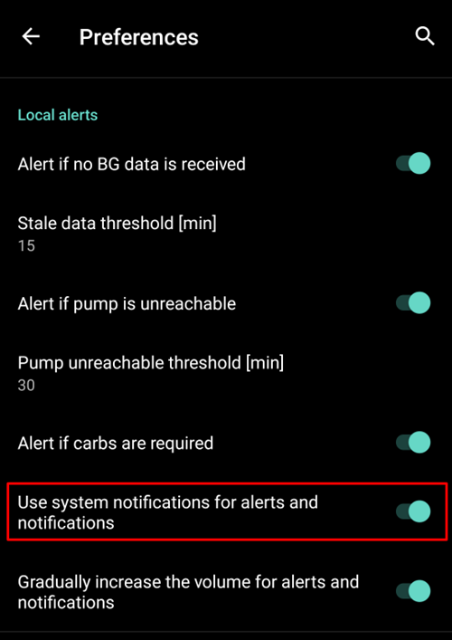
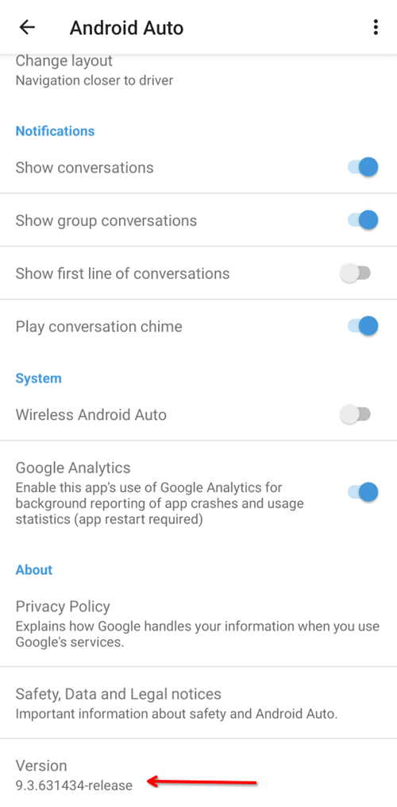
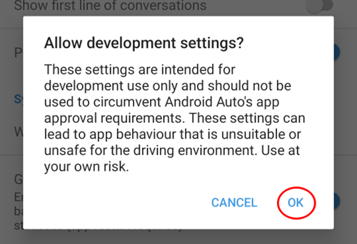

# Android Auto

**AAPS**能够将您当前状态的信息作为消息直接发送到汽车中的Android Auto显示屏上。

```{admonition} 版本和最后更改信息提示 :class: dropdown 最后编辑日期：07/05/2023

用于文档的版本：

* AAPS 3.2.0-dev-i
* Android Auto：9.3.631434-release} ```

## 要求

**AAPS**使用Android Auto的一项功能，该功能允许将手机上的应用程序消息路由到Auto Audio的汽车显示屏上。

这意味着：

* 您必须将**AAPS**配置为使用系统通知进行警报和通知，并且
* 由于**AAPS**是非官方应用程序，因此请允许Android Auto使用“未知来源”。


## 在AAPS中为警报和通知使用系统通知

在**AAPS**主屏幕的右上角打开三点菜单，并选择**Preferences**（偏好设置）


在**Local Alerts**（本地警报）中激活**Use system notifications for alerts and notifications**（使用系统通知进行警报和通知）



在走向汽车之前，请先确认您的手机上能够收到来自**AAPS**的通知！


## 允许Android Auto使用“未知来源”

由于**AAPS**不是Android Auto的官方应用程序，因此必须在Android Auto中为“未知来源”激活通知。 我们将通过开发者模式向您展示如何操作。

上车并将手机与汽车音响系统连接。

您现在应该会看到一个与此屏幕类似的屏幕。


点击**setting**（设置）图标开始配置。

向下滚动到页面底部，并选择**在手机上查看更多**。


现在，我们将在手机上激活开发者模式。

第一个屏幕如下所示。 向下滚动到页面底部。


在那里，您会看到列出的Android Auto版本。 连续点击Android Auto版本10次（按字面意思理解，十次）。 通过此隐藏组合，您现在已启用开发者模式。



在模态对话框“Allow development settings?”（允许开发设置？）中，确认您要启用开发者模式。 



在**developer settings**（开发者设置）中启用“Unknown sources”（未知来源）。


现在，如果您想退出开发者模式， 可以点击右上角的三个点菜单进行操作。

## 在汽车中显示通知

在汽车中的Android Auto上，点击右下角的**number icon**（数字图标）。


您的CGM数据将如下所示显示：


## 故障排除:

* 如果您看不到通知，请检查您是否在Android中[允许AAPS显示通知](#use-system-notifications-in-aaps-for-alerts-and-notifications)，以及[Android Auto是否具有访问通知的权限](#allow-the-use-of-unknown-sources-with-android-auto)。