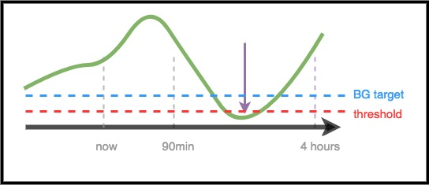
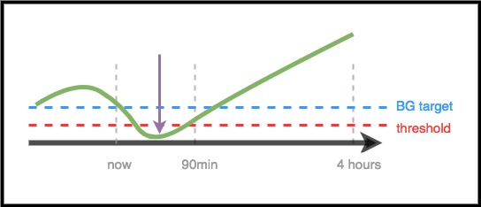

# 致临床医生——AAPS的一般介绍和使用指南

本页面专为两类用户设计，对开源人工胰腺技术（如AAPS）感兴趣的临床医师，以及需向医师分享此类信息的患者。

本指南包含关于DIY闭环系统的高阶信息，特别是AAPS的工作原理。 如需了解这些主题的更多详细信息，请查阅[在线版AAPS完整文档](../index.md)。 如有疑问，可向患者进一步了解详情，或随时联系社区咨询。 （如未使用社交媒体（如[Twitter](https://twitter.com/kozakmilos)或Facebook），欢迎发送邮件至developers@AndroidAPS.org） [您也可在此查阅部分最新研究及疗效相关数据](https://openaps.org/outcomes/)。

## 构建DIY闭环系统的步骤：

要开始使用AAPS，请按照以下步骤操作：

* 查找[兼容的泵](../Getting-Started/CompatiblePumps.md)、[兼容的Android设备](../Getting-Started/Phones.md)和[兼容的CGM来源](../Getting-Started/CompatiblesCgms.md)。
* [下载AAPS源代码并构建软件](../SettingUpAaps/BuildingAaps.md)。
* [配置软件以与糖尿病设备进行通信，并指定设置和安全偏好](../SettingUpAaps/SetupWizard.md)。

## DIY闭环系统的工作原理

在没有闭环系统的情况下，糖尿病患者需要从泵和CGM收集数据，决定该怎么做，并采取行动。

通过自动胰岛素输送，系统执行相同的操作：它从泵、CGM以及记录信息的任何地方（如Nightscout）收集数据，使用这些信息进行计算，并决定需要多少胰岛素（高于或低于基础速率），并使用临时基础速率进行必要的调整，以保持或将血糖水平带入目标范围内。

若运行AAPS的设备发生故障或超出胰岛素泵通信范围，当最后一个临时基础率结束后，胰岛素泵将恢复为预设基础率运行的标准泵模式。

## 数据采集方式：

在AAPS中，Android设备运行一个特殊的应用程序进行数学计算，该设备与支持的泵通过蓝牙通信。 AAPS可以通过WiFi或移动数据与其他设备和云端通信，以收集额外信息，并向患者、护理人员和亲人报告其正在做什么以及为什么这样做。

Android设备需要：

* 与泵通信并读取历史记录——已输送多少胰岛素
* 与CGM通信（直接或通过云端）——查看血糖水平

当设备收集到这些数据后，算法会运行并根据设置（ISF、碳水化合物比例、DIA、目标等）做出决策。 如果需要，它会向泵发出命令以修改胰岛素输送速率。

它还会从泵或Nightscout收集有关大剂量、碳水化合物摄入和临时目标调整的任何信息，以用于计算胰岛素输送速率。

## 该系统如何确定执行何种操作？

开源软件旨在使设备能够轻松完成人们过去在手动模式下所做的工作，即计算如何调整胰岛素输送。 它首先从所有支持设备和云端收集数据，准备数据并运行计算，预测未来不同场景下预期的血糖水平，并计算保持或将血糖带回目标范围所需的调整。 然后，它将任何必要的调整发送到泵。 之后，它读取数据，并重复此过程。

由于最重要的输入参数是来自CGM的血糖水平，因此拥有高质量的CGM数据非常重要。

AAPS被设计为透明地跟踪其收集的所有输入数据、生成的建议以及采取的任何操作。 因此，通过查看日志，可以随时轻松回答“它为什么这样做？”的问题。

## AAPS算法决策示例：

AAPS使用与OpenAPS相同的核心算法和功能集。 算法会做出多个预测（基于设置和情况），代表未来可能发生的不同场景。 在Nightscout中，这些以“紫色线”显示。 AAPS使用不同的颜色来区分这些[预测线](#aaps-screens-prediction-lines)。 在日志中，它会描述哪些预测和哪个时间段正在驱动必要的操作。

### 以下是紫色预测线的示例，以及它们可能如何不同：

### 以下是影响胰岛素输送所需调整的不同时间段的示例：

### 场景1 - 出于安全考虑的零临时基础率

在此示例中，血糖（BG）短期内呈上升趋势，但长期预测显示将处于低值状态。 实际上，系统预测血糖将低于目标值*且*突破安全阈值。 为防止低血糖，AAPS将启动零临时基础率（临时基础率设为0%），直至任意时间段的预测血糖值回升至阈值以上。

### 场景2 - 出于安全考虑的零临时基础率

在此示例中，系统预测血糖短期内将降低，但最终会回升至目标值以上。 但由于短期预测的低血糖值实际上已低于安全阈值，AAPS将启动零临时基础率，直至预测曲线不再有任何低于阈值的点。

### 场景3 - 需要更多胰岛素

在此示例中，短期预测显示血糖将跌破目标范围。 但系统预测其不会跌破安全阈值。 最终血糖将回升至目标范围以上。 因此，AAPS将避免追加任何可能导致短期低血糖的胰岛素（即防止因胰岛素追加而使预测值跌破阈值）。 系统将在安全允许时评估是否追加胰岛素，使最终预测血糖的最低值回落至目标范围。 *（根据设置及所需胰岛素的剂量与时间，该胰岛素可能通过临时基础率或SMB（超级微剂量推注）输送）。*

### 场景4 - 出于安全考虑的低临时基础率

在此示例中，AAPS检测到血糖正急剧上升并远超目标值。 然而，由于胰岛素的作用时间特性，体内已有足够胰岛素最终使血糖回归正常范围。 实际上，系统预测血糖最终将低于目标范围。 因此，AAPS将不会提供额外胰岛素，以避免导致更长时间段的低血糖。 尽管血糖处于高位/正在上升，此时更可能采用较低的临时基础率。

## 优化设置与参数调整

作为可能没有AAPS或DIY闭环系统经验的临床医生，您可能会发现帮助患者优化设置或做出更改以改善结果具有挑战性。 我们提供多种社区工具与[指南](https://openaps.readthedocs.io/en/latest/docs/Customize-Iterate/optimize-your-settings.html)，帮助患者通过经测试的小幅调整来优化设置。

患者最重要的调整原则是：​每次仅修改一个参数，并观察2-3天效果后，再决定是否调整其他设置（除非明显恶化，此时应立即恢复至先前参数）。 人类倾向于一次性调整所有参数，但这样做可能导致后续设置更加不理想，且难以恢复到已知的良好状态。

调整设置最强大的工具之一是基础率、胰岛素敏感系数和碳水比率的自动计算工具。 ​这被称为“[Autotune](https://openaps.readthedocs.io/en/latest/docs/Customize-Iterate/autotune.html)”​​。 它的设计初衷是独立/手动运行，通过数据引导您或患者逐步调整设置。 在社群中，最佳实践是在尝试手动调整设置之前，先运行（或查看）Autotune报告。 在AAPS中，Autotune目前是作为"一次性工具"运行的，不过开发团队也正在努力将其直接集成到AAPS系统内。 由于这些参数既是标准泵胰岛素输注的前提条件，也是闭环胰岛素输注的基础，因此讨论Autotune结果并调整这些参数，自然成为与临床医生沟通的重要环节。

此外，人类行为（从手动糖尿病管理模式中学到的）往往会影响治疗效果，即便是使用DIY闭环系统时也是如此。 例如，如果预测血糖将走低，且AAPS系统已在血糖下降过程中减少了胰岛素输注，那么仅需少量碳水化合物（如3-4克）即可将血糖从70 mg/dl（3.9 mmol）提升上来。 然而，在许多情况下，患者可能会选择摄入更多碳水化合物进行治疗（例如坚持"15法则"），这将导致血糖更快上升——既因额外的葡萄糖摄入，也因在低血糖发生前胰岛素输注量已被调低。

## OpenAPS

**本指南改编自[《OpenAPS临床医生指南》](https://openaps.readthedocs.io/en/latest/docs/Resources/clinician-guide-to-OpenAPS.html)。** OpenAPS是一套设计运行于小型便携计算机（通常称为"rig"）上的系统。 AAPS采用了OpenAPS中实现的诸多技术，并共享了大量逻辑与算法，因此本指南与原始指南高度相似。 关于OpenAPS的大部分信息均可直接适用于AAPS，主要区别在于两者运行的硬件平台不同。

## 总结

本文旨在对AAPS的工作原理进行高层概述。 如需了解更多详情，请咨询您的患者、联系用户社区，或阅读在线提供的完整AAPS文档。

补充推荐阅读：

* [完整的AAPS文档](../index.md)
* [OpenAPS参考设计](https://OpenAPS.org/reference-design/)（该文档阐述了OpenAPS如何实现安全性设计）：https://openaps.org/reference-design/
* [完整的OpenAPS文档](https://openaps.readthedocs.io/en/latest/index.html) 
  * More [details on OpenAPS calculations](https://openaps.readthedocs.io/en/latest/docs/While%20You%20Wait%20For%20Gear/Understand-determine-basal.html#understanding-the-determine-basal-logic)