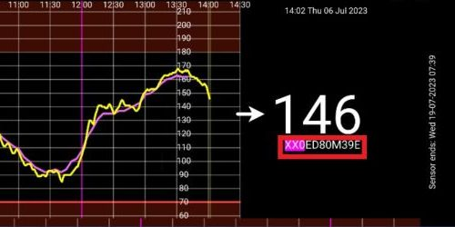

# **Freestyle Libre 3**

Freestyle Libre 3 (FSL3) 需要特殊設定才能將血糖值接收至 AAPS。 有兩種可能的方法將 Freestyle Libre 3 (FSL3) 值傳送到 AAPS。

**AndroidAPS 版本 3.2.0.1 不支援 1 分鐘讀取值。 加速和平滑處理無法與 1 分鐘讀取值搭配使用。**

下述方法使用單獨的應用程式 Juggluco 來實現此目的。 他使用 Juggluco 以接收來自傳感器的原始 1 分鐘間隔資料，然後將其傳送至 xDrip+ 或 AAPS。 可以使用 Libre 3 應用程式或直接在 Juggluco 中啟動新傳感器。 下方指南說明如何使用 Juggluco 應用程式啟動傳感器的過程。 如果傳感器是使用已登入 Libreview 帳戶啟動的，也可以在 Juggluco 和 Libre 3 應用程式之間切換作為接收器。

當傳感器使用 Libre 3 應用程式啟動時，Juggluco 也可以將資料傳送至 LibreView 以與醫療提供者共享。

在 xDrip+ 中，傳感器可以在 -40 mg/dL 至 +20 mg/dL（-2.2 mmol/l 至 +1.1 mmol/l）範圍內進行校正，以補償手動儀表讀取值與傳感器讀取值之間的差異。

## 方法 1：1 分鐘讀取值
AndroidAPS 版本 3.2.0.1 不支援 1 分鐘讀取值。 加速和平滑處理無法與 1 分鐘讀取值搭配使用。

## 方法 2：5 分鐘讀取值
此方法使用 Juggluco 接收來自傳感器的原始 1 分鐘間隔資料，然後將其傳送至 xDrip+，以平滑為 5 分鐘間隔資料，並傳送至 AAPS。

### 步驟 1：設定 Juggluco
從[此處](https://www.juggluco.nl/Juggluco/download.html)下載並安裝 Juggluco 應用程式。 按照[此處](https://www.juggluco.nl/Juggluco/libre3/)的指示操作。

確保將葡萄糖值傳送至 xDrip+：你可以在 Juggluco 的設定中配置 Juggluco 將葡萄糖值傳送至其他應用程式。 Juggluco 可以發送三種類型的廣播：**修補版 Libre 廣播** 最初由修補版 Librelink 應用程式使用，並可用於將葡萄糖值傳送至 xDrip+。

### 步驟 2：設定 xDrip

血糖值會由智慧型手機上的 xDrip+ 應用程式接收。

- 如果尚未設定，請下載 [xDrip+](https://github.com/NightscoutFoundation/xDrip) 並按照[xDrip+ 設定頁面](../CompatibleCgms/xDrip.md)上的指示操作。
- 在 xDrip+ 中選擇 "Libre2（修補版應用程式）" 作為資料來源。
- 如果需要，請在「不常見的設定」→「額外日誌紀錄設定」→「日誌紀錄的額外標籤」下輸入 "BgReading:d,xdrip libre_receiver:v"。 這將紀錄額外的錯誤訊息以便進行問題排除。

- 技術上來說，目前的血糖值每分鐘會傳送到 xDrip+。 加權平均濾波器預設會計算最近 25 分鐘內的平滑資料。 你可以在 NFC 掃描功能選單中更改此時間段。

  → 漢堡選單 → 設定 → NFC 掃描功能 → 使用 xxx 方法時平滑 Libre 3 資料

  

### 步驟 3：在 xDrip 中啟動傳感器

在 xDrip+ 中使用「啟動傳感器」和「暫不」選項啟動傳感器。 無需將手機靠近傳感器。 事實上，「啟動傳感器」不會實際啟動任何 Libre 3 傳感器，也不會與他們進行任何互動。 這僅僅是為了通知 xDrip+ 有一個新的傳感器正在提供血糖資料。 如果可用，請輸入兩個指血測量值作為初始校正。 現在，血糖值應該每 5 分鐘顯示在 xDrip+ 中。 跳過的讀取值，例如因為你離手機太遠，將不會被回填。

如果仍然沒有資料，請等待至少 15-20 分鐘。

更換傳感器後，xDrip+ 會自動偵測到新傳感器，並會刪除所有校正資料。 啟動後，你可以檢查你的指血血糖並進行新的初始校正。

### 步驟 4：配置 AndroidAPS

- 在[ConfigBuilder 的血糖來源](#Config-Builder-bg-source)中選擇 xDrip+。

- 如果 AndroidAPS 在手機處於飛行模式時無法接收血糖值，請使用「識別接收器」。
- 關閉平滑處理（已在 Xdrip+ 中完成）。

目前，當使用 Libre 3 作為血糖來源時，無法在 SMB 演算法中啟用「始終啟用 SMB」和「碳水後啟用 SMB」選項。 Libre 3 的血糖值不夠平滑，無法安全使用。

## 後續傳感器更換

1. 打開 Juggluco 並記下現有傳感器的序列號。

2. 現在，只需使用手機的 NFC 閱讀器掃描你的新傳感器。 如果過程成功開始，Juggluco 會顯示通知。
3. 當你準備停用舊傳感器時，請點擊螢幕左上角的空白區域打開 Juggluco 選單。
4. 選擇過期的傳感器並點擊「終止」。

注意：當兩個傳感器同時運作時，Juggluco 會將最近一個傳感器的資料發送至 xDrip+。 如果傳感器未經校正且讀取血糖類似，這可能會導致跳躍的血糖值被報告至 xDrip+。 如果你終止了錯誤的傳感器，可以透過掃描傳感器重新啟用他。

## 在 Libre 3 和 Juggluco 應用程式之間切換傳感器

如果傳感器是使用已登入 Libreview 帳戶啟動的，也可以在 Juggluco 和 Libre 3 應用程式之間切換作為接收器。 這需要以下步驟：

1. 從 Google Play 商店安裝 Libre 3 應用程式。
2. 使用啟動傳感器的 Libreview 帳戶設定 Libre 3 應用程式。
3. 在 Android 設定中強制停止 Juggluco 應用程式。
4. 在 Libre 3 選單中，點擊「啟動傳感器」，選擇「是」，「下一步」，然後掃描你的傳感器。
5. 幾分鐘後，血糖 值應該會顯示在 Libre 3 應用程式中。

要從 Libre 3 應用程式切換到 Juggluco，你需要透過 Android 設定強制停止 Libre 3 應用程式，然後執行步驟 1 和步驟 2。

(libre3-experiences-and-troubleshooting)=
## 經驗與問題排除

### Libre3 -> Juggluco 連線問題排除

- 確保你使用的是 Juggluco 應用程式的最新版本。
- 根據本指南檢查你的設定。
- 有時你可能需要強制停止 Libre 3 應用程式和 Juggluco 並重新啟動他。
- 停用藍牙並重新啟用。
- 稍等片刻或嘗試關閉 Juggluco。
- 低於 2.9.6 的 Juggluco 舊版本不會將後續資料從 Libre3 傳感器發送到連線的設備（例如：WearOS 上的 Juggluco）。 你可能需要在修補版 Libre3 應用程式中點擊「重新發送資料」（Juggluco 選單）。

### 進一步幫助

原始說明：[jkaltes 網站](https://www.juggluco.nl/Juggluco/libre3/)

其他 Github 倉庫：[Github 連結](https://github.com/maheini/FreeStyle-Libre-3-patch)
