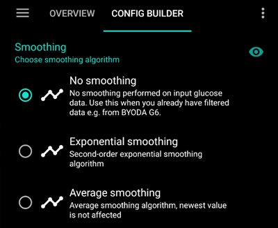

# 平滑血糖資料

如果 **血糖** 資料不穩定/干擾，**AAPS** 可能會錯誤地注射胰島素，導致血糖過高或過低。 如果你發現你的連續血糖監測（CGM）資料出錯，應在問題解決前暫停循環。 根據你的 CGM，這些問題可能是由於 **AAPS** 中的 CGM 韌體設定問題（如下文進一步說明）；或是 CGM 傳感器位置問題（這可能需要更換 CGM 傳感器）。

某些 CGM 系統內部有演算法可以檢測讀取中的干擾等級，**AAPS** 可以利用這些資訊來避免在血糖資料不準確時發出 SMB。 然而，部分 CGM 不會傳送此資料，對於這些血糖來源，「始終啟用 SMB」和「碳水化合物後啟用 SMB」會為了安全起見被停用。

## 在 AAPS 中平滑資料

自 **AAPS** 版本 3.2 起，**AAPS** 提供了在 **AAPS** 中平滑資料的選項，而不是在 CGM 應用程式中。 在 [組態建置工具](../SettingUpAaps/ConfigBuilder.md) 中有三個可用選項。

### 指數平滑

這是建議的起始選項，因為他最積極解決干擾問題，並重寫最近的數值。

### 平均平滑

此選項與先前在某些 CGM 平台上實作的反向平滑相似。 他對血糖值的近期變化反應更敏感，因此更容易對干擾的 CGM 資料反應不正確。

### 無平滑處理

僅在你的 CGM 資料在傳輸到 **AAPS** 之前已由收集應用程式正確平滑時使用此選項。

## 平滑處理建議

|                       | 指數平滑  |  平均平滑  | 無平滑處理 |
| --------------------- |:-----:|:------:|:-----:|
| G5 和 G6               | 如果有干擾 |        | 建議使用  |
| G7                    | 如果有干擾 | 如果穩定的話 |       |
| Libre 1 或 Juggluco    | 建議使用  |        |       |
| Libre 2 和 3 使用 xDrip+ |       |        | 建議使用  |

### Dexcom 傳感器

#### 自己動手打造您的 Dexcom 應用程式
當使用 [BYODA](#DexcomG6-if-using-g6-with-build-your-own-dexcom-app) 時，你的血糖資料是平滑且一致的。 此外，您可以利用 Dexcom 的回彈平滑功能。 使用 SMBs 並沒有任何限制，因為噪音級別資料會與 AAPS 共享。

#### xDrip+ 與 Dexcom G6 或 Dexcom ONE 配合使用
干擾資料和平滑的血糖讀取僅在你使用 xDrip+ 的 [原生模式](https://navid200.github.io/xDrip/docs/Native-Algorithm) 時與 AAPS 分享。 使用原生模式時，使用 SMBs 並沒有任何限制。

#### Dexcom G6 或 Dexcom ONE 與 xDrip+ 陪伴模式
使用此方法時，噪音級別資料不會與 AAPS 共享。 因此，「始終啟用 SMB」和「在碳水化合物後啟用 SMB」是停用的。

### Freestyle Libre 傳感器

#### xDrip+ 與 FreeStyle Libre 配合使用
所有 FreeStyle Libre 系統 (FSL1, FSL2 或 FSL3) 均不傳送任何有關讀取中檢測到的噪音等級的訊息，因此對於使用 FreeStyle Libre 的所有設置「始終啟用 SMB」和「在碳水化合物後啟用 SMB」都被停用。 此外，許多人報告說 FreeStyle Libre 經常產生嘈雜的資料。
