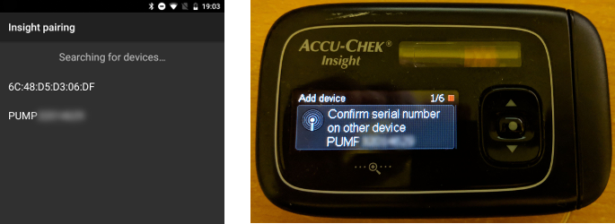
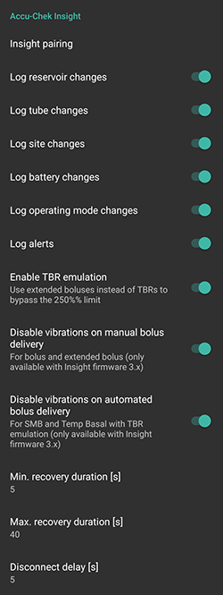
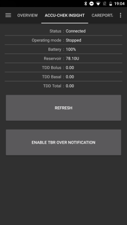
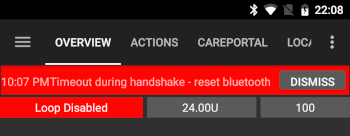

# Accu-Chek Insight 幫浦

**此軟體是DIY人工胰臟解決方案的一部分，不是產品， 你需要閱讀、學習並暸解整個系統，包括如何使用他。 他並不是為你自動管理所有糖尿病控制，而是 讓你在投入必要時間的前提下，提升糖尿病管理和生活品質。 不要急於使用， 請給自己時間學習。 你對自己 所做的決定負全部責任。**

---
***警告：** 如果你曾經使用過 Insight 與 **SightRemote**，請**更新至最新 AAPS 版本**並**卸載 SightRemote**。*
---

## 硬體和軟體需求

* 一台 Roche Accu-Chek Insight 幫浦（任何韌體都適用）

注意：AAPS 將資料寫入**幫浦的第一個基礎率設定檔**。
* 一台 Android 手機（基本上每個 Android 版本都適用於 Insight，但請檢查[模組](../Getting-Started/ComponentOverview)頁面了解運作 AAPS 所需的 Android 版本）。
* 你的手機上安裝了 AAPS 應用程式

## 設定

* Insight 幫浦一次只能連線一個裝置。 如果你之前使用過 Insight 遙控器（血糖機），必須從幫浦的配對裝置列表中移除該血糖機：選單 > 設定 > 通訊 > 移除裝置

   

* 在 AAPS 應用程式的[組態建置工具](../SettingUpAaps/ConfigBuilder.md)中，選擇 Accu-Chek Insight 作為幫浦部分。

   

* Tap the cog-wheel to open Insight settings.
* 在設定中，點擊螢幕頂部的“Insight 配對”按鈕。 你應該會看到附近所有藍牙裝置的列表（左下方）。
* On the Insight pump, go to Menu > Settings > Communication > Add Device. The pump will display the following screen (below right) showing the serial number of the pump.

   

* 返回手機，點擊藍牙裝置列表中的幫浦序列號。 然後點擊配對以確認。

   

* Both the pump and phone will then display a code. Check that the codes are the same on both devices and confirm on both the pump and the phone.

   

* 成功！ 配對成功後，為自己點個讚。

   

* 要檢查是否一切正常，返回 AAPS 中的組態建置工具並點擊 Insight 幫浦旁的齒輪圖示進入 Insight 設定，然後點擊 Insight 配對，你將看到一些關於幫浦的資訊：

   

注意：幫浦和手機之間不會有永久連線。 只有在需要時（例如設置臨時基礎率、進行注射、讀取幫浦歷史記錄時）才會建立連線。 否則手機和幫浦的電池會消耗過快。

(Accu-Chek-Insight-Pump-settings-in-aaps)=
## AAPS 設定
**注意：現在可以（僅在 AAPS v2.7.0 及以上版本）使用「始終使用基礎絕對值」，如果您想使用 Autotune 與 Insight 幫浦，即使在 Nightscout 中啟用同步。 **（在 AAPS 中轉到[偏好設定 > NSClient > 進階設定](../SettingUpAaps/Preferences.md#advanced-settings-nsclient)）。

   

在 AAPS 的 Insight 設定中，你可以啟用以下選項：
* "Log reservoir changes": This will automatically record an insulin cartridge change when you run the "fill cannula" program on the pump.

* "Log tube changes": This adds a note to the AAPS database when you run the "tube filling" program on the pump.

* "Log site change": This adds a note to the AAPS database when you run the "cannula filling" program on the pump. **注意：更換注射點也會重置自動敏感度調整（Autosens）。 **

* "Log battery changes": This records a battery change when you put a new battery in the pump.

* "Log operating mode changes": This inserts a note in the AAPS database whenever you start, stop or pause the pump.

* "Log alerts": This records a note in the AAPS database whenever the pump issues an alert (except reminders, bolus and TBR cancellation - those are not recorded).

* "Enable TBR emulation": The Insight pump can only issue temporary basal rates (TBRs) up to 250%. To get round this restriction, TBR emulation will instruct the pump to deliver an extended bolus for the extra insulin if you request a TBR of more than 250%.

  **Note: Just use one extended bolus at a time as multiple extended boluses at the same time might cause errors.**

* "停用手動注射時的震動"：這會在手動注射（或延長注射）時停用 Insight 幫浦的震動。 此設定僅在最新的 Insight 韌體（3.x）版本中可用。

* "停用自動注射時的震動"：這會在自動注射（SMB 或 TBR 仿真）時停用 Insight 幫浦的震動。 此設定僅在最新的 Insight 韌體（3.x）版本中可用。

* "恢復時間"：這定義了在連線失敗後，AAPS 將等待多長時間後再嘗試連線。 你可以選擇0到20秒。 如果你遇到連線問題，請選擇較長的等待時間。   Example for min. recovery duration = 5 and max. recovery duration = 20   no connection -> wait <b>5</b> sec.    retry -> no connection -> wait <b>6</b> sec.    retry -> no connection -> wait <b>7</b> sec.    retry -> no connection -> wait <b>8</b> sec.  ... 無連線 -> 等待**5**秒。    
  再試 -> 無連線 -> 等待**6**秒。    
  再試 -> 無連線 -> 等待**7**秒。    
  再試 -> 無連線 -> 等待**8**秒。

* "斷線延遲"：這定義了在操作完成後 AAPS 將等待多少秒後再中斷與幫浦的連線。 預設值為5秒。

For periods when pump was stopped AAPS will log a temp. basal rate with 0%.

在 AAPS 中，Accu-Chek Insight 標籤顯示幫浦的目前狀態，並有兩個按鈕：
* "Refresh": Refreshes pump status
* "啟用/停用 TBR 通知"：標準的 Insight 幫浦在 TBR 結束時會發出警報。 此按鈕讓你無需配置軟體即可啟用或停用此警報。

   

## Settings in the pump

配置幫浦中的警報如下：
* 選單 > 設定 > 裝置設定 > 模式設定 > 靜音 > 信號 > 聲音
* 選單 > 設定 > 裝置設定 > 模式設定 > 靜音 > 音量 > 0（移除所有條）
* 選單 > 模式 > 信號模式 > 靜音

這將使幫浦靜音，允許 AAPS 決定警報是否與你相關。 如果 AAPS 未確認警報，其音量將增加（先是嗶聲，然後是震動）。

(Accu-Chek-Insight-Pump-vibration)=
### 震動

Depending on the firmware version of your pump, the Insight will vibrate briefly every time a bolus is delivered (for example, when AAPS issues an SMB or TBR emulation delivers an extended bolus).

* 韌體 1.x：設計上沒有震動。
* 韌體 2.x：無法停用震動。
* 韌體 3.x：AAPS 安靜地發送注射。 (最低[版本 2.6.1.4](../Maintenance/ReleaseNotes.md#version-2614))

Firmware version can be found in the menu.

## 電池更換

Insight 在循環使用期間的電池壽命範圍為 10 到 14 天，最大 20 天。 報告此電池壽命的用戶使用的是 Energizer 鋰電池。

Insight 幫浦有一個小型內部電池，可在更換可拆卸電池時維持時鐘等重要功能的運作。 如果更換電池的時間過長，內部電池可能會耗盡電力，時鐘將重置，並且在插入新電池後你需要重新設置時間和日期。 如果發生這種情況，更換電池前在 AAPS 中的所有記錄將不再包括在計算中，因為無法正確識別正確的時間。

(Accu-Chek-Insight-Pump-insight-specific-errors)=
## Insight 特定錯誤

### Extended bolus

Just use one extended bolus at a time as multiple extended boluses at the same time might cause errors.

### 逾時

有時 Insight 幫浦在連線設置期間可能不會回應。 在這種情況下，AAPS 將顯示以下訊息：“交握時逾時 - 重置藍牙”。

In this case turn off bluetooth on pump AND smartphone for about 10 seconds and then turn it back on.

## Crossing time zones with Insight pump

For information on traveling across time zones see section [Timezone traveling with pumps](../DailyLifeWithAaps/TimezoneTraveling-DaylightSavingTime.md#insight).

