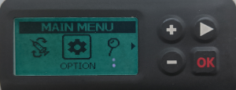

# DanaRS 和 Dana-i 幫浦

_這些說明適用於配置 2017 年之後的 DanaRS 或更新的 Dana-i 幫浦。 如果您擁有原始的 DanaR，請訪問[DanaR 胰島素幫浦](./DanaR-Insulin-Pump.md)。_

**Dana RS v3 韌體從 AAPS 版本 2.7 開始支援使用。**

**Dana-i 從 AAPS 版本 3.0 開始支援使用。**

* In DanaRS/i pump "BASAL A" is used by the app. Existing data gets overwritten.

(DanaRS-Insulin-Pump-pairing-pump)=
## Pairing pump

* 在 AAPS 主畫面上點擊左上角的選單，進入組態建置工具。
* 在幫浦部分選擇「Dana-i/RS」。
* Click on gear wheel to get directly to the pump settings or return to homescreen.

  

* 進入「DANA-i/RS」標籤。
* Select preferences menu by tapping the 3 dots in the top right.
* 選擇「Dana-i/RS 偏好設定」。
* Click on "Selected pump".
* In the pairing window click on the entry for your pump.

  

* **你必須在幫浦上確認配對！ ** 這跟其他藍牙配對的方式一樣（例如手機與汽車音響）。

  

* Follow the pairing process based on the type and firmware of your pump:

   * For DanaRS v1 select pump password in preferences and set your password.
   * DanaRS v3 中，你需要在 AAPS 配對對話框中輸入幫浦上顯示的兩段數字和字母序列。
   * Dana-i 中，會出現標準的 Android 配對對話框，你需要輸入幫浦上顯示的 6 位數字。

* Select Bolus Speed to change the default bolus speed used (12sec per 1u, 30sec per 1u or 60sec per 1u).
* Set basal step on pump to 0.01 U/h using Doctors menu (see pump user guide).
* Set bolus step on pump to 0.05 U/h using Doctors menu (see pump user guide).
* Enable extended boluses on pump

(DanaRS-Insulin-Pump-default-password)=

### Default password

* 對於韌體版本 v1 和 v2 的 DanaRS，預設密碼為 1234。
* 對於韌體版本 v3 或 Dana-i，預設密碼來自製造日期，計算方式為 MMDD，其中 MM 是月份，DD 是製造日期（例如「0124」代表 1 月 24 日）。

  * From MAIN MENU select REVIEW then open SHIPPING INFORMATION from the sub menu
  * 第三個項目是製造日期。
  * 對於 v3/i，該密碼僅用於鎖定幫浦選單。 這不會用於通訊，因此不需要在 AAPS 中輸入該密碼。

(DanaRS-Insulin-Pump-change-password-on-pump)=
## Change password on pump

* 按下幫浦上的「OK」按鈕
* 在主選單中選擇「選項」（按下箭頭按鈕多次向右移動）

  

* 在選項選單中選擇「用戶選項」

  

* 使用箭頭按鈕向下捲動至「11. 密碼」 密碼 password"

  

* 按下「OK」進入舊密碼。

* 輸入**舊密碼**（預設密碼見[上方](#default-password)）並按下 OK。

  

* 如果此處輸入了錯誤的密碼，將不會顯示失敗訊息！
* 設置**新密碼**（使用 + 和 - 按鈕更改數字 / 使用箭頭按鈕向右移動）。

  

* 按下「OK」按鈕確認。
* 按下 OK 以儲存設定。

  

* Move down to "14. EXIT" and press OK to exit.

  

(DanaRS-Insulin-Pump-dana-rs-specific-errors)=
## Dana RS 特定錯誤

### 胰島素注射過程中的錯誤
如果在注射胰島素過程中 AAPS 與 Dana RS 之間的連線中斷（例如，你在 Dana RS 幫浦注射胰島素時走開手機），你將看到以下訊息並聽到警報聲。

* In most cases this is just a communication issue and the correct amount of insulin is delivered.
* Check in pump history (either on the pump or through Dana tab > pump history > boluses) if correct bolus is given.
* 如果您希望，請在 [治療選項卡](../DailyLifeWithAaps/AapsScreens.md#bolus--carbs) 中刪除錯誤的條目。
* Real amount is read and recorded on next connect. To force this press BT icon on dana tab or just wait for next connect.

## 更換手機時的特別注意事項

更換新手機時，需要進行以下步驟：
* [Export settings](../Maintenance/ExportImportSettings.md) on your old phone
* 將設定從舊手機傳輸至新手機

### DanaRS v1
* **手動配對** Dana RS 與新手機
* 由於幫浦連線設定也會匯入，新手機上的 AAPS 已經「認識」幫浦，因此不會啟動藍牙掃描。 因此必須手動將新手機與幫浦配對。
* 在新手機上安裝 AAPS。
* [Import settings](../Maintenance/ExportImportSettings.md) on your new phone

### DanaRS v3, Dana-i
* 開始配對程序，如[上方](#pairing-pump)所述。
* Sometimes it may be necessary to clear pairing information in AAPS by long-click BT icon on Dana-i/RS tab.

## Timezone traveling with Dana RS pump

For information on traveling across time zones see section [Timezone traveling with pumps](../DailyLifeWithAaps/TimezoneTraveling-DaylightSavingTime.md#danarv2-danars).
