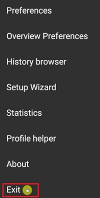

# Diaconn G8 胰島素幫浦

## Insulin Pump Bluetooth Pairing

- Click on the hamburger menu in the top left corner.

- Click on Config Builder.

- After selecting the Diaconn G8 Pump click on the Settings icon (cog wheel).

- Choose Selected pump.

- Select your insulin pump’s model number once it appears in the list.

- There are two options to check your model number:

1. 幫浦背面的 SN 編號的最後五位數字。
2. 點擊 O 按鈕 > 資訊 > 藍牙 > 最後五位數字。

- Once you select your pump, a window appears asking for a pin code. Enter the pin number displayed on your pump to complete the connection.

 

## Pump status check and log synchronization

- Once your pump is connected, click on the Bluetooth symbol to check the status and to synchronize logs.

## 藍牙問題排除

**What to do in the case of an unstable Bluetooth connection with the pump.**

### Method 1 ) Check the pump again after AAPS application is completed.

- Click on the 3 dots button on the top right.

- Click on Exit.

### 方法 2) 如果第一種方法無效，中斷藍牙然後重新連線。

- 按住頂部的藍牙按鈕約 3 秒鐘。

- Click on the Setting button on the paired Diaconn G8 Insulin pump.

- Unpair.

- Repeat the Bluetooth pairing process for the pump (see above).

## 更多資訊

### Diaconn G8 胰島素幫浦選項設定

- 設定管理器 > 幫浦 > Diaconn G8 > 設定
- DIACONN G8 在頂部> 右上角三點按鈕 > Diaconn G8 偏好設定

- 如果**記錄儲液瓶更換**選項被啟用，則相關細節會在發生「胰島素更換」事件時自動上傳至 careportal。
- 如果**紀錄針頭更換**選項已啟用，當發生「換點」事件時，相關詳細資料會自動上傳到照護入口。
- 如果**紀錄導管更換**選項已啟用，當發生「導管更換」事件時，相關詳細資料會自動上傳到照護入口。
- 如果**紀錄電池更換**選項已啟用，當發生「電池更換」事件時，相關詳細資料會自動上傳到照護入口，並且「幫浦電池更換」按鈕會在「操作」頁籤中停用。 （注意：更換電池前，請先停止所有進行中的注射功能。）

### 延長注射功能

- If you use extended bolus it will disable closed loop.
- 請參閱[本頁](../DailyLifeWithAaps/ExtendedCarbs.md#why-extended-boluses-wont-work-in-a-closed-loop-environment)了解為何延長注射功能無法在循環模式下運作的詳情。
