# Medtrum Nano / 300U

These instructions are for configuring the Medtrum insulin pump.

此軟體是 DIY 人工胰臟解決方案的一部分，並非產品，你需要閱讀、學習並了解系統，包括如何使用他。 你需要對自己使用的結果負完全責任。

## Pump capabilities with AAPS
* 支援所有循環功能（SMB、TBR等）
* 自動夏令時間（DST）與時區處理
* AAPS驅動不支援延長注射

## 硬體和軟體需求
* **與Medtrum幫浦基座及儲液瓶相容的修補版**
    - 目前支援：
        - Medtrum TouchCare Nano與幫浦基座參考：**MD0201**和**MD8201**。
        - Medtrum TouchCare 300U與幫浦基座參考：**MD8301**。
        - 如果你擁有不支援的型號，並願意捐贈硬體或協助測試，請透過discord與我們聯繫[這裡](https://discordapp.com/channels/629952586895851530/1076120802476441641)。
* 版本 3.2.0.0 或更新的 AAPS 以[建構 APK](../SettingUpAaps/BuildingAaps.md) 說明進行構建和安裝。
* **相容的 Android 手機** 需具備 BLE 藍牙連線
    - 請參見 AAPS [發行說明](../Maintenance/ReleaseNotes.md)
* [**連續血糖監測儀（CGM）**](../Getting-Started/CompatiblesCgms.md)

## 開始之前

**安全第一** 不要在無法修復錯誤的環境中進行此過程（需要備用修補版、胰島素和幫浦控制裝置）。

**PDM與Medtrum App將無法與AAPS啟動的修補版一起運作。 ** 之前你可能使用PDM或Medtrum App向你的幫浦發送指令。 For security reasons you can only use the activated patch with the device or app that was used to activate it.

*這並不意味著你應該丟棄PDM。 建議將他放在安全的地方作為備用，以防緊急情況發生，例如手機遺失或AAPS無法正常運作。*

**你的幫浦在未連線至AAPS時不會停止輸送胰島素** 預設的基礎率已經在幫浦上設定，並在目前啟動的設定檔中定義。 只要AAPS運作正常，他將發送臨時基礎率指令，最多持續120分鐘。 如果由於任何原因幫浦未接收到新指令（例如由於幫浦與手機距離過遠導致通訊中斷），當臨時基礎率結束時，幫浦將回到預設的基礎率。

**AAPS 不支援 30 分鐘基礎率設定檔。 ** **AAPS 設定檔不支援 30 分鐘的基礎率時間框架** 如果你是 AAPS 新手並首次設置基礎率設定檔，請注意，基礎率從半小時開始的設定不被支援，你需要調整你的基礎率設定檔以從整點開始。 例如，如果你的基礎率為 1.1 單位，並於 09:30 開始，持續時間為 2 小時，於 11:30 結束，這將無法正常工作。 你需要將此 1.1 單位的基礎率更改為 9:00-11:00 或 10:00-12:00 的時間範圍。 儘管Medtrum幫浦硬體本身支援30分鐘基礎率增量，但AAPS目前無法在其算法中考慮這些增量。

**AAPS不支援0U/h的設定檔基礎率** 儘管Medtrum幫浦支援零基礎率，但AAPS使用設定檔基礎率的倍數來確定自動治療，因此無法使用零基礎率。 可以透過“中斷幫浦”功能或停用循環/臨時基礎率或暫停循環/臨時基礎率的組合來實現臨時的 0 單位基礎率。

## 設定

注意：當使用AAPS啟動修補版時，**必須**停用所有其他可與Medtrum幫浦基座通訊的裝置。 例如，啟動的PDM與Medtrum App。 請確保你已準備好幫浦基座及其序號，進行新修補版的啟動。

### 步驟1：選擇Medtrum幫浦

#### 選項 1：新安裝

如果你是首次安裝AAPS，**安裝嚮導**將引導你完成AAPS的安裝過程。 當你到達幫浦選擇時，請選擇「Medtrum」。

If in doubt you can also select “Virtual Pump” and select “Medtrum” later, after setting up AAPS (see option 2).

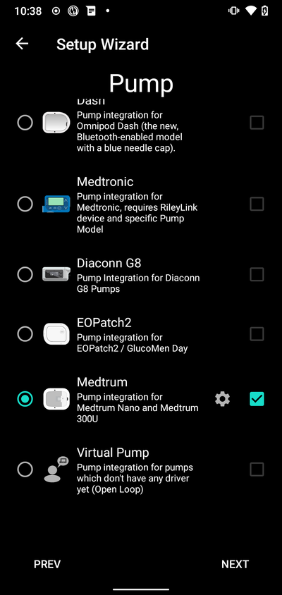

#### 選項 2：組態建置工具

在現有安裝中，您可以在[組態設置工具](../SettingUpAaps/ConfigBuilder.md#pump)中選擇**Medtrum** 幫浦：

在左上角的**漢堡選單**中選擇**組態建置工具**\ ➜\ **幫浦**\ ➜\ **Medtrum**，選擇**啟用按鈕**標題為**Medtrum**。

勾選**齒輪圖示**旁的**複選框**，將允許Medtrum總覽顯示在AAPS介面中的標籤中，標題為**Medtrum**。 勾選此框將便於你在使用AAPS時存取Medtrum指令，非常建議如此設置。

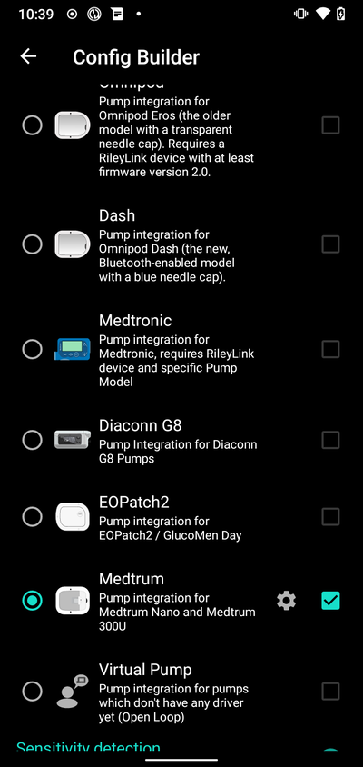

### 步驟2：變更Medtrum設置

點擊組態建置工具中Medtrum模組的**齒輪圖示**進入Medtrum設置。

#### 序號：

在此輸入幫浦基座上的序號。 請確保序號正確且沒有空格（可使用大寫或小寫字母）。

注意：此設置只能在無活動修補版時更改。

#### 警報設置

***Default: Beep.***

This setting changes the way that the pump will alert you when there is a warning or error.

- Beep > The patch will beep on alarms and warnings
- Silent > The patch will not alert you on alarms and warnings

注意：在靜音模式下，AAPS仍會根據手機音量設置發出警報。 如果你未回應警報，修補版最終會開始嗶聲。

#### Notification on pump warning

***Default: Enabled.***

此設置更改AAPS在非關鍵性幫浦警告時顯示通知的方式。 啟用後，當幫浦出現警告時，手機上會顯示通知，包括：
    - 電池電量低
    - Low reservoir (20 Units)
    - 修補版即將過期警告

無論如何，這些警告也會顯示在Medtrum總覽畫面中的[活動警報](#active-alarms)下。

#### 修補版過期

***Default: Enabled.***

此設置更改修補版的行為。 啟用後，修補版將在3天後過期，並在開啟聲音警告時發出聲音。 在3天8小時後，修補版將停止運作。

If this setting is disabled, the patch will not warn you and will continue running until the patch battery or reservoir runs out.

#### Pump expiry warning

***Default: 72 hours.***

此設置更改過期警告的時間，當[修補版過期](#patch-expiration)啟用時，AAPS將在啟動後的設定小時內發送通知。

#### Hourly Maximum Insulin

***Default: 25U.***

此設置更改每小時最多輸送的胰島素量。 如果此限制被超過，修補版將暫停並發出警報。 可以透過點擊總覽選單中的重置按鈕來重置此警報，請參閱[重置警報](#reset-alarms)。

Set this to a sensible value for your insulin requirements.

#### 每日最大胰島素輸送量

***Default: 80U.***

此設置更改每日最多輸送的胰島素量。 如果此限制被超過，修補版將暫停並發出警報。 可以透過點擊總覽選單中的重置按鈕來重置此警報，請參閱[重置警報](#reset-alarms)。

Set this to a sensible value for your insulin requirements.

### 步驟2b：AAPS警報設置

進入偏好設定

#### Pump:

##### BT Watchdog

進入偏好設定並選擇**幫浦**：

##### BT Watchdog

This setting will try to work around any BLE issues. It will try to reconnect to the pump when the connection is lost. It will also try to reconnect to the pump when the pump is unreachable for a certain amount of time.

Enable this setting if you experience frequent connection issues with your pump.

#### 本地警報：

進入偏好設定並選擇**本地警報**：

##### Alert if pump is unreachable

***Default: Enabled.***

當啟用Medtrum驅動時，此設置強制啟用。 It will alert you when the pump is unreachable. This can happen when the pump is out of range or when the pump is not responding due to a defective patch or pumpbase, for example when water leaks between the pumpbase and the patch.

For safety reasons this setting cannot be disabled.

##### Pump unreachable threshold [min]

***Default: 30 min.***

此設置更改AAPS發出幫浦無法使用警報的時間。 這可能發生在幫浦超出範圍或幫浦因修補版或幫浦基座故障而無法回應，例如當水滲入幫浦基座與修補版之間時。

此設定可在使用Medtrum幫浦時更改，但建議出於安全理由設為30分鐘。

### Step 3: Activate patch

**在繼續之前：**
- 準備好你的Medtrum Nano幫浦基座與儲液瓶修補版。
- 確保 AAPS 正確設置，並且已啟動[配置](../DailyLifeWithAaps/ProfileSwitch-ProfilePercentage.md)。
- 停用其他可與Medtrum幫浦連線的裝置（PDM與Medtrum App）

#### Activate patch from the Medtrum overview Tab

在AAPS介面中導航至[Medtrum標籤](#overview)，然後按下右下角的**更換修補版**按鈕。

如果修補版已啟動，系統將提示你先停用該修補版。 請參閱[停用修補版](#deactivate-patch)。

Follow the prompts to fill and activate a new patch. Please note - it is important to only connect the pumpbase to the reservoir patch at the step when you are prompted to do so. **你應在系統提示啟動過程時（填充完成後）才將幫浦放在身體上並插入套管。 **

##### 開始啟動

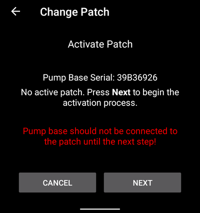

At this step, double check your serial number and make sure the pumpbase is not connected to the patch yet.

按**下一步**繼續。

##### 填充修補版

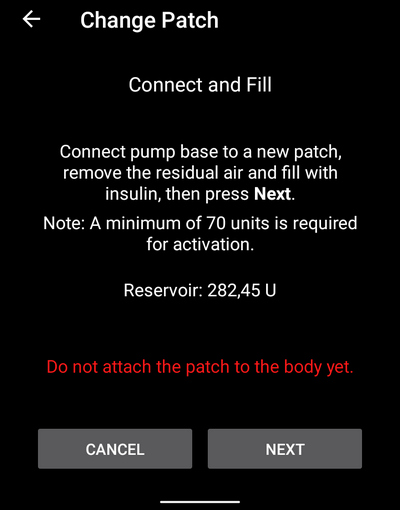

當偵測到貼片並填充至少 70 單位的胰島素後，會出現「按下 **下一步**」的提示。

##### Prime the patch

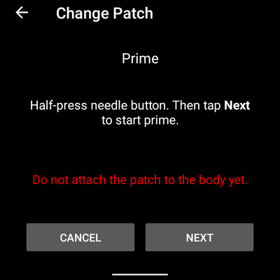

不要移除安全鎖，並按下修補版上的針頭按鈕。

按**下一步**開始填充

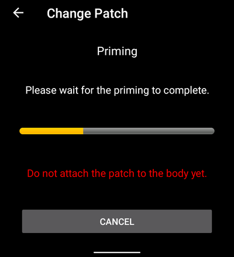

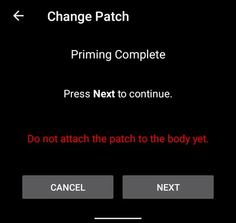

填充完成後，按**下一步**繼續。

##### 填充修補版

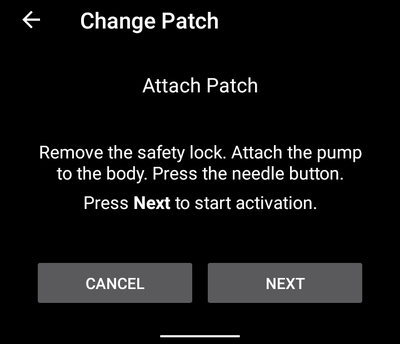

清潔皮膚，撕下貼紙並將修補版附著在身體上。 移除安全鎖，並按下修補版上的針頭按鈕插入套管。

按**下一步**啟動修補版。

##### Activate Patch

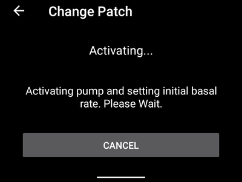

啟動完成後，將顯示以下畫面

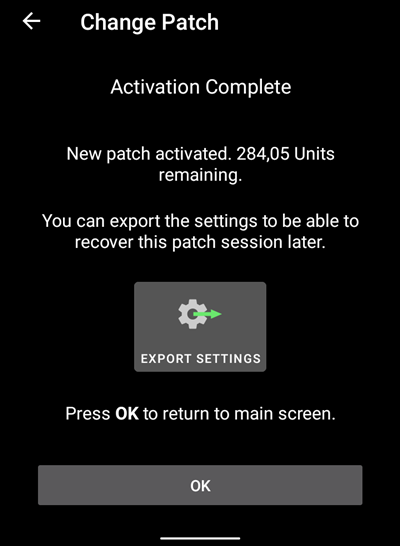

按**確定**返回主畫面。

### 停用修補版

要停用目前啟動的修補版，請前往AAPS介面中的[Medtrum標籤](#overview)，然後按下**更換修補版**按鈕。

You will be asked to confirm that you wish to deactivate the current patch. **請注意，此操作無法恢復。 **當停用完成後，你可以按下**下一步**繼續啟動新修補版的過程。 如果你尚未準備好啟動新修補版，請按下**取消**返回主畫面。

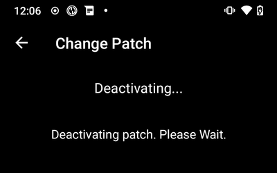

如果Android APS無法停用修補版（例如因為幫浦基座已從儲液瓶修補版中移除），你可以按下**丟棄**以忘記目前修補版會話，並啟動新修補版。

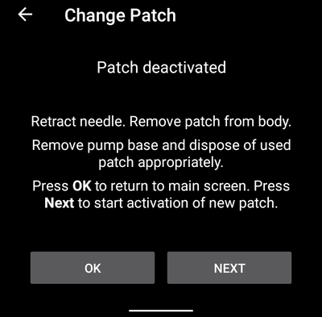

停用完成後，按**確定**返回主畫面，或按**下一步**繼續啟動新修補版的過程。

### Resume interrupted activation

如果修補版啟動過程被中斷，例如由於手機電量耗盡，你可以前往AAPS介面中的Medtrum標籤，並按下**更換修補版**按鈕來恢復啟動過程。

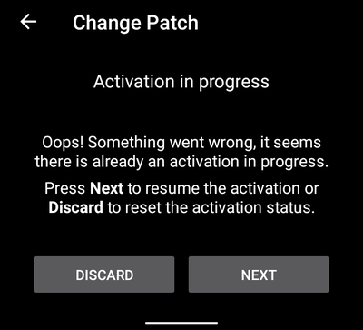

按**下一步**繼續啟動過程。 按**丟棄**丟棄目前修補版會話，並啟動新修補版。

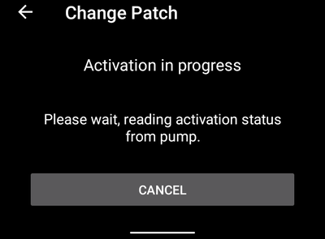

驅動將嘗試確定目前的修補版啟動狀態。 如果成功，他將進入目前步驟的啟動進度。

## Overview

The overview contains the current status of the Medtrum patch. It also contains buttons to change the patch, reset alarms and refresh the status.

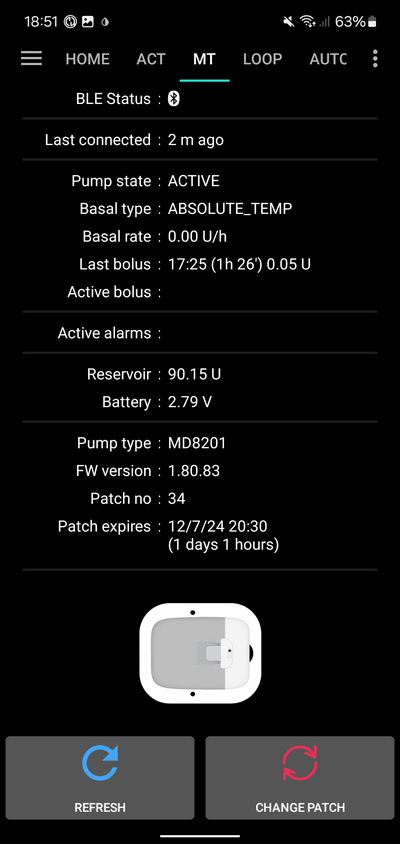

##### BLE Status:

This shows the current status of the Bluetooth connection to the pumpbase.

##### 上次連線：

This shows the last time the pump was connected to AAPS.

##### Pump state:

這顯示了幫浦的目前狀態。 例如：
    - ACTIVE : The pump is activated and running normally
    - 停止：修補版未啟動

##### 基礎率類型：

This shows the current basal type.

##### 基礎率：

這顯示了目前的基礎率。

##### Last bolus:

This shows the last bolus that was delivered.

##### Active bolus:

This shows the active bolus that is currently being delivered.

##### 目前警報：

這顯示了目前活動中的警報。

##### Reservoir:

This shows the current reservoir level.

##### 電池：

這顯示了修補版的目前電池電壓。

##### Pump type:

This shows the current pump type number.

##### 韌體版本：

This shows the current firmware version of the patch.

##### Patch no:

這顯示了啟動的修補版序列號。 每次啟動新修補版時，這個號碼會遞增。

##### 修補版過期：

This shows the date and time when the patch will expire.

##### 重新整理：

This button will refresh the status of the patch.

##### 更換修補版：

此按鈕將啟動更換修補版的過程。 請參閱[啟動修補版](#activate-patch)以獲取更多資訊。

### 重置警報

The alarm button will appear on the overview screen when there is an active alarm that can be reset. Pressing this button will reset the alarms and resume insulin delivery if the patch has been suspended due to the alarm. E.g. when suspended due to a maximum daily insulin delivery alarm.

按下**重置警報**按鈕以重置警報並恢復正常運作。

## 問題排除

### 連線問題

如果你遇到連線逾時或其他連線問題：
- 在AAPS的Android應用程式設置中：將定位權限設置為「始終允許」。

### Activation interrupted

如果啟動過程被中斷，例如手機電量耗盡或手機當機。 你可以前往更換修補版畫面，並按照[恢復中斷的啟動](#resume-interrupted-activation)中的步驟繼續啟動過程。

### 防止修補版故障

修補版可能會出現多種錯誤。 為防止頻繁的錯誤：
- Make sure the pumpbase is properly seated in the patch and no gaps are visible.
- 填充修補版時，請勿對活塞施加過大的力量。 不要嘗試填充超過適用於你的型號的最大容量。

## 如何尋求協助

所有Medtrum驅動的開發工作均由社群**志願者**完成；請記住這一點，並在請求協助之前，遵循以下指導原則：

-  **等級 0：** 閱讀此文件的相關部分，以確保你了解遇到困難的功能應如何工作。
-  **第一層：**如果你仍遇到無法透過此文件解決的問題，請前往**Discord**上的*#Medtrum*頻道，使用[此邀請連結](https://discord.gg/4fQUWHZ4Mw)。
-  **第二層：**搜尋現有問題，看看你的問題是否已在[問題頁面](https://github.com/nightscout/AAPS/issues)中報告 如果存在，請確認/評論/添加你的問題資訊。 如果沒有，請建立一個[新問題](https://github.com/nightscout/AndroidAPS/issues)並附上[您的日誌文件](../GettingHelp/AccessingLogFiles.md)。
-  **保持耐心——我們社群中的大多數成員都是善良的志願者，解決問題通常需要使用者和開發者雙方的時間和耐心。**
