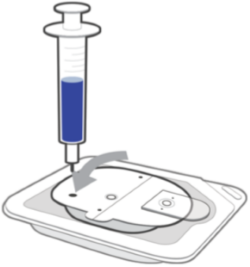
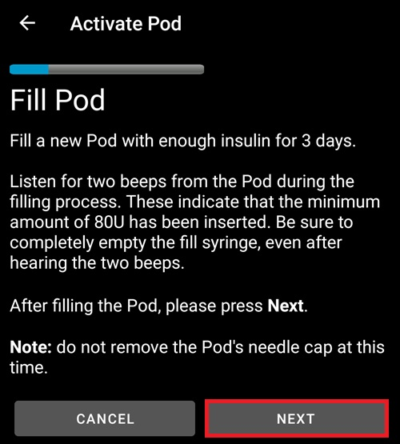
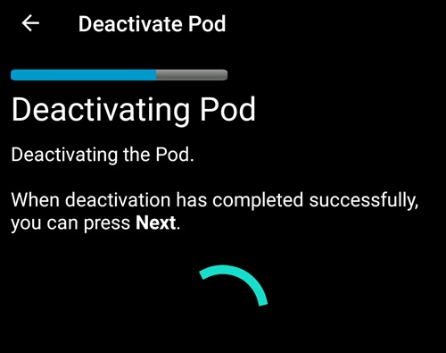
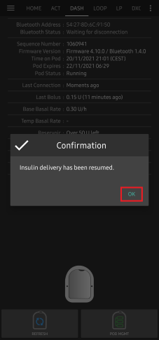

- - -
orphan: true
- - -

# Omnipod DASH

這些指示是用於設定**Omnipod DASH**世代幫浦**(不適用於 Omnipod Eros)**，可作為**AAPS**版本 3.0的一部分。

## Omnipod DASH 規格

以下是**Omnipod DASH**（簡稱「DASH」）的規格，以及它與**Omnipod EROS**（簡稱「EROS」）的區別：

* DASH Pods 具有藍色針蓋（EROS 則有透明針蓋）。 這兩種 Pod 在物理尺寸上是相同的。
*  DASH 不需要 BLE 連結/橋接設備（無需 RileyLink、OrangeLink 或 EmaLink）。
* DASH 的藍牙連線僅在需要時使用，並在發送指令後立即中斷連線！
* 使用DASH時再也不會出現「無法連線到連結設備/ Pod 」的錯誤。
* **AAPS**將等候 Pod 的可讀取性以發送指令。
* Pod 啟動時，**AAPS**將尋找並連接到新的DASH Pod 。
* 預期範圍：5-10公尺（依個人情況而異）。

警告：目前報告有以下組合的藍牙連線問題**AAPS** / DASH / Android 15。 **AAPS** 不應與 Android 15 和 DASH 一起使用，除非使用者已檢查以下[**清單**](https://docs.google.com/spreadsheets/u/1/d/e/2PACX-1vScCNaIguEZVTVFAgpv1kXHdsHl3fs6xT6RB2Z1CeVJ561AvvqGwxMhlmSHk4J056gMCAQE02sAWJvT/pubhtml?gid=683363241&single=true)並確認其手機不是已知的報告問題。 **AAPS** 目前正在努力解決此問題。

## 硬體/軟體要求

* DASH以藍色針頭蓋識別。

* **相容的Android手機**需要具備 BLE 藍牙連線  
  請注意，**AAPS** Omnipod Dash 驅動程式在每次發送命令時會透過藍牙連接 DASH，並在之後中斷連線。 藍牙連接可能會受到與運行**AAPS**的手機連接的其他藍牙設備的干擾，例如耳機等等（這可能會在少數情況下導致連線問題或 Pod 在啟動或之後出現錯誤/遺失），或被其干擾。
   -  **使用 [**Build APK**](../SettingUpAaps/BuildingAaps.md) 指示構建和安裝的 AAPS 版本 3.0 或更高版本**。
* [**連續血糖監測儀（CGM）**](../Getting-Started/CompatiblesCgms.md)

下面的指示說明如何啟動新的 Pod 會話。 在嘗試將**AAPS**與新的 Pod 連接之前，請等待當前 Pod 會話接近到期。 一旦 Pod 被取消，將會中斷 Pod ，無法重新使用。

## 在你開始之前

**安全第一** - 在沒有額外 Pod 、胰島素及手機設備的情況下，不應嘗試首次將**AAPS**連接至 Pod 。

**你的 Omnipod Dash PDM 在 AAPS Dash 驅動程式啟動 Pod 後將無需使用。** 在這之前用戶可以使用PDM 向 DASH 發送指令。 一個 DASH 將只能夠讓一個設備發送指令以與其進行通訊。 從那時起，成功啟動 Pod 的裝置將是唯一能夠與其通訊的裝置。 這意味著當你透過**AAPS**用Android手機啟動DASH後，**你將無法再使用PDM與該 Pod 連線**。 你Android手機中的**AAPS** Dash驅動程式現在是你的代替PDM。

*這並不意代表你應該丟棄 PDM，建議仍留作備用和應急使用，例如手機遺失或 AAPS 無法正常工作時。*

**當 Pod 未連線到 AAPS 時，Pod 不會停止輸送胰島素**。 預設的基礎率在 Pod 啟動時進行編程，如當前的活動**設定檔**所定義。 只要**AAPS**運行，它將發送基礎率命令，最多可運行120分鐘。 當因某些原因 Pod 未接收到任何新指令（例如，因 Pod 與手機的距離過遠而失去連線）時，Pod 會自動恢復為預設基礎率。

**AAPS設定檔不支援30分鐘的基礎率時間框架** 如果你是首次接觸**AAPS**並設置基礎率**設定檔**，請注意不支援以半小時為單位的基礎率開始，程序為按小時為單位。 例如，如果你的基礎率為1.1單位，於09:30開始，持續2小時在11:30結束，則無法在**AAPS**中重現此項。 你需要將此 1.1 單位的基礎率更改為 9:00-11:00 或 10:00-12:00 的時間範圍。 儘管DASH硬體本身支援30分鐘的基礎率**設定檔**增量，但**AAPS**不支援此特性。

**0U/h的設定檔基礎率在AAPS中不被支援** 雖然DASH支援零基礎率，但由於**AAPS**使用用戶的**設定檔**基礎率的倍數來確定自動化治療，因此無法以零基礎率運作。 可以透過“中斷幫浦”功能或停用循環/臨時基礎率或暫停循環/臨時基礎率的組合來實現臨時的 0 單位基礎率。 在**AAPS**中允許的最低基礎率為0.05U/h。

## 在AAPS中選擇DASH

有**兩種方法**：

### 選項 1：新安裝

首次安裝**AAPS**時，**設定嚮導**將引導新用戶了解**AAPS**的主要功能和安裝要求。 當達到幫浦選擇時，選擇“DASH”。

如果有疑慮，你也可以選擇“虛擬幫浦”，稍後在設置**AAPS**後選擇“DASH”（請參見選項2）。

### 選項 2：組態建置工具

在現有安裝中，你可以從組態建置工具中選擇**DASH**幫浦：

在左上角的**漢堡選單**中，選擇**組態建置工具（1）**\ ➜\ **幫浦**\ ➜\ **Dash**\ ➜\ 選擇**Dash**的**設置齒輪（3）**旁的**選項按鈕（2）**。

選中**設定齒輪(3)**旁邊的**復選框(4)**將使DASH選單顯示為**AAPS**介面的標籤**DASH**。 勾選此框將方便你在使用**AAPS**時訪問DASH指令。

**注意：** 有一個更快速的方式可以在本文件的DASH設定部分中找到，訪問[**Dash設定**](#dash-settings)。

### 驗證 Omnipod 驅動程式選擇

要確認你在**AAPS**中已選擇DASH，請檢查是否已勾選該框(4)，然後**從總覽選項卡向左滑動**，你會在**AAPS**看到一個**DASH**標籤。 如果此框未勾選，則DASH標籤將位於左上角的漢堡選單中。

## Dash 配置

請**向左滑動**到**DASH**標籤，在那裡你將能管理所有 Pod 功能（在沒有註冊 Pod 會話的情況下，某些功能將不可用或不可見）：

 “重新整理” Pod 的連接性和狀態，能夠靜音 Pod 在發出嗶聲時的警報。

 “ Pod 管理”（啟動、停用、播放測試嗶聲及 Pod 歷史）

### 註冊 Pod

1. 導航至**DASH**標籤，點擊**POD 管理（1）**按鈕，然後點擊**註冊 Pod（2）**。

​

2. 顯示**填充 Pod**畫面。 將至少 80 單位的胰島素注入新的 Pod，等聽到兩聲嗶聲，表示 Pod 準備就緒並可續繼將胰島素輸入完。 計算 3 天所需的胰島素總量時，請考慮 Pod 本身的排空會占用約 3-10 單位。

    

確保新的 Pod 與運行**AAPS**的手機處於近距離內，然後單擊**下一步**按鈕。

**注意**: 如果出現錯誤提示_“找不到可用的 Pod 以進行啟動”_（這可能會發生），請不要驚慌。 點擊 **重試** 按鈕。 在大多數情況下，註冊將繼續成功進行。

3. 在 **初始化 Pod** 畫面上，Pod 將開始排空（你會聽到點擊聲，接著是連續的滴答聲，表明 Pod 正在自我排空）。  排空成功後會顯示綠色勾號，並且 **下一步** 按鈕將變為可用狀態。 點擊 **下一步** 按鈕，完成 Pod 排空初始化並顯示 **連線 Pod** 畫面。

    

4. 接下來，準備好輸注部位以接收新的 Pod 。 洗手以避免任何感染風險。 使用肥皂和水或酒精濕巾清潔輸注部位，消毒後讓皮膚完全自然乾燥，再繼續進行。 移除 Pod 的藍色塑料針頭蓋。 如果你看到 Pod 有任何突出或不尋常的情況，請取消過程並使用新的 Pod 。 如果一切正常，請將粘性白色紙背面撕掉，並將 Pod 貼到你身體上選擇的位置。 完成後，點擊 **下一步** 按鈕。

5. 現在會出現 **連線 Pod** 對話框。 **只有在你準備好插入針管時才點擊 OK 按鈕**。

6. 按下**確定**後，DASH可能需要一些時間才能響應並插入導管（最多1-2分鐘）。 請耐心等候。

 *注意：在插入針管之前，最好輕捏針管插入點附近的皮膚。 這有助於針頭順利插入，並減少堵塞的機會。*

    

7. 針管成功插入後會顯示綠色勾號，並且 **下一步** 按鈕將變為可用狀態。 點擊 **下一步** 按鈕。

9. 顯示 **Pod 已註冊** 畫面。 點擊綠色 **完成** 按鈕。 恭喜！ 你現在已經開始一個新的藥量會話。

10. 現在 **Pod 管理** 選單畫面應顯示 **註冊 Pod (1)** 按鈕為 *停用*，並顯示 **停用 Pod (2)** 按鈕為 *啟用*。 這是因為目前有一個 Pod 處於啟用狀態，必須先停用目前啟用的 Pod 才能註冊另一個 Pod。

    點擊手機上的返回按鈕，返回到 **DASH** 標籤畫面，該畫面現在會顯示你的啟用 Pod 的資訊，包括目前基礎率、Pod 儲液量、輸送的胰島素、Pod 錯誤和警報。

    有關顯示的訊息的更多詳細資訊，請轉到本文件的[**DASH 標籤**](#dash-tab)部分。

​

在註冊 Pod 後匯出設置是一個好習慣。 每次更換藥量時應該進行匯出設置，並每月將匯出的檔案複製到你的雲端儲存。 請見[**匯出設定文件**](../Maintenance/ExportImportSettings.md)。

(OmnipodDASH-deactivate-pod)=

### 停用 Pod

在正常情況下，Pod 的預期壽命為三天（72 小時），並且在 Pod 過期警告後還有額外的 8 小時，總共可以使用 80 小時。

要停用 Pod（不論是過期還是 Pod 故障）：

1. 進入 **DASH** 標籤，點擊 **POD 管理 (1)** 按鈕，然後在 **Pod 管理** 畫面中點擊 **停用 Pod (2)** 按鈕。

​

2. 在 **停用 Pod** 畫面上，點擊 **下一步** 按鈕開始停用 Pod 的流程。 你會收到來自 Pod 的確認嗶聲，表明停用成功。

 

3. 停用成功後會顯示綠色勾號。 點擊 **下一步** 按鈕以顯示 Pod 停用畫面。 你現在可以移除 Pod，因為該使用階段已停用。

4. 點擊綠色按鈕返回 **Pod 管理** 畫面。

5. 現在你已進入 **Pod 管理** 選單；按下手機上的返回按鈕返回 **DASH** 標籤。 確認 **Pod 狀態：** 欄位顯示 **無可用的 Pod** 訊息。

 

### 恢復胰島素輸送

**注意**：在**設定檔切換**期間，DASH 必須在設置新的基礎**設定檔**之前中斷送藥，因為送藥可能會被暫停。 在問題排除部分閱讀[**暫停交付**](#delivery-suspended)以獲取更多詳細資訊。

使用此指令指示目前暫停的活動 Pod 恢復胰島素輸送。 命令成功處理後，胰島素將根據當前時間從活動的基礎**設定檔**恢復正常送藥。 藥量將再次接受注射、**TB** 和**SMB**的命令。

1. 進入 **DASH** 標籤，確認 **Pod 狀態 (1)** 欄位顯示 **已暫停**，然後按下 **恢復輸送 (2)** 按鈕以開始流程，指示目前的 Pod 恢復正常的胰島素輸送。 訊息 **恢復輸送** 將顯示在 **Pod 狀態 (3)** 欄位中。

   

2. 當恢復輸送指令成功後，確認對話框將顯示訊息 **胰島素輸送已恢復**。 點擊 **OK** 以確認並繼續。

3. **DASH** 標籤將更新 **Pod 狀態 (1)** 欄位，顯示 **運作中**，並且將不再顯示恢復輸送按鈕。

### 靜音 Pod 警報

*注意 - 僅當觸發 Pod 過期或低儲液量警報時，**靜音警報** 按鈕才會在 **DASH** 標籤上顯示。 如果未顯示靜音警報按鈕且你聽到 Pod 的嗶聲，請嘗試“重新整理 Pod 狀態”。*

以下流程將向你展示當 Pod 的使用時間接近72小時（3天）到期的警告時，如何確認並關閉 Pod 的嗶聲。 此警告時間限制定義在 **距關閉時間的時數** Dash 警報設置中。 Pod 的最大使用壽命為 80 小時（3 天 8 小時），但 Insulet 建議不要超過 72 小時（3 天）限制。

1. 當達到定義的 **距關閉時間的時數** 警告時間限制時，Pod 會發出警告嗶聲，通知你即將過期並需要更換 Pod。 你可以在 **DASH** 標籤上進行驗證，**Pod 過期：** 欄位將顯示 Pod 的確切過期時間（註冊後 72 小時），且文字會在此時間過後變為 **紅色**。 在 **啟用 Pod 警報 (2)** 欄位下，狀態訊息會顯示 **Pod 即將過期**。 這也會觸發顯示 **靜音警報 (3)** 按鈕。

2. 進入 **DASH** 標籤並按下 **靜音警報 (2)** 按鈕。 **AAPS** 發送命令給藥量以停用藥量過期警告嗶聲，並更新**藥量狀態 (1)**字段為**確認警報**。

3. **成功停用**警報後，啟用 Pod 將發出**兩聲嗶聲**，並且確認對話框將顯示訊息**註冊警報已靜音**。 點擊 **OK** 按鈕以確認並關閉對話框。

4. 進入 **DASH** 標籤。 在 **啟用 Pod 警報** 欄位下，警告訊息將不再顯示，且活動 Pod 將不再發出 Pod 過期警告嗶聲。

(OmnipodDASH-view-pod-history)=

### 查看 Pod 歷史紀錄

本節解釋如何檢視你的活動藥量歷史，並按不同操作類別進行篩選。 Pod 歷史工具允許你查看在其三天（72 - 80 小時）使用壽命期間提交到目前活動 Pod 的操作和結果。

此功能有助於驗證發送到 Pod 的注射劑量、臨時基礎率和基礎指令。 其餘類別對於排除故障和確定發生失敗前的事件順序很有幫助。

*注意：* **只有最後一個指令可能是不確定的**。 在**最後的“不確定”指令被“確認”或“拒絕”**之前，*不會發送新的指令*。 “修復”不確定指令的方法是按下 **“重新整理 Pod 狀態”**。

1. 進入 **DASH** 標籤，按下 **POD 管理 (1)** 按鈕以進入 **Pod 管理** 選單，然後按下 **Pod 歷史紀錄 (2)** 按鈕以進入 Pod 歷史紀錄畫面。

 

2. 在 **Pod 歷史紀錄** 畫面中，顯示預設類別 **全部 (1)**，以逆序顯示所有 Pod **操作 (3)** 和 **結果 (4)** 的 **日期和時間 (2)**。 使用你的手機的**返回按鈕 2 次**返回主**AAPS**介面的**DASH**標籤。

 

(OmnipodDASH-dash-tab)=

## DASH 標籤

以下是主 AAPS 介面中 **DASH** 標籤的佈局說明及圖示和狀態欄位的含義。

*注意：如果 **DASH** 標籤的狀態欄位中顯示 (不確定)，則你需要按下重新整理按鈕來清除此訊息並重新整理 Pod 狀態。*

### 欄位

* **藍牙地址：** 顯示目前連線 Pod 的藍牙地址。
* **藍牙狀態：** 顯示目前的連線狀態。
* **序列號：** 顯示目前啟用的 Pod 序列號。
* **韌體版本：** 顯示目前連線的韌體版本。
* **Pod 上的時間：** 顯示 Pod 上的目前時間。
* **Pod 過期時間：** 顯示 Pod 的過期日期和時間。
* **Pod 狀態：** 顯示 Pod 狀態。
* **上次連線：** 顯示與 Pod 的最後一次通訊時間。

   - *片刻前* - 少於 20 秒前。
   - *不到一分鐘前* - 超過 20 秒但少於 60 秒前。
   - *1 分鐘前* - 超過 60 秒但少於 120 秒（2 分鐘）。
   - *XX 分鐘前* - 超過 2 分鐘，具體由 XX 的值定義。

* **上次注射：** 顯示發送到活動 Pod 的最後一次注射的劑量以及他是多長時間前發出的（以括號顯示）。
* **基礎率：** 顯示基礎率設定檔中目前時間的基礎率設定。
* **臨時基礎率：** 以以下格式顯示目前運作的臨時基礎率。

   - {每小時單位數} @{TBR 開始時間} ({運作分鐘數}/{TBR 總運作分鐘數})
   - *示例：* 0.00U/h @18:25 ( 90/120 分鐘)

* **儲液量：** 當儲液量超過 50 單位時顯示 50+ 單位。 當儲液量低於 50 單位時，顯示確切的單位數。
* **總輸送量：** 顯示從儲液中輸送的胰島素總單位數。 這包含已使用和排空的胰島素。
* **錯誤：** 顯示遇到的最後一個錯誤。 檢查[Pod 歷史](#view-pod-history)和日誌檔案以獲取過去錯誤的詳細資訊和更多訊息。
*  **啟用 Pod 警報：** 保留目前啟用 Pod 上運作的警報。

### 按鈕

 ：向啟用的 Pod 發送重新整理指令以更新通訊。

   * 用於重新整理 Pod 狀態並消除顯示 (不確定) 訊息的狀態欄位。
   * 請參閱下面的問題排除部分以獲取更多訊息。

 ：導航到 Pod 管理選單。

 ：按下此按鈕可停用 Pod 警報嗶聲和通知（過期、儲液量低等）。

   * 該按鈕僅在 Pod 過期警告時間已過時顯示。
   * 成功解除後，此圖示將不再顯示。

 ：恢復目前暫停的活動 Pod 胰島素輸送。

### Pod 管理選單

以下是通過按下**POD MGMT (1)**按鈕從**DASH**選單進入的**Pod 管理**菜單中圖示的含義。

 

* 2 - [**啟動 Pod**](#activate-pod)：對新的 Pod 進行灌注並啟動。
* 3 - [**停用 Pod**](#deactivate-pod)：停用目前啟用的 Pod。
* 4 - **播放測試嗶聲** ：按下時播放 Pod 的單次測試嗶聲。
* 5 - [**Pod 歷史**](#view-pod-history)：顯示當前 Pod 的活動歷史紀錄。

(DanaRS-Insulin-Pump-dash-settings)=

## Dash 設定

你可以從左上角 **漢堡選單** 下的 **組態建置工具 (1)**\ ➜\ **幫浦**\ ➜\ **Dash**\ ➜\ **設定齒輪 (3)** 中進行 Dash 驅動設定，方法是選擇標題為 **Dash** 的 **單選按鈕 (2)**。 選擇**選框 (4)**旁邊的**設置齒輪 (3)**將允許 Dash 菜單在**AAPS**介面中作為標籤顯示，標題為**DASH**。

**注意：** 查看 **Dash 設定** 的更快方式是查看 **DASH** 標籤右上角的 **三點選單 (1)** 並從下拉選單中選擇 **Dash 偏好設定 (2)**。

下方列出了設定組；大多數項目可透過切換開關啟用或停用：

*注意：星號 (\*) 表示預設為啟用。*

### 確認嗶聲提示

提供來自藥筒的確認聲音提示，用於注射、基礎輸注、SMB以及TBR輸送和變更。

* **啟用注射嗶聲：** 啟用或停用注射時的確認嗶聲。
* **啟用基礎率嗶聲：** 啟用或停用設置新基礎率、取消啟用的基礎率或更改目前基礎率時的確認嗶聲。
* **啟用 SMB 嗶聲：** 啟用或停用當 SMB 被送達時的確認嗶聲。
* **啟用 TBR 嗶聲：** 啟用或停用設置或取消 TBR 時的確認嗶聲。

### 警報

提供**AAPS**的藥量過期、關閉、低藥量的警報，根據所定義的門檻值單位。

*請注意，Pod 觸發警報後，AAPS 通知將始終發出。 解除通知不會取消警報，除非啟用了自動確認 Pod 警報功能。 若要手動解除警報，你必須進入 **DASH** 標籤，並按下 **靜音警報按鈕**。*

* **啟用到期提醒：** 啟用或停用在達到設定的到期時間前的 Pod 到期提醒。
* **關閉前的時數：** 定義 Pod 關閉前的幾小時，這將觸發到期提醒警報。
* **啟用儲液量低警報：** 當 Pod 剩餘的單位達到定義的數量時，啟用或停用儲液量低警報。
* **單位數：** 定義觸發 Pod 儲液量低警報的單位數量。

### 通知

通知部分允許使用者選擇其偏好的通知和手機音訊提醒，以便在無法確定 TBR、SMB 或注射及輸送暫停事件是否成功時收到警示。

*注意：這些僅是通知，沒有嗶聲警報。*

* **已啟用不確定 TBR 通知的音效：** 啟用或停用此設定，以在 **AAPS** 無法確定 TBR 是否成功設定時觸發音訊提醒和視覺通知。
* **已啟用不確定 SMB 通知的音效：** 啟用或停用此設定，以在 **AAPS** 無法確定 SMB 是否成功輸送時觸發音訊提醒和視覺通知。
* **已啟用不確定注射通知的音效：** 啟用或停用此設定，以在 **AAPS** 無法確定注射是否成功輸送時觸發音訊提醒和視覺通知。
* **啟用暫停輸送通知音效：** 啟用或停用此設定，以在暫停輸送成功送達時觸發提示音和視覺通知。

## 手動操作 (ACT) 標籤

此標籤在主**AAPS**文件中有詳細說明，但這個標籤中有一些項目是針對 DASH 與管式幫浦的不同之處，特別是在應用新的藥量後的過程中。

1. 前往主**AAPS**介面的**操作 (ACT)**標籤。

2. 在**照護入口 (1)**部分，**胰島素**和**導管**字段將在**每次更換藥量後**其**時間重置**為0天和0小時。 這是根據 Omnipod 幫浦的設計和運作方式所設。 由於 Pod 直接將套管插入應用 Pod 的皮膚上，因此 Omnipod 幫浦不使用傳統的管路。 *因此，在更換 Pod 後，這些數值的時間將自動重置為零。* **幫浦電池時間** 不會被報告，因為 Pod 中的電池壽命始終比 Pod 的最大壽命（80 小時）長。 每個 Pod 內都包含 **幫浦電池** 和 **胰島素儲液器**。

### 等級

**胰島素等級**

顯示的胰島素水平是 DASH 報告的數量。 然而，Pod 僅在儲液器低於 50 單位時報告實際的胰島素儲液量。 在此之前，會顯示「超過 50 單位」。 報告的數量並不精準：當 Pod 報告「空」時，大多數情況下儲液器仍有一些剩餘的胰島素單位。 DASH 概覽標籤將顯示如下所述：

  * **超過 50 單位** - 藥量報告目前儲存庫中有超過 50 單位。
  * **少於 50 單位** - Pod 報告的儲液器中剩餘的胰島素量。

附加說明：
  * **SMS** - 短訊回報數值為 50+ 單位。
  * **Nightscout** - 當超過 50 單位時，向 Nightscout 上傳數值為 50（版本 14.07 及更早版本）。  更新版本將在超過 50 單位時報告數值為 50+。

## 問題排除

### 輸送暫停

  * 現在已無暫停按鈕。 如果你想要「暫停」藥量，你可以將 TBR 設置為零，持續 x 分鐘。
  * 在**設定檔切換**期間，DASH 必須在設置新的基礎**設定檔**之前暫停送藥。 如果兩個指令之間的通訊失敗，則輸送可能會保持暫停。 當這種情況發生時：
     - 將不會有胰島素輸送，包括基礎率、SMB、手動注射等。
     - 可能會通知某個指令未確認：這取決於失敗發生的時間。
     - **AAPS** 每 15 分鐘嘗試設置新的基礎設定檔。
     - **AAPS** 每 15 分鐘將顯示一則通知，告知送藥已暫停，如果送藥仍然暫停（恢復送藥失敗）。
     - 如果使用者選擇手動重新開始給藥，[**重新開始給藥**](#resuming-insulin-delivery)按鈕將會啟用。
     - 如果**AAPS**無法自行恢復送藥（如果藥量無法連線、聲音被靜音等情況會發生），藥量每分鐘將發出 4 次嗶聲，持續 3 分鐘，然後如果送藥暫停超過 20 分鐘將每 15 分鐘重複這個過程。
  * 對於未確認的指令，「重新整理 Pod 狀態」應能確認/否認他們。

<**注意：** 當你聽到 Pod 發出嗶聲時，不要假設胰島素會繼續注射而不檢查手機，注射可能已暫停，**所以一定要檢查！**

### Pod 故障

Pod 會因多種問題偶爾發生故障，包括 Pod 本身的硬體問題。 最佳做法是不要向 Insulet 報告，因為 AAPS 並非經過認證的使用情況。 一份故障代碼列表可在 [**這裡找到**](https://github.com/openaps/openomni/wiki/Fault-event-codes)，以幫助確定原因。

### 防止 49 號錯誤 Pod 故障

此故障與指令的 Pod 狀態不正確或胰島素輸送指令中的錯誤有關。 這是當驅動程式和 Pod 對實際狀態存在分歧時發生的情況。 The Pod (out of a built-in safety measure) then reacts with an unrecoverable error code 49 (0x31) ending up with what is know as a “screamer”: the long irritating beep that can only be stopped by punching a hole at the appropriate location at the back of the Pod. 「49 Pod 故障」的確切原因通常難以追溯。 在某些情況下，這種故障可能發生（例如應用程式崩潰、運作開發版本或重新安裝）。

### 幫浦無法連線警報

當無法在預設的時間內與 Pod 建立通訊時，將會發出「無法到達幫浦」的警報。 可透過進入右上角的三點選單，選擇 **偏好設定**\ ➜\ **本地警報**\ ➜\ **無法到達幫浦的門檻值 [分鐘]** 來配置無法到達幫浦的警報。 建議設置的值是**120** 分鐘後提醒。

### 匯出設定

匯出**AAPS**設置可讓你恢復所有設置，可能更重要的是，恢復所有目標。 你可能需要將設置恢復至「最後一次正常運作的狀況」，或在卸載/重新安裝**AAPS**後，或在手機遺失的情況下，在新手機上重新安裝。

注意：匯出的設定中包含啟用的 Pod 資訊。 如果你匯入了「舊」的匯出檔案，你的目前 Pod 會「失效」。 沒有其他選擇。 在某些情況下（如_程式化_的手機更換），你可能需要使用匯出的檔案來恢復**AAPS'**設置**同時保持當前活動的藥量**。 在這種情況下，重要的是需要包含目前啟用 Pod 的最新匯出設定檔案。

**啟動 Pod 後立即匯出是一種好習慣**。 這樣，你將能夠在發生問題時恢復當前活動的藥量。 例如，當你更換備用手機時。

定期將匯出的設定檔案複製到安全的地方（例如雲端硬碟），這樣在需要時，任何手機都能存取（例如手機遺失或實際手機的出廠重置情況下）。

### 匯入設定

**警告** 請注意，匯入設定可能會匯入過時的 Pod 狀態。 結果會是失去已啟用的 Pod ！ （參見 **匯出設定**）。 最好僅在沒有其他選擇時才嘗試這樣做。

當匯入具有啟用的 Pod 設定時，請確保匯出是在目前啟用的 Pod 下進行的。

**在有啟用 Pod 的情況下匯入：**（你有失去 Pod 的風險！）

1. 確保你匯入的設定是最近在目前啟用 Pod 下匯出的。
2. 匯入你的設定。
3. 檢查所有偏好設定。

**匯入（沒有啟用的 Pod 連線）**

1. 匯入任何最近的匯出應該可以工作（見上文）。
2. 匯入你的設定。
3. 檢查所有偏好設定。
4. You may need to **Deactivate** the "non existing" pod if the imported settings included any active pod data.

### 匯入包含非活動 Pod 狀態的設定

當匯入包含已不再啟用的 Pod 資料時，AAPS 將嘗試與其連線，這顯然會失敗。 在這種情況下，你無法啟動新 Pod。

要移除舊的藥量會話，請「嘗試」停用藥量。 停用將失敗。 選擇「重試」。 在第二次或第三次重試後，你將獲得移除 Pod 的選項。 一旦舊藥量被移除，你將能夠啟動新的藥量。

### 重新安裝 AAPS

卸載**AAPS**時，你將失去所有的設置、目標和當前的藥量會話。 為了恢復他們，請確保有一個最近匯出的設定檔案可用！

當在活動藥量中時，請確保你有當前藥量會話的匯出，否則在匯入舊設置時將失去目前的活動藥量。

1. 匯出你的設定並將副本存儲在安全的地方。
2. 卸載**AAPS**並重新啟動你的手機。
3. 安裝新的**AAPS**版本。
4. 匯入你的設定。
5. 驗證所有偏好設定（選擇性地再次匯入設置）。
6. 啟動新的藥量。
7. 完成後：匯出目前設定。

### 更新 AAPS 至新版本

在大多數情況下，無需卸載。 你可以透過啟動新版本的安裝進行「就地」安裝。 這在啟用 Pod 在使用期間也是可以的。

1. 匯出你的設定。
2. 安裝新的**AAPS**版本。
3. 驗證安裝是否成功。
4. 恢復藥量或啟動新的藥量。
5. 完成後：匯出目前設定。

### Omnipod 驅動程式警報

請注意，Omnipod Dash 驅動程式會在**首頁總覽標籤**中顯示各種獨特的警報，其中大多數是資訊性的，可以忽略，而有些會提供使用者解決觸發警報原因的操作。 你可能會遇到的主要警報總結如下：

* 未偵測到啟動的幫浦會話。 按下**稍後提醒**可以暫時忽略此警報，但只要未啟動新 Pod，他就會持續觸發。 當此警報啟動後，會自動靜音。
* 藥量已暫停 資訊警報，藥量已被暫停。
* 設置基礎**設定檔**失敗：送藥可能已被暫停！ 請手動從 Omnipod 標籤中重新整理 Pod 狀態並在需要時恢復輸送。 資訊警報，藥量基礎**設定檔**設置失敗，你需要在 Omnipod 標籤上點擊*重新整理*。
* 無法驗證**SMB**注射是否成功。 如果你確定注射未成功，應手動從治療中刪除 SMB 項目。 警報：無法驗證**SMB**注射指令成功與否，你需要在 DASH 標籤上確認*最後一次注射*字段，以查看**SMB**注射是否成功，如果沒有，請從治療標籤中移除該條目。
* 不確定「任務注射/TBR/SMB」是否完成，請手動確認是否成功。

## 有關 DASH 的幫助資訊

所有 DASH 的開發工作都是由社區以**志願者**的身份進行的；請記住這一點，在要求協助之前使用以下準則：

-  **等級 0：** 閱讀此文件的相關部分，以確保你了解遇到困難的功能應如何工作。
-  **等級 1：** 如果你仍然遇到無法解決的問題，請使用[此邀請鏈接](https://discord.gg/4fQUWHZ4Mw)進入**Discord**的*#AAPS* 頻道。
-  **等級 2：** 搜尋現有問題，以查看你的問題是否已被報告，請在[問題](https://github.com/nightscout/AndroidAPS/issues)中確認/評論/添加有關你的問題的訊息。 如果沒有，請建立一個[新問題](https://github.com/nightscout/AndroidAPS/issues)並附上[你的日誌文件](../GettingHelp/AccessingLogFiles.md)。
-  **保持耐心——我們社群中的大多數成員都是善良的志願者，解決問題通常需要使用者和開發者雙方的時間和耐心。**
