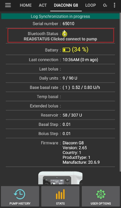
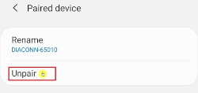

# Diaconn G8 胰島素幫浦

## 胰島素幫浦藍牙配對

- 點擊左上角的選單圖示。

- 點擊設定組態建置工具。

- 選擇 Diaconn G8 幫浦後，點擊設定圖示（齒輪）。

- 選擇所選幫浦。

- 當你的胰島素幫浦型號出現在列表中時，選擇他。

- 有兩種方法來檢查你的型號：

1. 幫浦背面的 SN 編號的最後五位數字。
2. 點擊 O 按鈕 > 資訊 > 藍牙 > 最後五位數字。

- 選擇幫浦後，會出現一個視窗，要求輸入 PIN 碼。 輸入幫浦上顯示的 PIN 碼以完成連線。

 

## 幫浦狀態檢查與日誌同步

- 當幫浦連線後，點擊藍牙圖示來檢查狀態並同步日誌。

## 藍牙問題排除

**如果幫浦的藍牙連線不穩定時該怎麼做。**

### 方法 1) 在 AAPS 應用程式完成後再次檢查幫浦。

- 點擊右上角的三點按鈕。

- 點擊退出。

### 方法 2) 如果第一種方法無效，中斷藍牙然後重新連線。

- 按住頂部的藍牙按鈕約 3 秒鐘。

- 點擊已配對的 Diaconn G8 胰島素幫浦上的設定按鈕。

- 取消配對。

- 重複幫浦的藍牙配對過程（見上文）。

## 更多資訊

### Diaconn G8 胰島素幫浦選項設定

- 設定管理器 > 幫浦 > Diaconn G8 > 設定
- DIACONN G8 在頂部> 右上角三點按鈕 > Diaconn G8 偏好設定

- 如果**記錄儲液瓶更換**選項被啟用，則相關細節會在發生「胰島素更換」事件時自動上傳至 careportal。
- 如果**紀錄針頭更換**選項已啟用，當發生「換點」事件時，相關詳細資料會自動上傳到照護入口。
- 如果**紀錄導管更換**選項已啟用，當發生「導管更換」事件時，相關詳細資料會自動上傳到照護入口。
- 如果**紀錄電池更換**選項已啟用，當發生「電池更換」事件時，相關詳細資料會自動上傳到照護入口，並且「幫浦電池更換」按鈕會在「操作」頁籤中停用。 （注意：更換電池前，請先停止所有進行中的注射功能。）

### 延長注射功能

- 如果使用延長注射功能，將會停用循環模式。
- 請參閱[本頁](Extended-Carbs-why-extended-boluses-won-t-work-in-a-closed-loop-environment)了解為何延長注射功能無法在循環模式下運作的詳情。
