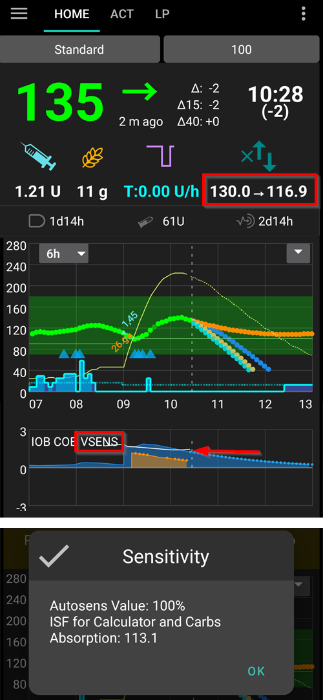
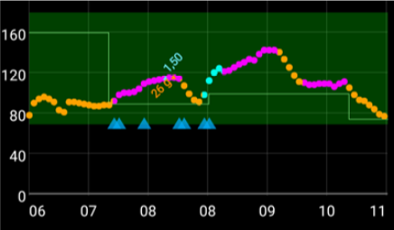
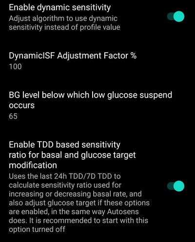

(Open-APS-features-DynamicISF)=
# 動態 ISF (DynISF)

到目前為止，使用 **AMA** 和 **SMB**，**ISF** 在 **個人設置** 中定義，並且在一天中的每個定義時間段內是靜態的。 但實際上，一個人的 **ISF** 並不是那麼靜態，而是根據他們的 **血糖** 水平而變化：當 **血糖** 水平很高時，使用者需要更多的胰島素來將其 **血糖** 降低 50mg/dL / 3mmol/L，這比在較低的 **血糖** 時更需要。 [Autosens](#Open-APS-features-autosens) 是第一個嘗試解決此問題的演算法，通過在用餐時間以外調整 **ISF**。

**Dynamic ISF**（也稱為 **DynISF**）具有相同的目的，但更為先進，因為它可以在任何時間使用。 建議僅供具有良好控管和監控 **AAPS** 的進階使用者使用。 在嘗試之前，請閱讀以下 [啟動 Dynamic ISF 時需考慮的事項](#dyn-isf-things-to-consider-when-activating-dynamicisf)。

```{admonition} CAUTION - Automations or Profile Percentage change
:class: warning

**自動化** 應始終小心使用。 這在使用 **Dynamic ISF** 時尤其如此。

使用 **Dynamic ISF** 時，請停用任何臨時 **個人設置** 更改作為 **自動化** 規則，因為這將導致 **Dynamic ISF** 在注射修正時過於激進，導致低血糖。 這正是 **Dynamic ISF** 的目的，因此在高 **血糖** 的情況下無需通過自動化告訴 **AAPS** 提供額外的胰島素。

```

使用 **Dynamic ISF** 時，**AAPS'** 資料庫需要至少 7 天的使用者 **AAPS** 資料。

## Dynamic ISF 的功能是什麼？

**Dynamic ISF** 根據使用者的以下因素動態調整胰島素敏感度因子（**ISF**）：

- 每日胰島素總量（**TDD**）；以及
- 目前和預測的血糖值。

使用 **Dynamic ISF** 時，**個人設置** 中輸入的 **ISF** 值不再使用，除非在 **AAPS** 資料庫中沒有足夠的 TDD 資料作為後備（例如 *即* 應用的全新重新安裝）。

**SMB/AMA** - 使用者的 **個人設置** 示例，其中的靜態 **ISF** 由使用者設置，並由 **SMB** 和 **AMA** 使用。


**Dynamic ISF** - 使用者的 **ISF** 的示例，會根據 **Dynamic ISF** 的規定而變化。



紅色圈起的部分顯示： `設定檔 ISF` -> `根據 DynISF 計算的 ISF`。 <br/> 點擊此部分顯示對話框，提供更多資訊，例如計算器和碳水化合物吸收所使用的 **ISF**（請參見 [ISF 的其他用途](#dynisf-other-usages-of-isf)）。

**DynISF** 值也可以在附加圖表中顯示，以提供“可變敏感度”的資料。 它顯示為白色線條（請參見上圖中的紅色箭頭）。

## Dynamic ISF 是如何計算的？

**Dynamic ISF** 使用 Chris Wilson 的模型來確定**ISF**，而不是使用者在**個人設置** 中設定的靜態**ISF** 值。 詳細解釋可以在此找到： [Chris Wilson 談論 Loop 和 Learn 的胰島素敏感度（修正因子），2022 年 2 月 6 日](https://www.youtube.com/watch?v=oL49FhOts3c)。

實施的**Dynamic ISF**方程式為： `ISF = 1800 / ((TDD * DynISF 調整因子) * Ln (( 當前血糖 / 胰島素除數) + 1 ))`

此方程中使用的變數詳細說明如下。<br/> 注意 : `Ln` 代表自然對數，一種數學函數。

該實施使用上述方程計算當前**ISF**，並在 oref1 [對於**IOB**、**ZT**（零溫度）以及**UAM**](#aaps-screens-prediction-lines)的預測中使用。 它也用於**COB**，以及在注射嚮導中（請參見[ISF的其他用途](#dynisf-other-usages-of-isf)）。

### TDD（每日總胰島素劑量）
TDD 將使用以下數值的組合：
1.  7天平均**TDD**；
2.  前一天的**TDD**; 和
3.  最近八（8）小時的胰島素使用的加權平均值，推算為 24 小時。

上面方程中使用的**TDD**是上述每個值的三分之一加權值。

### 動態胰島素敏感因子調整係數

這是在使用者的**偏好設定**中設置的，用以使**Dynamic ISF** 更加或 least aggressively. 請參見下文的[偏好設定](#dyn-isf-preferences)部分。

### 胰島素除數
胰島素除數取決於所使用胰島素的峰值，且與峰值時間成反比。 對於 Lyumjev，該值為 75；對於 Fiasp 為 65；對於普通速效胰島素則為 55。

### 根據預測的血糖進行劑量決策的ISF

動態敏感度是根據**當前血糖** 值計算的，並顯示為您當前在**AAPS**中的**ISF**。 但是在進行劑量計算時，oref1 演算法計算並使用 **未來 ISF**。

這樣做是為了防止在 **血糖** 較低或預測會下降時，劑量過多的胰島素。

**未來 ISF** 使用與上面描述的相同公式，不同的是，它可能使用 **最低預測血糖** 來替代 **目前血糖**。 **最低預測血糖**，[如 oref1 計算](https://openaps.readthedocs.io/en/latest/docs/While%20You%20Wait%20For%20Gear/Understand-determine-basal.html)，是預測所有預測過程中血糖 將下降的最小值。

* 如果目前 **血糖** 高於目標<br/> **且** 如果 **血糖** 水平穩定，在 +/- 3 mg/dL 內：<br/>血糖在公式中的使用如下：`平均值（預測最低血糖，當前血糖）`。
* 如果最終 **血糖** 高於目標，且葡萄糖水平正在上升，<br/>  
  **或** 最終 **血糖** 高於目前 **血糖**：<br/>血糖在公式中的使用如下：`目前血糖`。
* 否則：<br/>血糖在公式中的使用如下：`最低預測血糖`。

想要更簡單的解釋，請參見下面的截圖，該截圖說明了上述情況。 橙色點使用 **預測血糖**，紫色點使用 **平均值（預測血糖，目前血糖）**，藍色點使用 **目前血糖**。



(dynisf-other-usages-of-isf)=
## ISF 的其他用途

### ISF 和 COB 吸收

如 [COB 計算](../DailyLifeWithAaps/CobCalculation.md) 頁面所述，通常，COB 的吸收使用以下公式計算：   
`absorbed_carbs = deviation * ic / isf`  
在使用 **動態 ISF** 時，這裡使用的 **ISF** 是過去 24 小時動態 ISF 的平均值。

### 在劑量嚮導中的 ISF

當使用 [劑量嚮導](#aaps-screens-bolus-wizard) 時，如果 **血糖** 高於目標，則會使用 **ISF** 來添加校正。

當使用 **動態 ISF** 時，這裡使用的 **ISF** 是過去 24 小時動態 ISF 的平均值。

(dyn-isf-preferences)=
## 偏好設定

在 [偏好設定 > OpenAPS SMB](#Preferences-openaps-smb-settings) 中勾選 **啟用動態敏感度** 以啟用。 選擇後會提供新的設定。



(dyn-isf-adjustment-factor)=
### 動態胰島素敏感因子調整係數
**動態 ISF** 基於一條應適用於每個人的單一規則運作，這意味著具有相同 **TDD** 的人將具有相同的敏感性。 由於每個用戶都有其個人敏感性，因此 **調整因子** 允許用戶定義他們對胰島素的敏感性是比“標準”人更高還是更低。

**調整因子** 是一個介於 1% 和 300% 之間的值。 這作為**TDD**值的乘數。

* 將該值提高到 100% 以上使 **動態 ISF** 更積極：**ISF** 值變得 *更小* (_即_ 需要更多的胰島素來略微降低 **血糖** 水平)
* 將該值降低到 100% 以下使 **動態 ISF** 較不積極：**ISF** 值變得更大 (_即_ 需要更少的胰島素來略微降低 **血糖** 水平)。

當啟用 [**百分比設定檔切換**](../DailyLifeWithAaps/ProfileSwitch-ProfilePercentage.md) 時，**調整因子** 也會改變。 較低的 **設定檔百分比** 將降低 **調整因子**，反之亦然，較高的 **設定檔百分比** 則會提高 **調整因子**。

例如，如果你的 **調整因子** 是 80%，並且 **設定檔切換** 到 80% 被啟動，則最終 **調整因子** 將為 `0.8*0.8=0.64`。

這意味著，當使用 **動態 ISF** 時，你可以使用 **設定檔百分比** 來手動暫時微調你的敏感性。 這對於體能活動（較低百分比）、感冒（較高百分比）等情況將會很有用。

### 低於此血糖數值時，會啟動低血糖暫停功能

**血糖** 值低於此值時會暫停胰島素。 預設值使用標準目標模型。 用戶可以將此值設定在 60mg/dl (3.3mmol/l) 到 100mg/dl(5.5mmol/l) 之間。 低於 65/3.6 的值會使用預設模型。

### 啟用基於 TDD 的敏感性比率來調整基礎胰島素和血糖目標

此設定取代 Autosens，並使用過去 24 小時**TDD** / 7D **TDD** 作為增加和減少基礎率的依據，與標準 Autosens 的做法相同。 若選項中啟用根據敏感性調整目標，則此計算值也會用來調整目標值。 與 Autosens 不同，此選項不調整**ISF**值。

(dyn-isf-things-to-consider-when-activating-dynamicisf)=
## 啟用動態 ISF 時需考慮的事項

* **動態 ISF** 只建議給**AAPS** 控制及監控有良好掌握的進階使用者。 用戶在轉向 **動態 ISF** 之前，理想情況下應已經達到對 **SMB** 的良好控制。
* 如上所提，請關閉所有會啟動與 **血糖** 相關的 [**自動化**](../DailyLifeWithAaps/Automations.md)，因為這將過於積極，可能會過度輸送胰島素！ 這已經是 **動態 ISF** 演算法的一部分。
* [設定檔百分比](../DailyLifeWithAaps/ProfileSwitch-ProfilePercentage.md) 將考慮在動態 ISF 計算中（請參見上面的 [動態 ISF 調整因子](#dyn-isf-adjustment-factor)）。 長期使用 100% 以外的 **設定檔百分比** 不是一個好的做法。 如果你發現你的 **設定檔** 已經改變，請建立一個新的 **設定檔**，以反映修訂後的數值來重新建立具有特定百分比的 **設定檔**。
* **動態 ISF** 可能不適用於每個人。 具體而言，如果以下情況適用於你，你可能會看到意外的結果：
  * 生活方式變化（飲食或身體活動模式不一致）
  * 每日的 TDD 或敏感性不一致。
* 沒有準確的指導來設定 **調整因子** 的初始值。 然而，作為起點：假設你的 **設定檔** 數值正確，當你處於範圍內且 **血糖** 水平穩定時，**動態 ISF** 值應該與你之前在 **設定檔** 中的值大致相同。<br/>如果你發現 **動態 ISF** 太積極，請降低 **調整因子**，反之亦然。
* 儘管 **動態 ISF** 完全不使用 **設定檔 ISF**，如果你注意到你的敏感性與你之前存儲的 **設定檔** 上的數值相差很大，你應該考慮將其保持最新。 這在你遺失 **AAPS** 資料（例如：新手機、新版 **AAPS** 等）時可能會很有用，因為你的 **設定檔 ISF** 將在未來 7 天內作為備用使用。