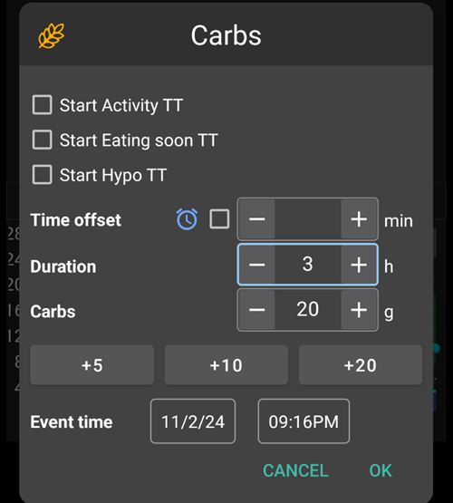
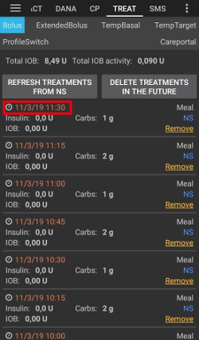
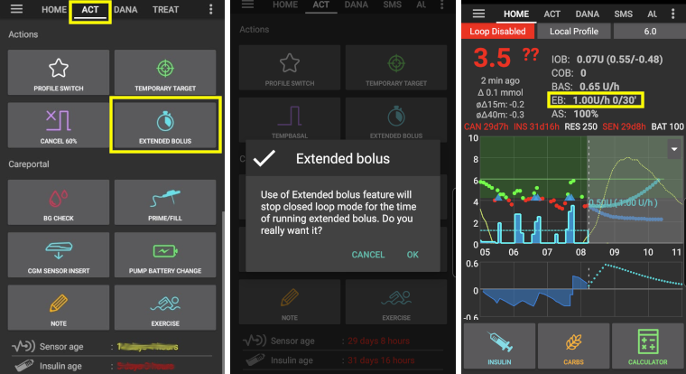

(Extended-Carbs-extended-carbs-ecarbs)=
# 延長碳水化合物 / "eCarbs"

## 什麼是 eCarbs？什麼時候使用 eCarbs 有效？

在一般幫浦療法中，延長注射（延長胰島素注射）是應對高脂肪或慢速吸收餐食的好方法，這些餐食會讓血糖在胰島素效果結束後仍然上升。 然而，在循環系統中，延長注射並不那麼適用（且技術上有困難），因為他基本上是一個固定的高臨時基礎率，而循環系統的工作原理是動態調整基礎率。 有關詳細資訊，請參見以下[延長注射](#extended-bolus-and-why-they-wont-work-in-closed-loop-environment)。

然而，處理這類餐食的需求仍然存在。 這就是為什麼從 AAPS 版本 2.0 開始支援所謂的延長碳水化合物或 eCarbs。

eCarbs 是指碳水化合物會在幾個小時內逐步釋放。 對於高碳水化合物的標準餐食，提前輸入碳水化合物（如果需要，可以減少初始注射量）通常足以避免過早的胰島素注射。  但是對於吸收較慢的餐食，如果完全提前輸入碳水化合物會導致來自 SMB 的 IOB 過多，eCarbs 可以更準確地模擬碳水化合物（以及你為其他營養素輸入的任何碳水化合物等效物）的吸收，並影響血糖。 有了這些資訊，循環系統可以更逐步地管理 SMB 來處理這些碳水化合物，這可以被視為一種動態的延長注射（即使沒有 SMB 也應該有效，但可能不如有 SMB 時效果好）。

**注意：** eCarbs 不僅限於高脂肪/高蛋白餐食：他們也可以幫助應對任何會提高血糖的情況，例如服用其他藥物（如類固醇）。

## 使用 eCarbs 的操作方式

要輸入 eCarbs，請在首頁總覽標籤的*碳水化合物*對話框中設置持續時間、總碳水化合物量，並可選擇時間偏移（*下方數值僅為示例，需自行嘗試以達到滿意的血糖反應*）：

首頁總覽標籤中的 eCarbs，注意 COB 欄位中的括號顯示未來的碳水化合物：

未來的碳水化合物條目在治療標籤中會以深橙色顯示：

______________________________________________________________________

此功能用於處理脂肪和蛋白質的方法描述在此處：[https://adriansloop.blogspot.com/2018/04/page-margin-0.html](https://adriansloop.blogspot.com/2018/04/page-margin-0.html)

______________________________________________________________________

## 推薦設置、範例場景及重要注意事項

推薦設置是使用 OpenAPS SMB APS 外掛，啟用 SMB 並啟用 *COB 啟用 SMB* 偏好設定。

例如，對於披薩，你可以先透過 *計算機*部分注射，然後使用 *碳水化合物* 按鈕輸入剩餘的碳水化合物，持續時間設置為 4-6 小時，從 1 或 2 小時後開始。

**重要注意事項：**當然，你需要嘗試看看哪些具體數值對你有效。 你還可以仔細調整*限制 SMB 的最大基礎率分鐘數*設置，以使演算法更積極或較不積極。 對於低碳水化合物、高脂肪/高蛋白餐食，可能僅使用 eCarbs 就足夠，不需要手動注射（詳情請參閱上述的部落格文章）。 當生成 eCarbs 時，系統也會在 Careportal 中生成一個筆記來紀錄所有輸入，這樣可以更容易地進行調整和改進。

(Extended-Carbs-extended-bolus-and-why-they-wont-work-in-closed-loop-environment)=
## 延長注射及其為何在閉環系統中無法運作？

如上所述，延長或多波段注射在閉環系統中並不真正有效。 [請參閱下方詳情](#why-extended-boluses-wont-work-in-a-closed-loop-environment)

(Extended-Carbs-extended-bolus-and-switch-to-open-loop-dana-and-insight-pump-only)=
### 延長注射與切換至開放循環 - 僅限 Dana 與 Insight 幫浦

一些人希望 AAPS 能提供延長注射選項，因為他們希望以自己習慣的方式處理特殊食物。

這就是為什麼從 AAPS 版本 2.6 開始，對 Dana 和 Insight 幫浦使用者提供了延長注射選項。

- 閉環將自動停止並切換為開環模式，以運作延長注射。
- 注射單位、剩餘和總時間將顯示在主畫面。
- On Insight pump extended bolus is *not available* if [TBR emulation](#Accu-Chek-Insight-Pump-settings-in-aaps) is used.

(Extended-Carbs-why-extended-boluses-won-t-work-in-a-closed-loop-environment)=
### 為什麼延長注射在閉環系統中無法運作

1. 循環系統決定現在應注射 1.55U/h。 無論這是透過延長注射還是 TBR 提供，對於演算法來說沒有區別。 實際上，有些幫浦使用延長注射。 那麼接下來該怎麼辦？ 大多數幫浦驅動程式會停止延長注射——> 你甚至不需要開始他。

2. 如果你已經輸入了延長注射，模型應該如何處理？

   1. 他應該與基礎率一起被視為中立並在上面循環嗎？ 然後，循環應該能夠減少注射量，如果，例如，你的血糖過低並且所有「中立」的胰島素都被移除了嗎？
   2. 延長注射應該被直接加入嗎？ 所以應該允許循環繼續運作嗎？ 即使是在最嚴重的低血糖情況下？ 我覺得這不太好：預見到了低血糖，但不應該加以預防嗎？

3. 延長注射所累積的活性胰島素會在5分鐘後的下一次運作時出現。 因此，循環將會提供較少的基礎率。 所以變化不大...除了避免低血糖的可能性被取消了。
