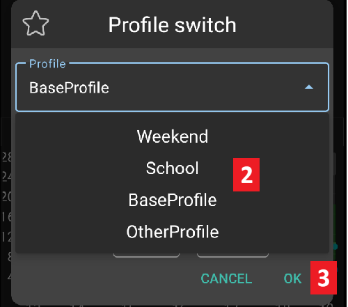

# 設定檔切換及設定檔百分比

本節將解釋什麼是**設定檔切換**和**設定檔百分比**。 你可以了解如何在[組態建置工具 > 設定檔](#setup-wizard-profile)中創建**設定檔**。

在開始你的**AAPS**之旅時，你需要創建一個**設定檔**，了解如何執行**設定檔切換**，並學習**AAPS**中**設定檔百分比**的影響。 **設定檔切換**或**設定檔百分比**的功能對於以下情況特別有益：

- 月經週期 - 可以在**自動化**中設定百分比調整，以便**AAPS**適應不同階段的荷爾蒙週期和預期的胰島素抗性。

- 運動 - 可以在**自動化**中設定百分比調整以減少基礎胰島素攝入。

- 夜班或輪班工作者 - 透過更改設定檔中的小時數來調整設定檔，以符合使用者晚睡或早起的時間變化。

為什麼使用**設定檔百分比**而非臨時基礎率調整？ 為了更有效地應用，**設定檔百分比**會對基礎率、ISF 和 I:C 進行比例減少或增加。 這確保**AAPS**在調整使用者的胰島素攝入時計算出平衡的方式。 如果僅僅降低基礎率，但演算法繼續應用相同的 ISF 和 I:C 比率，對使用者的**設定檔**幾乎無益。

## 如何啟用設定檔切換？

每個**設定檔**選擇後，都需要進行「設定檔切換」。 要做到這一點，使用者應編輯其**設定檔**或在「本地設定檔」標籤下設定一個新的**設定檔**。 應用所需的設定後，使用者應儲存更改並選擇「啟用設定檔」以啟用**設定檔**，如下所示：

建立並儲存新的**設定檔**後，**AAPS** 將儲存使用者生成的**設定檔**庫。

## 如何啟用設定檔切換？

A. 使用此功能時，使用者必須在**AAPS** 中儲存多個**設定檔**。 要啟用**設定檔切換**：

- **長按** 名稱的 **設定檔** (以下範例使用保存在 **AAPS** 主畫面的「學校」**設定檔**，並從下拉選單中選擇所需的 **設定檔**):

1. 長按**設定檔**；
2. 選擇所需的**設定檔**；然後按「確定」。
3. 然後按下『確定』。

## 要在設定檔切換中啟用設定檔百分比：

B. 要啟用**設定檔百分比**：

- 按照上述 A 的步驟進行。
- 根據需要調整「持續時間」和「百分比」欄位，但需注意以下事項。 如果「持續時間」欄位（如圖示 2 所示）： 
    - 設為「0」，則此設定檔將無限期保持啟用狀態。 設定檔將保持啟用，直到使用者選擇並切換到新的「設定檔切換」。
    - 如果輸入了 [x] 分鐘數，則這將是**設定檔**的預期持續時間。 當選定的時間範圍過期後，標準**設定檔**將回到**AAPS**中。

如何啟用設定檔「百分比」：

2. 輸入「持續時間」欄位。

3. 輸入「百分比」欄位。

4. 輸入「時間調整」。

## 要在設定檔切換中啟用設定檔百分比：

使用者暸解**設定百分比**的重要功能是很關鍵的。 透過對**設定切換**應用百分比增減，這將同樣比例地提高或降低使用者在**設定**中設定的參數。

例如：將**設定切換**設為130%（表示使用者對胰島素的抵抗增加了30%），將指示**AAPS**進行以下操作：

- **提高**基礎率30%； 
- **降低** **ISF**：將其除以1.3；
- **降低** **I:C**：將其除以1.3。

記住，降低**ISF**或**I:C**意味著更強的比例，並會施打更多的胰島素。 對**AAPS**的新使用者來說，這一事實可能很容易被忽略。

選擇後，**AAPS**會重新調整預設基礎率，並且**AAPS**（開啟或關閉）將在選擇的百分比**設定**上運作。

**設定檔**百分比的影響在以下表格中總結：

| 設定檔切換  
百分比 |   影響   | Insulin to Carbs Ratio  
g/UI | 示例  
15g | Insulin Sensitivity Factor  
mmol/l/UI  
mg/dl/UI | UI降低  
2mmol/l  
40mg/dl |
|:-----------:|:------:|:-----------------------------:|:--------:|:-------------------------------------------------:|:------------------------:|
|     90%     |   較弱   |       5/0.9  
=**5.55**       |  2.7 UI  |    2.2/0.9  
=**2.4**  
  
40/0.9  
=**44.4**     |          0.8 UI          |
|  **100%**   | **標準** |             **5**             | **3 UI** |                   **2.2  
40**                    |        **0.9** UI        |
|    130%     |  更強大   |       5/1.3  
=**3.85**       |  3.9 UI  |    2.2/1.3  
=**1.7**  
  
40/1.3  
=**30.8**     |          1.2 UI          |

(設定檔切換-個人設定比例-生理時鐘比例的時間偏移)=

## 日夜節律設定百分比的時間調整

使用者的**設定**功能中的「時間調整」將把使用者的**設定**根據輸入的時數在日常作息（「日夜節律」）中移動。 這對以下情況很有幫助：

- **夜班或輪班工作者**：透過調整時數來改變**設定**中就寢或起床的時間； 
- **跨時區旅行的使用者**；或
- **1型糖尿病孩童的使用者**：他們有固定的就寢時間表及在設定內處理的胰島素抗性。 如果出於任何原因預測孩童會晚睡，照護者可以對孩童的**設定**應用「時間調整」，讓**AAPS**在使用者設定的特定時間處理胰島素抗性。

問題始終是哪些小時的**設定**應取代目前時間的設定。 這次時間必須調整為提前或延後 x 小時 請留意以下範例中描述的指引：

- 目前時間：12:00
- **正** 時間調整 
    - 2:00 **+10 小時** -> 12:00
    - 由於正向時間調整，將使用2:00的設定來取代通常在12:00使用的設定。
- **負** 時間調整 
    - 22:00 **-10 小時** -> 12:00
    - 由於負向時間調整，將使用22:00（晚上10點）的設定來取代通常在12:00使用的設定。

透過紀錄**設定**快照的機制，能夠更精準地計算過去的資料，並追蹤**設定**變更的可能性。

## 保留設定檔切換以供日後使用

一旦你以百分比和/或時間偏移進行了設定檔切換，你可以將此臨時設定檔的複製製作成新的設定檔。

要這樣做，請前往選單[治療 > 設定檔切換](#your-aaps-profile-clone-profile-switch)。