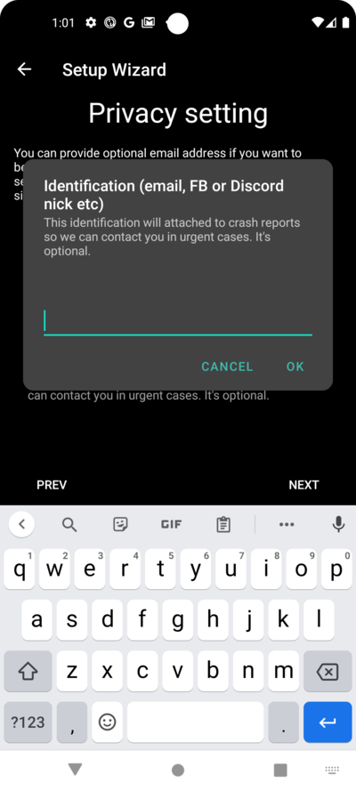
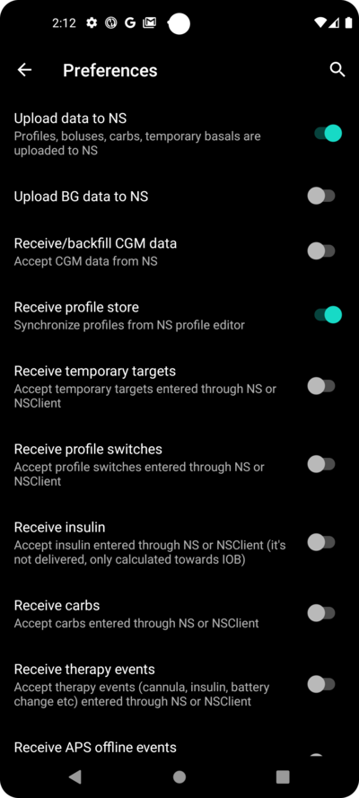
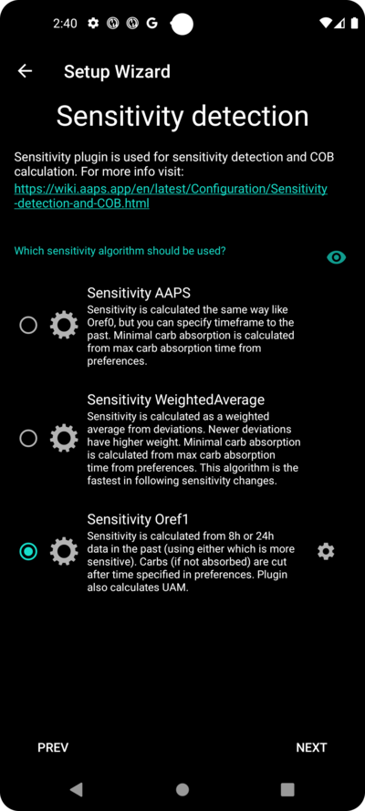
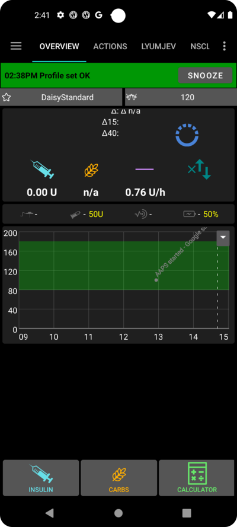

# AAPS設定嚮導

When you first start **AAPS** you are guided by the "**Setup Wizard**", to quickly setup all the basic configurations of your app in one go. **Setup Wizard** guides you, in order to avoid forgetting something crucial. For example, the **permission settings** are fundamental for setting up **AAPS** correctly.

However, it's not mandatory to get everything completely configured in the first run of using the **Setup Wizard** and you can easily exit the Wizard and come back to it later. There are three routes available after the **Setup Wizard** to further optimise/change the configuration. These will be explained in the next section. So, it's okay if you skip some points in the Setup Wizard, you can easily configure them later.

During, and directly after using the **Setup Wizard** you may not notice any significant observable changes in **AAPS**. To enable your **AAPS** loop, you have to follow the **Objectives** to enable feature after feature. You will start **Objective 1** at the end of the Setup Wizard. You are the master of **AAPS**, not the other way around.

```{admonition} Preview Objectives
:class: note
如果你想了解目標的結構，請閱讀 [完成目標](../Usage/completing-the-objectives.md)，但請在這裡返回以首先運行設置嚮導。

```

From previous experience, we are aware that new starters often put themselves under pressure to setup **AAPS** as fast as possible, which can lead to frustration as it is a big learning curve.

所以，請慢慢來配置你的循環，運作良好的 **AAPS** 循環帶來的好處是巨大的。

```{admonition} Ask for Help
:class: note
如果文檔中有錯誤或你有更好的解釋建議，你可以按照[與其他用戶聯繫](../Where-To-Go-For-Help/Connect-with-other-users.md)中的說明，向社群尋求幫助。
```

## AAPS設定嚮導逐步指南

### Welcome message

這只是歡迎訊息，你可以透過點擊“下一步”按鈕跳過：


### 許可協議

在最終用戶許可協議中，有關於使用 **AAPS** 的法律方面的重要訊息。 請仔細閱讀。 Please read it carefully.

如果你不理解或不同意最終用戶許可協議，請不要使用 **AAPS**！

如果你理解並同意，請點擊“我理解並同意”按鈕並繼續設定嚮導：


### 必要的權限

**AAPS** 需要一些條件才能正常運作。

In the following screens you are asked several questions you have to agree to, to get **AAPS** working. The Wizard itself explains why it asks for the relevant setting.

在此畫面中，我們提供更多背景訊息，將更技術性的內容轉換為常用語言，或解釋其原因。

請點擊“下一步”按鈕：


智慧型手機的電池消耗仍然是需要考慮的因素，因為電池性能仍然相當有限。 因此，智慧型手機上的Android操作系統在允許應用程式運作和消耗CPU時間（因此消耗電池電量）方面有嚴格的限制。 Android將藍牙通訊的使用與位置服務的使用權限相關聯。 你可能在其他應用程式中也見過這一點。 如果你想查看藍牙，通常需要位置權限。

然而，**AAPS** 需要定期運作，_例如_ 每隔幾分鐘接收一次血糖讀取值，然後應用演算法根據你的設定決定如何處理血糖水平。 因此，必須讓Android允許一些權限。 Therefore it must be allowed to do so by Android.

You do this by confirming the setting.

Please click the "ASK FOR PERMISSION" button:


請選擇“允許”：


如果應用程式希望向你發送通知，Android需要特殊的許可。

雖然停用社交媒體應用程式的通知是一個很好的功能，但你必須允許 **AAPS** 向你發送通知。

Please click the "ASK FOR PERMISSION" button:


選擇“AAPS”應用程式：


透過向右滑動滑塊來啟用“允許在其他應用程式上顯示”：


如果已啟用，滑塊應該看起來是這樣的：


Android links the use of bluetooth communication to the ability to use location services. Perhaps you have seen it with other apps too. It's common to need location permission if you want to access bluetooth.

**AAPS** 使用藍牙與你的CGM和胰島素幫浦進行通訊，前提是他們直接由 **AAPS** 控制，而不是透過 **AAPS** 使用的其他應用程式。 具體細節可能因設置而異。 Details may differ from setup to setup.

Click the "ASK FOR PERMISSION" button:


This is important. Otherwise **AAPS** can not work properly at all.

Click "While using the app":


Click the "NEXT" button:


**AAPS** 需要將訊息記錄到智慧型手機的永久儲存中。 永久儲存意味著即使重啟智慧型手機後，他仍然可用。 其他訊息則會遺失，因為他們沒有儲存到永久儲存中。 Permanent storage means that it will be available even after rebooting your smartphone. Other information is just lost, as it is not saved to permanent storage.

Click the "ASK FOR PERMISSION" button:


點擊“允許”：


你將被告知需要重新啟動智慧型手機以使更改生效。

請**不要現在停止設定嚮導**。 你可以在完成設定嚮導後再進行。 You can do it after finishing the Setup Wizard.

Click "OK" and then the "NEXT" button:


### 主密碼

由於 **AAPS** 的配置包含一些敏感資料（_例如_ 查看你的Nightscout伺服器的API_KEY），因此他透過你可以在此處設置的密碼進行加密。

The second sentence is very important, please **DO NOT LOSE YOUR MASTER PASSWORD**. Please make a note of it _e.g._ on Google Drive. Google Drive is a good place as it is backed up by Google for you. Your smartphone or PC can crash and you may have no actual copy. If you forget your Master Password, it can be difficult to recover your profile configuration and progress through the **Objectives** at a later date.

填寫密碼兩次後，請點擊“下一步”按鈕：


### Fabric上傳

在這裡，你可以設置自動崩潰和使用報告服務的使用。

It's not mandatory, but it is good practice to use it.

他幫助開發人員更好地了解你如何使用應用程式，並告知他們發生了哪些崩潰。

他們將獲得：

1. The information that the app crashed, which they would not otherwise know since in their own set-up everything works fine and
2. In the send data (crash information), there is information about the circumstances under which the crash happened, and what kind of configuration is being used.

因此，這有助於開發人員改進應用程式。

請透過向右滑動滑塊來啟用“Fabric上傳”：


此外，你可以標識自己，以便在開發人員希望就問題或緊急關注事項聯繫你時能夠找到你：



After filling in your "contact information" click the "OK" button. Contact information can be your identification on Facebook, on Discord, ... 只需提供你認為能透過最佳方式聯繫你的訊息：


Click the "NEXT" button:


### 單位（mg/dL <-> mmol/L）

請選擇你的血糖值是以 mg/dl 還是 mmol/L 為單位，然後點擊“下一步”按鈕：


### 顯示設置

Here you select the range for the sensor glucose display, which will be shown as "in range" between the values you set. You can leave it as the default values for now, and edit it later.

你選擇的值只會影響圖表的圖形展示，其他方面不會受到影響。

例如，你的血糖目標是單獨在你的設定檔案中進行配置的。

你的TIR（範圍內時間）分析範圍在你的報告伺服器中單獨配置。

請按下“下一步”按鈕：


### 與報告伺服器同步及更多設置

在這裡，你可以配置資料上傳到你的報告伺服器。

你也可以在這裡進行其他配置，但首次運作我們只會專注於報告伺服器。

If you are not able to set it up at the moment, skip it for now. You can configure it later.

If you select an item here on the left tick box, on the right you can then ticking the visibility (eye) box, which will place this plugin in the upper menu on the **AAPS** home screen. Please select the visibility too if you configure your reporting server at this point.

在此示例中，我們選擇Nightscout作為報告伺服器，並將進行配置。

```{admonition} Make sure to choose the correct **NSClient** version for your needs! 
:class 注意
點擊 [這裡](./Releasenotes.md) 查看 **AAPS** 3.2.0.0 的版本說明，這些說明解釋了頂部選項 **NSClient** （這是「v1」，雖然沒有明確標示）與第二個選項 **NSClient v3** 之間的差異。

Nightscout 使用者應選擇 **NSClient v3**，除非你希望透過 Nightscout 監控或發送遠端治療（例如:父母或看護使用 **AAPS** 幫助孩子），在這種情況下，請選擇第一個選項「**NSClient**」，直到進一步通知為止。
```

對於Tidepool來說，這更簡單，因為你只需要你的個人登錄訊息。

選擇後，請按下你選擇項目旁邊的齒輪按鈕：


在這裡，你可以配置Nightscout報告伺服器。

請點擊“Nightscout URL”：


輸入你的Nightscout存取權杖。 這是你配置的Nightscout伺服器的存取權杖。 沒有這個權杖，無法存取。 輸入你的Nightscout URL，這是你的個人Nightscout伺服器。 這只是你自己設置的URL，或者是從你的Nightscout服務提供商那裡獲得的。

請點擊“確定”按鈕：


Enter your nightscout access token. This is the access token for your Nightscout server you configured. Without this token, access will not work.

如果你目前沒有，請查看 **AAPS** 文檔中的報告伺服器設置說明。

填寫“**NS存取權杖**”並點擊“確定”後，請點擊“同步”按鈕：


如果你在設定嚮導的前幾步中已經配置了Nightscout，請選擇“上傳資料到NS”。

如果你在Nightscout上儲存了設定檔案並希望將他們下載到 **AAPS**，請啟用“接收設定檔案存儲”：



返回上一個螢幕並選擇“警報選項”：


For now, leave the switches disabled. We only walked to the screen to make you familar with possible options you might configure in the future. At the moment there is no need to do it.

Go back to the previous screen before and select "Connection settings".

在這裡，你可以配置如何將資料傳輸到報告伺服器。

照護者必須啟用“使用行動網路連線”，否則用來為受照護者/孩子服務的智慧型手機無法在WiFi範圍外（例如上學路上）上傳資料。

其他 **AAPS** 用戶可以停用行動網路連線的傳輸，如果他們希望節省資料或電池電量。

如果不確定，建議保持所有選項啟用。

Go back to the screen before and select "Advanced Settings".


Enable "Log app start to NS" if you want get this information in the reporting server. It can help you to know remotely if and when the app has been restarted, particularly as a caregiver.

現在可能會關心確認 **AAPS** 是否正確配置，但之後通常不需要在Nightscout中檢查 **AAPS** 啟動或停止的情況。

啟用“從錯誤中建立公告”和“從需要碳水化合物警報中建立公告”。

Leave "Slow down uploads" disabled. You would only use it in unusual circumstances if for example a lot of information is to be transfered to the Nightscout server, and the Nightscout server is being slow in processing this data.

Go back twice, to the list of plugins and select "NEXT" to go to the next screen:


### 患者名稱

在這裡，你可以在 **AAPS** 中設置你的名字。

It can be anything. It's just for differentiating users.

為了簡單起見，只需輸入名字和姓氏。

按“完成”進入下一個螢幕。


### 病人類型

在這裡，你可以選擇你的“患者類型”，這很重要，因為 **AAPS** 軟體根據患者的年齡設有不同的限制。 這對安全至關重要。 This is important for security and safety reasons.

Here is where you also configure the **maximum allowed bolus** for a meal. That is, the largest bolus you need to give to cover your typical meals. It's a security feature to help avoid accidentally overdosing when you are bolusing for meal.

第二個限制與此類似，但涉及你預期的最大碳水化合物攝入量。

設置這些值後，請按“下一步”進入下一個螢幕：


### 使用的胰島素

Select the type of insulin being used in the pump.

The insulin names should be self-explanatory.

```{admonition} Don't use the "Free-Peak Oref" unless you know what you are doing
:class: danger
對於進階使用者或醫療研究，你可以通過 "Free-Peak Oref" 定義自訂的胰島素作用型態的設定檔。請不要使用，除非你是專家，因為通常預設值對每種品牌的胰島素都能很好地運作。
```

點擊“下一步”按鈕：


### 血糖來源

Select the BG source you are using. Please read the documentation for your [BG source](../Configuration/BG-Source.md).

As there are several options available, we don't explain the configuration for all of them here. 由於有多個選項可用，因此我們不會在此詳細解釋所有選項的配置。 在這裡我們使用Dexcom G6與BYODA應用程式的示例：


如果你使用Dexcom G6與BYODA，請在頂層選單中點擊右側的勾選框來啟用可見性。

選擇後，按“下一步”進入下一個螢幕：


如果你正在使用 Dexcom G6 與 BYODA，點擊齒輪按鈕來訪問 BYODA 的設定。

Enable the "Upload BG data to NS" and "Log sensor change to NS".

返回並按 "下一步" 以進入下一個螢幕：


### Profile

現在我們進入設定嚮導中的一個非常重要的部分。

Please read the documentation about profiles before you try to enter your profile details on the following screen.

```{admonition} Working profile required - no exceptions here !
:class: danger
準確的設定檔是控制 **AAPS** 安全運行所必需的。

你必須已經確定並與你的醫生討論你的設定檔，並且經過成功的基礎率、ISF 和 IC 測試驗證其可行性！

一直以來，如果給一個機器人輸入不正確資訊，那麼他將無法正常。同理，**AAPS** 只能依賴於他所獲取的資訊。如果你的設定檔過強，你將冒著低血糖的風險；如果過弱，你則冒著高血糖的風險。
```

按“下一步”進入下一個螢幕： Enter a "profile name":


You can have several profiles in the long-term if needed. We only create one here.

```{admonition} Profile only for tutorial - not for your usage
:class: information
此處的範例設定檔僅用於顯示如何輸入資料。

他並不打算成為一個準確的設定檔或非常優化的東西，因為每個人的需求都如此不同。

不要用他來實際循環！
```

Enter your Duration of insulin Action (DIA) in hours. 點擊“確定”然後點擊“下一步”按鈕：


輸入你的IC值：


按“ISF”。 輸入你的ISF值： 按“基礎速率”。 輸入你的基礎值：


Press "BAS". Enter your basal values:


Press "TARG". 按“TARG”。 輸入你的血糖目標值。

For open looping this target can be a wider range, as otherwise **AAPS** notifies you permanently to change the temporary basal rate or another setting, which can be exhausting.

Later, for closed looping, you will generally have only one value for top and bottom. That makes it easier for **AAPS** to hit the target and give you better overall diabetes control.

輸入/確認目標值：


Save the profile by clicking on "SAVE":


After saving a new buttom "Activate Profile" occurs.

```{admonition} Several defined but only one active profile
:class: information
你可以定義多個設定檔案，但任何時刻只能啟用一個設定檔案。
```

按下“啟用設定檔案”：


The profile switch dialogue appears. In this case let it stay as preset.

```{admonition} Several defined but only one active profile
:class: information
你稍後將學習如何使用此通用對話框來處理疾病或運動等情況，在這些情況下，你需要更改適合情況的設定檔案。
```

按下“確定”：


A confirmation dialog for the profile switch appears.

You can confirm it with pressing "OK". 按“下一步”進入下一個螢幕：


你的設定檔案現在已設置：


### Insulin pump

Now you are selecting your insulin pump.

你會看到一個重要的警告對話框。 請閱讀並按“確定”。 Please read it, and press "OK".

If your have already setup your profile in the steps before and you know how to connect your pump, feel free to connect it now.

否則，請使用左上角的箭頭退出設定嚮導，讓 **AAPS** 首先顯示一些血糖值。 你可以隨時返回或使用直接配置選項（不使用嚮導）。 You can come back anytime or use one of the direct configuration options (not using the Wizard).

Please read the documentation for your [insulin pump](../Getting-Started/Pump-Choices.md).

按“下一步”進入下一個螢幕。


在此例中，我們選擇“虛擬幫浦”。

按“下一步”進入下一個螢幕：


### APS 演算法

當你首次啟動 **AAPS** 時，會由“**設定嚮導**”引導，快速完成應用程式的基本配置。 **設定嚮導** 會引導你，避免遺漏關鍵設定。 例如，**權限設置** 對於正確設置 **AAPS** 至關重要。 Despite the name the SMB feature of the algorithm is disabled until you are familar with AAPS and already worked through the first objectives. 選擇OpenAPS SMB演算法作為你的APS演算法。 即使有這個名稱，SMB功能在你熟悉 **AAPS** 並完成第一階段目標之前是停用的。 無論如何，OpenAPS SMB 相較於 OpenAPS AMA 更新且通常效果更好。

The reason SMB is disabled in the beginning is because the SMB feature enables faster reaction on blood sugar increase through the Super Micro Bolus instead of increasing the basal rate percentage. As in the begining your profile is in general not as good as after some time of experience the feature is disabled in the begining.

```{admonition} Only use the older algorithm **OpenAPS AMA** if you know what you are doing
:class: information
OpenAPS AMA 是最基本的演算法，不支援微量注射來修正高值。可能有情況需要使用此演算法，但這並不是推薦的做法。
```

按齒輪查看詳細資訊：


僅閱讀文本，此處不進行任何更改。

由於**目標**的限制，你目前無法使用“閉環”或“SMB功能”。

返回並按 "下一步" 以進入下一個螢幕：


### APS模式

讓“開放循環”保持選中狀態。

點擊“下一步”按鈕：


### 敏感度檢測

讓“敏感度Oref1”保持為敏感度外掛的標準選項。

按“下一步”進入下一個螢幕：



### 開始目標1

You are entering now the Objectives. The qualification for access to further **AAPS** features.

我們從目標1開始，即使此刻我們的設置尚未完全準備好成功完成此目標。

但這是開始。

按下綠色的“開始”按鈕以開始目標1：


你會看到你已經取得了一些進展，但還有其他區域需要完成。

按“下一步”進入下一個螢幕。


你來到了 **AAPS** 的主頁面。

Here you find the information message in **AAPS** that you set your profile.

This was done when we switched to our new profile.

You can click "SNOOZE" and it will disappear.



如果你在任何時候意外離開設定嚮導，你可以重新啟動嚮導，或手動更改[**AAPS**循環的配置](../Installing-AndroidAPS/change-configuration.md)。

如果你的 **AAPS** 循環現在已完全設置好，請繼續進行下一部分[“完成目標”](../Usage/completing-the-objectives.md)。
