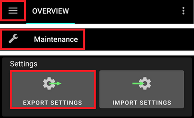
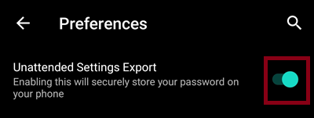

# 建立和恢復備份

當你在手機上安裝 AAPS 時，它將成為你每日依賴的「醫療設備」。 強烈建議針對手機故障、被盜或遺失時有一個緊急備份計畫。 因此，事先準備是必要的，問自己：「如果...怎麼辦？」

要將你的 AAPS 設定恢復到現有或新手機，重要的是將以下項目保存在安全的地方（也就是說：不能放在你的手機上）。 最佳實踐是至少保留兩個獨立的備份：在本地硬碟、USB 隨身碟上，以及（較佳選擇）在雲端儲存服務上，如 Google Drive 或 Microsoft 365 OneDrive。 將備份儲存在雲端，你能隨時隨地從手機取得一切所需，以恢復你的設定。

考慮獲得一部備用手機並練習恢復 AAPS，以確保備用手機正常運作。 這一步將給你信心，相信你的緊急計畫是有效的，如果你的主手機無法使用，你依然可以順利使用 AAPS。

為了能夠恢復，準備以下項目是很重要的：

- 你的 **Android Studio 憑證檔案** 和相關的 **密碼**：用於（重新）建立 AAPS .APK 安裝檔。
- 最近的 **AAPS 安裝檔 .APK** 副本
- 最近的 **設定匯出** 檔案：用於恢復重要的設定（包括你的目標！）。
- 你的 **AAPS 主密碼**
- 額外工具的備份：如 BYODA 和/或 xDrip+。
- 針對你設定的個人筆記。

以下是建議的備份項目。

## 建立備份

### 從構置 APK 時使用的電腦匯出的金鑰存儲檔案
當你從 Android Studio 構建 .APK 安裝檔時，會使用 **憑證檔案和密碼來簽署 .APK 安裝檔**。 若要更新當前的 AAPS 安裝，必須用與首次安裝相同的憑證簽署更新的 .APK 安裝檔。 在更新時，所有的設定和 AAPS 資料庫都將被保留。 沒有這個，你必須先卸載當前應用，然後重新安裝並重新配置 AAPS。

維持憑證和相關密碼將大大減少未來更新 APK 的複雜性，特別是如果你需要從新電腦構建應用時。 請參閱 [更新 AAPS](../Maintenance/UpdateToNewVersion.md) 部分，了解在構置新 APK 時如何使用金鑰存儲檔案的詳細資訊。

**何時備份：** 憑證應在你首次構建 **AAPS** .APK 安裝檔後進行備份。

**如何備份：** 找到你的憑證路徑。 如果你不記得，可以在 Android Studio 中選擇 **建置 > APK > 下一步** 找到它。 路徑將列在「金鑰庫路徑」中。 使用你的檔案總管，導航至此路徑並複製你的金鑰庫檔案（以`.jks`為檔案副檔名結尾）。 將他儲存到一個安全的雲端位置，以防你的電腦無法使用。 確保也紀錄下你的金鑰庫密碼、金鑰別名和金鑰密碼。

### 最新的 APK 副本
若你的主要 **AAPS** 手機遺失或損壞，擁有一個 APK 副本將允許你迅速在新手機上恢復使用 **AAPS**。 注意：你還需要如下所述的備份你的偏好設定。

**何時備份：** 你應保持最近安裝在主 **AAPS** 手機上的 APK 的備份。 你可能還想保留一個舊版本，以防出於任何原因需要退回到該版本。

**如何備份：** 在用 Android Studio 構建 APK 的電腦上保持一份副本。 此外，建議使用雲端平台儲存安裝檔 APK 的副本。 確保你知道如何在需要時找到這兩個備份。 考慮設置專用資料夾來存放這些備份。

### AAPS 設定檔案（也稱為「偏好設定」）
擁有 APK 安裝檔的副本（見上文）和你的 **設定** 檔後，你可以迅速在現有或新手機上啟動。

此 **設定** 檔用於自訂 AAPS 應用以符合你的特定設定。 它們包括你的組態建置工具設定、 目標狀態、第三方通訊設定（例如，Nightscout、Tidepool）、自動化和個人檔案。

將 AAPS 設定匯出為檔案使你能夠將其配置恢復到特定的時間點。 如前所述，除了所有 配置設定外，匯出檔案還包含你目標的狀態，當 **(重新)安裝** AAPS 時你需要恢復此狀態。 如果沒有 這個，你將需要從頭開始重新設置所有目標才能啟用封閉迴路。 設定檔也能讓你恢復「最後已知的良好」設定 以撤銷任何配置變更。

**何時備份 AAPS 設定：**
* 每次完成一個目標時，為了避免進度遺失。 _如果沒有你的 **設定** 副本，在需要重新安裝 AAPS 或更換手機時，你將不得不再次完成所有目標。_

* 每當你計畫對你的設定進行重大更改（更改 SMB 設定、更改胰島素類型、更改幫浦、對自動化進行更改）時，應在進行更改之前和之後備份你的**設定**。 這樣你就可以保留最新的設定副本以及變更前的設定副本，萬一需要回滾時可以使用。

* 無幫浦用戶（如 Omnipod 和 Medtrum）僅適用：**設定**檔案包含你當前 pod 的連線細節，可用於使用新手機恢復與該 pod 的連線。 如果你在開始使用目前幫浦後未匯出偏好設定的副本，當需要更換手機時，將需要重新啟動一個新的幫浦。

**如何手動備份：**

1. 如果你是第一次匯入或匯出**設定**，你需要在[偏好設定 > 一般 > 保護](#Preferences-master-password)中設置主密碼。 設置密碼並將其紀錄在安全的地方。 _若沒有此密碼，你將無法訪問你的**設定**備份。_

2. 在**AAPS**主畫面，選擇左上角的三條線（漢堡）選單 > 維護 > 匯出設定 > 輸入上述設定的主密碼 > 確定

 

3. 使用你的手機檔案總管（通常稱為「檔案」或「我的檔案」），導航至內部儲存 > AAPS > 偏好設定。 在這裡你可以看到所有匯出的偏好設定檔案副本。 檔案名稱應為`YYYY-MM-DD_Time_appname.json`。 將此檔案上傳到你選擇的雲端平台。 然後從雲端平台下載一份副本到你的本地電腦。

## 設定匯出

建議定期執行設定匯出，特別是在進行設定更改之前和之後。 你可以選擇手動執行匯出 **或通過自動化進行（較佳選擇）**。 確保記下你的 AAPS 主密碼，並將你的設定 檔案備份，通過將其從手機複製到雲端儲存位置等方式。

**注意**：_匯出的設定將使用你的 AAPS 主密碼進行加密：若沒有用於匯出的主密碼， 你將無法匯入設定檔！_

### 匯出或匯入設定
要匯出或匯入設定，請使用 AAPS**維護選單中的匯入或匯出按鈕**


(ExportImportSettings-Automating-Settings-Export)=
### 自動設定匯出

要進行自動設定匯出，請在[（**參見自動化**）](../DailyLifeWithAaps/Automations.md#automating-preference-settings-export)中啟用選項"**自動設定匯出**"，在[偏好設定 > 維護](#preferences-maintenance-settings)中。

你現在可以將[自動化](../DailyLifeWithAaps/Automations.md#automating-preference-settings-export)配置為定期匯出設定（_例如_每週），或在pod變更後進行匯出。

_**注意：**在匯入設定時，用戶始終需要輸入 AAPS 密碼！_



(ExportImportSettings-restoring-from-your-backups-on-a-new-phone-or-fresh-installation-of-aaps)=
## 從備份中恢復至新手機或重新安裝 AAPS
如果你擁有APK和**偏好設定**的備份，並想將其載入新手機，或因任何原因需要刪除並重新安裝現有手機上的APK，請使用這些指示。

_如果你在使用相同金鑰庫生成的APK更新**AAPS**，則無需遵循此過程。 不過，仍建議在更新前建立備份。_

如果你在丟失或更換原始金鑰庫後更新**AAPS**（即：使用未轉移金鑰庫的新電腦），確保按照上文備份所有設定，然後在你的手機上卸載現有版本的**AAPS**。

如有需要，[在下面步驟之前設置你的CGM/BG源接收器](../Getting-Started/CompatiblesCgms.md)

```{admonition} Tubeless pumps (Omnipod and Medtrum) users
:class: warning
匯入**偏好設定**檔案將在不同的活躍pod會話中使你的當前pod停用。 
```

1. 使用上述 APK 的備份副本，按照[新安裝](../SettingUpAaps/TransferringAndInstallingAaps.md)的說明進行操作

2. 啟動**AAPS**並允許任何要求的權限

3. 退出安裝嚮導。 我們將從備份的**偏好設定**中匯入所有必要的設定

4. 在**AAPS**主畫面，選擇要求並允許所有列在上方紅色的權限

5. 在**AAPS**主畫面，將主密碼在[偏好設定 > 一般 > 保護](#Preferences-master-password)中設置為與備份相同的密碼。

6. 在**AAPS**主畫面，選擇左上角的三條線（漢堡）選單 > 維護 > 匯入設定 > 選擇你要備份的偏好設定檔案 > 確定 > 輸入上述設定的主密碼 > 確定。 這將在手機上建立偏好設定資料夾（如果尚未存在）。

7. 從你的雲端平台下載**偏好設定**檔案的備份。

8. 使用你的檔案總管（通常稱為「檔案」或「我的檔案」）將檔案從下載移動到`/internal storage/AAPS/preferences`

9. 在**AAPS**主畫面，選擇左上角的三條線（漢堡）選單 > 維護 > 匯入設定 > 選擇你要備份的偏好設定檔案 > 確定 > 輸入上述設定的主密碼 > 確定。 確保選擇正確的偏好設定檔案，所有來自偏好設定資料夾的 .json 檔案將顯示。

 

10. **AAPS**將自動重新啟動，應該會導入你的所有偏好設定。

11. 無幫浦使用者（Omnipod和Medtrum）僅限 - 如果你的**偏好設定**不是從你目前使用的pod備份的，你需要啟動一個新的pod以開始胰島素傳遞。

**問題排除：**如果無法從**AAPS**主畫面取得活動個人設置，選擇左上角的三條線（漢堡）選單 > 組態建置工具 > 幫浦 > 切換到虛擬幫浦 > 然後切換回你的幫浦類型

### Dana RS 使用者注意事項

- 由於幫浦連接設定也會被導入，**AAPS**在你的新手機上將已經「知道」幫浦，因此不會開始藍牙掃描。
- 請手動配對新手機與幫浦。