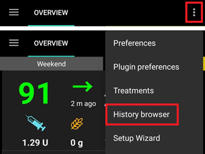
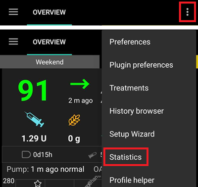
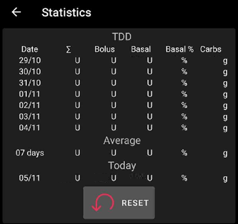
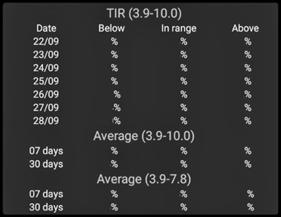
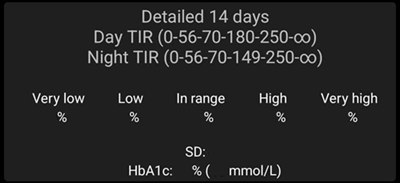
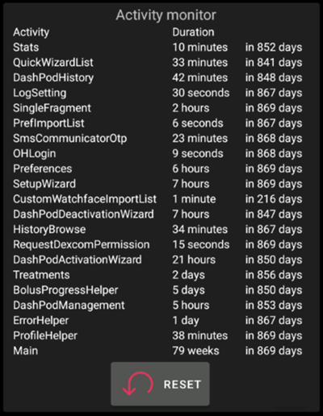

# **資料檢視**

## **AAPS 歷史瀏覽器**

**AAPS** 將所有使用者的歷史（__**血糖****、治療、基礎、目標、**設定檔切換**等）儲存在自己的資料庫中，這些資料無法被匯出或複製，可能需要在一段時間後進行清理。 為了進行清理，需要在**AAPS**中檢視“舊歷史”。 這可以通過上傳至 Nightscout 來完成。

**AAPS**歷史可以透過從總覽選單中的‘歷史’瀏覽器進行檢視。

選擇您想要檢視的日期。

顯示選項與總覽主圖相同。

‘歷史瀏覽器’選單允許選擇以下間隔的顯示時間段：6、12、18 或 24 小時。

‘歷史瀏覽器’可以通過選擇顯示的箭頭向前或向後移動，以符合所需的時間間隔（如下所示）。

要返回實時，請選擇此按鈕：

## **AAPS 統計**

**AAPS**提供基本的監控統計數據。

大多數值是根據 ADA 2023 [建議](https://diabetesjournals.org/care/article/46/Supplement_1/S97/148053/6-Glycemic-Targets-Standards-of-Care-in-Diabetes)引用的。

### 每日總劑量

**TDD**顯示一週的資訊：

- Σ: 每日總胰島素劑量(**TDD**)，即一天內注射的注射劑和基礎胰島素之和。
- 注射: 注射治療和微量注射的總和。
- 基礎: 僅基礎胰島素。
- 基礎%: 在總和中基礎胰島素的比例（**TDD**）。
- 碳水化合物: 所報告的碳水化合物和延長碳水化合物治療。

TDD部分是在您顯示頁面時即時計算的，計算需要幾秒鐘。

### 在範圍內的時間

在範圍內的時間 (**TIR**): 70-180 mg/dl 或 3.9-10 mmol/l。

**TIR**資訊在7天和30天內可用，取決於**AAPS**資料庫中可用資料的多少。

在緊密範圍內的時間(TITR) 70-140 mg/dl 或 3.9-7.8 mmol/l 的統計數據如下。

**與您的內分泌醫生討論目標**

您的糖尿病情況可能會有所不同。 任何建議的目標應與內分泌醫生或支援醫療團隊討論。 如果正確使用，AAPS的統計數據會是追蹤__血糖__趨勢及監測進度的好工具。

詳細的14天**TIR**統計。

**SD**: 標準差，是**[血糖](https://www.ncbi.nlm.nih.gov/pmc/articles/PMC3125941/)**變異性的指標（值越高，情況越差）。

HbA1c: 根據CGM測量的平均計算出的糖化血紅蛋白估計值。 這是一個指標性值，可能不符合血液HbA1c測試結果。

### 活動監視器

活動監控器捕捉每個**AAPS**活動所花費的時間。

------

## **Nightscout與Tidepool之間有什麼區別？**

Nightscout可以幫助使用者儲存**AAPS**的數據，並提供多種[報告工具](https://nightscout.github.io/nightscout/reports/)。

而Tidepool則允許使用者[檢視他們的數據](https://www.tidepool.org/viewing-your-data)，並提供[與內分泌團隊的簡單分享](https://www.tidepool.org/providers/how-it-works#tidepool-data-platform)。