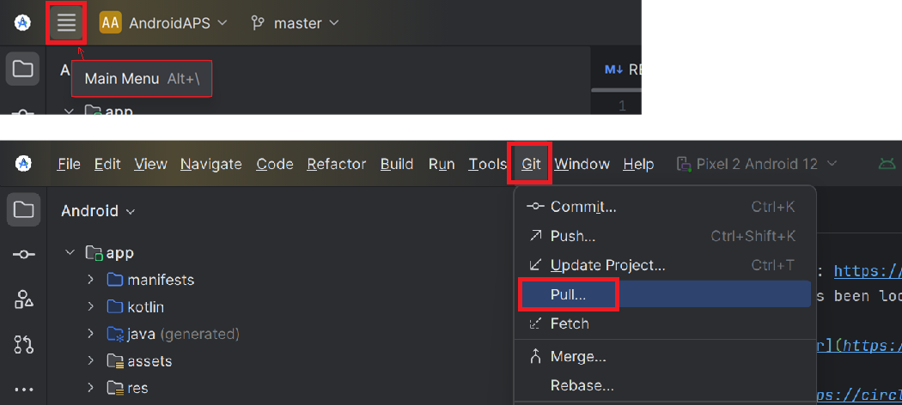
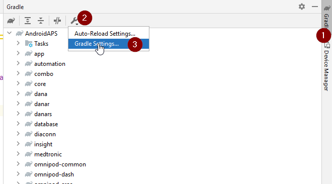

# 更新至 AAPS 3.2.0.4

(update-aaps-3204)=

## 自行建置，而不是下載

**AAPS 應用程式（apk檔案）因醫療設備相關法規而無法下載。 自行建置應用程式以供個人使用是合法的，但你不得將副本提供給他人！**

詳細資訊請參閱 [FAQ 頁面](../UsefulLinks/FAQ.md)。

## 建立 AAPS 3.2.0.4 的電腦及軟體規格

* 可能需要特定版本的 **[Android Studio](https://developer.android.com/studio/)** 來建立 apk。

| AAPS版本                  | 首選<br/>Android Studio<br/>版本 | 替代<br/>Android Studio<br/>版本 | Gradle | JVM |
| ----------------------- | ---------------------------------------- | ---------------------------------------- | ------ |:--- |
| [3.2.0.4](#version3200) | Hedgehog（2023.1.1）                       | 升級至 Meerkat                              | 8.2    | 17  |

"首選版本"已打包與適當的JVM版本。 首選版本也是你可以用來建立**AAPS**的最小版本。 你**無法**在比"首選"版本更舊的版本上建立。 如果使用不同的版本，你可能會遇到與JVM版本相關的問題。 請參閱 [Android Studio 問題排除](#troubleshooting_androidstudio-uncommitted-changes) 頁面以協助解決這些問題。 如果你當前的 Android Studio 版本未在表格中列出，你必須先更新它。

Gradle版本與源代碼相連結，下載/更新源代碼時，你將始終獲得正確的Gradle版本。 此處僅供參考，你不必採取行動。

* [Windows 32位系統](#troubleshooting_androidstudio-unable-to-start-daemon-process)不支援Android Studio。 請記住**64位中央處理器和64位作業系統是必要條件。** 如果你的系統不符合此條件，你必須更換受影響的硬體或軟體，或整個系統。

<table class="tg">
<tbody>
  <tr>
    <th class="tg-baqh">作業系統（僅限64位）</th>
    <td class="tg-baqh">Windows 8或更高版本</td>
    <td class="tg-baqh">Mac OS 10.14或更高版本</td>
    <td class="tg-baqh">任何支援Gnome、KDE或Unity DE的Linux;&nbsp;&nbsp;GNU C Library 2.31或更新版本</td>
  </tr>
  <tr>
    <th class="tg-baqh"><p align="center">CPU（僅限64位）</th>
    <td class="tg-baqh">x86_64 CPU架構；第二代Intel Core或更新版本，或支援<a href="https://developer.android.com/studio/run/emulator-acceleration#vm-windows" target="_blank" rel="noopener noreferrer"><span style="text-decoration:var(--devsite-link-text-decoration,none)">Windows Hypervisor</span></a>的AMD CPU</td>
    <td class="tg-baqh">ARM架構晶片，或支援<a href="https://developer.android.com/studio/run/emulator-acceleration#vm-mac" target="_blank" rel="noopener noreferrer"><span style="text-decoration:var(--devsite-link-text-decoration,none)">Hypervisor.Framework</span></a>的第二代Intel Core或更新版本</td>
    <td class="tg-baqh">x86_64 CPU架構；第二代Intel Core或更新版本，或支援AMD虛擬化（AMD-V）和SSSE3的AMD處理器</td>
  </tr>
  <tr>
    <th class="tg-baqh"><p align="center">記憶體</th>
    <td class="tg-baqh" colspan="3"><p align="center">8GB或更多</td>
  </tr>
  <tr>
    <th class="tg-baqh"><p align="center">硬碟</th>
    <td class="tg-baqh" colspan="3"><p align="center">至少30GB的可用空間。 建議使用SSD。</td>
  </tr>
  <tr>
    <th class="tg-baqh"><p align="center">解析度</th>
    <td class="tg-baqh" colspan="3"><p align="center">1280 x 800 最小<br></td>
  </tr>
  <tr>
    <th class="tg-baqh"><p align="center">網際網路</th>
    <td class="tg-baqh" colspan="3"><p align="center">寬頻</td>
  </tr>
</tbody>
</table>

**強烈建議（不是強制）使用SSD（固態硬碟）而非HDD（硬碟）因為在建置AAPS apk文件時將需要更少時間。** 在建置**AAPS** apk文件時仍可以使用HDD。 如果這樣做，建置過程可能需要很長時間才能完成，但開始後，你可以讓他無需監控地執行。

## 在 3.2.0.4 建立過程中的協助與支援

如果在建置**AAPS**應用的過程中遇到困難，請參考專門的[**Android Studio問題排除**](https://androidaps.readthedocs.io/en/3.2/GettingHelp/TroubleshootingAndroidStudio.html)部分。

如果你認為建置說明中的內容有錯誤、缺失或令人困惑，或仍然感到困難，請與其他**AAPS**用戶群聯繫，群組可在[Facebook](https://www.facebook.com/groups/AndroidAPSUsers)或[Discord](https://discord.gg/4fQUWHZ4Mw)上找到。 如果你想自行更改某些內容（更新螢幕截圖_等_），請提交[拉取請求（PR）](../SupportingAaps/HowToEditTheDocs.md)。

```{note}
此頁面提供 **新** 與舊 (**Classic**) Android Studio 使用者介面的範例圖片。
```

## 更新 3.2.0.x 至 3.2.0.4 的概覽

```{contents} Steps for updating to 3.2.0.4
:depth: 1
:local: true
```

### 匯出您目前的設定

從您手機上現有的 **AAPS** 版本匯出您的設定。 你可能不需要這樣做，但防患於未然更好。

如果您忘記如何做，請參見[匯出與匯入設定](ExportImportSettings.md)頁面。

### 更新您本地的 AAPS 複本

* 使用 Android Studio 開啟你現有的 AAPS 項目。 你可能需要選擇你的項目。 (雙擊) 點擊 AAPS 項目。


<br>


* 在 Android Studio 的選單列中，選擇 Git -> 取回


<br>


* 你將在右下角看到 Fetch 成功的訊息。


<br>


* 在選單列中，現在選擇 Git -> 拉取



<br>


* 保持所有選項不變（origin/master），然後選擇 Pull


<br>


* 等待下載過程進行，你會在底部欄看到進度資訊。 完成後，你將看到成功訊息。

  ```{note}
  更新的檔案可能會有所不同！ 這並不代表指示
  ```


<br>


* Gradle 同步將運行以下載一些相依套件。 等待他完成。


<br>


### 選擇 JVM 版本 17

- 通過單擊 Android Studio 右側的“大象圖示” (1) 打開 Gradle 視圖，並打開設定 (2)，然後選擇 **Gradle 設定** (3)：


<br>



- 在 **Gradle JDK** 欄位中，檢查是否選擇了適當的版本：**jbr-17** (1) 如果沒有，請點擊該欄位，查看是否已經在列表中可選擇。


- 在版本 (1) 中，選擇 **17**。 在供應商 (2) 中選擇 JetBrains Runtime 或其他任何供應商。 位置 (3)：請勿更改。


- 用**OK**關閉**設定**對話框。

### 選擇 AAPS 3.2.0.4 分支

- 在左下角，選擇 Git 圖示，右鍵點擊 3.2.0.4 並檢出。


<br>


### 與 Gradle 同步專案

```{admonition} WARNING!
:class: warning
**切勿更新 Gradle。** 請始終與專案同步。
```

使用大象圖示和與 Gradle 檔案同步專案（或參考 [這個](#gradle-resync)）以便於新 UI。


或（[這裡](https://androidaps.readthedocs.io/en/3.2/GettingHelp/TroubleshootingAndroidStudio.html#gradle-resync)）對於經典 UI。


### 建立簽名的 3.2.0.4 APK

你的原始碼現在是當前已發佈的版本，並且所有前置條件已經檢查過。 現在是時候按照[建立簽署的 APK 部分](#Building-APK-generate-signed-apk)中的說明來建立簽署的 APK。

### 傳輸並安裝 3.2.0.4 APK

你需要將 apk 傳送到手機以便你安裝他。

```{note}
如果你使用相同的現有金鑰庫在 Android Studio 中完成了構建，那麼你不需要刪除手機上的現有應用。 當你安裝 apk 時，按照提示安裝更新。
對於其他情況，例如在 Android Studio 中為你的簽章 apk 建立新密鑰庫，你將需要刪除舊應用程式後再安裝 apk。 **確保匯出你的設定！**
```

請參閱有關[傳送和安裝 AAPS](../SettingUpAaps/TransferringAndInstallingAaps.md)的說明。

### 檢查手機上的 AAPS 版本 3.2.0.4

安裝新 apk 後，你可以點擊右上角的三點選單，然後選擇 "關於"，以檢查手機上的 AAPS 版本。 你應該能看到目前版本。

