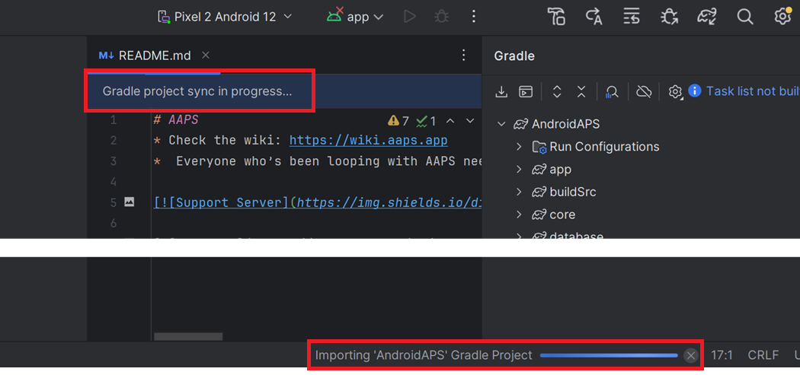

# 更新至新版本或分支

## 自行建置，而不是下載

**AAPS** 無法下載，因為這涉及醫療設備的法規。 自行建置應用程式以供個人使用是合法的，但你不得將副本提供給他人！ 詳細資訊請參閱 [FAQ 頁面](../UsefulLinks/FAQ.md)。

## 重要提示

* 請在有新版本發布後儘快更新到最新版本的 **AAPS**。
* 當有新版本發布時，你將在 **AAPS** 應用中收到關於新版本的訊息橫幅。
* 新版本也會在發布時於 Facebook 上公佈。
* 發布後，請詳細閱讀[發布說明](ReleaseNotes.md)，如有任何疑問，請在Facebook或Discord社群中澄清後再進行更新。
    
    ```{note}
    如果你想在新電腦上建立 **AAPS**：請將你的備份金鑰存檔複製到新電腦上。 然後按照 [初始建置 **AAPS** 程序](../SettingUpAaps/BuildingAaps.md) 的步驟，而不是這個指導。 唯一的不同之處在於，你可以選擇你在新電腦上複製的金鑰存檔，而不必建立新的金鑰存檔。
    ```

## 更新到新版本 AAPS 的概述

```{contents} 更新到新版本 AAPS 的步驟 :depth: 1 :local: true

    <br />如果遇到問題，請參閱針對 [Android Studio 的問題排除](../GettingHelp/TroubleshootingAndroidStudio) 的單獨頁面。
    
    ### 匯出你的設定
    
    從你手機上現有的 **AAPS** 版本匯出你的設定。 你可能不需要這樣做，但防患於未然更好。
    
    如果你不記得如何進行，請參閱 [匯出與匯入設定](ExportImportSettings.md) 頁面。
    
    ### 檢查你的 Android Studio 版本
    
    所需的最小版本已在 [建立指導](#Building-APK-recommended-specification-of-computer-for-building-apk-file) 中說明。 如果你的版本較舊，請 [先更新 Android Studio](#Building-APK-install-android-studio)！
    
    (Update-to-new-version-update-your-local-copy)=
    ### 更新你的本地副本
    
    ```{admonition} 警告
    :class: warning
    如果你是從 2.8.x 之前的版本更新，請遵循指示進行 [新複製](../Installing-AndroidAPS/building-AAPS)，因為本指南對你無效！
    

* 使用 Android Studio 開啟你現有的 AAPS 項目。 你可能需要選擇你的項目。 (雙擊) 點擊 AAPS 項目。
    
    

* 在 Android Studio 的選單欄中，選擇 Git -> Fetch
    
    

* 你將在右下角看到 Fetch 成功的訊息。
    
    

* 在選單欄中，現在選擇 Git -> Pull
    
    

* 保持所有選項不變（origin/master），然後選擇 Pull
    
    

* 等待下載過程進行，你會在底部欄看到進度資訊。 完成後，你將看到成功訊息。
    
    ```{note}
    更新的檔案可能會有所不同！ 這並不代表指示
    ```
    
    

* Gradle 同步將運行以下載一些相依套件。 等待他完成。
    
    

### 檢查 JVM 版本

如果你已經在同一台電腦上建立了 **AAPS** 的先前版本，特別建議進行此檢查。

請在 [建置指示](#Building-APK-recommended-specification-of-computer-for-building-apk-file) 中檢查與你現在要建置的 **AAPS** 版本對應的 JVM 所需版本。 然後按照在 [不相容的 Gradle JVM](#incompatible-gradle-jvm) 中描述的步驟，以確保你當前使用的是正確的版本。

(更新至新版本-建立簽署的 APK)=

### 建置簽章 APK

你的原始碼現在是當前已發佈的版本，並且所有前置條件已經檢查過。 現在是時候按照[建立簽署的 APK 部分](#Building-APK-generate-signed-apk)中的說明來建立簽署的 APK。

(Update-to-new-version-transfer-and-install)=

### 轉移並安裝 APK

你需要將 apk 傳送到手機以便你安裝他。

```{note}
如果你使用相同的現有金鑰庫在 Android Studio 中完成了構建，那麼你不需要刪除手機上的現有應用。 當你安裝 apk 時，按照提示安裝更新。
對於其他情況，例如在 Android Studio 中為你的簽章 apk 建立新密鑰庫，你將需要刪除舊應用程式後再安裝 apk。 **確保匯出你的設定！**
```

請參閱有關[傳送和安裝 AAPS](../SettingUpAaps/TransferringAndInstallingAaps.md)的說明。

(Update-to-new-version-check-aaps-version-on-phone)=

### 檢查手機上的 AAPS 版本

安裝新 apk 後，你可以點擊右上角的三點選單，然後選擇 "關於"，以檢查手機上的 AAPS 版本。 你應該能看到目前版本。


檢查[發佈說明](../Maintenance/ReleaseNotes.md)以了解更新後是否有任何特定的指示。

## 問題排除

如果發生任何錯誤，不要慌張。

先深呼吸！

然後查看專門頁面[問題排除 Android Studio](../GettingHelp/TroubleshootingAndroidStudio)，看看你的問題是否已經紀錄在案！

如果你需要進一步幫助，請聯繫其他**AAPS**使用者，透過[Facebook](https://www.facebook.com/groups/AndroidAPSUsers)或[Discord](https://discord.gg/4fQUWHZ4Mw)。