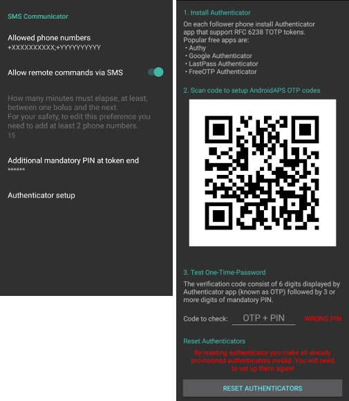
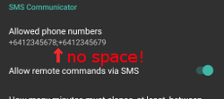

# SMS Commands

```{admonition} Documentation
:class: note

This section may contain outdated content. Please also see the page [SMS Commands](../RemoteFeatures/RemoteControl.md#1-sms-commands)).

```

## Safety First
.
- AAPS allows you to control a child's phone remotely via text message. If you enable this SMS Communicator, always remember that the phone set up to give remote commands could be stolen. So always protect it at least by a PIN code. A strong password or biometrics are recommended.
- Additionally it is recommended to allow a [second phone number](../RemoteFeatures/SMSCommands.md#authorized-phone-numbers) for SMS commands. So you can use second number to [temporary disable](../RemoteFeatures/SMSCommands.md#other) SMS communicator in case your main remote phone gets lost or stolen.
- AAPS will also inform you by text message if your remote commands, such as a bolus or a profile change, have been carried out. It is advisable to set this up so that confirmation texts are sent to at least two different phone numbers in case one of the receiving phones is stolen.
- **If you bolus through SMS Commands you must enter carbs through Nightscout (AAPSClient, Website...)!** If you fail to do so IOB would be correct with too low COB potentially leading to not performed correction bolus as AAPS assumes that you have too much active insulin.
- As of AAPS version 2.7 an authenticator app with a time-based one-time password must be used to increase safety when using SMS commands.

## Setup SMS commands



- Most of the adjustments of temp targets, following AAPS etc. can be done on [AAPSClient app](../RemoteFeatures/RemoteMonitoring.md) on an Android phone with an internet connection.
- Boluses can't be given through Nightscout, but you can use SMS commands.
- If you use an iPhone as a follower and therefore cannot use AAPSClient app, there are additional SMS commands available.
- In your android phone setting go to Applications > AndroidAPS > Permissions and enable SMS

### Authorized phone numbers

- In AAPS go to **Preferences > SMS Communicator** and enter the phone number(s) that you will allow SMS commands to come from (separated by semicolons - i.e. +6412345678;+6412345679)

- Note that the "+" in front of the number may or may not be required based on your location. To determine this send a sample text which will show the received format in the SMS Communicator tab.

- Enable 'Allow remote commands via SMS'.

- If you want to use more than one number:

  - Enter just one number.

  - Make that single number work by sending and confirming a SMS command.

  - Enter additional number(s) separated by semicolon, no space.

    

### Minutes between bolus commands

- You can define the minimum delay between two boluses issued via SMS.
- For safety reasons you have to add at least two authorized phone numbers to edit this value.

### Additionally mandatory PIN at token end

- For safety reasons the reply code must be followed by a PIN.

- PIN rules:

  - 3 to 6 digits
  - not same digits (i.e. 1111)
  - not in a row (i.e. 1234)

### Authenticator setup

- Two-factor authentication is used to improve safety.

- You can use any Authenticator app that supports RFC 6238 TOTP tokens. Popular free apps are:

  - [Authy](https://authy.com/download/)
  - Google Authenticator - [Android](https://play.google.com/store/apps/details?id=com.google.android.apps.authenticator2) / [iOS](https://apps.apple.com/de/app/google-authenticator/id388497605)
  - [LastPass Authenticator](https://lastpass.com/auth/)
  - [FreeOTP Authenticator](https://freeotp.github.io/)

- Install the authenticator app of your choice on your follower phone and scan the QR code shown in AAPS.

- Test the one-time password by entering the token shown in your authenticator app and the PIN you just setup in AAPS. Example:

  - Your mandatory PIN is 2020
  - TOTP token from the authenticator app is 457051
  - Enter 4570512020

- The red text "WRONG PIN" will change **automatically** to a green "OK" if the entry is correct. **There is no button you can press!**

- The time on both phones must be synchronized. Best practice is set automatically from network. Time differences might lead to authentication problems.

- Use button "RESET AUTHENTICATORS" if you want to remove provisioned authenticators.  (By resetting authenticator you make ALL already provisioned authenticators invalid. You will need to set them up again)

## Use SMS commands

- Send a SMS to the phone with AAPS running from your approved phone number(s) using any of the [commands](#commands) below.

- The AAPS phone will respond to confirm success of command or status requested.

- Confirm command by sending the code where necessary. Example:

  - Your mandatory PIN is 2020
  - TOTP token from the authenticator app is 457051
  - Enter 4570512020

**Hint**: It can be useful to have unlimited SMS on your phone plan (for each phone used) if a lot of SMS will be sent.

## Commands

Commands must be sent in English, the response will be in your local language if the response string is already [translated](../SupportingAaps/Translations#translate-strings-for-aaps-app).


### Loop

- LOOP STOP/DISABLE \* Response: Loop has been disabled

- LOOP START/ENABLE \* Response: Loop has been enabled

- LOOP STATUS

  - Response depends on actual status

    - Loop is disabled
    - Loop is enabled
    - Suspended (10 min)

- LOOP SUSPEND 20 \* Response: Loop suspended for 20 minutes

- LOOP RESUME \* Response: Loop resumed

- LOOP CLOSED \* Response: Current loop mode: Closed Loop

- LOOP LGS \* Response: Current loop mode: Low Glucose Suspend

### CGM data

- BG \* Response: Last BG: 5.6 4min ago, Delta: -0,2 mmol, IOB: 0.20U (Bolus: 0.10U Basal: 0.10U)
- CAL 5.6 \* Response: To send calibration 5.6 reply with code from Authenticator app for User followed by PIN \* Response after correct code was received: Calibration sent (**If xDrip is installed. Accepting calibrations must be enabled in xDrip+**)

### Basal

- BASAL STOP/CANCEL \* Response: To stop temp basal reply with code from Authenticator app for User followed by PIN
- BASAL 0.3 \* Response: To start basal 0.3U/h for 30 min reply with code from Authenticator app for User followed by PIN
- BASAL 0.3 20 \* Response: To start basal 0.3U/h for 20 min reply with code from Authenticator app for User followed by PIN
- BASAL 30% \* Response: To start basal 30% for 30 min reply with code from Authenticator app for User followed by PIN
- BASAL 30% 50 \* Response: To start basal 30% for 50 min reply with code from Authenticator app for User followed by PIN

### Bolus

Remote bolus is not allowed within 15 min (this value is editable only if 2 phone numbers added) after last bolus command or remote commands! Therefore the response depends on the time that the last bolus was given.

- BOLUS 1.2 \* Response A: To deliver bolus 1.2U reply with code from Authenticator app for User followed by PIN \* Response B: Remote bolus not available. Try again later.
- BOLUS 0.60 MEAL \* If you specify the optional parameter MEAL, this sets the Temp Target MEAL (default values are: 90 mg/dL, 5.0 mmol/l for 45 mins). \* Response A: To deliver meal bolus 0.60U reply with code from Authenticator app for User followed by PIN \* Response B: Remote bolus not available.
- CARBS 5 \* Response: To enter 5g at 12:45 reply with code from Authenticator app for User followed by PIN
- CARBS 5 17:35/5:35PM \* Response: To enter 5g at 17:35 reply with code from Authenticator app for User followed by PIN
- EXTENDED STOP/CANCEL \* Response: To stop extended bolus reply with code from Authenticator app for User followed by PIN
- EXTENDED 2 120 \* Response: To start extended bolus 2U for 120 min reply with code from Authenticator app for User followed by PIN

### Profile

- PROFILE STATUS \* Response: Profile1
- PROFILE LIST \* Response: 1.\`Profile1\` 2.\`Profile2\`
- PROFILE 1 \* Response: To switch profile to Profile1 100% reply with code from Authenticator app for User followed by PIN
- PROFILE 2 30 \* Response: To switch profile to Profile2 30% reply with code from Authenticator app for User followed by PIN


### Other

- TREATMENTS REFRESH \* Response: Refresh treatments from NS
- NSClient RESTART \* Response: NSCLIENT RESTART SENT
- PUMP \* Response: Last conn: 1 min ago Temp: 0.00U/h @11:38 5/30min IOB: 0.5U Reserv: 34U Batt: 100
- PUMP CONNECT \* Response: Pump reconnected
- PUMP DISCONNECT *30* \* Response: To disconnect pump for *30* minutes reply with code from Authenticator app for User followed by PIN
- SMS DISABLE/STOP \* Response: To disable the SMS Remote Service reply with code Any. Keep in mind that you'll able to reactivate it directly from the AAPS master smartphone only.
- TARGET MEAL/ACTIVITY/HYPO \* Response: To set the Temp Target MEAL/ACTIVITY/HYPO reply with code from Authenticator app for User followed by PIN
- TARGET STOP/CANCEL \* Response: To cancel Temp Target reply with code from Authenticator app for User followed by PIN
- HELP \* Response: BG, LOOP, TREATMENTS, .....
- HELP BOLUS \* Response: BOLUS 1.2 BOLUS 1.2 MEAL

## Troubleshooting

### Multiple SMS

If you receive the same message over and over again (i.e. profile switch) you will probably have set up a circle with other apps. This could be xDrip+, for example. If so, please make sure that xDrip+ (or any other app) does not upload treatments to NS.

If the other app is installed on multiple phones make sure to deactivate upload on all of them.

### SMS commands not working on Samsung phones

There was a report on SMS commands stopping after an update on Galaxy S10 phone. Could be solved by disabling 'send as chat message'.


### Android Messages App

If you are having issues sending or receiving SMS commands with the Android Messages app disable end-to-end ecryption on both caregiver and child's phones.
 - open the specific SMS conversation in Messages
 - Select the options ellipisis in the top right corner
 - select "Details"
 - Activate "Only send SMS and MMS messages"
