(browser-build)=

# 瀏覽器建置

使用 GitHub Actions 建置 AAPS。

**最低支援 AAPS 版本為 3.3.2.1。**

## 自行建置，而不是下載

**AAPS 應用程式（apk檔案）因醫療設備相關法規而無法下載。 自行建置應用程式以供個人使用是合法的，但你不得將副本提供給他人！**

詳細資訊請參閱 [FAQ 頁面](../UsefulLinks/FAQ.md)。

(Building-APK-without-a-computer)=

## 建置 AAPS 的裝置和軟體規格

我們建議使用 Android 裝置。 你也可以使用電腦或 iOS 裝置。

您需要在瀏覽器中使用多個選項卡，並在它們之間切換。 範例 Chrome：

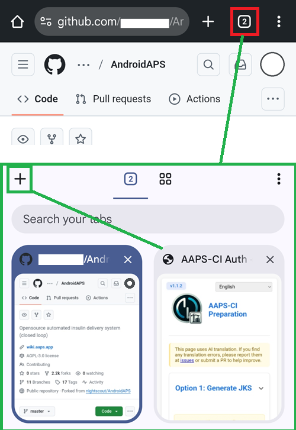

你還需要一個 Google 帳號，以便將應用程式保存在你的 Google 雲端硬碟中。

```{note}
這個維基假設您所有操作都是使用您的行動電話和 Chrome 網頁瀏覽器進行的。  
你會需要在不同的頁籤之間切換，所以在開始之前，你可以先關閉其它頁籤，避免在切換時找不到頁面。
```

(github-fork)=

## 1. AAPS 個人分支

你需要儲存你的個人 Android Java 金鑰和 Google 雲端硬碟資訊於 GitHub 中的 Secrets（稍後會說明如何操作）。

由於這無法在 AndroidAPS 的公開倉庫中完成，你需要製作自己的原始碼副本（稱為分支）。

### GitHub 帳號

如果你尚未擁有帳號，你需要[創建一個 GitHub 帳號](https://github.com/signup)。  
你可以使用電子郵件註冊，也可以透過 Google 註冊。 遵循註冊和驗證過程。

當你擁有帳號後，請[登入 GitHub](https://github.com/login)。

### 分支 AndroidAPS

按照[這個連結](https://github.com/nightscout/AndroidAPS)打開官方 AndroidAPS 倉庫。

點選分支圖示。 這將在你的帳號內創建一個副本。


向下滾動至下一個螢幕並點選**建立分支**。


*注意：如果你想要建置開發版本或自訂版本，你可以**取消選擇**「僅複製主分支」。*


GitHub 現在顯示你個人的 AndroidAPS 副本。 請保持這個瀏覽器頁籤開啟。


(aaps-ci-preparation)=

## 2. 準備步驟

- 如果你是從 Android 裝置建置，請先從 Google Play 商店安裝[File Manager Plus](https://play.google.com/store/apps/details?id=com.alphainventor.filemanager)。

```{admonition} File Manager Plus
:class: dropdown

:::{include} BrowserBuildFileManagerPlus.md
```

- 從這裡下載準備檔案：

  <!--crowdin:disable-->

```{eval-rst}
.. raw:: html

    &nbsp;&nbsp;&nbsp;&nbsp;&nbsp;&nbsp;<a href="../_static/CI/aaps-ci-preparation.html" download style="font-weight: bold; font-size: 20px;">  aaps-ci-preparation.html</a>
```
<br>
<br>
<br>
<!--crowdin:enable-->

AndroidAPS 建置需要私有金鑰，這些金鑰儲存於 Java 金鑰庫（JKS）：

- 如果這是你第一次建立 AAPS（或你沒有 Android Studio 的 JKS），請參考 [AAPS-CI 選項 1 – 產生 JKS](aaps-ci-option1) 來完成設定。

</br>

```{warning}
使用 **選項 1** 建立 AAPS 將不允許您升級現有的 AAPS。
您需要:
1. 在您的手機上[匯出設定](#ExportImportSettings-Automating-Settings-Export)。
2. 將設定檔案從您的手機複製或上傳到外部位置 (例如您的電腦、雲端儲存服務…)。
3. 根據選項 1 的說明生成簽名 apk 的新版本並傳輸至您的手機。
4. 卸載手機上的上一個 AAPS 版本。
5. 在手機上安裝新的 AAPS 版本。
6. [匯入設定](#ExportImportSettings-restoring-from-your-backups-on-a-new-phone-or-fresh-installation-of-aaps) 來恢復您的目標和設定。
7. 從 Nightscout 恢復您的資料。
```

- 如果你想使用自己的 JKS（你在先前的 AAPS 建置中使用的那個 JKS），並且你知道它的密碼和別名（key0），請選擇 [AAPS-CI 選項 2 – 上傳現有的 JKS](aaps-ci-option2)。

</br>

一旦建立，AAPS 應用程式將保存在您的 Google 雲端硬碟中。

(aaps-ci-option1)=
### AAPS-CI 選項 1 – 生成 JKS
 - 適合首次使用者、沒有 JKS 的使用者或忘記密碼或別名的使用者。
- 以下是使用多個平台的範例。
- 在以下列表中選擇您的平台， Android（優先選擇）、iOS 或電腦。

```{tab-set}

:::{tab-item} Android
(aaps-ci-option1-android)=
:::{include} BrowserBuildO1A.md
:::  

:::{tab-item} iOS
(aaps-ci-ios-ipad)=
:::{include} BrowserBuildO1I.md
:::  

:::{tab-item} 電腦
(aaps-ci-option1-computer)=
:::{include} BrowserBuildO1C.md
:::  

```

跳過下一部分，繼續 [這裡](#aaps-ci-google-drive-auth)。

---

(aaps-ci-option2)=

### AAPS-CI 選項 2 – 上傳現有 JKS
 - 適用於已擁有 JKS 並知道 JKS 密碼和別名的使用者（對於 `KEYSTORE_PASSWORD`、`KEY_ALIAS` 和 `KEY_PASSWORD`，請在 GitHub 中輸入您的實際密碼和別名 - 來自 Android Studio，詳情請參閱下方您使用它們的地方）。

```{admonition} KEY + PASSWORDS
:class: dropdown


```

 - 以下是使用多個平台的範例。
 - 在下面的列表中選擇您的平台，Android（首選選擇）或電腦。


```{tab-set}

:::{tab-item} Android
(aaps-ci-option2-android)=
:::{include} BrowserBuildO2A.md
:::  

:::{tab-item} 電腦
(aaps-ci-option2-computer)=
:::{include} BrowserBuildO2C.md
:::  

```

(aaps-ci-google-drive-auth)=

### AAPS-CI Google 雲端硬碟授權

注意：如果您已在影片中跟隨了這部分，現在可以跳到 [這裡](#github-build-apk)。

返回檔案資源管理器 Plus 頁籤。

向下滾動到 Google Drive 認證部分，然後點擊開始認證。

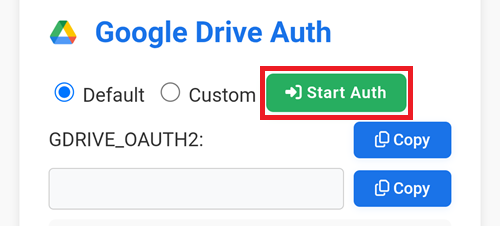

選擇您的 Google 帳號。

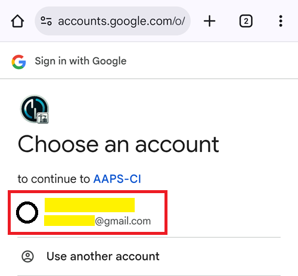

向下滾動並接受存取權限。 該網頁需要此存取權以獲取 Google Drive 認證金鑰。

點擊繼續。

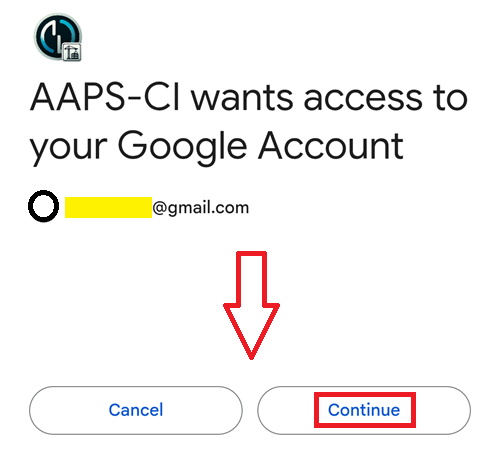

`GDRIVE_OAUTH2` 欄位將會填寫，請點擊上方的複製按鈕。

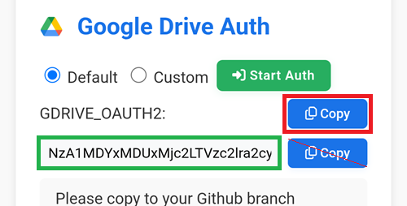

切換回 GitHub 頁籤。

向下滾動到儲存庫密碼並點擊新增儲存庫密碼。

如果您遵循了選項 1，應該會看到這個：


如果您遵循了選項 2，將會有更多金鑰：

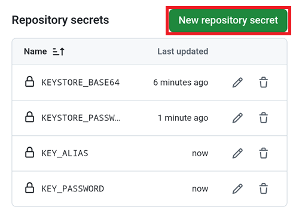

在名稱欄位中，貼上您剛才複製的文字。 在文字框上長按以顯示「貼上」選單。

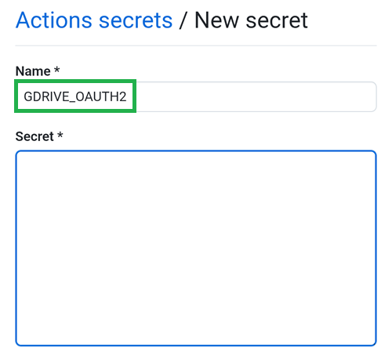

切換到 File Explorer Plus 頁籤。

點擊第二個複製按鈕。

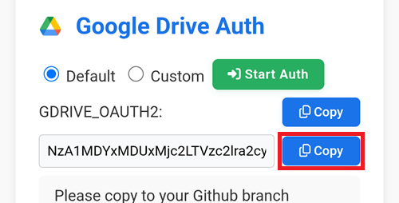

切換回 GitHub 頁籤。

1. 在「secret」」欄位中，貼上您剛才複製的文字。 在文字框上長按以顯示「貼上」選單。

2. 點擊「Add secret」。

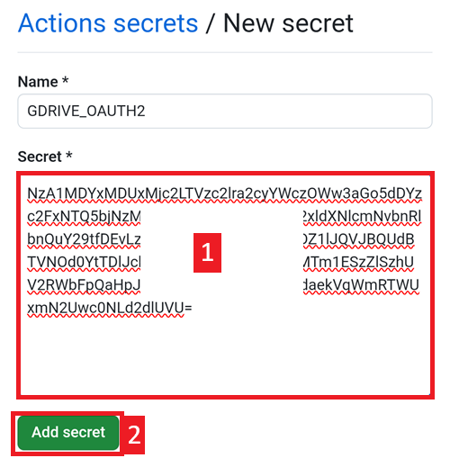

GitHub 現在將能夠將 AAPS apk 檔案儲存在您的 Google Drive 中，一旦建立完成。

(github-build-apk)=
## AAPS-CI GitHub Actions 以建置 AAPS APK
 - 適合一般使用者。

```{tab-set}

:::{tab-item} YouTube
<div align="center" style="max-width: 360px; margin: auto; margin-bottom: 2em;">
  <div style="position: relative; width: 100%; aspect-ratio: 9/16;">
    <iframe
      src="https://www.youtube.com/embed/amfEBwpTtQI"
      style="position: absolute; top: 0; left: 0; width: 100%; height: 100%;"
      frameborder="0"
      allowfullscreen>
    </iframe>
  </div>
</div>
:::  

:::{tab-item} Wiki
:::{include} BrowserBuildCIS.md
:::  

```

### 建構版本選擇

**僅 AAPS 版本 3.3.2.1 及以上將使用瀏覽器方法繼續建構。**

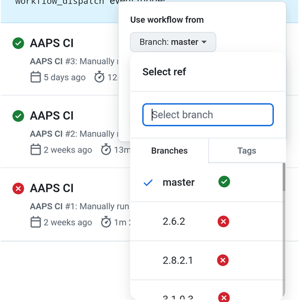

(variant)=

### 建構變數選擇

*注意： Android 和 Android Wear 應用程式將自動建置。*

  - 選擇您需要的變種：
    - fullRelease: 用於正常的幫浦使用，具有完整功能。
    - [aapsclientRelease, aapsclient2Release](#RemoteControl_aapsclient)：適用於看護者（需要 [Nightscout](../SettingUpAaps/Nightscout.md)）。
    - pumpcontrolRelease：替換您的幫浦應用程式/控制器

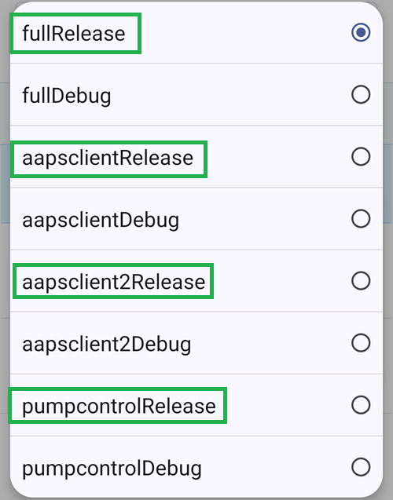

以「Debug」結尾的變數表示 APK 將以除錯模式建立，這對開發者進行故障排除非常有用。

<!-- If you want to test the items in a pull request has been moved to dev page /AdvancedOptions/DevBranch.md -->

(aaps-ci-troubleshooting)=
## AAPS-CI 問題排除

(aaps-ci-preparation-web)=
### aaps-ci-preparation 網頁
  - 當你使用「檔案管理器」打開 aaps-ci-preparation.html 時，它會在你的手機上啟動一個臨時本地伺服器來顯示網頁並接收 Google Refresh token。
  - 如果你看到以下螢幕，這表示你已經一段時間未進行操作，檔案管理器已經關閉本地伺服器。
  - 請使用「檔案管理器」應用程式重新打開 aaps-ci-preparation.html，並完成剩餘步驟。

  

(aaps-ci-disable-software)=
### 停用可能會影響 OAUTH2 授權的軟體
  - 在嘗試獲取 OAUTH2 金鑰之前，請停用電話上的任何 VPN 或安全應用程式（防火牆、反惡意軟體等）。

(aaps-ci-actions-permission)=
### 檢查 GitHub Actions 權限設定
  - 請確保 GitHub Actions 政策設置為「Allow all actions and reusable workflows」（Settings → Actions → General）。

  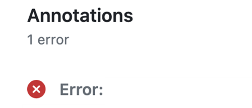

`actions/checkout@v4` 和 `actions/setup-java@v4` 不允許在 `xxxxx/AndroidAPS` 中使用。 此工作流程中的操作必須位於 `xxxxx` 擁有的儲存庫內

--------

```{warning}
Google 雲端硬碟授權中的「自訂」欄位，適合熟悉Google Oauth2的人，並且想要使用自已的ClientID時使用。 僅供你參考。
```

(github-cherry-pick)=

## 如果你想將特定的提交添加到你的分支，請使用 cherry-pick。

  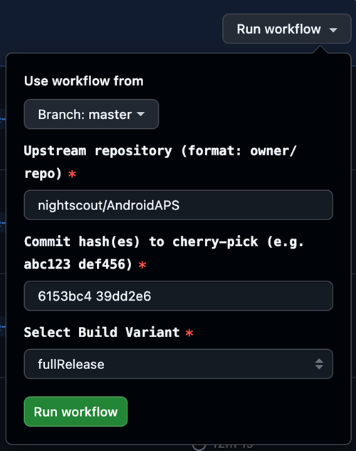

  - Use workflow from Branch：請輸入你想要 cherry-pick 到的分支名稱。
  - Upstream Repository：請輸入你想要 cherry-pick 的庫名稱。
  - Commit SHA：請輸入你想要 cherry-pick 的提交 SHA（像 git commit hash）。
  - Select Build Variant： [變體](variant)