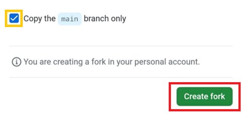
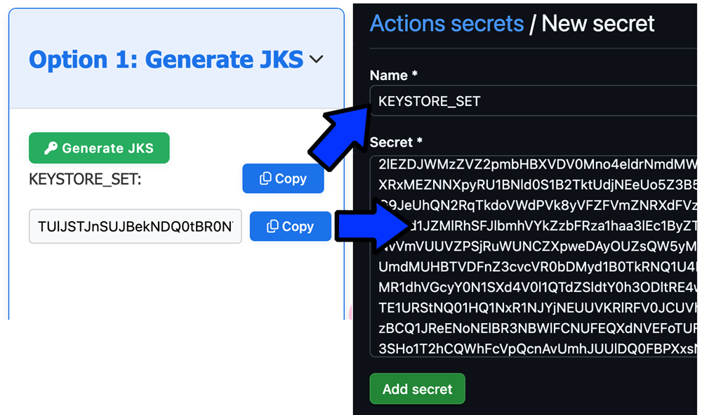
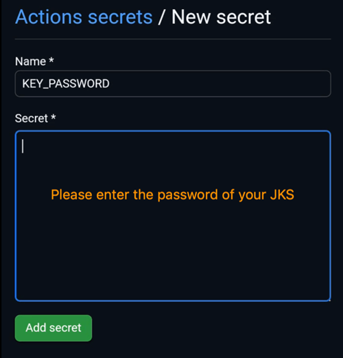

# 瀏覽器建置

使用 GitHub Actions 建置 AAPS。

**最低支援 AAPS 版本為 3.3.2.1。**

## 自行建置，而不是下載

**AAPS 應用程式（apk檔案）因醫療設備相關法規而無法下載。 自行建置應用程式以供個人使用是合法的，但你不得將副本提供給他人！**

詳細資訊請參閱 [FAQ 頁面](../UsefulLinks/FAQ.md)。

(Building-APK-without-a-computer)=

## 建置 AAPS 的裝置和軟體規格

你需要一個可在 Android 或 iOS 上運作的瀏覽器

您還需要一個 Google 帳號，以便將應用程式保存在您的 Google 雲端硬碟中。

```{note}
本維基假設您使用 Android 手機和 Chrome 瀏覽器進行所有操作。  
您將需要在不同的標籤之間切換：從所有標籤關閉開始，以避免在切換時迷失。
```

(github-fork)=

## 1. AAPS 個人分支

您需要秘密儲存您的個人 Android Java 金鑰和 Google 雲端硬碟資訊於 GitHub（稍後我們將會說明如何操作）。

由於這無法在 AndroidAPS 的公開倉庫中完成，您需要製作自己的原始碼副本（稱為分支）。

### GitHub 帳號

如果您尚未擁有帳號，您需要[創建一個 GitHub 帳號](https://github.com/signup)。  
您可以使用電子郵件註冊，也可以透過 Google 註冊。 遵循註冊和驗證過程。

當您擁有帳號後，請[登入 GitHub](https://github.com/login)。

### 分支 AndroidAPS

按照[這個連結](https://github.com/nightscout/AndroidAPS)打開官方 AndroidAPS 倉庫。

點選分支圖示。 這將在您的帳號內創建一個副本。


向下滾動至下一個螢幕並點選**建立分支**。


*注意：如果您想要建置開發版本或自訂版本，您可以**取消選擇**「僅複製主分支」。*



GitHub 現在顯示您個人的 AndroidAPS 副本。 請保持這個瀏覽器頁籤開啟。


(aaps-ci-preparation)=

## 2. 準備步驟

- 如果您是從 Android 裝置建置，請先從 Google Play 商店安裝[File Manager Plus](https://play.google.com/store/apps/details?id=com.alphainventor.filemanager)。
```{eval-rst}
.. <pre style="font-family: inherit; margin: 0;">
       • 從<a href="../_static/CI/aaps-ci-preparation.html" download>這裡</a>下載準備檔案
</pre><br />

```

AndroidAPS 建置需要私有金鑰，這些金鑰儲存於 Java 金鑰庫（JKS）：

- 如果這是您第一次建立 AAPS（或您沒有 Android Studio 的 JKS），請參考 [AAPS-CI 選項 1 – 產生 JKS](aaps-ci-option1) 來完成設定。
- 如果您想使用自己的 JKS（您在先前的 AAPS 建置中使用的那個 JKS），並且你知道它的密碼和別名（key0），請選擇 [AAPS-CI 選項 2 – 上傳現有的 JKS](aaps-ci-option2)。

```{warning}
使用 **選項 1** 建立 AAPS 將無法更新已安裝的 AAPS：您需要卸載它，重新安裝後，從你的手機恢復設定，並從 Nightscout 讀取資料。
```

AAPS 應用程式在建立後會保存在您的 Google 雲端硬碟中：

- 同時執行 Google 雲端硬碟 [授權](aaps-ci-google-drive-auth) 以允許將建置保存到那裡。

(aaps-ci-option1)=
### AAPS-CI 選項 1 – 生成 JKS
 - 適合首次使用者、沒有 JKS 的使用者或忘記密碼或別名的使用者。

 Android 適用
```{eval-rst}
.. raw:: html

    <!--crowdin: exclude-->
    <div align="center" style="max-width: 360px; margin: auto; margin-bottom: 2em;">
      <div style="position: relative; width: 100%; aspect-ratio: 9/16;">
        <iframe
          src="https://www.youtube.com/embed/t1VlnCpm-A4"
          style="position: absolute; top: 0; left: 0; width: 100%; height: 100%;"
          frameborder="0"
          allowfullscreen>
        </iframe>
      </div>
    </div>
```

 iOS 適用（以 iPad 為例）
```{eval-rst}
.. raw:: html

    <!--crowdin: exclude-->
    <div align="center" style="max-width: 360px; margin: auto; margin-bottom: 2em;">
      <div style="position: relative; width: 100%; aspect-ratio: 9/16;">
        <iframe
          src="https://www.youtube.com/embed/pA-z1ODrSps"
          style="position: absolute; top: 0; left: 0; width: 100%; height: 100%;"
          frameborder="0"
          allowfullscreen>
        </iframe>
      </div>
    </div>
```

- 如影片所示，請將其複製到相應的欄位中。



(aaps-ci-option2)=
### AAPS-CI 選項 2 – 上傳現有 JKS
 - 適合已經擁有 JKS 並且知道 JKS 密碼和別名的用戶。
```{eval-rst}
.. raw:: html

    <!--crowdin: exclude-->
    <div align="center" style="max-width: 360px; margin: auto; margin-bottom: 2em;">
      <div style="position: relative; width: 100%; aspect-ratio: 9/16;">
        <iframe
          src="https://www.youtube.com/embed/L5L3XtnszMQ"
          style="position: absolute; top: 0; left: 0; width: 100%; height: 100%;"
          frameborder="0"
          allowfullscreen>
        </iframe>
      </div>
    </div>
```

- 如影片所示，請將其複製到相應的欄位中。


- 對於 KEYSTORE_PASSWORD、KEY_ALIAS 和 KEY_PASSWORD，請在 GitHub 中輸入您的實際密碼和別名。




(aaps-ci-google-drive-auth)=
### AAPS-CI Google 雲端硬碟授權
- 點選開始授權以開始授權過程，並在授權後將獲得的TOKEN設定在 GitHub 中。


(github-build-apk)=
## AAPS-CI GitHub Actions 以建置 AAPS APK
 - 適合一般使用者。
```{eval-rst}
.. raw:: html

    <!--crowdin: exclude-->
    <div align="center" style="max-width: 360px; margin: auto; margin-bottom: 2em;">
      <div style="position: relative; width: 100%; aspect-ratio: 9/16;">
        <iframe
          src="https://www.youtube.com/embed/amfEBwpTtQI"
          style="position: absolute; top: 0; left: 0; width: 100%; height: 100%;"
          frameborder="0"
          allowfullscreen>
        </iframe>
      </div>
    </div>
```
  - 在 GitHub 中，前往 Actions，選擇 AAPS-CI，然後點擊運行工作流以開始建置 APK。

*注意： Android 和 Android Wear 應用程式將自動建置。*

  

  - 變體：
    - 請參考 [變體](variant)

<!-- If you want to test the items in a pull request has been moved to dev page /AdvancedOptions/DevBranch.md -->

(aaps-ci-troubleshooting)=
## AAPS-CI 問題排除

  (aaps-ci-preparation)= ### aaps-ci-preparation 網頁
  - 當您使用「檔案管理器」打開 aaps-ci-preparation.html 時，它會在您的手機上啟動一個臨時本地伺服器來顯示網頁並接收 Google Refresh token。
  - 如果您看到以下螢幕，這表示您已經一段時間未進行操作，檔案管理器已經關閉本地伺服器。
  - 請使用檔案管理器應用程式重新打開 aaps-ci-preparation.html，並完成剩餘步驟。

  


--------

```{warning}
「自訂」欄位適合熟悉Google Oauth2的人想要使用自已的ClientID時使用。 僅供您參考。
```

(github-cherry-pick)=

## 如果您想將特定的提交添加到您的分支，請使用 cherry-pick。

  

  - 使用來自分支的工作流：請輸入您想要 cherry-pick 到的分支名稱。
  - 上游庫：請輸入您想要 cherry-pick 的庫名稱。
  - 提交 SHA：請輸入您想要 cherry-pick 的提交 SHA（類似於 git 提交哈希）。
  - 選擇建構變體： [變體](variant)