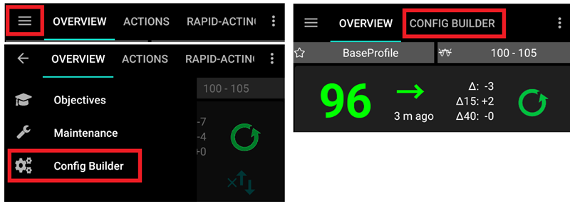
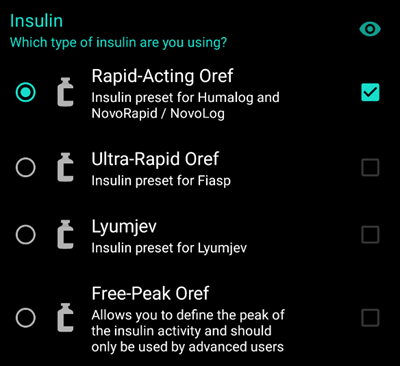
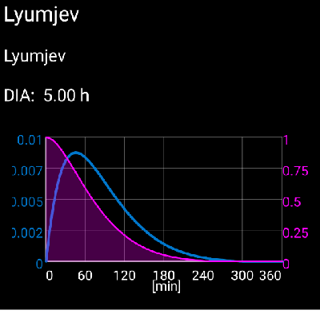
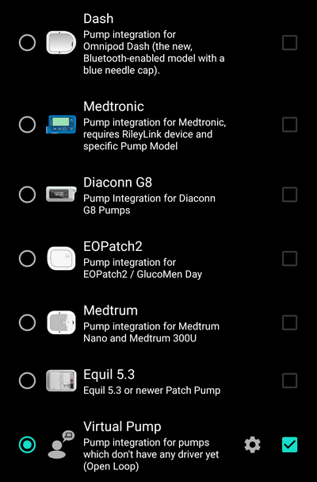

# 組態建置工具

根據你的設定，你可以透過**AAPS**螢幕頂部的選項卡或漢堡選單來開啟組態建置工具。



強調**組態建置工具**是用來開啟和關閉模組功能的選項卡。 在下方圖片中，左側的方框 (A) 讓你選擇想要啟用的模組。 預設情況下，開啟組態建置工具時，區塊會收起來，只顯示活動中的外掛。 點擊箭頭 (G) 來顯示所有可用選項。 右側的方框 (C) 讓你將活動中的模組以選項卡 (E) 的方式顯示在 **AAPS** 中。 如果右側的方框未被啟動，你可以使用螢幕左上方的漢堡選單 (D) 來進入該功能。 請參閱下面的[選項卡或漢堡選單](#tab-or-hamburger-menu)。

當模組內有額外設定可用時，你可以點擊齒輪圖示 (B)，這將帶你進入偏好設定中的具體設定。


(Config-Builder-tab-or-hamburger-menu)=

## 標籤或選單

透過眼睛圖示下方的選框，你可以決定如何開啟相應的程式區段。


```{contents}
:backlinks: entry
:depth: 2
```

(ConfigBuilder_Profile)=

## 設定檔

此模組無法停用，因為它是**AAPS**的核心部分。

請參閱[你的 AAPS 個人設定](../SettingUpAaps/YourAapsProfile.md)以基本了解你的**個人設定**中包含的內容。

(Config-Builder-insulin)=

## 胰島素



選擇你正在使用的胰島素類型。

有關如何理解**AAPS**中顯示的胰島素個人設定的更多資訊，請[查看這裡](#AapsScreens-insulin-profile)。

### 胰島素類型差異

* 選項 'Rapid-Acting Oref'、'Ultra-Rapid Oref'、'Lyumjev' 和 'Free-Peak Oref' 都具有指數形狀。
* 對於 'Rapid-Acting'、'Ultra-Rapid' 和 'Lyumjev'，DIA 是唯一可以自行調整的變數，峰值時間是固定的。 
* Free-Peak 允許你同時調整 DIA 和峰值時間，這僅應由了解這些設置效果的進階使用者使用。 
* 該[胰島素曲線圖](#AapsScreens-insulin-profile)幫助您理解不同的曲線。

#### Rapid-Acting Oref


* 推薦用於 Humalog、Novolog 和 Novorapid
* DIA = 至少 5.0 小時
* 峰值 峰值 = 注射後 75 分鐘（固定，不可調整）

#### Ultra-Rapid Oref


* 推薦用於 FIASP
* DIA = 至少 5.0 小時
* 峰值 峰值 = 注射後 55 分鐘（固定，不可調整）

(Config-Builder-lyumjev)=

#### Lyumjev



* Lyumjev 的特殊胰島素設定檔
* DIA = 至少 5.0 小時
* 峰值 峰值 = 注射後 45 分鐘（固定，不可調整）

#### Free Peak Oref


* 使用 "自由峰值 Oref" 設定檔，你可以單獨輸入峰值時間。 要這麼做，點擊齒輪圖示以進入進階設定。
* 如果設定檔中未指定更高值，則 DIA 自動設置為 5 小時。
* 如果使用無背景支援的胰島素或不同胰島素的混合物，建議使用此效果設定檔。

(Config-Builder-bg-source)=

## 血糖來源

選擇你正在使用的血糖來源。 請參閱[血糖來源](../Getting-Started/CompatiblesCgms.md)頁面以獲取更多設置資訊。


* [xDrip+](../CompatibleCgms/xDrip.md)
* [NSClient 血糖](../CompatibleCgms/CgmNightscoutUpload.md) - 僅當你清楚操作時，查看[血糖來源](../Getting-Started/CompatiblesCgms.md)。
* [MM640g](../CompatibleCgms/MM640g.md)
* [Glimp](#libre1-using-glimp) - 僅支援版本 4.15.57 及更新版本
* [自建你的 Dexcom 應用程式 (BYODA)](#DexcomG6-if-using-g6-with-build-your-own-dexcom-app)。
* [Poctech](../CompatibleCgms/PocTech.md)
* [Tomato 應用程式](#libre1-using-tomato)，用於 MiaoMiao 裝置
* [Glunovo 應用程式](https://infinovo.com/) 用於 Glunovo CGM 系統
* [歐泰(Ottai)](../CompatibleCgms/OttaiM8.md)
* [Syai Tag](../CompatibleCgms/SyaiTagX1.md)
* 隨機血糖：生成隨機血糖資料（僅限演示模式）

## 平滑


請參閱[平滑血糖資料](../CompatibleCgms/SmoothingBloodGlucoseData.md)。

(Config-Builder-pump)=

## 幫浦

選擇你正在使用的幫浦。 請參閱[相容的幫浦](../Getting-Started/CompatiblePumps.md)頁面以獲取更多設置資訊。

 

* [Dana R](../CompatiblePumps/DanaR-Insulin-Pump.md)
* Dana R Korean（適用於國內 DanaR 幫浦）
* Dana Rv2（升級了非官方韌體的 DanaR 幫浦）
* [Dana-i/RS](../CompatiblePumps/DanaRS-Insulin-Pump.md)
* [Accu Chek Insight](../CompatiblePumps/Accu-Chek-Insight-Pump.md)
* [Accu Chek Combo](../CompatiblePumps/Accu-Chek-Combo-Pump-v2.md)
* Omnipod 用於[Omnipod Eros](../CompatiblePumps/OmnipodEros.md)
* Dash 用於[Omnipod DASH](../CompatiblePumps/OmnipodDASH.md)
* [Medtronic](../CompatiblePumps/MedtronicPump.md)
* [Diaconn G8](../CompatiblePumps/DiaconnG8.md)
* [EOPatch2](../CompatiblePumps/EOPatch2.md)
* [Medtrum](../CompatiblePumps/MedtrumNano.md)
* [Equil 5.3](../CompatiblePumps/Equil5.3.md)
* 虛擬幫浦：開放循環 - 僅限**AAPS**建議 
  * 當你開始使用**AAPS**時，在首次[完成目標](../SettingUpAaps/CompletingTheObjectives.md)的過程中
  * 針對尚未擁有驅動程式的幫浦

## 敏感性偵測

選擇你正在使用的敏感性偵測類型。 欲了解不同設計的更多詳細資訊，請[在這裡閱讀](../DailyLifeWithAaps/SensitivityDetectionAndCob.md)。 此功能會即時分析歷史資料，並在你對胰島素的反應比平常更敏感（或相反，更具抗性）時進行調整。 更多關於敏感性演算法的詳細資訊請參閱[OpenAPS 文件](https://openaps.readthedocs.io/en/latest/docs/Customize-Iterate/autosens.html)。

你可以在主畫面上查看你的敏感性，顯示在[額外圖表](#AapsScreens-section-g-additional-graphs)中。 你可以在主畫面上選擇 SEN 並觀看白線來查看你的敏感性狀況。 請注意，您需要在[目標 8](#objectives-objective8)中，以便讓敏感度檢測/[自動敏感調整](#Open-APS-features-autosens)所提供的胰島素量。 在達到該目標之前，Autosens 的百分比/圖表中的線僅供參考。

### 吸收設定

如果你使用 Oref1 與**SMB**，你必須將**min_5m_carbimpact**改成 8。 該值僅在**CGM**讀數缺口期間或當身體活動“消耗”所有本應導致**AAPS**降解 COB 的血糖上升時使用。 在無法根據你的血液反應動態計算[碳水化合物吸收](../DailyLifeWithAaps/CobCalculation.md)的情況下，系統會插入碳水化合物的預設衰減。 基本上，這是一個安全保護機制。

(Config-Builder-aps)=

## APS

選擇用於治療調整的 APS 演算法。 你可以在 OpenAPS (OAPS) 標籤中查看選定演算法的活動詳情。

* OpenAPS AMA 
  * 進階餐點輔助：不再建議使用的舊演算法。
  * 簡單來說，這些好處是在你提供餐前注射後，系統可以更快進行高溫调节，前提是你可靠地輸入碳水化合物。
* [OpenAPS SMB](#Open-APS-features-super-micro-bolus-smb) 
  * 超微量注射：建議所有用戶使用的最新演算法。
  * 與 AMA 不同，SMB 不使用臨時基礎率來控制血糖水平，而主要使用小型**超微量注射**。
  * 注意：建議你從一開始就使用這個演算法，儘管你實際上直到[目標 9](#objectives-objective9)才會收到 SMB。

如果從 AMA 切換到 SMB 演算法，*min_5m_carbimpact* 必須手動更改為**8**（SMB 的預設值），在[偏好設定 > 敏感性檢測 > 敏感性 Oref1 設定](../SettingUpAaps/Preferences.md)中進行。

## 循環

此模組不應停用，因為它是**AAPS**的核心部分。

## 約束條件

### 目標

**AAPS**有一個學習計畫（一系列目標），你需要逐步完成。 這將引導你安全地設置閉合循環系統。 他保證你已正確設置所有內容，並了解系統的具體操作。 這是你可以信任系統的唯一方式。

請參閱[目標](../SettingUpAaps/CompletingTheObjectives.md)頁面以獲取更多資訊。

## 同步選項

在這部分中，你可以選擇要將**AAPS**將資料傳送到哪裡。

### NSClient 或 NSClientV3

可用作[報告伺服器](../SettingUpAaps/SettingUpTheReportingServer.md)以及/或[遠端監控](../RemoteFeatures/RemoteMonitoring.md)、[遠端控制](../RemoteFeatures/RemoteControl.md)。

請參閱[與報告伺服器的同步](#SetupWizard-synchronization-with-the-reporting-server-and-more)幫助你選擇 NSClient (v1) 和 NSClientV3。

### Tidepool

可用作[報告伺服器](../SettingUpAaps/SettingUpTheReportingServer.md)。

請參閱[Tidepool](../SettingUpAaps/Tidepool.md)。

### xDrip

用於**傳送**資料，例如治療方式給 xDrip+。

### Open Humans

請參閱[Open Humans](../SupportingAaps/OpenHumans.md)。

### Wear

使用你的 Android WearOS 手錶來監控和控制**AAPS**（請參見[錶盤頁面](../WearOS/WearOsSmartwatch.md)）。

### 三星 Tizen

將資料傳送到三星的 G-Watch Wear 應用程式 (Tizen OS).

### Garmin

連接到 Garmin 設備（Fenix、Edge...）

## 治療

如果你查看「治療」（Treat）標籤，你可以看到已上傳到 Nightscout 的治療紀錄。 如果您希望編輯或刪除一個項目（例如，您攝取的碳水化合物少於預期），請選擇「移除」，然後透過 [主螢幕上的碳水化合物按鈕](#screens-bolus-carbs) 輸入新值（如有必要可以更改時間）。

## 一般問題

### 首頁總覽

這是**AAPS**的[主畫面](#AapsScreens-the-homescreen)，不可停用。

#### 在治療對話框中顯示備註欄位

選擇是否要在輸入治療時顯示備註欄位。

#### 狀態燈

選擇是否要在首頁總覽中顯示[狀態燈](#Preferences-status-lights)，顯示導管時間、胰島素時間、傳感器時間、電池時間、儲液罐液位或電池電量。 當達到警告等級時，狀態燈的顏色會變為黃色。 關鍵時間將顯示為紅色。

#### 進階設定

**交付此部分注射嚮導結果：**使用 SMB 時，許多人不會進行 100% 的餐前注射，而只注射一部分（例如 75%），其餘部分由 SMB 和 UAM（無人操作餐點偵測）處理。 在這個設定中，您可以為注射嚮導計算的百分比選擇一個預設值。 如果此設置為 75%，而你需要注射 10 單位，注射嚮導將建議餐前注射 7.5 單位。

**在嚮導中啟用超級注射功能**（與*超微量注射*不同！）：請謹慎使用，在瞭解其真正作用之前不要啟用。 基本上，接下來兩個小時的基礎率將加到注射中，並啟用兩小時的0基礎率。 **AAPS 的循環功能將停用——請小心使用！** 如果您使用 SMB，根據您在[“限制 SMB 的最大基礎分鐘數”](#Open-APS-features-max-minutes-of-basal-to-limit-smb-to)的設定，AAPS 循環功能將被停用；如果您不使用 SMB，則循環功能將在兩小時內被停用。詳細的超注射資訊可以在[這裡](https://www.diabetesnet.com/diabetes-technology/blue-skying/super-bolus)找到。

(Config-Builder-actions)=

### 操作

一個選項卡提供多個按鈕在**AAPS**中進行[操作](#screens-action-tab)。

### 自動化

一個選項卡用於管理你的[自動化](../DailyLifeWithAaps/Automations.md)，從[目標 10](#objectives-objective10)開始。

(Config-Builder-sms-communicator)=

### SMS(簡訊) 通訊器

允許遠端照護人員透過簡訊控制某些**AAPS**功能，請參閱[簡訊指令](../RemoteFeatures/SMSCommands.md)以獲取更多設置資訊。

### 食物

顯示 Nightscout 食物資料庫中定義的食物預設值，更多設定資訊請參閱[Nightscout 讀我](https://github.com/nightscout/cgm-remote-monitor#food-custom-foods)。

注意：項目無法在**AAPS**計算機中使用。 （僅供檢視）

(Config-Builder-wear)=

### Wear

使用您的 Android Wear 手錶監控和控制 AAPS（請參見[錶盤頁面](../WearOS/WearOsSmartwatch.md)）。 使用設置（齒輪圖示）來定義在透過手錶進行注射時應考慮哪些變數（例如 15 分鐘趨勢，COB...）。

如果你想要透過手錶進行注射等操作。 那麼在「Wear 設置」中需要啟用「從手錶進行控制」。


透過 Wear 標籤或選單（螢幕左上角的選單圖示，如果標籤未顯示）你可以

* 重新發送所有資料。 如果手錶長時間未連線，你可能希望將訊息推送到手錶。
* 直接從手機上打開手錶的設置。

### 維護

進入此選項卡以匯出/匯入設定。

### 組態建置工具

當前選項卡。