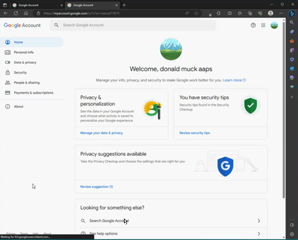

# 為 AAPS 建立專用的 Google 帳戶（可選）

Some **AAPS** users prefer to use their main email account for **AAPS** as well. Alternatively, some **AAPS** users (or their caregivers) set-up a dedicated **AAPS** email account - this is optional, we give an example of how to do it below.

If you don't want to set up an **AAPS**-dedicated Gmail account, you can just go straight to the next section, [building AAPS](../SettingUpAaps/BuildingAaps.md).

```{admonition} Advantages of a dedicated Google account for AAPS
:class: dropdown

- Dedicated Google drive space means you will not risk filling up your personal Google drive limit with **Export Preferences**.
- Each version of **AAPS** (and supporting apps like xdrip+, BYODA, etc) will be stored in one single place which is independent of your computer hardware. If your PC or phone is stolen/lost/broken you will still have access.
- By harmonizing the setup, it will make online support simpler across users with similar folder structure.
- Depending on the setup (see below), you will have a separate identity as an alias to communicate within the community which can protect your privacy. 
- Children with T1D can preserve their own “everyday” email account as minors while using **AAPS** and associated features which require an adult account.
- Gmail allows you to register up to 4 accounts under the same phone number.
```

## 如何為AAPS設置專用的Google帳號

(⌛大約10分鐘)


需求：

* You have a Windows’ PC (Windows 10 or newer) and a Android phone (Android 9 or newer) which will host the **AAPS** app. 這些設備都已安裝最新的安全更新，具備網際網路連線和管理員權限，因為某些步驟需要下載和安裝程式。
* Android手機已經設置了你的個人“日常”電子郵件地址，例如Gmail帳號。

```{admonition} Things to consider when setting up your new account
:class: dropdown
- You could use a name different to your own, which has relevance to the account (like t1dsuperstar) for privacy reasons. You can then use it in **AAPS** public forums while keeping your own identity private. Since Google requires a recovery email and phone number, it is still traceable.
- The new **AAPS** account will use the same phone number for verification as your “_everyday_” one. It will use the “everyday” email address for verification;
- We will setup email forwarding such that any email sent to the new dedicated AAPS account will be forwarded to the primary one (so there is no need to check two different mailboxes);
- Use separate passwords for your _everyday_ Gmail account and the AAPS-dedicated Gmail account
- If you use google “2-step verification” (aka multifactor) authentication for one Gmail account, you might as well do it for both Gmail accounts.
- If you plan to use Google “Passkeys”, make sure you register multiple devices. This is so you don’t lock yourself out. Only do it on devices that nobody else can access (_i.e._ not on a PC with a shared account that other people can unlock).
```
 

```{admonition}  Video Walkthrough! 
:class: Note
Click [here](<https://drive.google.com/file/d/1dMZTIolO-kd2eB0soP7boEVtHeCDEQBF/view?usp=drive_link>) for a video walkthrough of how to set up a dedicated Google account.
```

 影片中概述的步驟如下：

In this example: 
- Your existing “_Everyday_” Google account is <donald.muck42@gmail.com> ; 
- Your new “_AAPS_” Gmail account will be: <donald.muck42.aaps@gmail.com>; 


#### Go to <https://account.google.com> 

 If you are already logged into Google, this will direct you to your “Everyday” **My Account** page. (1) Click on the top right of the page on your profile picture (in this case, a simple  (2) select “_add another account_”.


#### Enter your NEW dedicated account details: 

- Enter the new account: 
- 建立帳號
- for my personal use. 


 #### 輸入你的個人資料：
 - 輸入名字
 - 姓氏
 - 出生日期（需要是成年人年齡）

#### Choose your NEW email address & password

This example appends “.AAPS” to Donald Muck’s existing one…\
Set a password

####  Enter a phone number which can receive the SMS verification

Gmail現在將向你發送一個唯一的驗證碼。

#### Enter the recovery email address 

In this case it will be your existing “_everyday_” email…

#### 完成帳號設置

Gmail將顯示帳號名稱。 It will ask you to accept Gmail’s terms and conditions & confirm your personalization settings.

#### 自定義新個人資料顯示

At this point you should be on Gmail’s MyAccount page showing your new **AAPS**-dedicated email account. 預設情況下，個人資料圖片會設置為你名字的第一個字母。 Change it to something unique to avoid confusion… in this example, Donald.Muck.AAPS has replaced  with 

\


#### 在兩個視窗中打開Gmail網站來配置新帳號

So that you don’t need to monitor a separate email account, forward all the emails from the new **AAPS**-dedicated account to your everyday account \
This part can be a bit confusing, since you will have to switch back and forth between both accounts. 為了使操作更簡單，將兩個獨立的瀏覽器視窗堆疊在一起：

1. Move your existing browser to the top of your screen and resize it such that it only takes about half of the top of the screen… 
2. Right click on your Browser logo in your taskbar 
3. From the menu select “New Window”... and adjust it so it only takes the bottom half of the screen.

Open <https://gmail.com>  in each browser window. Make sure your personal account is on top and the new dedicated **AAPS** account is on the bottom, and is easily identifiable by the profile picture in the top right corner. （如果需要，你可以隨時透過點擊個人資料圖片切換帳號並選擇正確的帳號）。


Your Gmail homepages screen should look like this:\


 #### In the new Gmail account (bottom window), open Gmail settings… 

- Click on the gear on the left of the profile picture 
- then select “**See all Settings**”


#### 設置轉發…

- 點擊“轉發和POP/IMAP”設置標籤
- 點擊“新增轉發地址”
- 添加你的“日常”電子郵件地址
- Gmail will send a verification code to your “everyday” email address. 
- 你需要切換回你的日常帳號，並點擊連結來驗證你接受轉發（或者從Gmail的驗證電子郵件中獲取驗證碼，然後將其粘貼到你的“新AAPS專用”Gmail視窗中）。

這樣雖然需要在兩個視窗之間來回切換，但當你檢查“日常”帳號的郵件時，也會看到從AAPS專用帳號轉發的郵件，例如Gmail警報。


#### 驗證轉發的電子郵件地址

- In the “Everyday” gmail (top window), you will get the “Gmail forwarding Confirmation” email. 
- 打開郵件並“點擊連結確認請求”

#### 將轉發的郵件存檔在新專用的Gmail帳號中（底部視窗）

<!---->

1. 重新整理底部視窗
2. 勾選“轉發收到的電子郵件”
3. 並存檔Gmail的副本（以保持你的新專用信箱整潔）
4. Scroll all the way to the bottom to save your changes\
   


恭喜！ 現在，你已經建立了一個專用於AAPS的Google帳號。 The next step is to [build the AAPS app](../SettingUpAaps/BuildingAaps.md).
