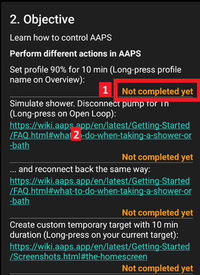
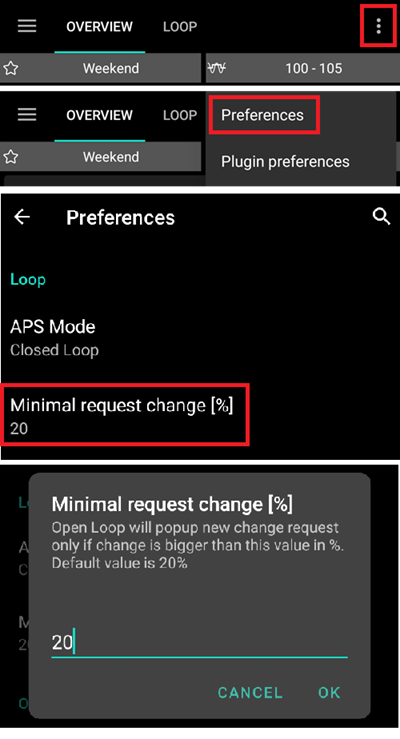
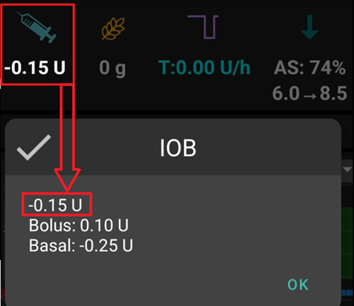
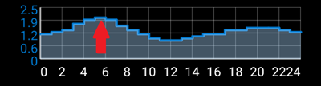
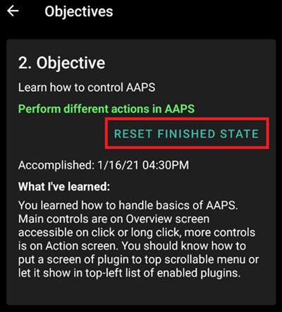

# 完成目標

**AAPS** 有一系列的 **目標**，需要你完成才能從基本的開環進展到混合閉環並完全使用 **AAPS** 功能。 完成 **目標** 確保： 建立一個自訂的臨時目標，持續 10 分鐘（_提示_：按首頁總覽頁面上的目標條以開啟臨時目標對話框）

- 你已正確配置你的 **AAPS** 設定
- 你已了解 **AAPS** 的基本功能
- 你對系統的操作有基本的暸解，因此能夠信任他。

```{admonition} Note
:class: note

在完成每個 **目標** 後，定期匯出你的 **AAPS** 設置！
```

We strongly recommend that you  [export your settings](../Usage/ExportImportSettings.md) after completing each **objective**. This exporting process creates a **settings** (.json) file which you should keep backed-up in one or more safe places (_e.g._ Google Drive, hard disk, email attachment _etc._). This ensures that you keep your progress through the **objectives**, and if you accidentally delete your progress, you can simply re-load it by importing a recent settings file. 我們強烈建議你在完成每個 **目標** 後[匯出設定](../Usage/ExportImportSettings.md)。 此匯出過程會建立一個 **設定** (.json) 檔案，你應該將他備份到一個或多個安全的地方（例如 Google Drive、硬碟、電子郵件附件等）。 這確保了你保留了目標進度，如果你不慎刪除了進度，只需匯入最近的設定檔即可重新載入。 如果你想更換 **AAPS** 的智慧型手機（例如升級、遺失或手機損壞等），備份設定檔也是必需的。

**設定檔** 不僅會儲存你的目標進度，還會儲存你自訂的 **AAPS** 設定，例如 **最大注射量** 等。

如果沒有備份的 **設定檔**，如果你的 **AAPS** 手機發生任何問題，你將需要重新從頭開始完成 **目標**。

Overall the **objectives** take around 6 weeks to complete (see [how long will it take?](preparing-how-long-will-it-take?) for a detailed breakdown) from configuring **AAPS** on your smartphone to "basic" hybrid closed looping (from objective 1 to objective 8), so, although you _can_ proceed up to **objective 5** using a **virtual pump** (and using some other method of insulin delivery in the meantime), having to re-complete all the **objectives** because for example, you lost your smartphone, is still something you really want to avoid.

除了進展目標外，若你有需要，還可以移除進度並[回到先前的目標](Objectives-go-back-in-objectives)。

## 目標 1：設置可視化與監控，分析基礎率與比率

- **AAPS** 檢查你的基本技術設定是否運作。

若未運作，你需要重新配置，直到 **AAPS** 的基本技術設定正常運作。

- 在 [設定建置器](../Configuration/Config-Builder.md) 中選擇正確的 CGMS/FGMS。  更多資訊請參閱[血糖來源](../Configuration/BG-Source.md)。  See [BG Source](../Configuration/BG-Source.md) for more information.
- Select the correct Pump in [Config Builder](../Configuration/Config-Builder.md) to ensure your pump can communicate with AAPS. Select **virtual pump** if you are using a pump model with no **AAPS** driver for looping, or if you want to work through the early **objectives** while using another system for insulin delivery. See [insulin pump](../Getting-Started/Pump-Choices.md) for more information.
- 按照 [Nightscout](../Installing-AndroidAPS/Nightscout.md) 頁面中的指示，確保 **Nightscout** 能接收並顯示此資料。
- 請注意，**NSClient** 中的 URL 必須 **_不包含_ "/api/v1/"** 結尾 - 參見 [NSClient 偏好設定中的設定](Preferences-nsclient)。

請注意 - _你可能需要等待下一次感測器的血糖讀取值到來，**AAPS** 才能識別他。_

## 目標 2：學習如何控制 AAPS

- 在此 **目標** 中按要求在 **AAPS** 內執行多個操作。
- Click on the orange text "Not completed yet" to access the to-dos.
- Links will be provided to guide you, in case you are not familiar with a specific action yet.

  
- 完成 **目標 2** 的任務：
  - Set your profile to 90% for a duration of 10 min (_Hint_: Long press your profile name on the OVERVIEW screen) (_Note_: AAPS does not accept basal rates below 0.05U/hr. If your profile includes any rates 0.06U/hr or lower you will need to create a new profile with higher basal rates before completing this task. Switch back to your normal profile after completing this task.)
  - 模擬 "洗澡" 並在 **AAPS** 中中斷幫浦連線 1 小時（_提示_：按首頁總覽頁面上的循環圖示以開啟循環對話框）
  - 完成 "洗澡" 並重新連線幫浦（_提示_：按 "中斷連線" 圖示以開啟循環對話框）
  - Create a custom temporary target with a duration of 10 min (_Hint_: press the target bar on the OVERVIEW screen to bring up the temporary target dialog)
  - Activate the **ACTIONS** plugin in **CONFIG BUILDER** to make it appear on the top scrollable menu bar (_Hint_: Go to **CONFIG BUILDER** and scroll down to 'General")
  - Display the LOOP plugin's content
  - Scale the BG-Chart to be able to look at larger or smaller timeframes: toggling between 6h, 12h, 18h 24h of past data (_Hint_: Tap the chart)

(Objectives-objective-3-prove-your-knowledge)=

## 目標 3：證明你的知識

- 透過一個測試你 **AAPS** 知識的多選題考試。

Some users find **Objective 3** to be the most difficult objective to complete. Please do read the **AAPS** documents in conjunction with the questions. 某些使用者發現 **目標 3** 是最難完成的目標。 請務必結合問題閱讀 **AAPS** 文件。 如果你在研究**AAPS**文件後仍然感到困惑，請在 [Facebook](https://www.facebook.com/groups/AndroidAPSUsers) 群組中搜索 "目標 3"（因為你的問題可能之前已被詢問並回答過）。 如果你仍然無法解決，請在 [Facebook](https://www.facebook.com/groups/AndroidAPSUsers) 或 [Discord](https://discord.gg/4fQUWHZ4Mw) 群組中發文詢問。 這些群組可以提供友善的提示，或引導你閱讀 **AAPS** 文件的相關部分。 If you are still stuck, ask in a post on either the [Facebook](https://www.facebook.com/groups/AndroidAPSUsers) or [Discord](https://discord.gg/4fQUWHZ4Mw) group. These groups can provide friendly hints, or redirect you to the relevant part of the **AAPS** documents.

要進行 **目標 3**，點擊橘色文字“**尚未完成**”來查看相關問題。 請仔細閱讀每個問題並選擇你的答案。 Please read each question carefully and select your answer(s).

- 為了減少你在開環模式下需要做出的決策數量，設定一個較寬的目標範圍，例如 90 - 150 mg/dl 或 5.0 - 8.5 mmol/l。

- 你可能想在晚上設置更寬的上限，或者甚至停用開環模式。

For each question, there may be more than one answer that is correct! 每個問題可能有多個正確答案！ 如果選擇了錯誤的答案，該問題將被鎖定一段時間（60 分鐘），你將無法立即重新作答。 當你再次嘗試回答時，請注意答案的順序可能已經改變，這是為了確保你仔細閱讀並真正暸解每個答案的正確性（或錯誤性）。 Be aware that the order of the answers may have changed when you next try to answer, this is to make sure you read them carefully and really understand the validity (or not) of each response.

當 **AAPS** 第一次安裝時，你必須完成整個 **目標 3** 才能進入 **目標 4**。 每個目標必須按順序完成。 隨著目標的進展，新的功能將逐漸解鎖。 Each objective is required to be completed in sequential order. New features will gradually be unlocked as progress is made through the objectives.

```{admonition} __What happens if new question(s) are added to an Objective when I update to a newer version of AAPS?__
:class: Note
不時會為 **AAPS** 添加新功能，可能需要在目標中新增問題，特別是目標 3。因此，任何新增到 **目標 3** 的問題將被標記為「未完成」，因為 **AAPS** 需要你執行此操作。不要擔心，因為每個 **目標** 是獨立的，你不會失去 **AAPS** 的現有功能，前提是其他目標仍然完成。
```

## 目標 4：開始使用開環

這個目標的目的是讓你了解 **AAPS** 如何評估基礎率對血糖水平的影響，並建議臨時調整基礎率。 在這個目標中，你將首次啟動開環，並手動在幫浦上執行 20 次建議的臨時基礎率調整。 此外，你將觀察臨時目標和預設臨時目標對於活動或低血糖治療的影響。 如果你還不熟悉如何在 **AAPS** 設置臨時基礎率變更，請參閱 [手動操作 頁籤](Screenshots#Screenshots-action-tab)。 As part of this objective, you will activate open looping for the first time, and will perform 20 proposed temporary basal rate changes manually on your pump. Furthermore, you will observe temporary and default temporary targets' impact (_e.g._ for activity or hypo treatments). If you are not familiar with setting a temporay basal rate change in **AAPS** yet, please refer to the [ACTIONS tab](Screenshots#Screenshots-action-tab).

完成此目標的預估時間：**7 天**。 這是一個強制的等待時間。 即使你已經執行了所有基礎率變更，你仍無法進入下一個目標。 This is a mandatory wait time. You can't proceed to the next Objective, even if you enacted all basal rate changes already.

- Select Open Loop either from the "Preferences" menu or by presssing and holding the Loop icon on the top left of the OVERVIEW screen.
- 透過 [偏好設定](../Configuration/Preferences.md) 設定來進行設置（向下滾動到 "Loop/APS 模式" 並選擇 "開環模式"）。
- Manually enact at least 20 of the temporary basal rate suggestions over a period of 7 days; key them into your (physical) pump and confirm in AAPS that you have accepted them. Ensure these basal rate adjustments show up in AAPS and Nightscout.
- Enable [temp targets](../Usage/temptarget.md) if necessary. After treating a hypo use hypo temp targets to prevent the system from overcorrecting upon the bounce back.

### 減少通知數量

- 為了減少開環模式下建議的基礎率變更數量，設置較寬的目標範圍，例如 90-150 mg/dl 或 5.0-8.5 mmol/l。
- 你甚至可以考慮在晚上提高上限（或停用開環模式）。
- You can set a minimum percentage for recommended basal rate changes to change the number of triggered notifications.

  

```{admonition} You don't need to action each and every system recommendation!
:class: Note
```

(目標-Objective-5-暸解你的開環模式及其臨時基礎率建議)=

## 目標 5：暸解你的開環，包括其臨時基礎率建議

As part of **Objective 5** you will start to understand how temporary basal recommendations are derived. 在 **目標 5** 中，你將開始了解如何得出臨時基礎率的建議。 這包括 [基礎率邏輯的確定](https://openaps.readthedocs.io/en/latest/docs/While%20You%20Wait%20For%20Gear/Understand-determine-basal.html)，透過觀察 [AAPS OVERVIEW 中的預測線](Screenshots-prediction-lines)/Nightscout 來分析影響，並檢視 OPENAPS 頁籤中的詳細計算。

完成此目標的預估時間：7 天。

此目標要求你確定並設置“最大 U/h 臨時基礎率”（max-basal）值，如 [OpenAPS 功能](Open-APS-features#Open-APS-features-max-u-h-a-temp-basal-can-be-set-to-openaps-max-basal) 中所述。 這個值可以在 偏好設定 > OpenAPS 中設置。
確保在 **AAPS** 和你的胰島素幫浦中都設置了這個安全設定。 This value can be set in Preferences > OpenAPS.
Make sure this safety setting is set in both **AAPS** and your insulin pump.

你可能希望將目標設置得比平常高，直到你對計算和設定感到滿意為止。

**AAPS** 允許：

- 低目標最小值為 4 mmol/l (72 mg/dl) 或最大值為 10 mmol/l (180 mg/dl)
- 高目標最小值為 5 mmol/l (90 mg/dl) 或最大值為 15 mmol/l (225 mg/dl)
- 臨時目標可設為單一數值，範圍為 4 mmol/l 到 15 mmol/l (72 mg/dl 到 225 mg/dl)

Your target is a core value. All calculations are based on it. It is different from a target range which you usually aim to keep your blood glucose values in. If your target is very wide (say, 3 or more mmol/l [50 mg/dl or more] wide), you will often find little **AAPS** action. This is because sensor glucose is predicted to be somewhere in that wide range, and thus temporary basal rate changes are rarely suggested.

你可能需要嘗試將目標範圍調整得更緊（例如 1 mmol/l [20 mg/dl] 或更小），並觀察系統行為的變化。

你可以透過輸入不同的數值來調整圖表中的綠色區域（代表你的目標範圍），位置在 [偏好設定](../Configuration/Preferences.md) > Overview > 顯示範圍。


```{admonition} If you have been using a virtual pump, change to a real insulin pump now!
:class: note

如果你正在使用虛擬幫浦開啟循環，請在此停下來。只有在你已經換到使用「真正的」實體幫浦後，才在這個目標結束時點擊驗證。
```


(目標-Objective-6-啟動低血糖暫停模式閉環)=

## 目標 6：使用低血糖暫停功能開始閉環


```{admonition} Closed loop will not correct high BG values in objective 6 as it is limited to low glucose suspend only!
:class: Note
你仍然需要自行修正高血糖值（手動透過幫浦或注射筆進行修正）！
```

完成 **目標 7** 的條件是你必須關閉閉環並提高 [maxIOB](Open-APS-features-maximum-total-iob-openaps-cant-go-over-openaps-max-iob)。 在 **目標 6** 中 maxIOB 被自動設置為零。 現在這個設定將被恢復。 **AAPS** 將開始使用你設定的 maxIOB 值來修正高血糖值。 You have to remain in LGS mode for 5 days to complete this objective. You should use this time to check if your profile settings are accurate and don't trigger LGS events too often.

完成此目標的預估時間：5 天。

It's crucial that your current profile (basal, ISF, IC) is well tested before you close your loop in Low Glucose Suspend mode. Incorrect profile settings might force you into hypo situations which have be  treated manually. An accurate profile will help to avoid needing low glucose treatments during the 5 days period.

**如果你仍然觀察到頻繁或嚴重的低血糖情況，請考慮微調 DIA、基礎率、ISF 和碳水化合物比率。**

在目標 6 中，**AAPS** 將自動將 maxIOB 設置為零。 **當進入目標 7 時，這個覆蓋設定將被恢復。** **This override will be reversed when moving to objective 7.**

這意味著當你處於目標 6 時，如果傳感器顯示血糖水平正在下降，**AAPS** 將為你減少基礎胰島素的輸送量。 如果血糖水平上升，只有當先前的低血糖暫停導致基礎 IOB 為負數時，**AAPS** 才會將基礎率提高到個人資料的數值以上。 否則，**AAPS** 不會將基礎率提高到超過你目前個人資料的數值，即使血糖水平正在上升。 這個謹慎設置是為了避免在學習使用 **AAPS** 時出現低血糖情況。 If sensor glucose levels are rising, **AAPS** will only increase the basal rate above your profile value if basal IOB is negative as a result of from a previous Low Glucose Suspend. Otherwise, **AAPS** will not increase basal above your current profile value, even if glucose levels are rising. This caution is to avoid hypos as you are learning to use **AAPS**.

**因此，在這個階段，你需要手動處理高血糖的胰島素注射修正。**

- 如果你的基礎 IOB 是負數（如下圖所示），在目標 6 中可以觸發超過 100% 的臨時基礎率 (TBR)。



- 將你的目標範圍設置得比平常略高，以增加安全緩衝。
- Enable 'Low Glucose Suspend' mode by pressing and holding the Loop icon at the top right corner of the OVERVIEW screen and selecting the Loop - LGS mode icon.
- Watch active temporary basals by looking at the turquoise basal text on the OVERVIEW screen or the turquoise basal render as part of the OVERVIEW graph.
- You may temporarily experience spikes following treated hypos without being able to increase basals on the rebound.

(目標-Objective-7-調整閉環模式，將 maxIOB 提高至 0 以上並逐步降低血糖目標)=

## 目標 7：調整閉環模式，將 maxIOB 提高至 0 以上並逐步降低血糖目標

To complete **Objective 7** you have to close your loop and raise your [maxIOB](Open-APS-features-maximum-total-iob-openaps-cant-go-over-openaps-max-iob). 完成後，你可以[提高 maxIOB](Open-APS-features-maximum-total-iob-openaps-cant-go-over-openaps-max-iob) 以使 SMB 正常運作。 maxIOB 現在包括所有 IOB，不僅僅是累積的基礎率。 此門檻值會暫停 SMB，直到 IOB 低於此值為止（例如，maxIOB 設為 7 U，並給予 8 U 的注射來覆蓋一餐：SMB 將暫停，並且不會再次啟用，除非 IOB 低於 7 U）。 一個好的起點是將 maxIOB 設為平均餐後注射 + 每日最大基礎率的 3 倍（每日最大基礎率 = 一天內任何時段的每小時最大值，參見[目標 7](Objectives-objective-7-tuning-the-closed-loop-raising-max-iob-above-0-and-gradually-lowering-bg-targets) 作為參考）。 This is now reverted. **AAPS** will start to use your defined maxIOB value to correct high glucose values.

完成此目標的預估時間：1 天。

- Select 'Closed Loop' either from [Preferences](../Configuration/Preferences.md) or by pressing and holding the Loop icon at the top right corner of the OVERVIEW screen, over a period of 1 day.

- 將 'OpenAPS 無法超過的最大總 IOB'（在 OpenAPS 中稱為 'max-iob'）提高至 0 以上。 預設建議為“平均餐後注射 + 每日最大基礎率的 3 倍”（適用於 SMB 演算法）或“每日最大基礎率的 3 倍”（適用於 AMA 演算法），但你應該逐步提高此值，直到你確定設定適合你（每日最大基礎率 = 一天內任何時間段的最大每小時值）。 The default recommendation is "average mealbolus + 3x max daily basal" (for the SMB algorithm) or "3x max daily basal" (for the AMA algorithm) but you should slowly work up to this maximum until you know your settings work for you (max daily basal = the maximum hourly value in any time segment of the day).

This recommendation should be seen as a starting point. 這個建議應被視為起點。 如果你將其設置為 3 倍，並發現 AAPS 因血糖上升而給予過多的胰島素，那麼請降低“OpenAPS 無法超過的最大總 IOB”值。 或者，如果你對胰島素抵抗非常高，則謹慎地提高該值。 Alternatively, if you are very resistant, raise it very cautiously.



- 當你對 IOB 與你的閉環模式的運作模式相符有信心後，將你的目標逐步降低至你理想的水準。

(目標-Objective-8-如果需要，調整基礎率和比例，然後啟用 autosens)=

## 目標 8：如有需要，調整基礎率與比率，然後啟用自動感應

在此目標中，你將重新檢視個人資料的表現，並使用 autosens 功能作為錯誤設定的指標。

完成此目標的預估時間：7 天。

- 你可以使用 [autotune](https://openaps.readthedocs.io/en/latest/docs/Customize-Iterate/autotune.html) 來一次性檢查基礎率是否保持準確，或進行傳統的基礎率測試。
- 啟用 [autosens](../Usage/Open-APS-features.md) 為期 7 天，並觀察 OVERVIEW 圖表中的白線，該線顯示因運動或荷爾蒙等因素導致的胰島素敏感性上升或下降，並關注 OpenAPS 報告頁籤，該頁籤顯示 **AAPS** 根據情況調整基礎率和/或目標。

(目標-Objective-9-啟用白天使用的其他 oref1 功能，例如超微量注射 SMB)=

## 目標 9：啟用白天使用的其他 oref1 功能，例如超微量注射 (SMB)

In this objective you will tackle and use "Super Micro Bolus (SMB)" as one core functionality. After working through the mandatory readings you will have a good understanding of what SMBs are, how these work, reasonable starting point with SMBs and why basal is set to zero temporarily after SMBs are given (zero-temping). 在這個目標中，你將處理並使用“超微量注射 (SMB)”作為核心功能之一。 在完成必讀內容後，你將對 SMB 是什麼、如何運作、SMB 的合理起點以及為何在 SMB 後會暫時將基礎率設為零（即零基礎率）有深入的暸解。 完成此目標的預估時間：28 天。

- [此文件中的 SMB 部分](Open-APS-features-super-micro-bolus-smb) 和 [openAPS 文件中的 oref1 涵蓋範圍](https://openaps.readthedocs.io/en/latest/docs/Customize-Iterate/oref1.html) 是必讀內容，以了解 SMB 和零基礎率的概念。
- Once done, you [raise maxIOB](Open-APS-features-maximum-total-iob-openaps-cant-go-over-openaps-max-iob) to get SMBs working well. maxIOB now includes all IOB, not just accumulated basal. This threshold pauses SMBs until IOB drops below this value (_e.g._ maxIOB is set to 7 U and a bolus of 8 U is given to cover a meal: SMBs will be paused and not given unless IOB drops below 7 U). A good start is setting maxIOB = average mealbolus + 3x max daily basal (max daily basal = the maximum hourly value in any time segment of the day - see [objective 7](Objectives-objective-7-tuning-the-closed-loop-raising-max-iob-above-0-and-gradually-lowering-bg-targets) as reference)
- 當你從 OpenAPS AMA 演算法切換到 OpenAPS SMB 時，將 "min_5m_carbimpact" 參數（偏好設定 > 吸收設定 > min_5m_carbimpact）更改為 8。 對於 AMA 演算法，預設值為 3。 在此處閱讀有關此設定的更多資訊 [此處](../Configuration/Preferences.md#min_5m_carbimpact) For AMAs the default value is 3. Read more about this setting [here](../Configuration/Preferences.md#min_5m_carbimpact)

(目標-Objective-10-自動化設定)=

## 目標 10：自動化

你必須開始 **目標 10** 才能使用自動化功能。

1. 首先閱讀文件頁面 [Automation](../Usage/Automation.md)。
2. 設定最基本的自動化規則；
   例如在幾分鐘後觸發 Android 通知：

- Select the notification tab
- 從右上角的 3 點選單中，選擇新增規則
- 給任務命名為 "我的第一個自動化通知"
- "edit"  "condition"
  - click the "+" symbol to add the first trigger
  - 選擇 "時間" 並按 "OK"，他將建立一個預設的條目，時間為今天的某時某分
  - click the MINUTE portion to edit the time such that it triggers in a few minutes. Then click ok to close
  - click "ok"  to close the Triggers screen
- "新增" 一個 "動作"
  - 選擇 "通知"，按 "OK"
  - 點擊 "通知" 來編輯訊息（Msg），輸入類似 "我的第一個自動化" 的內容
- 等待時間觸發通知（請注意，根據你的手機不同，可能會延遲幾分鐘）

4. 嘗試設定更有用的自動化。

- The documentation page gives a few examples, and you can search for "automation" screenshots on the [Facebook](https://www.facebook.com/groups/AndroidAPSUsers) group. Since most people eat the same thing for breakfast at the same time every morning before school/work, a fairly common use-case can be to set a "before-breakfast-target" to set a slightly lower temporary target 30 minutes before having breakfast. In such case, your condition is likely to include "recurring time" which consists of selecting specific days of the week (Monday, Tuesday, Wednesday, Thursday, Friday) and a specific time (06:30 am). The action will consists of  "Start temp target" with a target value and a 30 minutes duration.

## 目標 11：啟用白天使用的其他功能，例如動態敏感度外掛 (DynISF)。

- 確保 SMB 正常運作
- 閱讀有關動態 ISF 的文件[這裡](../Usage/DynamicISF.md)
- 在 Facebook 和 [Discord](https://discord.gg/4fQUWHZ4Mw) 群組中搜索與動態 ISF 相關的討論，並閱讀其他使用者的經驗和建議。
- Enable the **DynamicISF plugin** and identify the appropriate calibration for your body's uniqueness. It is advisable to begin with a value lower than 100% for safety reasons.

(目標-回到先前的目標進度)=

## 返回目標

如果你想出於任何原因返回 **目標** 進度，你可以點擊 "清除已完成"。



## Android APS 3.0 版本前的目標

One objective was removed when **AAPS** version 3.0 was released.  Users of Android APS version 2.8.2.1 who are on older Android software (_i.e._ earlier than version 9) will be using an older set of Objectives which can be found [here](../Usage/Objectives_old.md).
