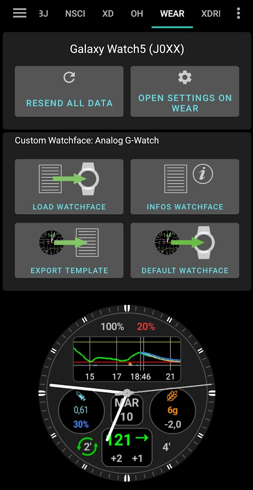

# Setup AAPS on your Wear OS watch

The instructions below apply to the **AAPS Wear** apk that you need to build (see [here](../WearOS/BuildingAapsWearOS.md) if you haven't yet) as you've built the phone **AAPS** apk.

You can also use some of the information for the **AAPSClient** and **PumpControl** **Wear** apk that are directly available in [GitHub](https://github.com/nightscout/AndroidAPS/releases/tag/3.2.0.4). Each **Wear** app will communicate with its matching phone app. For example: the **AAPSClient Wear** app can be used to display **AAPSClient** data and not **AAPS** data.

## How to set up a Samsung Galaxy 4 smartwatch with **AAPS**

This section assumes you are totally new to Smartwatches, and gives you basic orientation of a popular watch, the **Galaxy Watch 4**, followed by a step-by-step guide to setup **AAPS** on the watch.

_This guide assumes the Samsung Galaxy watch you are setting up is running Wear OS version 3 or lower._ If you are setting up a watch running Wear OS 4/OneUI 5 or later, you will need to use a new ADB pairing process, this is explained in the Samsung software on your phone and will be updated here in due course.

**Do not to upgrade your watch to Wear OS 5** (Android 14) that is not fully supported.

Here are basic setup guides for the [Galaxy Watch 5](https://www.youtube.com/watch?v=Y5upzOIxwTU) and [Galaxy Watch 6](https://www.youtube.com/watch?v=D6bq20KzPW0)

## Basic smartwatch familiarity

After basic setup of your watch according to the video above, go to the playstore on the phone and download the following apps: "Galaxy Wearable" “Samsung” and either “Easy Fire tools” or "Wear Installer 2".

There are plenty of 3rd party YouTube videos which will help you with getting familiar with your new smartwatch, for example:

https://www.youtube.com/watch?v=tSVkqWNmO2c

The app “Galaxy Wearable” also has an instruction manual section in it. Open galaxy wearable on the phone, search for the watch, attempt to pair the watch with the phone. Depending on your version, this may prompt you to install a further 3rd app “galaxy watch 4 plugin” from the playstore (takes a while to download). Install this on the phone, and then attempt to pair the watch and phone again in the wearable app. Go through a series of menus and tick various preferences.

## Setting up a Samsung account

You need to make sure that the email account you use to set up the Samsung account has a date-of-birth such that the user is age 13+, as otherwise the Samsung permissions are really difficult to approve. If you have given your child under 13 a Gmail account and are using that email address, you cannot simply change it to an adult account. One way around this is to modify the current date-of-birth to make the current age 12 years and 363 days old. The following day, the account will be converted to an adult account, and you can progress with the setup of the Samsung account.

(remote-control-transferring-the-aaps-wear-app-onto-your-aaps-phone)=

## Transferring the **AAPS** Wear app onto your **AAPS** phone

Loading the Wear.apk from Android Studio to your phone can be done either by:

a)  using a USB cable to put the **AAPS** wear apk file onto the phone, and then “side-load” it to the watch. Transfer Wear.apk to the phone via USB into the downloads folder; or

b)  cut and paste Wear.apk from Android Studio onto your Gdrive.


You can use either Wear Installer 2 or Easy Fire tools to side-load AAPS onto the watch. Here we recommend Wear Installer 2, because the instructions and process in the video are so clear and well-explained.

## Using Wear Installer 2 to side-load **AAPS** Wear from the phone onto the watch

 

Wear Installer 2, developed by [Malcolm Bryant](https://www.youtube.com/@Freepoc) can be downloaded from Google Play onto your phone and can be used to side-load the AAPS wear app onto the watch. The app includes a handy ‘how to sideload’ [video.](https://youtu.be/abgN4jQqHb0?si=5L7WUeYMSd_8IdPV)

This provides all the necessary detail (best to open the video on a separate device so you can watch it whilst setting up the phone).

As mentioned in the video, once complete, switch ADB debugging off on the watch, to avoid draining the smartwatch battery.

Alternatively, you can:

```{admonition} Use Easy Fire tools to side-load the **AAPS** wear on the watch
:class: dropdown

1)   Download _Easy Fire Tools_ from playstore onto phone 


2)  Make yourself a developer in the watch (once set up and connected to phone): 

Go to settings >about watch (bottom option) >- software info > software version. 

Rapidly tap on “ software version” until a notification appears that the watch is now in "developer mode". Return to the top of settings menu, scroll to the bottom
 and see “developer options” below “about watch”. 

In “developer options”, turn on “ADB debugging” and “wireless debugging”. The latter option then reveals the IP address of the watch, the final two digits of which changes each time the watch is paired with a new phone. It will be something like: **167.177.0.20.** 5555 (ignore the last 4 digits). Note that the last two digits (here, “20”) of this address will change every time you change to a new phone handset for AAPS.  


STEP 3)     Enter IP address _e.g._ **167.177.0.20** into Easy Fire tools on the phone (go into the left hamburger, settings and enter the IP address). Then click the plug socket icon on the top right.  


STEP 4) Follow the instructions [here](https://wearablestouse.com/blog/2022/01/04/install-apps-apk-samsung-galaxy-watch-4/?utm_content=cmp-true) to side-load (i.e. transfer)  Wear.apk onto the smartwatch using Easy Fire tools

Click side "plug-in" socket in the app, in order to upload Wear OS.apk onto the smartwatch: 


 Next step > accept the authorisation request on the smartwatch


```


## Setting up the connection between the watch and the phone from **AAPS**

The final step is to configure **AAPS** on the phone to interact with **AAPS** Wear” on the watch. To do this, enable the Wear plugin in Config Builder:

* Go to the **AAPS** app on the phone

* Select > Config Builder in the left-hand Hamburger tab

* Tick for Wear selection under General


To change to a different **AAPS**  watchface, press on the home screen of the watch and it will come to “customise”. Then swipe right until you get to all the **AAPS**  faces.

If the **AAPS** Wear.apk has been successfully side-loaded onto the smartwatch, it will look like this:


### Troubleshooting the **AAPS** watch- **AAPS** phone communication

1.  If EasyFire tools does not connect or if you are receiving ‘authorisation failed’ > check IP address has been correctly entered.
2.  Check that the smartwatch is connected to the internet (and not just connected to the phone via Bluetooth).
3.  Check that the **AAPS** Phone and smartwatch are paired or linked in Samsung app.
4.  It may also help to do a hard restart of Phone and smartwatch (meaning turning phone on and off)
5.  Assuming you have managed to download the Wear.apk onto your phone but you are not receiving any BG data, _check_ that you have side-loaded the correct **AAPS** apk version onto the watch. If your AAPS wear.apk version is listed as any of the following: a) “wear-AAPSClient-release’; b) ‘wear-full-release.aab’; or c) the word ‘debug’ appears in the title, you have not selected the correct Wear OS apk version during the build.
6.  Check that your router is not isolating the devices from one another.

More troubleshooting tips can be found [here](https://freepoc.org/wear-installer-help-page/#:~:text=If%20you%20are%20having%20problems,your%20phone%20and%20your%20watch.)

(WearOS_changing-to-AAPS-watchface)=

## Changing to an AAPS Watchface on your WearOS watch

There are a number of watchfaces available in the standard build of the AAPS Wear OS APK build. Once you have installed the AAPS Wear APK on your watch, they will be available. Here are the steps for selecting one:

1. On your watch (assuming WearOS), long press on your current watchface to bring up the watchface selector screen and scroll all the way to the right until you see the "Add Watch Face" button and select it


2. Scroll to the bottom of the list until you see the "Downloaded" section and find "AAPS (Custom)" and click the middle of the image to add it to your shortlist of current watchfaces. Don't worry about the current appearance of the "AAPS (Custom)" watchface, we will select your preferred skin in the next step.


3. Now open AAPS on your phone and go to the Wear plugin (enable it in Config Builder (under Synchronization) if you don't see it in your current plugins along the top).



4. Click on the "Load Watchface" button and select the watchface that you like


5. Check your watch, the "AAPS (Custom)" watchface should now be displaying the skin that you have selected. Give it a few seconds to refresh. You may now customize the complications, etc. by long pressing the watchface and then pressing the "Customize" button on the watchface image.

## AAPSv2 watchface - Legend


A - time since last loop run

B - CGM reading

C - minutes since last CGM reading

D - change compared to last CGM reading (in mmol or mg/dl)

E - average change CGM reading last 15 minutes

F - phone battery

G - basal rate (shown in U/h during standard rate and in % during TBR)

H - BGI (blood glucose interaction) -> the degree to which BG “should” be rising or falling based on insulin activity alone.

I - carbs (carbs on board | e-carbs in the future)

J - insulin on board (from bolus | from basal)