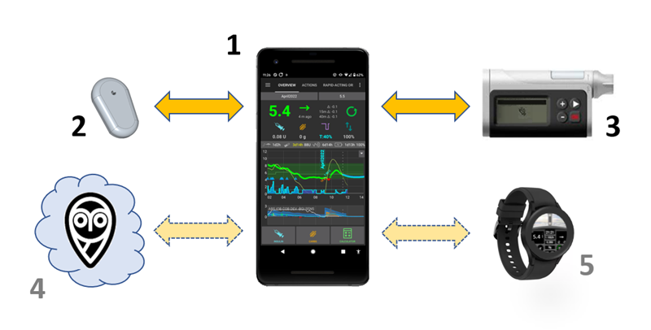

# 歡迎來到 AAPS 文件指南



Android APS (**AAPS**) 是一款針對胰島素依賴型糖尿病患者的開源應用程式。 這是一個人工胰臟系統 (APS)，可以在 Android 智慧型手機上運作。 **AAPS** uses an openAPS software algorithm and aims to do what a real pancreas does: keep blood sugar levels within healthy limits by using automated insulin dosing. To use **AAPS** you need **three** compatible devices: an Android phone, a FDA/CE approved insulin pump, and a continuous glucose meter (CGM).

第六章節）**AAPS 的維護** 涵蓋了如何匯出和備份你的設置（這非常重要，以防你的手機遺失或損壞），提供了最新版本的說明，並詳細說明了如何更新 **AAPS**。 你可以預期每年會有一個新版本和 2-3 次強制更新。 你需要像其他軟體一樣進行這些更新，以解決小錯誤並改進**AAPS** 。 有一個專門的“更新”問題排除部分，解答常見問題。 本文件將詳細說明如何設置和使用**AAPS**。 你可以透過左側的選單（以及方便的“**搜尋文件**”功能）或使用頁面底部的[索引](Index-of-the-AAPS-Documentation.md)瀏覽**AAPS**文件。

## AAPS 文件總覽("簡稱本文件")

Section 2) "Getting Started", the [Introduction](introduction.md) explains the general concept of what an artificial pancreas system (APS) is designed to do. It outlines the background of looping in general, why **AAPS** was developed, compares **AAPS** to other systems, and addresses safety. It gives suggestions about how to talk to your clinical team about **AAPS**, explains why you need to build the **AAPS** app yourself rather than just downloading it, and gives an overview of the typical connectivity of an **AAPS** system. It also addresses accessibility, and who is likely to benefit from **AAPS**.

[Preparing for AAPS](preparing.md) gives more detail about safety considerations, and the phones, CGMs (Continuous Glucose Monitors) and insulin pumps which are compatible with **AAPS**. It gives an overview of the process you will go through, and provides an approximate timeline for gaining full functionality of **AAPS**. This section gets you technically prepared to assemble your **AAPS** setup as quickly and efficiently as possible. The subsection [CGM Configuration](Configuration/BG-Source.md) explains how to optimse CGM setup and what smoothing options are best.

Now that you have a solid understanding of the process, you can start assembling your **AAPS** loop. Section **3) Setting up AAPS** contains step-by-step instructions to do this. It covers choosing and [setting up your reporting server](setting-up-the-reporting-server.md) (Nightscout or Tidepool) so you can review and share your data, getting your computer ready for building the AAPS app, building the AAPS app and transferring the AAPS app to your phone. It also covers setting up the **AAPS** app using the setup Wizard, linking it with your CGM app, and either a real or virtual insulin pump, as well as linking **AAPS** to your reporting server.
You are then slowly introduced to the full usage of what **AAPS** has to offer via a safe and carefully calibrated step-by-step process designed to make sure that you/your child are thoroughly familiar and comfortable navigating all the different levels and menu configurations before graduating on the next phase, commonly referred to as the next "Objective", until you are have enough experience to begin using the more advanced options available within the app.
These Objectives are specially designed in such a way that will gradually unlock more possibilities of **AAPS** and switch from Open Loop to Closed Loop.

Section 4) [Remote AAPS features](remote-control.md) highlights a real strength of **AAPS**. There are a wide range of possibilities for remotely sending commands to, or simply following the data from **AAPS**. This is equally useful for carers who want to use **AAPS** for minors, and for adults with diabetes who either want to monitor their sugars (and other metrics) more conveniently than just on their phone (on a watch, in the car _etc._), or wish to have significant others to also monitor the data. This section also provides guidance for using Android Auto so you can view glucose levels in the car.

Section **5) Daily life with AAPS** covers key **AAPS** features, to help you use (and customise)  **AAPS**. This including understanding the screens, carbs-on-board, sensitivity, profile switching, temp targets, extended carbs (or eCarbs), automations, and DynamicISF. It also covers frequent topics like how to manage different types of meals, how to deal with cannula and sensor changes, smartphone updates, daylight saving changes, and [travelling with AAPS](Usage/Timezone-traveling.md) and sports. Common questions and answers are located within the troubleshooting section.

Section **6) Maintenance of AAPS** covers how to export and backup your settings (which is very important in case you lose/break your phone), gives the latest version notes and details how to update **AAPS**. You can expect that there will be one new version and 2-3 required updates per year. You are required to do these updates as with all software, as any minor bugs are ironed out, and improvements to **AAPS** are made. There is a dedicated "updating" troubleshooting section with the common queries.

\*\*第七章節）[獲得協助](Where-To-Go-For-Help/Connect-with-other-users.html) \*\*應該可以幫助你找到獲取 **AAPS** 一般幫助的最佳途徑。 這非常重要，讓你能夠快速與其他用戶取得聯繫，澄清問題並解決常見的困難。 很多人已成功使用 **AAPS**，但每個人都有自己無法獨立解決的問題。 由於用戶眾多，問題的回應時間通常非常快，通常僅需幾個小時。 不要擔心尋求幫助，更不用擔心愚蠢的問題！ 我們鼓勵任何新手/老手用戶提出他們認為有必要的所有問題，以幫助他們安全啟動並運作。 本節還包含 **AAPS** 和 **AAPSClient**（追蹤應用程式）的一般問題排除指南，如果你認為 **AAPS** 出現技術問題需要處理，本節也說明了如何將你的 **AAPS** 資料（日誌文件）發送給開發者進行調查，。 This is very important so that you can get in touch with others as quickly as possible, clarify questions and solve the usual pitfalls. A lot of people are already using **AAPS** successfully, but everyone has a question at some point that they couldn't solve on their own. Due to the large number of users, the response times to questions are usually very quick, typically only a few hours. Don’t worry about asking for help, there is no such thing as a dumb question! We encourage users of any/all levels of experience to ask as many questions as they feel is necessary to help get them up and running safely. This section includes general troubleshooting for **AAPS** and **AAPSClient** (a companion following app) as well as explaining how to send your **AAPS** data (logfiles) to the developers for investigation, if you think a technical issue with **AAPS** needs looking at.

Section **8) Useful AAPS links** are for handy reference. This includes the  [Glossary](Getting-Started/Glossary.md), a list of the acronyms (or short-term names) used throughout **AAPS**. This is where to go to find out what the terms ISF or TT, stand for, for example. This section also has links to useful screenshots and other data.

Section 9) covers **Advanced AAPS options** such as how to progress from using **AAPS** for hybrid-closed looping (bolusing for meals _etc._) to full closed looping (no bolusing), and details development and engineering modes. Most users get on just fine with the main or "Master" **AAPS** version without looking into these options, this section is for users who already have good control and are looking to further improve their setup.

In section 10) [How to support AAPS](make-a-PR.md) we provide  information so that you can support this project. You can donate money, equipment or expertise. You can suggest/make changes to the documentation yourself, help with [translation of the documentation](translations.md) and provide your data through the Open Humans project.

Section 11) contains archived or additional documentation, including a subsection for [clinicians](Resources/clinician-guide-to-AAPS.md) who have expressed interest in open source artificial pancreas technology such as **AAPS**, or for patients who want to share such information with their clinicians, this topic is also addressed in the introduction. 第 11 節）包含保存的或其他文檔，包括一個針對已表達對開放原始碼人工胰腺技術（如 **AAPS**）感興趣的 [臨床醫師](Resources/clinician-guide-to-AAPS.md) 的子部分，或對想與臨床醫生分享此類信息的患者，該主題也在介紹中處理。 第 12 節）包含更多糖尿病和循環的參考資料和資源。

### 有興趣開始使用 **AAPS** 嗎？ 在 [介紹](introduction.md) 中閱讀更多關於 **AAPS** 的資訊。 第二章節）“入門”，[介紹](introduction.md) 解釋了人工胰臟系統 (APS) 的一般概念。 本文件概述了循環系統的背景，為何開發**AAPS** ，並比較了**AAPS** 與其他系統，同時也討論了安全性問題。 他提供了如何與你的醫療團隊討論 **AAPS**的建議，解釋了為什麼你需要自行建置**AAPS** 應用程式，而不是直接下載，並概述了典型的**AAPS** 系統連接性。 他還討論了無障礙設計，並指出誰最有可能從**AAPS** 中受益。

```{admonition} SAFETY NOTICE
:class: danger
**AAPS** 的安全性依賴於你硬體（電話、幫浦、CGM）的安全功能。 請只使用經過 FDA/CE 認證的全功能胰島素幫浦和 CGM。 不使用故障、改裝或自行組裝的胰島素幫浦或 CGM 接收器。 僅使用由製造商批准並與幫浦和 CGM 搭配使用的原裝耗材（如注射器、套管和胰島素儲存罐）。 使用未經測試或修改的耗材可能會導致資料不準確和胰島素注射錯誤，從而對使用者造成重大風險。 

如果你正在服用 SGLT-2 抑制劑（gliflozins），請勿使用 **AAPS**，因為這會降低血糖水平。 由於胰島素供應減少，會增加罹患糖尿病酮酸中毒（DKA）的風險，而血糖下降則會提高低血糖的風險。 
```

```{admonition} Disclaimer
:class: note

- 此處描述的所有信息和代碼僅供參考和教育目的使用。 使用 [Nightscout](https://nightscout.github.io/) 和 **AAPS** 需自行承擔風險，並且不應使用該信息或代碼來做出醫療決策。 Nightscout目前不符合HIPAA的隱私規定。 
- 從 github.com 使用的代碼不提供任何保證或正式支援。 請檢視此儲存庫的許可證( LICENSE) 以暸解詳細資訊。
- 所有產品和公司名稱、商標、服務標記、註冊商標和註冊服務標記均為其各自持有者的財產。 他們的使用僅供資訊用途，沒有任何關聯或背書。

**AAPS** 與以下組織無任何關聯，也不受其支持：[SOOIL](http://www.sooil.com/eng/)、[Dexcom](https://www.dexcom.com/)、[Accu-Chek, Roche Diabetes Care](https://www.accu-chek.com/)、[Insulet](https://www.insulet.com/) 或 [Medtronic](https://www.medtronic.com/).

```

(AAPS-Documentation-Index)=

## AAPS文件索引

```{toctree}
:caption: 1) 切換語言

切換語言 <./changelanguage.md>
```

```{toctree}
:caption: 2) 開始使用

AAPS介紹 <./introduction.md>
準備AAPS <preparing.md>
相容幫浦  <./Getting-Started/Pump-Choices.md>
相容CGM <./Configuration/BG-Source.md>
相容手機  <./Hardware/Phoneconfig.md>
```

```{toctree}
:caption: 3) 設置AAPS

設置報告伺服器 <./Installing-AndroidAPS/setting-up-the-reporting-server.md>
建置 AAPS <./Installing-AndroidAPS/building-AAPS.md>
傳輸和安裝 AAPS <./Installing-AndroidAPS/Transferring-and-installing-AAPS.md>
設置嚮導 <./Installing-AndroidAPS/setup-wizard.md>
更改 AAPS 配置 <./Installing-AndroidAPS/change-configuration.md>
- 組態建置工具 <./Configuration/Config-Builder.md>
- 偏好設定 <./Configuration/Preferences.md>
完成目標 <./Usage/completing-the-objectives.md>
```

```{toctree}
:caption: 4) 遠端 AAPS 功能

遠端控制 <remote-control.md>
僅查看 <following-only.md>
Android Auto <./Usage/Android-auto.md>

```

```{toctree}
:caption: 5) APPS的日常使用

AAPS螢幕 <./Getting-Started/Screenshots.md>
AAPS的主要功能 <./Usage/Open-APS-features.md>
COB 計算 <./Usage/COB-calculation.md>
敏感度偵測 <./Configuration/Sensitivity-detection-and-COB.md>
設定檔切換 <./Usage/Profiles.md>
臨時目標 <./Usage/temptarget.md>
延長碳水化合物 <./Usage/Extended-Carbs.md>
自動化 <./Usage/Automation.md>
動態 ISF <./Usage/DynamicISF.md>
餐點管理
幫浦和針管 <./5-DailyLifewithAAPS/DailyLife-PUMPS.md>
傳感器
手機
夏令時間變更
與AAPS旅行
跨時區與幫浦旅行 <./Usage/Timezone-traveling.md>

```

```{toctree}
:caption: 6) 維護 AAPS

備份你的設置
匯出/匯入設置 <./Usage/ExportImportSettings.md>
檢視你的資料
版本發行說明 <./Installing-AndroidAPS/Releasenotes.md>
升級至 AAPS 的新版本 <./Installing-AndroidAPS/Update-to-new-version.md>


```

```{toctree}
:caption: 7) 獲得幫助

在哪裡可以得到有關 AAPS 的幫助 <./Where-To-Go-For-Help/Connect-with-other-users.md>
常見問題排除 <./Usage/troubleshooting.md>
問題排除 AAPSClient <./Usage/Troubleshooting-NSClient.md>
如何報告錯誤/請求功能
存取日誌檔案 <./Usage/Accessing-logfiles.md>
幫助! 我的AAPS手機損壞/被偷/丟失
```

```{toctree}
:標題: 8) 有用的AAPS連結

詞彙表  <./Getting-Started/Glossary.md>
AAPS螢幕  <./Getting-Started/Screenshots.md>
你的AAPS設定檔 
相容的幫浦 <./Getting-Started/Pump-Choices.md>
Accu-Chek Combo基本使用提示 <./Usage/Accu-Chek-Combo-Tips-for-Basic-usage.md>
相容的CGM <./Configuration/BG-Source.md>
相容的手機  <./Hardware/Phoneconfig.md>
在智慧型手錶上執行AAPS的操作 <./Configuration/Watchfaces.md>
如何自定義你的AAPS手錶錶面  <./Usage/Custom_Watchface_Reference.md>
xDrip設置 <./Configuration/xdrip.md>
自動調整 <./Usage/autotune.md>

```

```{toctree}
:caption: 9) Advanced AAPS options

全閉環 <./Usage/FullClosedLoop.md>
開發分支 <./Installing-AndroidAPS/Dev_branch.md>
xDrip工程模式 <./Usage/Enabling-Engineering-Mode-in-xDrip.md>

```

```{toctree}
:caption: 10) 如何支援AAPS

如何幫助<./Getting-Started/How-can-I-help.md>

如何編輯文檔<./make-a-PR.md>

如何翻譯應用程式和文檔<./translations.md>

翻譯狀態<./Administration/stateTranslations.md>

文檔更新和變更<./Getting-Started/WikiUpdate.md>

Open Humans 上傳程式<./Configuration/OpenHumans.md>

```

```{toctree}
:caption: 11) 附加/存檔文件

為 AAPS 的專用的 Google 帳戶 (可選)<./Installing-AndroidAPS/Dedicated-Google-account-for-AAPS.md>

Careportal (已停用) <./Usage/CPbefore26.md>

針對臨床醫師 (已過時) <./Resources/clinician-guide-to-AndroidAPS.md>

與第三方應用程式自動化 <./Usage/automationwithapp.md>

更新至 AAPS 3.0 後檢查<./Installing-AndroidAPS/update3_0.md>

更新至 AAPS 2.7 後檢查 <./Installing-AndroidAPS/update2_7.md>

```

```{toctree}
:caption: 12) 參考資料

一般糖尿病和循環資源 <./Where-To-Go-For-Help/Background-reading.md>
AAPS 相關的科學期刊文章
```

```{toctree}
:caption: 13) 沙箱

沙箱 <./Sandbox/sandbox1.md>
Crowdin 測試 <./Sandbox/crowdintest.md>
圖像縮放 <./Sandbox/imagescaling.md>

```
